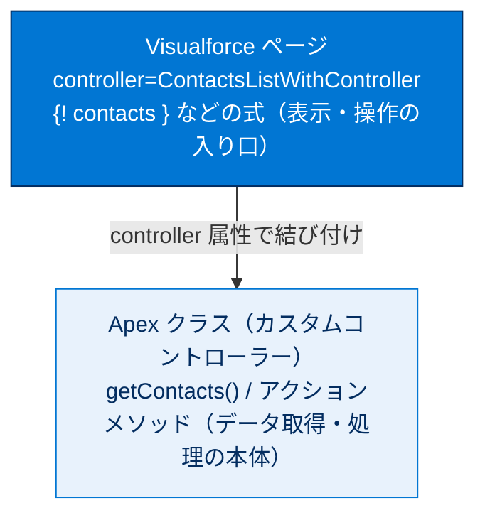
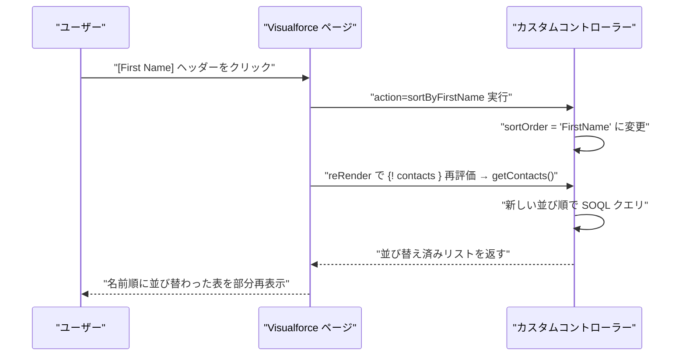
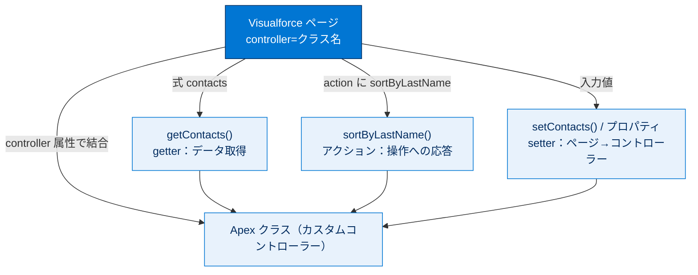

# カスタムコントローラーの作成と使用

## 学習の目的

この単元を完了すると、次のことができるようになります。

- カスタムコントローラーとは何かを説明する。
- カスタムコントローラー Apex クラスを作成する。
- レコードを取得する getter メソッドを記述する。
- ユーザー入力に応答するアクションメソッドを記述する。
- Visualforce ページでカスタムコントローラーを使用する。

> [!ポイント] この単元のゴール
>
> 標準コントローラーで足りない独自ロジックは、自分で書いた Apex クラス（カスタムコントローラー）で実現します。`controller` 属性での結び付け、`{! 式 }` と `getXxx()`（getter）の自動対応、ユーザー操作に応えるアクションメソッドの 3 点を押さえれば試験対策は十分です。

> [!用語] カスタムコントローラー（Custom Controller）
>
> 開発者が自分で書く Apex クラスをコントローラーとして使う仕組み。標準コントローラーで足りない独自のクエリ・計算・処理を自由に実装でき、ページには `<apex:page controller="クラス名">` で結び付けます。

---

## カスタムコントローラーの概要

`<apex:page>` の `controller` 属性でクラス名を参照して、カスタムコントローラーをページに追加します。

> [!用語] `controller` 属性／Apex
>
> - **`controller`**：`<apex:page>` でどの Apex クラスをコントローラーとして使うかを指定する属性。`controller="ContactsListWithController"` のようにクラス名（API 名）を正確に書く。クラスが無い・名前が違うとコンパイルエラーになる。
> - **Apex**：Salesforce 上で動く、Java に似たオブジェクト指向言語。SOQL や DML などのデータベース操作、ビジネスロジックをサーバー側で実行する。

> [!注意] `controller` と `standardController` は併用できない
>
> 1 つのページにカスタムコントローラーと標準コントローラーを同時に指定することはできません。両方を組み合わせたいときは、後述の「コントローラー拡張（controller extension）」を使います。

> [!手順] カスタムコントローラーを参照するページを作成する
>
> 開発者コンソールで `ContactsListWithController` ページを作成し、マークアップを次に置き換えます（クラスが未作成のため、この時点では保存するとエラーになります。次で対処します）。
>
> ```html
> <apex:page controller="ContactsListWithController">
>     <apex:form>
>         <apex:pageBlock title="Contacts List" id="contacts_list">
>             <!-- Contacts List goes here -->
>         </apex:pageBlock>
>     </apex:form>
> </apex:page>
> ```

---

## カスタムコントローラー Apex クラスを作成する

カスタムコントローラーは、開発者コンソールで自分が記述する Apex クラスにすぎません。

> [!ポイント] カスタムコントローラーの「唯一の要件」
>
> 条件は、そのクラスが存在し、ページの `controller` 属性から参照できることだけ。特定のインターフェースの実装や親クラスの継承は不要です。標準コントローラーや一部のフレームワークと異なる点で、試験でも問われます。

> [!手順] カスタムコントローラー Apex クラスを作成し、ページと結び付ける
>
> 1. 開発者コンソールで **[File] | [New] | [Apex Class]** をクリックし、クラス名に `ContactsListWithController` と入力します。
> 2. コードを次に置き換えて保存します。
>
>     ```apex
>     public class ContactsListWithController {
>     // Controller code goes here
>     }
>     ```
>
> 3. Visualforce ページに戻って再度保存するとエラーが消え、プレビューで標準ヘッダーとサイドバー（コンテンツはまだなし）が表示されます。

> [!例] ページとコントローラーの関係
>
> ページが「表示・操作の入り口」、Apex クラスが「データ取得・処理の本体」という役割分担です。



---

## レコードを取得するメソッドを追加する

ページに表示するレコードを返す SOQL クエリを実行する getter メソッドを作成します。

> [!用語] SOQL／getter メソッド／`List<Contact>`
>
> - **SOQL（ソークル）**：Salesforce のデータベースからレコードを取得する問い合わせ言語。`SELECT 項目 FROM オブジェクト WHERE 条件` の形で書く。
> - **getter メソッド**：名前が `get` で始まり、ページに渡す値を返すメソッド。`{! contacts }` は自動的に `getContacts()` の呼び出しに変換される。
> - **`List<Contact>`**：同じ型のレコードを順番に保持するコレクション。SOQL の結果を入れ、反復コンポーネントでループ表示する。

> [!手順] getter メソッドを追加する
>
> `ContactsListWithController` クラスで、`// Controller code goes here` を次のコードで置き換えます。
>
> ```apex
> private String sortOrder = 'LastName';
> public List<Contact> getContacts() {
>     List<Contact> results = Database.query(
>         'SELECT Id, FirstName, LastName, Title, Email ' +
>         'FROM Contact ' +
>         'ORDER BY ' + sortOrder + ' ASC ' +
>         'LIMIT 10'
>     );
>     return results;
> }
> ```

非公開変数 `sortOrder`（並び替え基準の項目名）と公開メソッド `getContacts()`（SOQL でリストを取得しページに返す）を追加します。

> [!注意] `Database.query()` は動的 SOQL
>
> ここでは文字列を組み立てて `Database.query()` に渡す「動的 SOQL」を使っています。`sortOrder` のように後から並び順を変えたいときに便利ですが、文字列連結に外部入力を直接含めると SOQL インジェクションのリスクがあります。固定条件で済むなら `[SELECT ...]` のインライン SOQL のほうが安全です。

> [!手順] テーブルでリストを表示するマークアップを追加する
>
> `ContactsListWithController` ページの `<!-- Contacts List goes here -->` を次のマークアップで置き換えて保存します。
>
> ```html
> <!-- Contacts List -->
> <apex:pageBlockTable value="{! contacts }" var="ct">
>     <apex:column value="{! ct.FirstName }"/>
>     <apex:column value="{! ct.LastName }"/>
>     <apex:column value="{! ct.Title }"/>
>     <apex:column value="{! ct.Email }"/>
> </apex:pageBlockTable>
> ```

`{! contacts }` の評価時、Visualforce がこの式を `getContacts()` の呼び出しに変換し、`<apex:pageBlockTable>` に表示するリストを返します。マークアップは `controller` 属性以外、標準コントローラーで作る場合とほぼ同じです。

> [!ポイント] 式とメソッド名の対応規則
>
> | ページの式 | 呼ばれるコントローラーのメソッド |
> | --- | --- |
> | `{! contacts }` | `getContacts()` |
> | `{! someExpression }` | `getSomeExpression()` |
>
> 「式名の先頭に `get` を付け、先頭を大文字にしたメソッド」が自動で呼ばれます。Visualforce の最重要ルールの 1 つです。

---

## 新しいアクションメソッドを追加する

ページ上のユーザー入力に応答するアクションメソッドを作成します。

> [!用語] アクションメソッド（Action Method）
>
> ボタンやリンクのクリックなど、ユーザー操作に応答して実行されるメソッド。getter と違い、`action="{! sortByLastName }"` のようにメソッド名そのものを式に書いて参照します（`get` を付けない）。処理後にページを再表示したり、別ページへ遷移したりできます。

> [!手順] 並び替え用のアクションメソッドを追加する
>
> `getContacts()` の下に次の 2 つのメソッドを追加します（`sortOrder` を変更すると SOQL の結果順序が変わります）。
>
> ```apex
> public void sortByLastName() {
>     this.sortOrder = 'LastName';
> }
> public void sortByFirstName() {
>     this.sortOrder = 'FirstName';
> }
> ```

> [!手順] 列ヘッダーをクリック可能なリンクにする
>
> `ct.FirstName` と `ct.LastName` の 2 つの `<apex:column>` タグを次のマークアップで置き換えます。
>
> ```html
> <apex:column value="{! ct.FirstName }">
>     <apex:facet name="header">
>         <apex:commandLink action="{! sortByFirstName }"
>             reRender="contacts_list">First Name
>         </apex:commandLink>
>     </apex:facet>
> </apex:column>
> <apex:column value="{! ct.LastName }">
>     <apex:facet name="header">
>         <apex:commandLink action="{! sortByLastName }"
>             reRender="contacts_list">Last Name
>         </apex:commandLink>
>     </apex:facet>
> </apex:column>
> ```

[名]・[姓] の列ヘッダーをクリックすると並び替え順が変わります。`<apex:facet name="header">` で列ヘッダーをクリック可能なリンクに置き換え、`<apex:commandLink>` の `action` でアクションメソッドを参照しています。

> [!用語] `<apex:facet>`／`<apex:commandLink>`
>
> - **`<apex:facet>`**：コンポーネントの特定部分（ヘッダーやフッターなど）の中身を差し替える。`name="header"` で列ヘッダーを任意のマークアップに置き換える。
> - **`<apex:commandLink>`**：`<apex:commandButton>` のリンク版。`action` で起動するメソッドを、`reRender` で部分更新する領域を指定する。

> [!例] クリックから再表示までの流れ



> [!ポイント] getter とアクションメソッドの式の書き方の違い
>
> | 種類 | コントローラー側 | ページ側の式 |
> | --- | --- | --- |
> | getter メソッド | `getContacts()` | `{! contacts }`（get を外し先頭小文字） |
> | アクションメソッド | `sortByFirstName()` | `{! sortByFirstName }`（メソッド名そのまま） |
>
> getter は「データの取得」、アクションは「操作への応答」と役割が異なり、式の書き方も違うことを区別しましょう。

> [!ポイント] 高度な操作：項目ラベルの国際化
>
> ヘッダーテキストをハードコードする代わりに `<apex:outputText value="{!$ObjectType.Contact.Fields.FirstName.Label }"/>` を使うと、項目名の翻訳バージョンが使われ、項目名が変わると自動更新されます。

---

## もうひとこと...

カスタムコントローラーと Apex では、Visualforce ページで考えられるほぼすべてを実行できます。getter がコントローラーのデータをページに渡すのに対し、**setter** はページの値をコントローラーに戻します（名前に `set` プレフィックスを使う）。getter/setter の代わりに Apex のプロパティも使えます。

```apex
public MyObject__c myVariable { get; set; }
```

> [!用語] setter メソッド／プロパティ（Property）
>
> - **setter メソッド**：名前が `set` で始まり、ページ上の入力値をコントローラー側の変数に受け取る。getter と逆向き（ページ→コントローラー）。
> - **プロパティ**：getter と setter を 1 つの変数宣言にまとめた簡潔な書き方。`{ get; set; }` を付ける。`get`/`set` を省略すれば読み取り専用・書き込み専用にできる。Apex の一般機能で Visualforce 固有ではない。

> [!注意] getter / setter の実行順序に依存しない
>
> getter・setter・プロパティは呼ばれる順番が保証されていません。「A の getter が B の setter より先に実行される」といった前提でロジックを組むと不具合になります。各メソッドは順序に依存せず単独で正しく動くように書きましょう。

---

## 試験対策：押さえておきたい追加ポイント

> [!ポイント] カスタムコントローラーの頻出ポイント
>
> - ページとの結び付けは **`controller="クラス名"`**。`standardController` とは併用不可。
> - カスタムコントローラーになる条件は「**クラスが存在すること**」だけ。継承・インターフェース実装は不要。
> - 表示データは **getter メソッド**（`getXxx()` ⇔ `{! xxx }`）で渡す。
> - ユーザー操作には **アクションメソッド**で応答（式にはメソッド名をそのまま書く）。
> - ページ入力は **setter メソッド**または**プロパティ `{ get; set; }`** で受け取る。
> - getter / setter の**実行順序は保証されない**。

> [!用語] コントローラー拡張（Controller Extension）
>
> 標準コントローラーの機能を活かしつつ独自ロジックを足すときに使う Apex クラス。`<apex:page standardController="Account" extensions="MyExtension">` のように指定します。コンストラクターで `ApexPages.StandardController` を引数に取るのが特徴で、「標準＋カスタム」を両立できます（試験で標準・カスタムとの違いが問われます）。

> [!注意] よくある落とし穴
>
> - `controller` 属性のクラス名と Apex クラス名が一致していないとページがコンパイルできない。
> - getter を `getContacts()` と書いたのに式を `{! getContacts }` と書く誤り。正しくは `{! contacts }`。
> - 動的 SOQL に外部入力をそのまま連結すると SOQL インジェクションのリスク。`String.escapeSingleQuotes()` などで対策する。

---

## リソース

- Visualforce 開発者ガイド: Creating Your First Custom Controller
- Visualforce 開発者ガイド: Custom Controllers and Controller Extensions
- Apex 開発者ガイド
- Salesforce 開発者ブログ: Apex Template: Visualforce Controller
- Salesforce 開発者ブログ: A Real Controller for Visualforce Charting
- Visualforce 開発者ガイド: apex:outputLink / apex:repeat コンポーネント

---

## ハンズオン Challenge（+500 ポイント）

> [!まとめ] あなたの Challenge：新規ケースを表示する Visualforce ページを作成する
>
> カスタムコントローラを使用して状況が「新規」のケースのリストを表示する Visualforce ページを作成します。
>
> **Challenge の要件**
> 新しい Visualforce ページを作成する:
> - 表示ラベル：`NewCaseList`
> - 名前：`NewCaseList`
>
> カスタム Apex コントローラを作成する:
> - 名前：`NewCaseListController`
> - `getNewCases` という名前で範囲が `public` のメソッドを追加する
> - 戻り値のデータ型に `List<Case>` を使用する
> - `ID` 項目と `CaseNumber` 項目を含むケースレコードのリストを返す
> - 返された結果を状況が `New` のものだけに絞り込む
>
> `NewCaseList` ページでは次の特性を持つ **1 つの `apex:repeat` コンポーネント**を使用する:
> - `newCases` にバインドする
> - `var` 属性を `case` として参照する
> - `apex:outputLink` コンポーネントをケースの `ID` にバインドする（各ケースレコードの詳細ページにリダイレクトされる）

> [!ポイント] Challenge のヒント
>
> - メソッド名 `getNewCases` に対して、ページの式は `{! newCases }` になる（先頭の `get` を外す）。
> - 「状況が New のものだけ」は SOQL の `WHERE Status = 'New'` で絞り込む。
> - レコード詳細ページへのリンクは `apex:outputLink` の `value` に `/{! case.Id }` を設定すると作れる。

> [!注意] 日本語環境で受講する場合
>
> Challenge は日本語の Trailhead Playground で開始し、かっこ内の翻訳を参照しながら進めてください。評価は英語データに対して行われるため、**英語の値のみ**をコピー&ペーストします。不合格時は、(1) [Locale] を [United States]、(2) [Language] を [English] に切り替え、(3) [Check Challenge] をクリックすると通ることがあります。

---

## 🎓 この単元のまとめ

この単元では、標準コントローラーで足りない独自ロジックを自分の Apex クラスで実装する **カスタムコントローラー**と、`{! 式 }` ⇔ `getXxx()` の対応、ユーザー操作に応えるアクションメソッドを学びました。

次の図は、ページとコントローラーが「式とメソッド名のルール」で結ばれる関係を俯瞰したものです。



> [!まとめ] この単元の要点
>
> - **カスタムコントローラー**は自分で書く Apex クラス。`<apex:page controller="クラス名">` で結び付け、**`standardController` とは併用不可**（両立は **コントローラー拡張**）。
> - 条件は「**クラスが存在すること**」だけ。継承・インターフェース実装は不要。
> - **getter**（`getContacts()`）はページの式 **`{! contacts }`**（`get` を外し先頭小文字）に対応してデータを渡す。
> - **アクションメソッド**（`sortByFirstName()`）は式に **メソッド名そのまま** `{! sortByFirstName }` と書き、ユーザー操作に応答する。
> - ページ入力は **setter** または **プロパティ `{ get; set; }`** で受け取る。**getter / setter の実行順序は保証されない**。
> - 動的 SOQL に外部入力を直接連結すると **SOQL インジェクション**のリスク。`String.escapeSingleQuotes()` などで対策する。

> [!豆知識] `{! contacts }` がメソッドに化ける仕組み
>
> ページに `{! contacts }` と書くと、Visualforce は自動的に **先頭を大文字にして `get` を付けた `getContacts()`** を探して呼び出します。これは JavaBeans 由来の「getter/setter 命名規約」をそのまま採用したもの。だから `getCEO()` のような特殊な大文字には注意が必要で、式名とメソッド名の綴りがズレると「式を解決できない」エラーになります。
