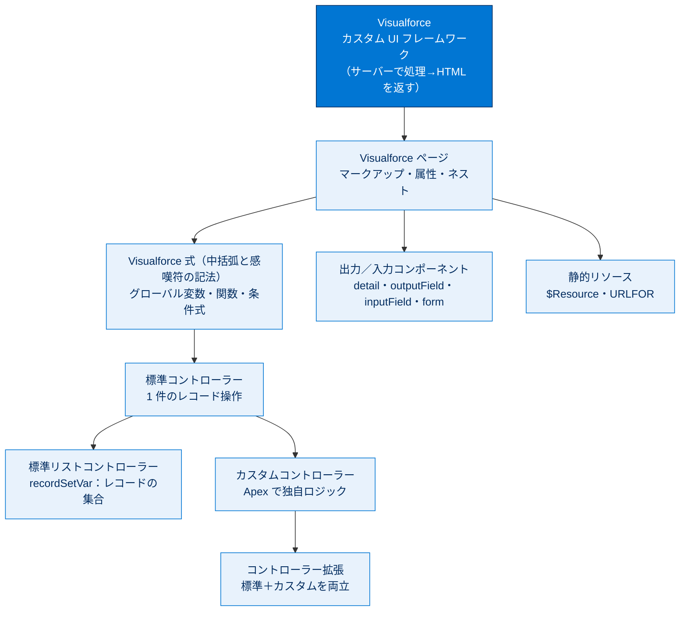

# Visualforce の基礎 総まとめ

このトピックでは、Salesforce 上で独自の UI を作る Web 開発フレームワーク **Visualforce** を、基礎から体系的に学びました。ページの作り方（マークアップ・属性・ネスト）から、動的な値を埋め込む **Visualforce 式**、コードなしでデータを扱う **標準コントローラー／標準リストコントローラー**、入力フォーム、静的リソースの活用、そして独自ロジックを書く **カスタムコントローラー**まで、表示・入力・拡張のひととおりを通しで押さえました。「どこまで宣言的（コードなし）でできて、どこから Apex が必要になるか」の境目を意識すると、全体像がすっきり整理できます。

---

## 全体像

次の図は、Visualforce の登場概念を「ページ → 式 → コントローラー → 拡張」という流れで 1 枚に俯瞰したものです。

---

## ユニット横断 早見表

| # | ユニット | 学んだこと | キーワード | 一言要点 |
| --- | --- | --- | --- | --- |
| 01 | Visualforce の使用開始 | Visualforce の正体・処理の流れ・表示できる場所 | フレームワーク / サーバー処理 / 7 つの表示場所 | サーバーで処理して HTML を返す。**[設定] ページには出せない** |
| 02 | ページの作成と編集 | 開発者コンソールでの作成、属性、ネスト | 開発者コンソール / 属性 / ネスト | `<apex:pageBlockSection>` は `<apex:pageBlock>` の中だけ |
| 03 | 単純な変数と数式の使用 | 動的な値を埋め込む式の構文 | `{! ... }` / `$User` / `IF()` | 式は **1 つの値に解決**。大小無視・空白無視 |
| 04 | 標準コントローラーの使用 | コードなしのレコード操作 | MVC / `standardController` / ドット表記 | URL の `id` でレコードを取得。`Account.Owner.Name` でたどる |
| 05 | レコード、項目、テーブルの表示 | 出力コンポーネントの粒度と反復 | detail / outputField / pageBlockTable | 大まか・きめ細かい・反復を使い分ける |
| 06 | フォームを使用したデータの入力 | 編集・保存フォームの作成 | `apex:form` / `inputField` / `commandButton` | form は 1 ページ 1 つ。検証は標準コントローラーが自動 |
| 07 | 標準リストコントローラーの使用 | レコードの集合の表示とページ送り | `recordSetVar` / 反復 / ページネーション | 既定 20 件。`next`/`previous`/`first`/`last` |
| 08 | 静的リソースの使用 | 画像・CSS・JS・ZIP の参照 | `$Resource` / `URLFOR` / 公開・非公開 | ZIP 内は必ず `URLFOR` で相対パス指定 |
| 09 | カスタムコントローラーの作成と使用 | Apex による独自ロジック | `controller` / getter / アクションメソッド | `{! contacts }` ⇔ `getContacts()`。継承不要 |

---

## 🎯 試験頻出ポイント

> [!ポイント] このトピックで狙われやすい論点・暗記値
>
> - **処理はサーバー側**で実行され、**HTML に変換**されてブラウザーに返る。Visualforce ページは **固有 URL（`/apex/ページ名`）** を持つ。
> - 表示できる場所は **7 つ**（ランチャー / ナビゲーションバー / ページレイアウト / Lightning アプリケーションビルダー / クイックアクション / ボタン・リンクの上書き / カスタムボタン・リンク）。**[設定] ページの中には表示できない**（ひっかけ）。
> - `sidebar` / `showHeader` は **Classic の既定 `true`、Lightning とモバイルでは常に `false`** に上書き。
> - 式 `{! ... }` は **大文字小文字を区別せず・空白は無視**、最終的に **1 つの値に解決**。式の中で **Apex メソッドは直接呼べない**。
> - 標準コントローラー：URL の **`id`** で 1 件取得。**ドット表記**で関連レコードをたどる。標準アクションは `save` / `quicksave` / `edit` / `delete` / `cancel`。**`save` は詳細へリダイレクト、`quicksave` はとどまる**。
> - **`<apex:form>` は 1 ページ 1 つ**。`<apex:inputField>` は **FLS・必須・入力規則を自動順守**。プラットフォームスタイルは `pageBlock` 系が与える。
> - 標準リストコントローラー：**`recordSetVar`** で集合化。**既定 20 件**。固有アクションは **`next` / `previous` / `first` / `last`**。実体は **`StandardSetController`**。並び替えは Apex が必要。
> - 静的リソース：単純は **`$Resource.名前`**、ZIP 内は **`URLFOR($Resource.名前, '相対パス')`**。サイズ上限 **1 ファイル 5MB・組織全体 250MB**。
> - カスタムコントローラー：**`controller` と `standardController` は併用不可**（両立は **コントローラー拡張**）。**継承・インターフェース実装は不要**。式 **`{! xxx }` ⇔ getter `getXxx()`**、アクションは **メソッド名そのまま**。

---

## 📖 用語早見表

| 用語 | ひとことの意味 |
| --- | --- |
| Visualforce | Salesforce 上でカスタム UI を作る Web 開発フレームワーク |
| マークアップ | `<apex:～>` で書くページの記述。HTML/CSS/JS を混在できる |
| 属性 | タグの動作を変える設定値（`属性名="値"`） |
| ネスト | タグを別のタグの内側に入れる入れ子。親子ルールがある |
| Visualforce 式 | `{! ... }` で動的な値を埋め込む記法。1 つの値に解決される |
| グローバル変数 | `$` で始まるシステム共通変数（`$User` `$Resource` `$Action` など） |
| MVC | Model（DB）・View（ページ）・Controller（処理）の役割分担 |
| 標準コントローラー | コードなしで 1 件のレコード操作を提供する組み込み機能 |
| ドット表記 | `Account.Owner.Name` のように関連レコードをたどる書き方 |
| 出力コンポーネント | 参照表示用の部品（大まか／きめ細かい／反復） |
| 反復コンポーネント | リストを 1 件ずつループして表・リストを作る部品 |
| `recordSetVar` | 標準リストコントローラーで集合を入れる変数名を指定する属性 |
| ページネーション | リストを「ページ」単位に区切り [次へ]/[前へ] で表示する仕組み |
| `<apex:form>` | 入力をまとめてサーバーへ送る領域（1 ページ 1 つ） |
| `<apex:inputField>` | レコード項目を型に応じた入力欄に自動変換する部品 |
| 静的リソース | 画像・CSS・JS・ZIP を Salesforce 上に保存し配信する仕組み |
| `URLFOR()` | リソースと相対パスから参照可能な URL を組み立てる関数 |
| カスタムコントローラー | 独自ロジックを書く Apex クラスをコントローラーにする仕組み |
| getter メソッド | `getXxx()` 形式で、式 `{! xxx }` にデータを渡すメソッド |
| アクションメソッド | クリックなどのユーザー操作に応答して実行されるメソッド |
| コントローラー拡張 | 標準コントローラーに独自ロジックを足す Apex クラス |
| `StandardSetController` | 標準リストコントローラーの実体となる Apex クラス |

---

> [!豆知識] Visualforce は「MVC の V と C」をまるごと面倒みる
>
> Visualforce ページ（View）と標準／カスタムコントローラー（Controller）は、Salesforce が **Model（データベース）と自動でつないでくれる**のが強みです。標準コントローラーを使えば、クエリも保存処理も書かずに編集画面が完成します。だからこそ「どこまで宣言的にできて、どこから Apex が要るか」を見極めるのが学習の肝になります。

> [!豆知識] 数式項目の関数知識がそのまま流用できる
>
> Visualforce 式の関数（`TODAY()` `IF()` `CONTAINS()` `YEAR()` など）は、**数式項目（Formula Field）の関数とほぼ共通**です。「数式と入力規則」トピックで覚えた知識の多くがここで再利用できます。ただし完全に同一ではなく、一方にしか無い関数もあるので、移植時はリファレンスで確認すると安心です。

> [!豆知識] レコード ID の先頭 3 文字でオブジェクトが分かる
>
> 標準コントローラーが手がかりにするレコード ID は、先頭 3 文字が **オブジェクトの種類を示すプレフィックス**になっています（取引先 `001`、取引先責任者 `003`、商談 `006`、ケース `500` など）。URL の `id=` を見ただけで「何のレコードか」が判別でき、開発中のデバッグで地味に役立ちます。

---

## ✅ 理解度セルフチェック

> [!まとめ] 理解度を確認しよう（答え付き）
>
> 1. Visualforce の処理はクライアントとサーバーのどちらで実行され、何に変換されて返る？
>    → **サーバー側**で実行され、**HTML** に変換されて返る。
> 2. Visualforce ページを表示**できない**場所は？
>    → **[設定] ページの中**（ランチャーやページレイアウトなど 7 つの場所には表示できる）。
> 3. 式 `{! YEAR(TODAY()) }` は内側と外側のどちらから評価される？
>    → **内側から外側**へ（`TODAY()` → その結果を `YEAR()` に渡す）。
> 4. 標準コントローラーが編集対象のレコードを特定する手がかりは？
>    → URL の **`id` パラメーター**。
> 5. 単一レコードを「レコードの集合」に切り替える属性は？　既定の表示件数は？
>    → **`recordSetVar`**。既定は **20 件**。
> 6. ZIP 静的リソース内のファイルを参照する書き方は？
>    → **`URLFOR($Resource.名前, '相対パス')`**（単純な 1 ファイルは `$Resource.名前`）。
> 7. ページの式 `{! contacts }` はコントローラーのどのメソッドを呼ぶ？　`controller` と `standardController` は併用できる？
>    → **`getContacts()`**。併用は**できない**（両立はコントローラー拡張）。
