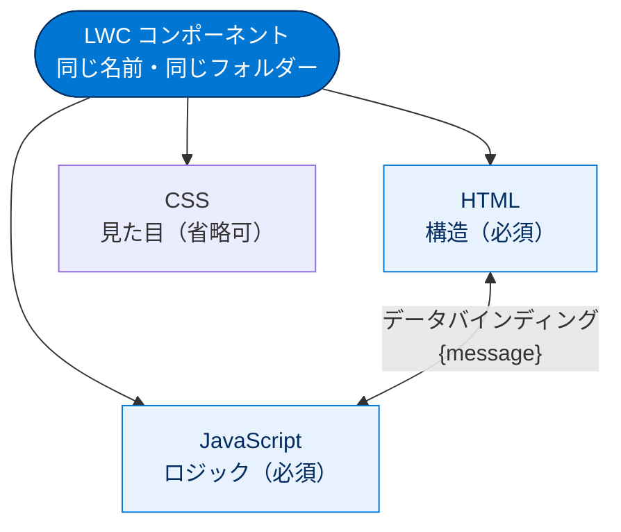
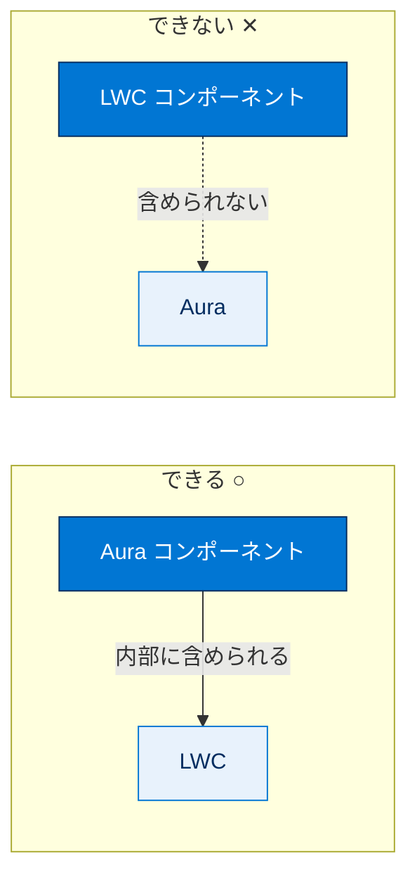
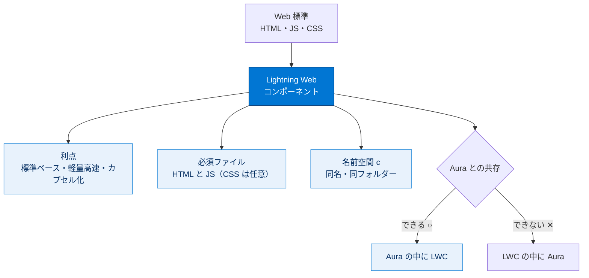

# Lightning Web コンポーネントの概要

## 学習の目的

この単元を完了すると、次のことができるようになります。

- Lightning Web コンポーネントプログラミングモデルについて説明する。
- Lightning Web コンポーネントを使用することの利点を挙げる。
- Lightning Web コンポーネントの開発を始めるために必要なものを見つける。

> [!ポイント] この単元のゴール
>
> Lightning Web コンポーネント（LWC）は、**HTML・JavaScript・CSS という Web 標準技術だけで作れる Salesforce 用の UI 部品**です。「なぜ LWC なのか（利点）」「最低限どのファイルが必要か」「Aura コンポーネントとの関係」の3点を押さえれば試験対策は十分です。

---

## Web 標準を使用したプログラミングへの道

LWC は HTML・JavaScript・CSS という標準テクノロジーで Salesforce 組織向けのコンポーネントを作成しつつ、既存の Aura コンポーネントとの互換性も維持します。Salesforce 以外で培ったスキルをそのまま活かせます。

> [!用語] Lightning Web コンポーネント（LWC：Lightning Web Components）
>
> Salesforce が提供する、**最新の Web 標準（HTML・JavaScript・CSS）をベースにした UI 部品の作成モデル**。ブラウザーがネイティブに備える Web Components 標準の上に構築されるため軽量・高速です。

> [!用語] Web 標準（Web Standards）
>
> W3C などが定める、主要ブラウザーが共通して従う技術の取り決め。HTML（構造）・JavaScript（動き）・CSS（見た目）が代表例。「どのブラウザーでも同じように動く」「情報や経験者が多い」利点があります。

> [!注意] 「Lightning Web コンポーネント」は2つの意味で使われる
>
> **プログラミングモデル（しくみ全体）**を指す場合と、**コンポーネント自体（個々の部品）**を指す場合があります。なお旧来の Lightning コンポーネントモデルは **Aura コンポーネントモデル**に改称されました。

> [!用語] Aura コンポーネント（Aura Components）
>
> LWC より前から存在する、Salesforce 独自フレームワークによる旧世代のコンポーネントモデル（旧称「Lightning コンポーネント」）。LWC と共存でき、段階的に LWC へ移行するのが一般的です。

---

## 先へ進む前に

Salesforce DX プロジェクトと Salesforce CLI の基本知識、適切に設定された Trailhead 組織、Salesforce 拡張機能パックを含む VS Code が必要です。詳しくは「Quick Start: Lightning Web Components」を修了してください。

> [!用語] Salesforce DX（Developer Experience）
>
> Salesforce の開発者向けツールセットの総称。ソースをファイルとして管理し、CLI やスクラッチ組織でモダンな開発を行う仕組み。LWC 開発の前提となります。

> [!用語] Salesforce CLI（Command Line Interface）
>
> ターミナルから Salesforce 組織を操作するツール。スクラッチ組織の作成やコンポーネントのリリース（デプロイ）をコマンドで実行できます。

---

## Lightning Web コンポーネントを使用する理由

LWC はコア Web コンポーネント標準を使用し、ブラウザーでネイティブに実行されるため軽量で高いパフォーマンスを発揮します。記述するコードの大部分は標準の JavaScript と HTML です。これにより次が容易になります。

- Web 上の一般的な場所でソリューションを見つける。
- 必要なスキルと経験を持つ開発者を見つける。
- 他の開発者・他プラットフォームの経験を活用する。
- 開発を加速する。
- 完全なカプセル化でコンポーネントを多用途にする。

Web コンポーネント自体は新しいものではなく、`<select>`・`<video>`・`<input>` など機能を持つタグとして以前から存在します。

> [!例] 「すでにある Web コンポーネント」をイメージする
>
> `<video>` タグは1行書くだけで再生ボタン・音量・シークバーを備えた動画プレーヤーになります。内部に機能を閉じ込めた1つの「部品」です。LWC も同様に **`<c-my-component>` のようなタグ1つで再利用できる部品**になります。

> [!用語] カプセル化（Encapsulation）
>
> コンポーネント内部の作り（HTML 構造や CSS スタイル）を外から見えないよう閉じ込めること。スタイルの相互干渉を防ぎ安全に再利用できます。LWC では Shadow DOM で実現します（詳細は単元5）。

> [!ポイント] LWC の利点は「標準」と「軽量・高速」
>
> 試験頻出。要点は2つ。
> - **Web 標準（HTML/JS/CSS）ベース**なので学習コストが低く、経験者が多く、開発が速い。
> - **ブラウザーがネイティブ実行**するため軽量・高速。

---

## シンプルなコンポーネントの作成

LWC は (1) JavaScript ファイル、(2) HTML ファイル、必要に応じて (3) CSS ファイルの3ステップで作成できます。

| ファイル | 役割 | 必須/省略可 |
| --- | --- | --- |
| **HTML** | コンポーネントの**構造**を提供する | 必須 |
| **JavaScript** | コアビジネスロジックとイベント処理を定義する | 必須 |
| **CSS** | デザインとアニメーションを提供する | 省略可 |

> [!ポイント] 必須なのは HTML と JavaScript の2つ
>
> 試験頻出。**LWC で必ず必要なのは「HTML」と「JavaScript」の2つ**。CSS は見た目を整えたいときだけ追加する**省略可能**なファイルです。



以下は入力項目に「Hello World」と表示するシンプルな例です。

### HTML

```html
<template>
  <input value={message}></input>
</template>
```

> [!用語] `template`（テンプレート）タグ
>
> LWC の HTML ファイルの一番外側を必ず囲むタグ。「ここからここまでがこのコンポーネントの見た目」という入れ物です。LWC の HTML は**必ず `<template>` で始まり `</template>` で終わります**。

### JavaScript

```javascript
import { LightningElement } from 'lwc';
export default class App extends LightningElement {
  message = 'Hello World';
}
```

> [!例] HTML と JavaScript はどうつながる?
>
> HTML の `value={message}` と JavaScript の `message = 'Hello World';` は**同じ名前でつながっています（データバインディング）**。そのため入力欄に自動的に「Hello World」が表示され、JS 側の値を変えれば表示も自動で変わります。

### CSS

```css
input {
  color: blue;
}
```

最小限必要なのは、同じフォルダー内にある同じ名前の HTML ファイルと JavaScript ファイルだけです。メタデータと一緒に組織へリリースすれば、Salesforce が自動でコンパイルしてくれます。

> [!注意] ファイル名は「同じ名前・同じフォルダー」が鉄則
>
> HTML・JavaScript（と任意の CSS）は**同じフォルダーに入れ、すべて同じ名前にする**必要があります。例：`app` なら `app/app.html`・`app/app.js`。一致しているからこそ Salesforce が自動でリンクします。

---

## Lightning Web コンポーネントと Aura コンポーネントの連携

既存の Aura コンポーネントはそのまま使い続けられ、Aura と LWC は問題なく共存できます。**Aura コンポーネントに LWC を含めることはできます（その逆はできません）**。純粋な LWC 実装では完全なカプセル化と標準準拠が可能です。



> [!ポイント] 「Aura の中に LWC は入れられる／逆は不可」
>
> 試験頻出。**Aura コンポーネントの中に LWC を入れることはできる**が、**LWC の中に Aura を入れることはできない**。一方向だけ覚えましょう。

---

## 使用できるもの

LWC を効率的に開発するために使うツールと環境です。

| ツール / 環境 | 役割 |
| --- | --- |
| **DevOps センター** | 開発チームに DevOps のベストプラクティスを提供し、変更とリリース管理を向上させる |
| **コードビルダー** | VS Code・Salesforce 拡張機能・Salesforce CLI の機能を Web ブラウザーで使える Web ベース IDE |
| **Dev Hub とスクラッチ組織** | スクラッチ組織は使い捨ての開発・テスト用組織、Dev Hub はその管理機能。どちらも Salesforce DX に含まれる |
| **Salesforce CLI** | スクラッチ組織の作成・設定やリリースをコマンドで素早く実行できる |
| **Lightning コンポーネントライブラリ** | Aura/LWC 両方のリファレンスと使用方法を確認できる公式リファレンス |
| **GitHub** | 拡張機能やサンプルを共有しているリポジトリ群 |
| **VS Code Salesforce 拡張機能パック** | コードヒント・Lint 警告・組み込みコマンドを提供する VS Code 用統合環境 |
| **LWC レシピ / E-Bikes デモ** | LWC の動作を確認できる GitHub のサンプルアプリケーション |
| **Lightning データサービス（LDS）** | Salesforce のデータ・メタデータにアクセスする仕組み。基本コンポーネントは LDS 上に構築される |
| **Lightning Locker** | 名前空間ごとにコンポーネントを保護し、安全な API のみへのアクセスを許可するセキュリティ機構 |

主なリソースのリンクは次のとおりです。

- Lightning コンポーネントライブラリ：https://developer.salesforce.com/docs/component-library/overview/components （組織から表示する場合は http://<MyDomainName>.lightning.force.com/docs/component-library）
- VS Code Salesforce 拡張機能パック：https://marketplace.visualstudio.com/items?itemName=salesforce.salesforcedx-vscode
- LWC レシピ：https://github.com/trailheadapps/lwc-recipes
- E-Bikes デモ：https://github.com/trailheadapps/ebikes-lwc

> [!用語] スクラッチ組織（Scratch Org）
>
> 開発・テスト専用の**使い捨て（破棄可能）の Salesforce 組織**。短期間だけ使い、不要になったら削除します。本番組織を汚さず自由に試せます。

> [!用語] Lightning データサービス（LDS：Lightning Data Service）
>
> Apex を書かずに Salesforce のレコードデータを取得・作成・更新・削除できる仕組み。キャッシュや変更追跡を自動で行います（単元5の wire サービスで使用）。

---

## この後の進め方

eBikes のデモを使って、HTML ファイルと JavaScript ファイルで何ができるかを確認しましょう。

---

## 試験対策：押さえておきたい追加ポイント

> [!ポイント] LWC まわりの頻出ポイント
>
> - **必須ファイルは HTML と JavaScript の2つ**。CSS は任意。
> - **LWC は Web 標準（HTML/JS/CSS）ベース**。Aura は Salesforce 独自フレームワークベース。
> - **Aura の中に LWC は入れられるが、LWC の中に Aura は入れられない**（一方向）。
> - LWC はブラウザーがネイティブ実行するため**軽量・高速**。
> - コンポーネントは**同じ名前・同じフォルダー**の HTML / JS で構成し、名前空間 `c` を持つ。

> [!まとめ] この単元のまとめ
>
> - **LWC** は HTML・JavaScript・CSS という **Web 標準**で作る Salesforce 用 UI 部品のモデル。
> - 利点は「標準ベースで学びやすく経験者が多い」「ネイティブ実行で軽量・高速」「カプセル化で再利用しやすい」。
> - 必須ファイルは **HTML と JS の2つ**、CSS は任意。
> - **Aura と共存可能**で、Aura の中に LWC を入れられる（逆は不可）。
> - 開発には **VS Code + Salesforce 拡張機能 + Salesforce CLI（Salesforce DX）** を使う。

---

## リソース

- Developers' Blog: Introducing Lightning Web Components（Lightning Web コンポーネントの概要）
- Lightning Web Components Dev Guide: Lightning Web コンポーネントと Aura コンポーネントの連携

---

## テスト

この単元を完了するには、テストのすべての質問に正しく解答する必要があります。
**+100 ポイント**

**1. Lightning Web コンポーネントで必須なのは、次のファイルのどれですか?**

- A. HTML、JS、CSS
- B. HTML、JS
- C. HTML、JS、Aura
- D. HTML、JS、SFDX
- E. HTML、JS、LWC

**2. Aura コンポーネントに Lightning Web コンポーネントを含めることができますか?**

- A. True
- B. False

> [!ポイント] 解答の考え方
>
> - 設問1：必須は **HTML と JS の2つ**（CSS は任意）→ **B**。
> - 設問2：**Aura の中に LWC は入れられる**（逆は不可）→ **A. True**。

---

## 🎓 この単元のまとめ

この単元では、LWC が「Web 標準（HTML・JavaScript・CSS）で作る軽量・高速な Salesforce 用 UI 部品」であることと、その利点・必須ファイル・Aura との関係を学びました。

次の図は、LWC を選ぶ理由から構成要素・Aura との共存までを1枚で俯瞰したものです。



> [!まとめ] この単元の要点
>
> - LWC は **HTML・JavaScript・CSS という Web 標準**で作る Salesforce 用 UI 部品のモデル。
> - 利点は「**標準ベースで学びやすい／経験者が多い**」「**ネイティブ実行で軽量・高速**」「**カプセル化で再利用しやすい**」。
> - 必須ファイルは **HTML と JS の2つ**、CSS は任意（同名・同フォルダーが鉄則）。
> - **Aura の中に LWC は入れられるが、逆は不可**（一方向）。
> - 開発には **VS Code + Salesforce 拡張機能 + Salesforce CLI（Salesforce DX）** を使う。

> [!豆知識] LWC 誕生は2019年、JavaScript の標準化が後押し

> LWC が一般提供されたのは2019年（Spring '19）です。それ以前の Aura は、ブラウザーに Web Components 標準がまだ十分そろっていない時代に Salesforce が独自に作ったフレームワークでした。ブラウザー側の標準（カスタム要素・Shadow DOM・ES6 モジュール）が成熟したことで、「独自フレームワークを薄くして標準に寄せる」LWC が実現したのです。だから LWC は速くて学びやすい、というわけです。
