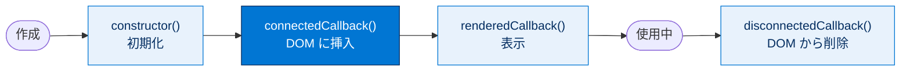
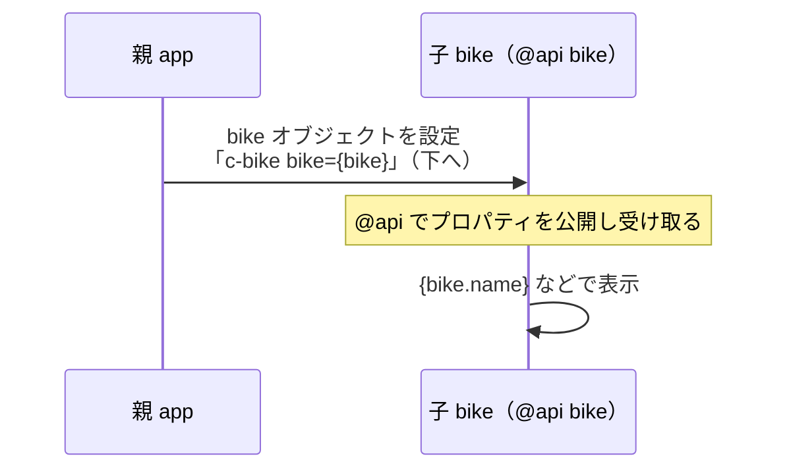

# Lightning Web コンポーネントの作成

## 学習の目的

この単元を完了すると、次のことができるようになります。

- 各コンポーネントファイルの内容を説明する。
- Lightning Web コンポーネントの JavaScript メソッドを作成する。
- コンポーネントライフサイクルでライフサイクルフックを使用する。

> [!ポイント] この単元のゴール
>
> 「**各ファイル（HTML/JavaScript/CSS）の役割**」「**JavaScript の基本構造（import と export class）**」「**ライフサイクルフック（`connectedCallback()` など）**」「**デコレーター（`@api`/`@track`/`@wire`）**」「**命名規則（キャメルケースとケバブケース）**」を理解するのがゴール。とくにデコレーターと命名規則は試験頻出です。

---

## 実践してみよう

ebikes サンプルリポジトリの productCard コンポーネントを題材に、データ表示要素をゼロから作成し、本格的な LWC へ進化させる流れを確認します。

---

## 組織にステップアップ

この単元では Salesforce 拡張機能を含む VS Code で開発します。続行には次が必要です（「クイックスタート: Lightning Web コンポーネント」を修了してください）。

- Salesforce 拡張機能パックを含む Visual Studio Code (VS Code)
- Salesforce CLI

---

## HTML ファイルの中身

LWC の HTML ファイルはすべて `template` タグを含み、その中にコンポーネントの構造を定義する HTML を記述します。productCard の簡易版を見てみましょう。

> [!注意] このサンプルの目的
>
> このバッジは HTML レイアウトのベストプラクティスではなく、LWC を動作させることに焦点を当てています。スタイルは Salesforce Lightning Design System 2 (SLDS) Named Value List を参照。

> [!手順] プロジェクトとコンポーネントを作成する
>
> 1. コマンドパレットの **[SFDX: Create Project]** を選択し、標準テンプレートでプロジェクト名 `bikeCard` を付ける。
> 2. `force-app/main/default` の `lwc` フォルダーを右クリックし **[SFDX: Create Lightning Web Component]** を選択。
> 3. コンポーネント名に `app` と入力。
> 4. Enter キーを押し、もう一度 Enter でデフォルトの `force-app/main/default/lwc` を受け入れる。

次のコードを app.html に貼り付けます（既存の HTML を置き換え）。

```html
<template>
  <div>
    <div>Name: {name}</div>
    <div>Description: {description}</div>
    <div>Category: {category}</div>
    <div>Material: {material}</div>
    <div>Price: {price}</div>
    <div></div>
  </div>
</template>
```

中括弧 `{}` で囲まれた識別子は、JavaScript クラス内の同名の項目にバインドされます。

> [!用語] データバインディング（中括弧 `{}`）
>
> HTML の `{name}` は、JavaScript クラス内の同名プロパティ（`name`）の値に**自動で置き換わります**。JS 側の値が変わると画面表示も自動更新されます。「HTML と JavaScript を名前でひも付ける」しくみです。

次のコードを app.js に貼り付けて保存します。

```javascript
import { LightningElement } from 'lwc';
export default class App extends LightningElement {
  name = 'Electra X4';
  description = 'A sweet bike built for comfort.';
  category = 'Mountain';
  material = 'Steel';
  price = '$2,700';
  pictureUrl = 'https://s3-us-west-2.amazonaws.com/dev-or-devrl-s3-bucket/sample-apps/ebikes/electrax4.jpg';
}
```

> [!例] 表示される内容
>
> 上の HTML と JavaScript を組み合わせると、画面に「Name: Electra X4」「Description: A sweet bike built for comfort.」…と JavaScript で設定した値が順に表示されます。HTML の `{name}` が JS の `name` に置き換わるためです。

---

## 条件付きディレクティブで表示を切り替える

読み込みに時間がかかる場合、テンプレート内で `lwc:if` / `lwc:else` を使って表示する要素を切り替えられます。

> [!用語] 条件付きディレクティブ（`lwc:if` / `lwc:else`）
>
> 「条件が真のときだけこの部分を表示する」を指定する命令。`lwc:if={ready}` は `ready` が `true` のとき、`lwc:else` はそれ以外のときに表示します。JavaScript の if/else を HTML 上で表現するイメージです。

次のコードを app.html に貼り付けます。`"display"` div の内容は `ready` が `true` になるまで表示されません。

```html
<template>
  <template lwc:if={ready}>
    <div id="display">
      <div>Name: {name}</div>
      <div>Description: {description}</div>
      <div>Category: {category}</div>
      <div>Material: {material}</div>
      <div>Price: {price}</div>
      <div></div>
    </div>
  </template>
  <template lwc:else>
    <div id="waiting">Loading…</div>
  </template>
</template>
```

次のコードを app.js に貼り付けて保存します。3 秒のタイマー後にコンテンツが表示されます（テスト目的）。

```javascript
import { LightningElement } from 'lwc';
export default class App extends LightningElement {
  name = 'Electra X4';
  description = 'A sweet bike built for comfort.';
  category = 'Mountain';
  material = 'Steel';
  price = '$2,700';
  pictureUrl = 'https://s3-us-west-2.amazonaws.com/dev-or-devrl-s3-bucket/sample-apps/ebikes/electrax4.jpg';
  ready = false;
  connectedCallback() {
    setTimeout(() => {
      this.ready = true;
    }, 3000);
  }
}
```

> [!例] このコードの動き
>
> 最初は `ready = false` なので「Loading…」と表示されます。コンポーネントが画面に挿入されると `connectedCallback()` が動き、3 秒後（`setTimeout` の 3000 ミリ秒）に `ready` を `true` に変更。`lwc:if={ready}` が真になり自転車の情報に切り替わります。

---

## 基本 Lightning Web コンポーネント

ゼロから作らずに済むよう、Salesforce は既製のコンポーネントを多数提供しています。すべて「Component Reference」に掲載されています。

> [!用語] 基本 Lightning Web コンポーネント（Base Lightning Web Components）
>
> Salesforce があらかじめ用意した既製コンポーネント群。`lightning-badge`、`lightning-button` など `lightning-` で始まるタグで使えます。組み込むだけで標準的な UI を素早く構築できます。

app.html の material と category の div を `lightning-badge` に置き換えて保存します。Steel と Mountain がバッジとして表示されます。

```html
<template>
  <template lwc:if={ready}>
    <div id="display">
      <div>Name: {name}</div>
      <div>Description: {description}</div>
      <lightning-badge label={material}></lightning-badge>
      <lightning-badge label={category}></lightning-badge>
      <div>Price: {price}</div>
      <div></div>
    </div>
  </template>
  <template lwc:else>
    <div id="waiting">Loading…</div>
  </template>
</template>
```

---

## コンポーネントの構築構造

コンポーネントに必要なのは同じ名前のフォルダーとファイルのみで、名前と場所で自動的にリンクされます。

```text
lwc/
└── app/                  ← フォルダー名 = コンポーネント名
    ├── app.html          ← 構造（必須）
    ├── app.js            ← ロジック（必須）
    └── app.css           ← 見た目（任意）
```

すべての LWC には名前空間があり、HTML 上ではフォルダー名とハイフンで区切られます。デフォルト名前空間 `c` のフォルダー名 app のコンポーネントは `<c-app>` と書きます。

Salesforce Platform ではフォルダー名・ファイル名にハイフンを使えません。複数単語の場合はキャメルケース（例 `myComponent`）でファイル名を付け、HTML 上ではケバブケースに対応付けて `<c-my-component>` と参照します。たとえば viewSource フォルダーのコンポーネントは HTML で `c-view-source` と参照します。

> [!用語] キャメルケースとケバブケース
>
> - **キャメルケース（camelCase）**：単語の切れ目を大文字で表す。例 `myComponent`。**ファイル名・フォルダー名・JavaScript プロパティ名**に使用。
> - **ケバブケース（kebab-case）**：単語をハイフンでつなぐ。例 `my-component`。**HTML マークアップのタグ名・属性名**に使用。

> [!用語] 名前空間（Namespace）
>
> コンポーネント名の衝突を防ぐ「所属を表す接頭辞」。独自作成の LWC は既定でデフォルト名前空間 `c` に属し、HTML では `c-` を頭に付けて参照します（例 `<c-app>`）。

| 場所 | 書き方 | 例 |
| --- | --- | --- |
| フォルダー名 / ファイル名 | キャメルケース | `myComponent` |
| JavaScript プロパティ名 | キャメルケース | `itemName` |
| HTML のタグ名 | ケバブケース（`c-` 付き） | `<c-my-component>` |
| HTML の属性名 | ケバブケース | `item-name` |

> [!ポイント] 命名規則は試験頻出
>
> 「フォルダー名 `myComponent` を HTML から参照する書き方は?」→ `<c-my-component>`。**「ファイルはキャメルケース、HTML はハイフン区切りのケバブケースで `c-` を付ける」**と覚えましょう。

---

## JavaScript の処理

JavaScript メソッドは入力・データ・イベント・状態変更などの処理を定義してコンポーネントを動作させます。LWC の JavaScript ファイルには少なくとも次のコードが必要です（`MyComponent` はクラス名）。

```javascript
import { LightningElement } from 'lwc';
export default class MyComponent extends LightningElement {
}
```

`export` ステートメントで `LightningElement` を拡張するクラスを定義します。クラス名はファイル名と同じにするのがベストプラクティスですが必須ではありません。

> [!用語] `LightningElement`（ライトニングエレメント）
>
> すべての LWC が継承（extends）する**基本クラス**。これを継承するとライフサイクルフックなど LWC に必要な機能が使えます。`import { LightningElement } from 'lwc';` で読み込みます。

> [!用語] `import` と `export` ステートメント
>
> - **`import`**：他のモジュールから機能を取り込む命令。`import { LightningElement } from 'lwc';` は `lwc` から `LightningElement` を取り込む。
> - **`export default`**：自分のクラスを外部に公開する命令。これにより Salesforce がこのクラスをコンポーネントとして認識します。

---

## LWC モジュール

LWC はモジュール（ECMAScript 6 で導入）でコア機能をバンドルします。コアモジュールは `lwc` で、`import` ステートメントで使用する機能を指定します。

```javascript
// import module elements
import { LightningElement} from 'lwc';
// declare class to expose the component
export default class App extends LightningElement {
  ready = false;
  // use lifecycle hook
  connectedCallback() {
    setTimeout(() => {
      this.ready = true;
    }, 3000);
  }
}
```

- `LightningElement` は基本クラスで、`connectedCallback()` を使用可能にする。
- `connectedCallback()` はライフサイクルフックの1つ。DOM にコンポーネントが挿入されるとトリガーされ、ここではタイマーを開始する。

> [!用語] モジュール（Module）
>
> 機能をひとまとまりにし、`import`/`export` で他ファイルとやり取りできるようにした単位。ECMAScript 6（ES6）で導入。LWC の中心モジュールは `lwc` です。

> [!用語] DOM（ドキュメントオブジェクトモデル：Document Object Model）
>
> ブラウザーがページを「要素の木構造（ツリー）」として表したもの。コンポーネントが「DOM に挿入される」とは、**実際に画面に組み込まれて表示される**ことを意味します。

---

## ライフサイクルフック

LWC はコンポーネントのライフサイクルの節目（作成・DOM 追加・表示・エラー・DOM 削除）でコードを「フック」できるメソッドを提供します。たとえば `connectedCallback()` は DOM 挿入時、`disconnectedCallback()` は DOM 削除時に呼ばれます。

> [!用語] ライフサイクルフック（Lifecycle Hook）
>
> コンポーネントの「誕生から消滅まで」の節目で**自動的に呼び出される特別なメソッド**。決められた名前のメソッドを書いておくと、その節目で Salesforce が自動実行します。「このタイミングで処理を差し込みたい」を実現する仕組みです。

| ライフサイクルフック | 呼び出されるタイミング | 主な用途 |
| --- | --- | --- |
| `constructor()` | コンポーネントが**作成**されたとき | 初期化（制約が多い） |
| `connectedCallback()` | コンポーネントが**DOM に挿入**されたとき | データ取得・タイマー開始など |
| `renderedCallback()` | コンポーネントが**表示**された後 | 描画後の処理 |
| `disconnectedCallback()` | コンポーネントが**DOM から削除**されたとき | タイマー停止・後片付け |
| `errorCallback()` | 子孫コンポーネントで**エラー**が発生したとき | エラー処理 |



条件付き表示の例では `connectedCallback()` で DOM 挿入時にコードが自動実行され、3 秒待機後に `ready` を `true` に設定しました。

```javascript
import { LightningElement } from 'lwc';
export default class App extends LightningElement {
  ready = false;
  connectedCallback() {
    setTimeout(() => {
      this.ready = true;
    }, 3000);
  }
}
```

> [!注意] `setTimeout()` の Lint 警告
>
> エディターで `setTimeout()` に「Restricted async operation....（制限された非同期操作....）」という Lint 警告が出ることがあります。誤用されやすい非同期操作への注意ですが、任意の遅延時間を示す用途では問題なく使用できます。

> [!用語] Lint（リント）
>
> コードを書く最中に書き方の問題や潜在的なミスを自動チェックして警告する仕組み。VS Code の Salesforce 拡張機能に組み込まれています。警告は必ずしもエラーではなく「注意したほうがよい」という助言です。

`this` キーワードにも注目してください。`this` は現在のコンテキストの最上位（ここでは this クラス）を指します。`this.ready = true;` は「このコンポーネントの `ready` を true にする」という意味です。

> [!用語] `this` キーワード
>
> 現在のコンテキスト（多くは自分自身のクラスのインスタンス）を指す JavaScript の予約語。`this.ready = true;` は「このコンポーネントの `ready` プロパティを true にする」という意味です。

---

## デコレーター

デコレーターはプロパティや関数の動作を変更するために使われます。`lwc` モジュールから import し、プロパティや関数の前に配置します。

```javascript
import { LightningElement, api } from 'lwc';
export default class MyComponent extends LightningElement{
  @api message;
}
```

> [!用語] デコレーター（Decorator）
>
> プロパティや関数の**前に `@` を付けて記述し、その動作に特別な意味を加える**しるし。`lwc` モジュールから import して使います。

> [!注意] 1つの項目に付けられるデコレーターは1つだけ
>
> 複数のデコレーターを import はできますが、**1つのプロパティ／関数に設定できるデコレーターは1つだけ**。たとえば同じプロパティに `@api` と `@wire` を両方付けることはできません。

| デコレーター | 役割 |
| --- | --- |
| **`@api`** | 項目を**公開**としてマークし、外部（親）コンポーネントからアクセス・設定できるようにする |
| **`@track`** | オブジェクトのプロパティや配列の要素の**内部の変更**を監視させる |
| **`@wire`** | Salesforce から**データを簡単に取得**してバインドできるようにする |

### @api

`@api` は項目を公開としてマークし、コンポーネントの API を定義します。HTML で使用する所有者（親）コンポーネントは公開プロパティにアクセスできます。すべての公開プロパティはリアクティブで、値が変更されるとフレームワークがコンポーネントを再表示します。

> [!用語] リアクティブ（Reactive）
>
> 「値の変化に**自動で反応する**」という意味。リアクティブなプロパティの値が変わるとフレームワークが自動で画面を再描画します。手動で更新指示は不要です。

> [!注意] 「項目」と「プロパティ」はほぼ同義
>
> 作成者は JavaScript クラスで項目を宣言し、インスタンスはプロパティを持ちます。コンシューマーにとって項目はプロパティです。`@api` でデコレートした項目のみがコンシューマーに公開されます。

### @track

`@track` はオブジェクトのプロパティや配列の要素の変更を監視するようフレームワークに指示し、変更時にコンポーネントを再表示します。プロパティ全体の値を変更する場合は不要です。

> [!ポイント] `@track` の出題ポイント
>
> Spring '20 以降は**すべての項目が既定でリアクティブ**なので、単純な値変更に `@track` は不要です。`@track` が必要なのは「**オブジェクトの中のプロパティ**」や「**配列の中の要素**」の変更を追跡したいときだけ、と覚えましょう。古い例で不要な `@track` が残っていても機能は変わりません。

### @wire

`@wire` は Salesforce からデータを簡単に取得してバインドできるようにします（詳しくは単元5）。

---

## @api を使ったコンポーネント間のデータ受け渡し

`@api` で、あるコンポーネント (bike) の値を別のコンポーネント (app) に表示する例です。ファイル構造は次のとおりです。

```text
lwc/
├── app/
│   ├── app.html
│   └── app.js
└── bike/
    ├── bike.html
    └── bike.js
```

```html
<!-- app.html -->
<template>
  <div>
    <c-bike bike={bike}></c-bike>
  </div>
</template>
```

```javascript
// app.js
import { LightningElement } from 'lwc';
export default class App extends LightningElement {
  bike = {
    name: 'Electra X4',
    picture: 'https://s3-us-west-2.amazonaws.com/dev-or-devrl-s3-bucket/sample-apps/ebikes/electrax4.jpg'
  };
}
```

```html
<!-- bike.html -->
<template>
  
  <p>{bike.name}</p>
</template>
```

```javascript
// bike.js
import { LightningElement, api } from 'lwc';
export default class Bike extends LightningElement {
  @api bike;
}
```

> [!例] 親から子へ値が渡る流れ
>
> 親（app）の HTML で `<c-bike bike={bike}>` と書くと、親の `bike` オブジェクトが子（bike）の `@api bike` にコピーされます。子は `@api` のおかげで外部から値を受け取る「窓口」を持ち、`{bike.name}` などで表示します。**`@api` は「このプロパティは親から設定してよい」という公開宣言**です。



---

## 試験対策：押さえておきたい追加ポイント

> [!ポイント] 作成まわりの頻出ポイント
>
> - **JavaScript の最小構成**は「`import { LightningElement } from 'lwc';` ＋ `export default class ... extends LightningElement {}`」。
> - **`template` タグ**にはコンポーネントの HTML が含まれる（div の代わりでもモジュール import でもない）。
> - **デコレーターは1項目に1つだけ**。`@api`（公開）・`@track`（オブジェクト/配列の内部変更を監視）・`@wire`（データ取得）。
> - **命名規則**：ファイル/プロパティはキャメルケース、HTML はケバブケース（`c-my-component`、`item-name`）。
> - **`connectedCallback()`** は DOM 挿入時に1回呼ばれる代表的なライフサイクルフック。

> [!まとめ] この単元のまとめ
>
> - LWC は **HTML（構造）・JavaScript（ロジック）・CSS（見た目・任意）** で構成。
> - JavaScript は **`LightningElement` を継承したクラスを `export default`** するのが基本。
> - **ライフサイクルフック**（`connectedCallback()` など）で節目に処理を差し込める。
> - **デコレーター**：`@api`（外部公開）・`@track`（内部変更監視）・`@wire`（データ取得）、1項目1つまで。
> - **命名規則**：ファイル＝キャメルケース、HTML タグ／属性＝ケバブケース。

---

## リソース

- Lightning Web Components Developer Guide: リアクティビティ
- Lightning Web Components Developer Guide: 参考文献（HTML テンプレートディレクティブ、デコレーターなど）
- MDN web docs: this
- Salesforce Lightning Design System 2 (SLDS): Named Value List

---

## テスト

この単元を完了するには、テストのすべての質問に正しく解答する必要があります。
**+100 ポイント**

**1. template タグについて正しい記述は、次のうちどれですか?**

- A. template タグはモジュールをインポートする。
- B. template タグは Salesforce バージョンの div タグである。
- C. template タグは標準コンポーネントに代わるものである。
- D. template タグには、コンポーネントの HTML が含まれる。
- E. template タグは事前定義された要素を挿入する。

**2. コンポーネントの JavaScript ファイルに含める必要があるものは何ですか?**

- A. @api
- B. LightningElement ラッパーを指定した import ステートメントと、クラス名を指定した export ステートメント
- C. template タグ
- D. ファイルパスを指定した import ステートメントと、クラス名を指定した export ステートメント
- E. LightningElement ラッパーを指定した import ステートメントと、JavaScript ファイルと同じ名前でクラスを定義した export ステートメント

> [!ポイント] 解答の考え方
>
> - 設問1：**template タグにはコンポーネントの HTML が含まれる** → **D**。
> - 設問2：必須は「`LightningElement` を import」＋「クラス名を指定して export」。クラス名をファイル名と同じにするのはベストプラクティスで**必須ではない**ため、E より一般的な **B** が正解です。

---

## 🎓 この単元のまとめ

この単元では、各ファイルの役割・JavaScript の基本構造・ライフサイクルフック・デコレーター・命名規則という「LWC を実際に組み立てる土台」を学びました。

次の表は、覚えておきたい4つの軸を凝縮したものです。

| 軸 | 要点 |
| --- | --- |
| **JS 最小構成** | `import { LightningElement } from 'lwc';` ＋ `export default class ... extends LightningElement {}` |
| **デコレーター** | `@api`（公開）／`@track`（オブジェクト・配列の内部変更を監視）／`@wire`（データ取得）。**1項目1つまで** |
| **ライフサイクルフック** | `constructor` → `connectedCallback`（DOM 挿入）→ `renderedCallback`（表示）→ `disconnectedCallback`（削除）／`errorCallback`（子のエラー） |
| **命名規則** | ファイル・プロパティ＝キャメルケース、HTML タグ・属性＝ケバブケース（`c-my-component`／`item-name`） |

> [!まとめ] この単元の要点
>
> - JavaScript は **`LightningElement` を継承したクラスを `export default`** するのが基本構造。
> - **ライフサイクルフック**で節目（作成・DOM 挿入・表示・削除・エラー）に処理を差し込める。`connectedCallback()` が代表。
> - **デコレーターは1項目に1つだけ**。`@api`・`@track`・`@wire` の役割を区別する。
> - Spring '20 以降は**既定でリアクティブ**。`@track` は「オブジェクトの中／配列の中」を追跡したいときだけ。
> - **ファイルはキャメルケース、HTML はケバブケース（`c-` 付き）**。

> [!豆知識] `@track` はもう「ほぼ要らない」デコレーター

> 昔の LWC では、画面に反映させたいプロパティすべてに `@track` を付ける必要がありました。しかし Spring '20 でフレームワークが改良され、**クラスのすべての項目が既定でリアクティブ**になったため、単純な値の変更には `@track` が不要になりました。今 `@track` が活躍するのは「オブジェクトのプロパティ」や「配列の要素」といった**入れ子の中身**の変更を追跡したいときだけ。古いサンプルコードに残っている `@track` を見ても慌てないようにしましょう。
