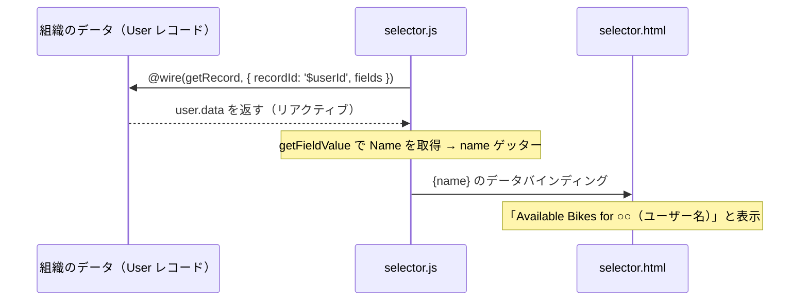

# Lightning Web コンポーネントへのスタイルとデータの追加

## 学習の目的

この単元を完了すると、次のことができるようになります。

- コンポーネントに CSS と Lightning Design System を使用する。
- Salesforce 組織からデータを取得する。
- アプリケーションを組織にリリースしてテストする。

> [!ポイント] この単元のゴール
>
> (1) **CSS と SLDS でコンポーネントの見た目を整える方法**、(2) **`@wire` サービスで組織のライブデータ（レコード）を取得する方法**、の2つが中心テーマ。とくに `@wire` の構文と `@salesforce` モジュールの import は試験で問われます。

---

## メモ

> [!注意] 日本語で受講されている方へ
>
> Challenge は日本語の Trailhead Playground で開始し、かっこ内の翻訳を参照しつつ進めます。評価は英語データを対象に行われるため、**英語の値のみ**をコピー&ペーストします。日本語組織で不合格の場合は、(1) [Locale] を [United States] に、(2) [Language] を [English] に切り替えてから、(3) [Check Challenge] をクリックすると通ることがあります。

---

## コンポーネントの適応

ここではコンポーネントの外観を制御する方法とライブデータを取得する方法を試します。テキストの外観を整え、組織のレコードから動的に名前を描画します。前単元の自転車セレクターアプリケーションのファイルを使います。

---

## CSS とコンポーネントのスタイル設定

LWC の CSS は W3C 標準に準拠します。CSS ファイルを作成すると、対応する HTML ファイルに自動的に適用されます。LWC は Shadow DOM でコンポーネントをカプセル化し、グローバル DOM から分離します。

> [!用語] Shadow DOM（シャドウ DOM）
>
> コンポーネントの HTML・CSS を、ページ全体（グローバル DOM）から切り離した「影の小部屋（サブツリー）」に閉じ込める仕組み。**あるコンポーネントの CSS が他のコンポーネントに漏れて影響することを防ぎます**（カプセル化）。`input { color: blue; }` と書いても、そのコンポーネント内の input にしか効きません。

> [!例] Shadow DOM のありがたみ
>
> 自分のコンポーネントで「ボタンを赤くする」CSS を書いても、ページ上の他のコンポーネントのボタンには影響しません。Shadow DOM が各コンポーネントのスタイルを「箱の中」に閉じ込めるため、衝突を心配せず部品を組み合わせられます。

例として、価格を緑色の太字にします。次の `.price` を detail.css に追加して保存・リリースします。

```css
body{
  margin: 0;
}
.price{
  color: green;
  font-weight: bold;
}
```

> [!注意] 個別のファイルだけをリリースできる
>
> detail フォルダーを右クリックして新しいファイルのみをリリースでき、プロジェクト全体のリリースを待たずに済みます。変更したコンポーネントだけを素早くデプロイしたいときに便利です。

ページがキャッシュされている場合は更新が必要です。自転車を選択すると価格が緑色の太字になります。

---

## Lightning Design System のスタイルの適用

SLDS は Lightning Experience と一貫したデザインを提供する CSS フレームワークです。Lightning Experience や Salesforce モバイルアプリ内の LWC は、import や静的リソースなしで SLDS を使えます。

> [!用語] SLDS（Salesforce Lightning Design System）
>
> Salesforce 標準の見た目に合わせた既製の CSS フレームワーク（クラス集）。`slds-text-heading_small` のような決められたクラス名を HTML に付けるだけで、Lightning Experience と統一感のあるデザインになります。Lightning Experience 内では import なしで使えます。

detail.html を更新して `slds-text-heading_small` と `slds-text-heading_medium` を使います。保存してリリースします。

```html
<template>
  <template lwc:if={product}>
    <div class="container">
      <div class="slds-text-heading_small">{product.fields.Name.value}</div>
      <div class="price">{product.fields.MSRP__c.displayValue}</div>
      <div class="description">{product.fields.Description__c.value}</div>
      
      <p>
        <lightning-badge label={product.fields.Material__c.value}></lightning-badge>
        <lightning-badge label={product.fields.Level__c.value}></lightning-badge>
      </p>
      <p>
        <lightning-badge label={product.fields.Category__c.value}></lightning-badge>
      </p>
    </div>
  </template>
  <template lwc:else>
    <div class="slds-text-heading_medium">Select a bike</div>
  </template>
</template>
```

組織でコンポーネントを試し、違いを確認してください（ページの更新が必要）。

> [!ポイント] スタイル設定の2つの方法
>
> | 方法 | 使いどころ |
> | --- | --- |
> | **CSS ファイル** | コンポーネント独自の見た目を細かく作りたいとき。Shadow DOM でそのコンポーネント内だけに効く |
> | **SLDS クラス** | Salesforce 標準と統一感のある見た目を手早く適用したいとき。import 不要 |

これまでは data コンポーネントの静的データを使ってきました。次は動的データをページに追加します。

---

## Salesforce データの取得

Salesforce アプリでは組織から動的データを取得したいものです。LWC は Lightning データサービス上に構築されたリアクティブな wire サービスを使います。

> [!用語] wire サービス（Wire Service）
>
> Apex を書かずに、Salesforce 組織のデータをコンポーネントに「配線（wire）」して取得する仕組み。Lightning データサービス（LDS）の上に構築され、**リアクティブ**（元データが変わると自動更新）です。`@wire` デコレーターで実装します。

### wire サービスでデータをアプリケーションに取得

`@wire` デコレーターが wire サービスを実装します。

> [!手順] wire サービスを使う2ステップ
>
> 1. JavaScript ファイルで wire アダプターをインポートする。
> 2. `@wire` デコレーターでプロパティまたは関数をデコレートする。

構文は次のとおりです。

```javascript
import { adapterId } from 'adapter-module';
@wire(adapterId, adapterConfig) propertyOrFunction;
```

| 構文要素 | 型 | 意味 |
| --- | --- | --- |
| `adapterId` | ID | wire アダプターの ID |
| `adapter-module` | 文字列 | wire アダプター関数が含まれるモジュールの ID |
| `adapterConfig` | オブジェクト | wire アダプター固有の設定オブジェクト |
| `propertyOrFunction` | プロパティ/関数 | wire サービスからデータのストリームを受信する非公開のプロパティまたは関数 |

プロパティが `@wire` でデコレートされている場合、結果はそのプロパティの `data` または `error` に返されます。関数の場合は `data` と `error` を持つオブジェクトで返されます。

> [!用語] wire アダプター（Wire Adapter）
>
> wire サービスで「どんなデータを取得するか」を決める部品。たとえば `getRecord` は「1件のレコードを取得する」アダプター。`lightning/uiRecordApi` などのモジュールから import して使います。

selector.js に次を追加して、組織から現在のユーザー名を取得します。

```javascript
import { LightningElement, wire } from 'lwc';
import { getRecord, getFieldValue } from 'lightning/uiRecordApi';
import Id from '@salesforce/user/Id';
import NAME_FIELD from '@salesforce/schema/User.Name';
const fields = [NAME_FIELD];
export default class Selector extends LightningElement {
  selectedProductId;
  handleProductSelected(evt) {
    this.selectedProductId = evt.detail;
  }
  userId = Id;
  @wire(getRecord, { recordId: '$userId', fields })
  user;
  get name() {
    return getFieldValue(this.user.data, NAME_FIELD);
  }
}
```

主な行の意味は次のとおりです。

- `wire` を `lwc` から import。
- `getRecord` と `getFieldValue` を `lightning/uiRecordApi` から import。
- `@salesforce` モジュールで現在のユーザー ID と `User.Name` のスキーマを import。
- `@wire` で `getRecord` を呼び、`userId` を渡して `fields` を取得。結果を `user` で受け取る。

> [!用語] `@salesforce` モジュール
>
> 組織の固有情報（現在のユーザー ID、項目のスキーマ、Apex メソッドなど）をハードコードせず安全に import するための特別なモジュール群。`@salesforce/user/Id`（現在のユーザー ID）、`@salesforce/schema/User.Name`（User の Name 項目）のように使います。

> [!注意] `recordId: '$userId'` の `$` の意味
>
> `@wire` の設定で値の先頭に付ける `$`（例 `'$userId'`）は「**この値はリアクティブな変数を参照する**」という印。`userId` が変わると wire が自動的に再実行され新しいデータを取得します。`$` を付けず固定文字列にすると再取得されません。

> [!例] このコードがやっていること
>
> 「現在ログイン中のユーザー ID（`Id`）」で `getRecord` を使ってそのユーザーのレコードを取得し、`getFieldValue` で `Name` 項目を取り出して `name` ゲッターで返します。結果として**ログイン中のユーザー名**を動的に表示できます。

selector.html を編集して `{name}` を追加します。

```html
<template>
  <div class="wrapper">
    <header class="header">Available Bikes for {name}</header>
    <section class="content">
      <div class="columns">
        <main class="main" >
          <c-list onproductselected={handleProductSelected}></c-list>
        </main>
        <aside class="sidebar-second">
          <c-detail product-id={selectedProductId}></c-detail>
        </aside>
      </div>
    </section>
  </div>
</template>
```

selector ファイルを含めて保存・リリースすると、ログイン中のユーザー名が表示されます（ページの更新が必要な場合あり）。



> [!ポイント] `@wire` の頻出ポイント
>
> - wire サービスは **LDS 上に構築**され、**リアクティブ**（元データの変化に自動追従）。
> - 手順は「**アダプターを import → `@wire` でプロパティ/関数をデコレート**」の2ステップ。
> - `@wire` をプロパティに付けると結果は **`data` か `error`** に入る。
> - 設定オブジェクト内の **`$変数名`** はリアクティブ参照（値が変わると再取得）。

---

## モバイル対応マークアップ

自転車セレクターアプリケーションのマークアップは基本学習向けにクリーンですが、モバイルには対応していません。SLDS を使う利点の1つは、少しの作業でデスクトップとモバイルの両方で見栄えよく表示できることです。詳しくは「リソース」を参照してください。

> [!ポイント] モバイルファーストの推奨
>
> 実務上のベストプラクティスとして、**モバイル対応は後付けにせず開発の最初から検討する**ことが推奨されます。SLDS はレスポンシブ対応なので、最初から使えばデスクトップ/モバイル両対応のデザインを少ない手間で作れます。後付けでのモバイル対応は構造の作り直しを招きがちです。

---

## まとめ

これは始まりにすぎません。LWC モデルにはテスト・セキュリティ・Apex インテグレーションなどのサポートが含まれます。W3C Web コンポーネント標準の進化とともにこのモデルも進化します。

> [!まとめ] この単元・モジュール全体のまとめ
>
> - **CSS** はコンポーネント単位で適用され、**Shadow DOM** によりスタイルがカプセル化される（他に漏れない）。
> - **SLDS** クラスを使えば import なしで Lightning 標準の見た目を手早く適用できる。
> - 組織のライブデータは **wire サービス（`@wire`）** で取得する。LDS 上に構築されリアクティブ。
> - **`@salesforce` モジュール**で現在のユーザー ID や項目スキーマを安全に import する。
> - 設定オブジェクトの **`$変数名`** はリアクティブ参照。
> - モバイル対応は**最初から**検討するのがベストプラクティス。

---

## リソース

- Lightning Web Components Developer Guide: Lightning Web コンポーネントの概要
- Developers: Code Samples and SDKs（Trailhead サンプルギャラリー）
- Trailhead: Salesforce 開発者の JavaScript スキル
- Lightning Web Components Developer Guide: モバイル対応コンポーネントの作成
- Lightning Web Components Developer Guide: Lightning Design System を使用してコンポーネントのスタイルを設定する
- Lightning Web Components Developer Guide: モバイルでの Lightning Web コンポーネントのプレビュー
- Lightning Web Components Developer Guide: Shadow DOM
- Lightning Web Components Developer Guide: Use the Wire Service to Get Data（ワイヤーサービスを使用したデータの取得）
- Lightning Web Components Developer Guide: @salesforce モジュール

---

## ハンズオン Challenge（+500 ポイント）

> [!まとめ] あなたの Challenge：Lightning アプリケーションページへの現在のユーザーの名前のインポート
>
> wire サービスを使用して現在のユーザー名を表示する Lightning アプリケーションページを作成します。
>
> **事前作業**：前単元で作成したファイルが必要です。未完了なら先に完了してください。
>
> **手順と設定値**
> 1. Lightning アプリケーションページを作成する:
>    - 表示ラベル：`Your Bike Selection`（あなたの自転車の選択）
>    - API 参照名：`Your_Bike_Selection`
> 2. 現在のユーザーの名前をアプリケーションコンテナに追加する:
>    - `selector.js` を編集する
>    - `selector.html` を編集する

> [!注意] 日本語環境で受講する場合
>
> Challenge は日本語の Trailhead Playground で開始し、かっこ内の翻訳を参照しつつ進めます。評価は英語データに対して行われるため、**英語の値のみ**をコピー&ペーストします。日本語組織で不合格の場合は、(1) [Locale] を [United States] に、(2) [Language] を [English] に切り替えてから、(3) [Check Challenge] をクリックすると通ることがあります。
