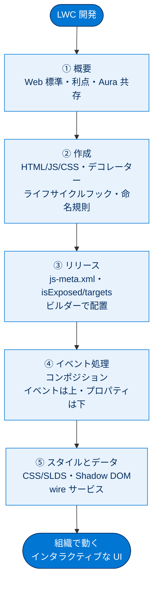

# Lightning Web コンポーネントの基本 総まとめ

このトピックでは、Salesforce の最新 UI 開発モデルである **Lightning Web コンポーネント（LWC）** を、概要から実装・リリース・イベント処理・スタイル/データ取得まで一通り学びました。LWC は HTML・JavaScript・CSS という Web 標準で作る軽量・高速な部品で、`@api`/`@track`/`@wire` のデコレーター、ライフサイクルフック、「イベントは上・プロパティは下」の通信パターン、`.js-meta.xml` による組織へのリリースが核心です。ここでは5つのユニットを1枚で思い出せるよう、全体像・早見表・頻出ポイント・用語・セルフチェックに凝縮します。

---

## 全体像：LWC 開発の流れと登場概念

次の図は、LWC を「作る → 公開する → つなぐ → 飾る・データを取る」という流れで、各ユニットの登場概念を1枚に俯瞰したものです。

---

## ユニット横断 早見表

| ユニット | 学んだこと | キーワード | 一言要点 |
| --- | --- | --- | --- |
| ① 概要 | LWC とは何か・利点・Aura との関係 | Web 標準・カプセル化・名前空間 `c` | HTML と JS が必須、CSS は任意。Aura の中に LWC は入る（逆は不可） |
| ② 作成 | 各ファイルの役割・JS 構造・フック・デコレーター | `LightningElement`・`@api`/`@track`/`@wire`・命名規則 | `extends LightningElement` を `export default`。デコレーターは1項目1つ |
| ③ リリース | 組織への設定・デプロイ・ビルダー配置 | `.js-meta.xml`・`isExposed`・`targets`・信頼済み URL | 公開には `isExposed=true` ＋ `<target>` 1つ以上 |
| ④ イベント処理 | 複数コンポーネントの連携と通信 | コンポジション・`CustomEvent`・`dispatchEvent`・`on○○` | イベントは上（子→親）、プロパティは下（親→子） |
| ⑤ スタイルとデータ | 見た目の調整とライブデータ取得 | CSS・SLDS・Shadow DOM・`@wire`・`@salesforce` | Shadow DOM でスタイルは漏れない。`@wire` でリアクティブにデータ取得 |

---

## 🎯 試験頻出ポイント

> [!ポイント] このトピックで狙われやすい論点
>
> - **必須ファイルは HTML と JavaScript の2つ**。CSS は任意。3つすべて同名・同フォルダー。
> - **Aura の中に LWC は入れられるが、LWC の中に Aura は入れられない**（一方向）。
> - **JS 最小構成**＝`import { LightningElement } from 'lwc';` ＋ `export default class ... extends LightningElement {}`。
> - **`template` タグ**にはコンポーネントの HTML が含まれる（div の代替でも import でもない）。
> - **デコレーターは1項目に1つだけ**。`@api`（公開）・`@track`（オブジェクト/配列の内部変更）・`@wire`（データ取得）。
> - **命名規則**：ファイル・プロパティ＝キャメルケース、HTML タグ・属性＝ケバブケース（`c-my-component`／`item-name`）。
> - **ビルダー表示の2条件**：`isExposed` を `true` ＋ `<target>` を1つ以上定義。
> - 主な `target`：`lightning__AppPage`・`lightning__RecordPage`・`lightning__HomePage`。
> - **通信の鉄則**：イベントは子→親（上）、プロパティは親→子（下）。種別名は**小文字・スペース不可**、親は **`on` ＋ 種別名**で待ち受け。
> - **Shadow DOM** でスタイルはカプセル化（他へ漏れない）。**`@wire`** は LDS 上に構築されリアクティブ、結果は **`data`／`error`**。

---

## 📖 用語早見表

| 用語 | ひとことの意味 |
| --- | --- |
| Lightning Web コンポーネント（LWC） | HTML・JS・CSS で作る Salesforce 用の最新 UI 部品モデル |
| Aura コンポーネント | LWC より前の Salesforce 独自フレームワークによる旧世代のコンポーネント |
| `template` タグ | LWC の HTML を必ず囲む一番外側のタグ |
| データバインディング | HTML の `{name}` と JS の同名プロパティを自動でひも付けるしくみ |
| `LightningElement` | すべての LWC が継承する基本クラス |
| デコレーター | プロパティ/関数の前に `@` を付けて動作に意味を加えるしるし |
| `@api` | プロパティを公開し親から設定できるようにする |
| `@track` | オブジェクトのプロパティ/配列要素の内部変更を監視する |
| `@wire` | 組織のデータを配線して取得するデコレーター |
| ライフサイクルフック | 作成・DOM 挿入・表示・削除などの節目で自動実行されるメソッド |
| `connectedCallback()` | コンポーネントが DOM に挿入されたときに呼ばれるフック |
| キャメルケース／ケバブケース | `myComponent`（ファイル/JS）／`my-component`（HTML）の命名規則 |
| 名前空間（`c`） | 独自 LWC が属する既定の接頭辞。HTML では `c-` を付ける |
| `.js-meta.xml` | 表示先や API バージョンを定義する設定（メタデータ）ファイル |
| `isExposed` | ビルダーで使えるようにするかの公開フラグ（true/false） |
| `targets` | コンポーネントを配置できるページ種別を指定するタグ |
| 信頼済み URL | 外部リソース接続を許可するために登録する URL リスト |
| コンポジション | 複数の LWC を組み合わせて1つのアプリを組み立てること |
| `CustomEvent` | 開発者が名前を付けて作る独自イベントオブジェクト |
| `dispatchEvent()` | イベントを発火（送り出す）メソッド |
| Shadow DOM | コンポーネントの HTML/CSS をグローバルから切り離すカプセル化のしくみ |
| SLDS | Salesforce 標準デザインの既製 CSS フレームワーク |
| wire サービス | Apex なしで組織データを取得するリアクティブなしくみ（LDS 上） |
| `@salesforce` モジュール | ユーザー ID や項目スキーマを安全に import する特別なモジュール群 |

---

> [!豆知識] LWC のタグ名に必ず付く「c-」の正体

> 自作の LWC を HTML で使うとき `<c-bike-card>` のように先頭に `c-` を付けますが、この `c` は「デフォルト名前空間」を表します。組織に独自の名前空間を登録していない場合、すべてのカスタムコンポーネントはこの `c` に属します。逆に基本コンポーネントは `lightning-` で始まり、明確に区別できるようになっています。タグの接頭辞を見れば「自作か、Salesforce 製か」がひと目で分かるわけです。

> [!豆知識] `lwc:if` は昔は `if:true` だった

> 条件付き表示のディレクティブは、古い教材では `<template if:true={ready}>` と書かれていることがあります。これは Spring '23 で `lwc:if` / `lwc:elseif` / `lwc:else` に刷新された新しい構文の旧版です。新構文は `else if` まで書けて読みやすく、パフォーマンスも改善されています。試験やサンプルで両方を見かけても「同じ条件分岐の新旧」と分かっていれば慌てません。

> [!豆知識] LWC は「ローカルでプレビュー」もできる

> LWC の開発では、組織にデプロイしなくても Salesforce CLI と Local Development Server を使えば、ローカルのブラウザーでコンポーネントの見た目をプレビューできます。デプロイ→組織を開いて確認、というサイクルを毎回回さずに済むため、見た目の微調整が一気に速くなります。「作って即確認」が効率的な開発の鍵です。

---

## ✅ 理解度セルフチェック

> [!まとめ] 答えながら知識を定着させよう（答えは各項目の末尾）
>
> 1. LWC で必須のファイルは何と何？（CSS は必須？）
>    → **HTML と JavaScript**。CSS は**任意**。
> 2. Aura の中に LWC を入れられる？ LWC の中に Aura は？
>    → Aura の中に LWC は**入れられる**。LWC の中に Aura は**入れられない**。
> 3. `@api`・`@track`・`@wire` のうち、外部（親）に公開するのはどれ？ 1項目に複数付けられる？
>    → 公開は **`@api`**。1項目に付けられるデコレーターは**1つだけ**。
> 4. コンポーネントをビルダーに表示する2つの条件は？
>    → **`isExposed` を `true`** にする ＋ **`<target>` を1つ以上**定義する。
> 5. コンポーネント間通信の鉄則を一言で言うと？
>    → **イベントは上（子→親）、プロパティは下（親→子）**。
> 6. 組織のライブデータを Apex なしで取得するデコレーターは？ その結果はどこに入る？
>    → **`@wire`**。結果は **`data`** または **`error`** に入る。
