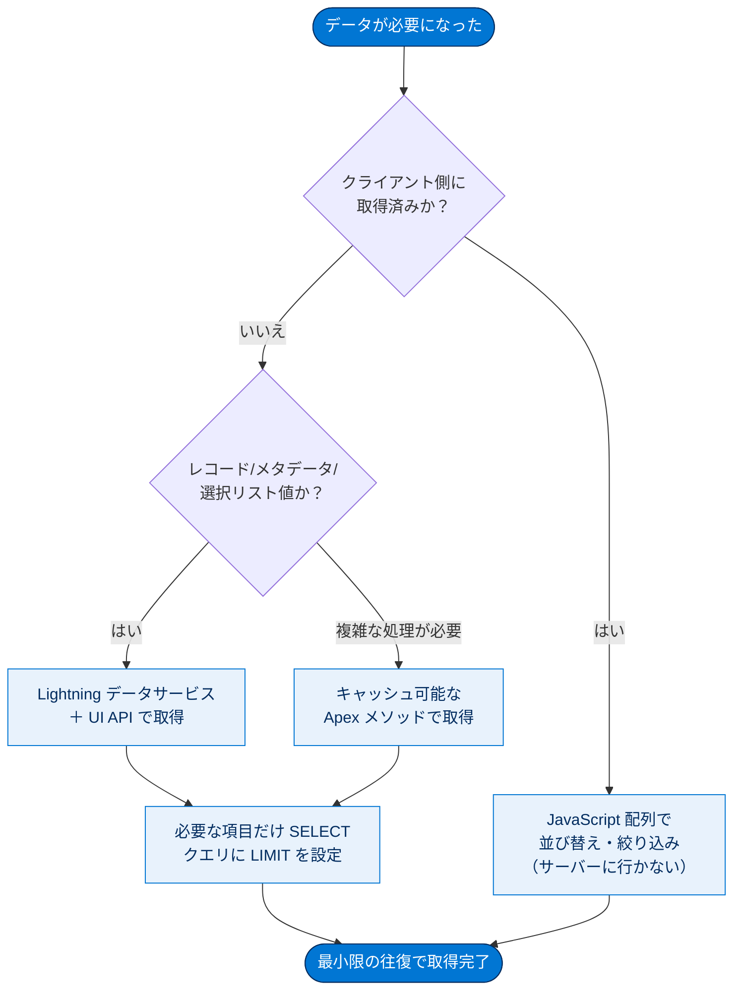
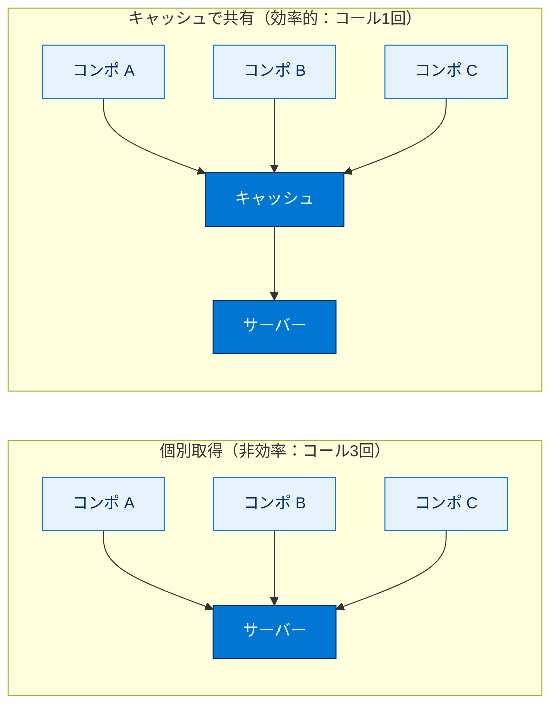
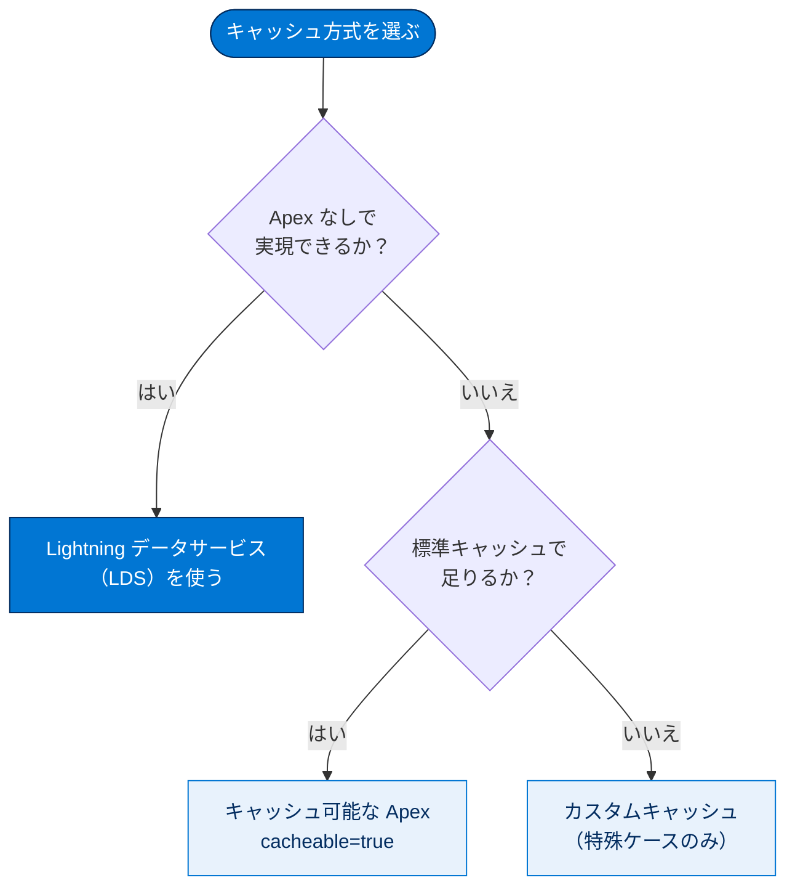

# データを操作する

## 学習の目的

この単元を完了すると、次のことができるようになります。

- LWC でサーバーへのデータ取得を最適化する方法を説明する。
- Lightning データサービスとキャッシュ可能な Apex メソッドの違いを説明する。
- クライアント側キャッシュでパフォーマンスを向上させる方法を理解する。

> [!ポイント] この単元のゴール
>
> LWC は**クライアント側で動く**ため、「サーバーとの往復（コール）をいかに減らすか」がパフォーマンスの鍵。**(1) 必要なデータだけ取る**、**(2) 取ったデータをキャッシュして使い回す**、この2点を押さえれば試験対策は十分です。

---

## はじめに：LWC のパフォーマンス課題

LWC はクライアント側の 1 ページで動作し、必要に応じて作成・破棄されます。そのため LWC 固有のパフォーマンス課題が生じます。本単元ではまずデータの取得とキャッシュを最適化します。

> [!用語] Lightning Web コンポーネント（LWC）
>
> Web 標準（HTML / JavaScript）に近い書き方で UI 部品を作る仕組み。ページは**ブラウザー側（クライアント側）**で組み立てられ、必要なデータはサーバーから取得します。この「取得」が遅さの原因になりやすいので最適化を学びます。

> [!用語] サーバーとの往復（ラウンドトリップ）
>
> ブラウザーがサーバーにデータを要求し応答を受け取るまでの一連の通信。1 回ごとに時間がかかるため、**回数を減らす・1 回を軽くする**のが基本戦略です。

---

## データ取得を最適化する

サーバーとの往復処理は次のように最適化できます。



- 可能なら Lightning データサービスかキャッシュ済みデータを使う。
- サーバーコールの前に、他にデータ取得方法がないか確認する。
- 複数コンポーネントで同一データが必要なら、属性・イベント・メソッドでデータを渡す。または UI を持たず照会 1 回でデータを配るサービスコンポーネントを作る。
- サーバーコールでは結果セットの項目と行を制限する。
  - 必要な項目のみを「選択」する。
  - クエリに「制限（LIMIT）」を設定する。
  - 結果が大きくなりうる場合はページネーションを実装する。
- 稀にしかアクセスされないデータは遅延読み込みし、アクセス頻度の低いコンポーネントは副タブに配置する。
- クライアント側で所有済みのデータの並び替え・絞り込みはサーバーに頼まず、JavaScript 配列の関数で行う（ページ設定データを除く）。
- レコードだけでなくリストビュー・メタデータ・選択リスト値も、Apex でなく Lightning データサービスと UI API で取得する。

> [!用語] ページネーション（Pagination）
>
> 大量レコードを 1 度に全部取得せず「1 ページ 20 件ずつ」のように**分割して取得・表示**する仕組み。1 回に返す行数を抑えられ、サーバー負荷も表示も軽くなります。

> [!用語] 遅延読み込み（Lazy Loading）
>
> 必要になるまでデータやコンポーネントを読み込まないこと。めったに開かれない副タブの中身はクリック時に初めて読み込みます。最初の表示が速くなります。

> [!例] 「クライアント側でできることはサーバーに頼まない」
>
> 取得済みの連絡先 100 件を名前順に並べ替えるだけなら、**サーバーへの再問い合わせは不要**。JavaScript の `Array.prototype.sort()` でクライアント側だけで処理できます。
>
> ```javascript
> // すでに取得済みの contacts 配列を、サーバーに問い合わせず並べ替える
> this.contacts = [...this.contacts].sort((a, b) =>
>   a.Name.localeCompare(b.Name)
> );
> ```

---

### UI API のワイヤーアダプターで「必要な項目だけ」要求する

`getRecord` ワイヤーアダプター（UI API の一部）では、コンポーネントに必要な項目のみを要求します。

```javascript
// 必要な「Contact.Name」だけを要求する（良い例）
@wire(getRecord, { recordId: '$recordId', fields: ['Contact.Name'] });
```

> [!用語] ワイヤーアダプター / `@wire`
>
> サーバーのデータを「配線（wire）」のように自動でつないで取得する仕組み。`@wire` デコレーターを付けると、フレームワークが取得・キャッシュ・再取得を自動管理します。`getRecord` は「1 件のレコードを取る」アダプターです。

> [!用語] UI API
>
> 画面構築に必要なデータ・メタデータをまとめて返す API。Lightning データサービスはこれを裏で利用し、項目レベルセキュリティ（FLS）チェックも自動で行います。

レイアウト単位でのレコード要求は、その全データが本当に必要な場合を除き避けます。レイアウトには何百もの項目が含まれることが多く、非常に大きな負荷がかかるためです。

```javascript
// レイアウト全体（Full）を要求する例。何百項目も取得する恐れがあり、原則避ける
@wire(getRecord, { recordId: '$recordId', layoutTypes: ['Full'] });
```

> [!注意] `getRecordUi` は本当に必要なときだけ
>
> `getRecordUi` の応答メタデータはデータペイロードより **100 ～ 1,000 倍**大きくなる場合があります。レコードデータのみ必要なら `getRecord` を使います。

> [!ポイント] 「必要な項目・行だけ」が大原則
>
> 試験頻出。サーバーコールの制限は **(1) 必要な項目だけ SELECT** と **(2) クエリに LIMIT** の両方が答え。`fields` で項目を絞り、`layoutTypes:['Full']` の「全部取り」は避けると覚えましょう。

---

## データキャッシュを改善する

各コンポーネントが個別にサーバーへ問い合わせるとコール数が膨らみます。小さなコールを何回も行うより、大きなコールを 1 回行う方が効率的です。

> [!用語] アプリケーションコンポジション（Application Composition）
>
> 小さな独立コンポーネントを部品のように組み合わせてアプリを作る設計手法。再利用しやすい反面、各コンポーネントが**勝手にサーバーへ問い合わせる**とコール数が膨らむ落とし穴があります。

> [!用語] キャッシュ（Cache）
>
> 一度取得したデータをクライアント側に一時保存し、次に同じデータが必要なときサーバーに行かず**手元の保存分を再利用**する仕組み。往復回数が減り表示が速くなります。

クライアント側でデータをキャッシュするとコンポーネント間で共有でき、往復処理が大幅に減ります。LWC には **Lightning データサービス**と**キャッシュ可能な Apex メソッド**の 2 つのキャッシュメカニズムが組み込まれ、どちらも合わない場合はカスタム実装もできます。



> [!ポイント] キャッシュ方式は2つ＋自前
>
> 1. **Lightning データサービス（LDS）** … Apex 不要。まずこれを検討。
> 2. **キャッシュ可能な Apex メソッド** … LDS が使えないとき。
> 3. **カスタムキャッシュ** … 上記2つで対応できない特殊ケースのみ。
>
> 「**まず LDS、ダメなら Apex**」の優先順位が重要です。



---

### Lightning データサービス

Lightning データサービスは管理されたレコードアプローチを提供し、Apex のデータアクセスロジックが不要です。レコードと項目のアクセシビリティを確認してセキュリティを処理し、フレームワークがレコードを管理します（初回のサーバー取得、効率的なキャッシュへの保存、要求する全コンポーネント間での共有、データ変更時のサーバー送信とキャッシュ無効化など）。

後で別コンポーネントが追加項目を必要とすれば、その項目は透過的に読み込まれキャッシュに追加されます。LDS は多くの種類の UI API データ（レコード、スキーマ、メタデータ、レイアウトメタデータ、レコードのリスト、リストメタデータなど）をキャッシュします。また、あるコンポーネントでレコードが更新されると、そのレコードを使う他コンポーネントに通知され自動更新されるため、UI の一貫性が高まります。

> [!用語] Lightning データサービス（LDS）
>
> Apex を書かずにレコードの取得・作成・更新・削除ができる仕組み。**FLS や共有ルールのチェックを自動で行い**、取得レコードを効率的にキャッシュ・共有します。`lightning-record-form` や `getRecord` などを通して利用します。

> [!例] LDS の「自動同期」が便利な理由
>
> 同じレコードを表示するコンポーネントが 3 つあるとき、1 つで更新すると LDS が残り 2 つにも変更を**自動通知**し画面が最新化されます。各コンポーネントが個別に再取得する必要がなく、コードも往復もシンプルになります。

---

### キャッシュ可能な Apex メソッド

LDS を使えない場合は Apex を使います。キャッシュ可能な Apex メソッドは、同一引数による後続要求がサーバーでなくキャッシュから返るよう、応答をクライアントキャッシュに保存するサーバーアクションです。

リモートで呼び出せるメソッドとして公開ロジックを Apex に実装でき、戻り値に関係なくほとんど何でもキャッシュできます。一般に、変更されない冪等なアクションをキャッシュ（保存可能としてマーク）することが推奨されます。

> [!用語] Apex
>
> Salesforce 専用のサーバー側プログラミング言語（Java に似た構文）。LDS では足りない複雑な処理やビジネスロジックに使います。LWC からは `@AuraEnabled` を付けたメソッドを呼べます。

> [!用語] 冪等（idempotent）なアクション
>
> 「何回実行しても結果が変わらない」処理。読み取りだけの処理は冪等で、「在庫を 1 減らす」のような毎回結果が変わる処理は冪等ではありません。**読み取り中心で副作用のない処理だけをキャッシュ対象にする**のが安全です。

キャッシュ可能な Apex メソッドは、`@AuraEnabled(cacheable=true)` アノテーションを付けるだけで作れます。

> [!用語] `@AuraEnabled(cacheable=true)`
>
> Apex メソッドに付ける目印。応答がクライアント側キャッシュに保存され、同じ引数での再呼び出しはキャッシュから返されます。`@wire` で呼ぶ Apex メソッドには原則この指定が必要です。

API バージョン 55.0 以降では、`@AuraEnabled(cacheable=true)` と共に `@AuraEnabled(scope='global')` を使い、Apex メソッドをグローバルキャッシュにできます。

```apex
// scope='global' でグローバルキャッシュに、cacheable=true でキャッシュ可能にする
@AuraEnabled(scope='global' cacheable=true)
public static someObject getIceCream(String flavor) {
  // ここに処理を記述する
}
```

> [!注意] `cacheable=true` を付けたメソッドは DML できない
>
> キャッシュ可能としてマークした Apex メソッド内では、レコードを更新・挿入・削除する **DML 操作を行ってはいけません**（読み取り専用が前提）。データ変更は別の `cacheable=false` メソッドに分けます。試験でも狙われやすいポイントです。

---

## 試験対策：押さえておきたい追加ポイント

> [!ポイント] データ操作のベストプラクティス頻出ポイント
>
> - **大きなコール 1 回 ＞ 小さなコール多数**：往復回数を減らすのが最優先。
> - **必要な項目・行だけ取得**：`fields` で項目を絞り、クエリに LIMIT を付ける。
> - **キャッシュの優先順位**：まず LDS → 次にキャッシュ可能な Apex → 最後にカスタムキャッシュ。
> - **`@wire` で呼ぶ Apex** には `@AuraEnabled(cacheable=true)` が必要。
> - **クライアント側でできる並び替え・絞り込みはサーバーに頼まない**。

> [!まとめ] この単元のまとめ
>
> - LWC はクライアント側で動くため、**サーバーとの往復をいかに減らすか**が核心。
> - データ取得は「**必要な項目・行だけ**」が鉄則。`getRecord` では `fields` で項目を絞り、`layoutTypes:['Full']` や `getRecordUi` の多用は避ける。
> - キャッシュは「**まず LDS、ダメなら キャッシュ可能な Apex**」。Apex は `@AuraEnabled(cacheable=true)` を付けるだけでキャッシュ可能。
>
> 次の単元では、順次表示と条件付き表示でデータを必要なときだけ表示する方法を説明します。

---

## リソース

- Lightning Web Components Dev Guide: getRecord
- Lightning Web Components Dev Guide: getRecordUi
- Lightning Web Components Dev Guide: Data Guidelines（データガイドライン）
- 開発者ブログ: Modularizing Code in Lightning Components
- Trailhead: Lightning Web コンポーネントと Salesforce データ
- 開発者ブログ: Designing Lightning Pages for Scale
- Lightning Web Components Dev Guide: Call Apex Methods（Apex メソッドのコール）
- Apex 開発者ガイド: AuraEnabled Annotation

---

## テスト

この単元を完了するには、テストのすべての質問に正しく解答する必要があります。
**+100 ポイント**

> [!ポイント] テスト1：サーバーコールで項目と行を制限する方法は？
>
> 選択肢
> - A. 必要な項目のみを「選択」する。
> - B. すべての項目が使用できるようにすべて「選択」する。
> - C. クエリに「制限」を設定する。
> - D. A と C
> - E. B と C
>
> ヒント：「必要な項目だけ SELECT」かつ「LIMIT を設定」の両方が正解。

> [!ポイント] テスト2（正誤問題）：サーバーに小さなコールを何回も行うより、大きなコールを 1 回行う方が効率的である。
>
> 選択肢
> - A. 正しい
> - B. 誤り
>
> ヒント：往復回数を減らすのが基本戦略でした。

---

## 🎓 この単元のまとめ

この単元では、クライアント側で動く LWC のパフォーマンスを上げるため、「サーバーとの往復をいかに減らすか」を軸に、データ取得の絞り込みとキャッシュの使い分けを学びました。

次の表は、データ操作のベストプラクティスを「課題 → 対策 → ポイント」で俯瞰したものです。

| 課題 | 対策 | 押さえどころ |
| --- | --- | --- |
| 往復回数が多い | 大きなコール 1 回にまとめる／サービスコンポーネントで配る | 小さなコール多数より大きなコール 1 回 |
| 取得データが重い | `fields` で項目を絞る・クエリに LIMIT・ページネーション | 「必要な項目・行だけ」 |
| 同じデータを各所で再取得 | キャッシュで共有 | まず LDS → 次に Apex → 最後にカスタム |
| Apex をキャッシュしたい | `@AuraEnabled(cacheable=true)` を付与 | キャッシュ可能メソッド内では DML 禁止 |
| 取得済みデータの並び替え | JavaScript 配列の関数で処理 | クライアント側でできることはサーバーに頼まない |

> [!まとめ] この単元の要点
>
> - LWC はクライアント側で動くため、**サーバーとの往復（ラウンドトリップ）を減らす**のが最優先。**小さなコール多数より大きなコール 1 回**。
> - データは「**必要な項目・行だけ**」取得する。`getRecord` の `fields` で項目を絞り、クエリに **LIMIT**、大量なら**ページネーション**。
> - `layoutTypes:['Full']` の全部取りや `getRecordUi` の多用は避ける（メタデータが 100〜1,000 倍重くなることがある）。
> - キャッシュの優先順位は「**まず LDS → 次にキャッシュ可能な Apex → 最後にカスタムキャッシュ**」。
> - `@wire` で呼ぶ Apex には **`@AuraEnabled(cacheable=true)`** が必要で、その**メソッド内では DML 不可**。

> [!豆知識] 「cacheable=true」は実は HTTP の世界の話
>
> キャッシュ可能な Apex メソッドの呼び出しは、内部的に HTTP の GET リクエストとして送られます。GET は「読み取り（副作用なし）」を表すメソッドなので、ブラウザーや CDN がキャッシュしやすいのが特徴。だから `cacheable=true` のメソッドで DML（書き込み）が禁止されているのは、「GET なのに書き込むのは Web のルール違反」という Web 標準の考え方とも一致しているんです。
