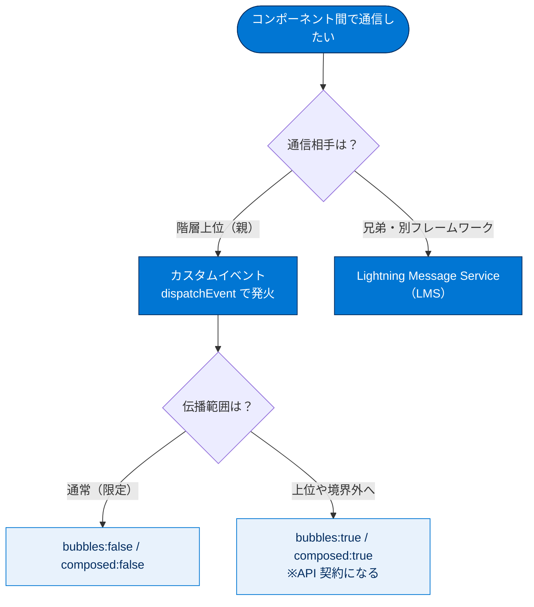
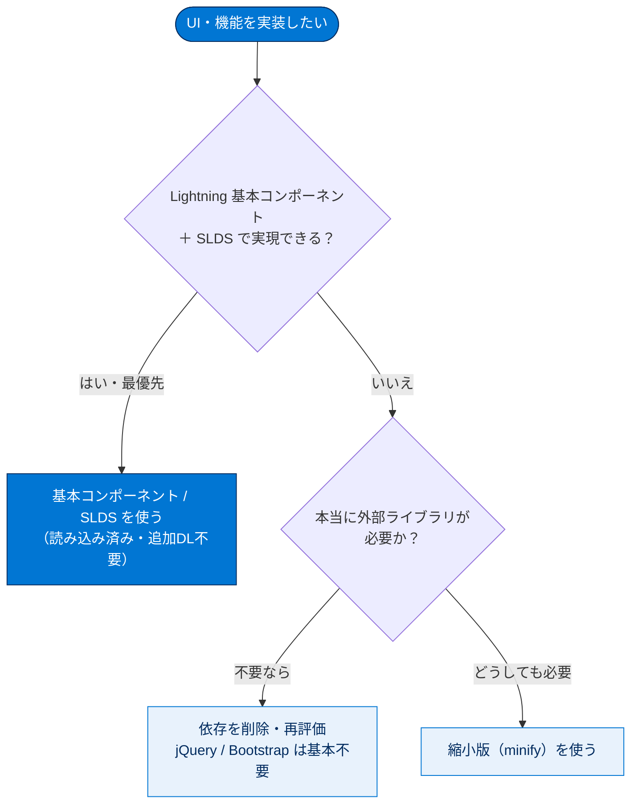
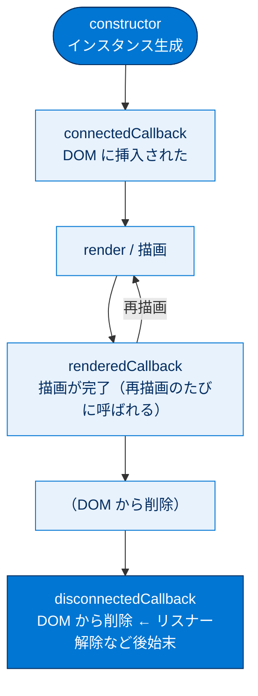

# 他の表示方法について学ぶ

## 学習の目的

この単元を完了すると、次のことができるようになります。

- JavaScript ライブラリとスタイルシートを使用する方法を説明する。
- Lightning Web コンポーネントの画像を最適化する。
- Lightning 基本コンポーネントの利点を説明する。
- ライフサイクルの表示とリフローを使用する方法を説明する。

> [!ポイント] この単元のゴール
>
> データ取得・順次表示に加え、**リスト・イベント・外部ライブラリ・画像・基本コンポーネント・ライフサイクル**の観点からパフォーマンスを底上げします。一貫したテーマは「**SLDS と Lightning 基本コンポーネントを優先し、外部ライブラリやカスタム CSS は極力避ける**」です。

---

## はじめに

前の単元のベストプラクティスに加え、LWC をさらに高速化するための表示方法を紹介します。

---

## リスト

リストは大量データを簡単に表示できますが、準備しないとデータが多くなりすぎます。次の点に留意します。

- リストは `for:each` か `iterator` を使う。`iterator` は配列の最初と最後の項目に特別な動作を適用できる `first` / `last` プロパティを持つ。
- カスタムリストでは無数の項目作成をサポートしない（特に大規模組織でパフォーマンスが著しく低下する）。ページネーションを提供するか、リストを仮想化する。
- 各リスト要素には、子の中で一意の `key` を含める。
- リスト内で LWC を使うとオーバーヘッドが大きく増え、特に大きいリストで問題が生じうるため注意する。

```html
<template for:each={contacts} for:item="contact">
  <li key={contact.Id}>{contact.Name}, {contact.Title}</li>
</template>
```

> [!用語] `for:each` と `iterator`
>
> どちらもリスト（配列）を繰り返し表示するテンプレート構文。`iterator` は各要素に `first`（最初か）と `last`（最後か）の情報が付くため、**先頭・末尾だけ装飾を変える**処理がしやすい点が違いです。

> [!用語] `key`（キー）
>
> リストの各項目に付ける**一意の識別子**。フレームワークがどの項目が追加・削除・並び替えされたかを判断するために使います。通常はレコードの `Id`。重複や欠落があると正しく描画されません。

> [!用語] 仮想化（Virtualization）/ リハイドレート
>
> 何千件もあるリストでも、**画面に見えている数十件分のコンポーネントだけ作り、スクロールに応じて中身を入れ替えて再利用する**手法。総数を抑えるためパフォーマンスが大きく向上します。「リハイドレート」は再利用するコンポーネントに新しいデータを差し込み直すことです。

> [!注意] 大量のリスト項目をそのまま作らない
>
> 数千件のレコードをすべて項目コンポーネントにすると、特に大規模組織でパフォーマンスが激しく低下します。**ページネーション**か**仮想化**で同時に存在するコンポーネント数を抑えてください。

> [!例] リスト内でのコンポーネント乱用に注意
>
> 1 行ごとに重い子コンポーネントを置いたリストを 1,000 行表示すると子が 1,000 個生成されます。1 個は小さくても合計オーバーヘッドは膨大です。リスト内では可能なら単純な HTML 要素で済ませるのが無難です。

---

## イベント

イベントはコンポーネント間通信に優れた方法です。LWC は標準 DOM イベントをディスパッチし、カスタムイベントも作成できます。階層上位との通信にはイベントを使い、リスナーは `addEventListener()` で宣言的またはプログラムで添付します。次の点に留意します。

- イベントハンドラーの数は最小限に抑える（各ハンドラーにオーバーヘッドがある）。
- `bubbles` と `composed` による親子間の伝達を理解する。通常は混乱を抑えるため `bubbles:false` / `composed:false`（DOM ツリーを上に伝わらず、シャドウ境界も越えない）。`bubbles:true` / `composed:true` にすると、そのコンポーネントの API 契約を作ることになる。
- 1 ページ内・複数ページにわたる兄弟コンポーネント間通信には Lightning Message Service を使う（Visualforce・Aura・LWC・ユーティリティバー・コンソールの各ページタブで機能する）。
- `window`・`document` などライフサイクル外にリスナーを付けた場合、`disconnectedCallback` で `removeEventListener()` し自分で削除する。怠るとメモリリークでアプリ全体が徐々に遅くなる。
- リストでは、イベントを上位に伝達させ、各項目でなく親要素に 1 つのリスナーを登録するとリスナー数を大幅に削減できる。



> [!用語] イベント / イベントハンドラー
>
> 「ボタンが押された」「値が変わった」などの**出来事（イベント）**と、それに反応する処理（**ハンドラー**）。LWC では子が `dispatchEvent()` で発火し、親が `onxxx` 属性で受け取って通信します。

> [!用語] `bubbles` と `composed`
>
> イベントが「どこまで伝わるか」を決める設定。
> - **`bubbles`**：true で DOM ツリーを**上方向（親）へ伝わる**。
> - **`composed`**：true で**シャドウ DOM の境界を越えて**外側へ伝わる。
>
> 既定は両方 false 推奨で、伝播を限定して挙動を分かりやすく保ちます。

> [!用語] シャドウ境界（Shadow Boundary / シャドウ DOM）
>
> 各 LWC は内部 DOM を「シャドウ DOM」という外から見えない殻で包みます。その境目がシャドウ境界で、`composed:false` のイベントは越えられません。

> [!用語] Lightning Message Service（LMS）
>
> 直接の親子関係にない**兄弟コンポーネント間**や、Visualforce・Aura・LWC をまたいで通信する仕組み。ページやフレームワークの種類を越えてメッセージをやり取りできます。

> [!注意] イベントリスナーの解除を忘れるとメモリリーク
>
> `window` や `document` などライフサイクル外にリスナーを付けたら、`disconnectedCallback` 内で `removeEventListener()` を呼び**必ず解除**。忘れると**メモリリーク**が起き、ブラウザーを閉じる/更新するまでアプリ全体が徐々に遅くなります。

> [!例] リストのイベントは「親で1つだけ受ける」
>
> 100 行に各々クリックリスナーを付けると 100 個になります。代わりに**親要素に 1 つだけ付け、伝播（bubbling）で受ける**と 1 個で済みます。これを「イベント委譲（デリゲーション）」と呼びます。

---

## サードパーティの JavaScript ライブラリとスタイルシート

不要なライブラリ依存は削除し、サードパーティライブラリは本当に必要か再評価します。特に DOM 操作（jQuery）や UI（Bootstrap、jQuery UI）は LWC では不要になっていることが多いです。カスタムスタイルシートは SLDS でニーズを満たせない場合のみ使います。



- **DOM 操作ライブラリ**：JavaScript 標準と LWC の抽象化により、jQuery の重要性は低下しています。
- **UI ライブラリ**：Bootstrap や jQuery UI は独自の UI アイデンティティを持ち Lightning Experience と競合しうるため避けます。Lightning 基本コンポーネントと SLDS が一貫した環境と類似機能を提供します。
- **MVC フレームワーク**：React や AngularJS は LWC と焦点が同じ（コードの整理とコンポーネント作成）。LWC との併用は非推奨。ただし Lightning コンポーネントをコンテナとして他フレームワーク製コンポーネントをホストすることは可能（本単元では扱わない）。
- **カスタムスタイルシート**：パフォーマンス問題や UI の不一致を招きます。SLDS は CSS だけでなくデザイン原則、コンポーネントブループリント（ブレッドクラム・モーダル・アラートなど）、色・フォント・余白の設計トークンを含み、Lightning に組み込み済みなので独自 CSS の作成・維持が不要です。
- **縮小版を使う**：どうしても外部ライブラリが必要なら、必ず縮小（minify）バージョンを使ってパフォーマンスを高めます。

> [!用語] SLDS（Salesforce Lightning Design System）
>
> Salesforce 公式デザインシステム。CSS スタイルに加え、デザイン原則、コンポーネントの設計図（ブループリント）、色・フォント・余白などの「設計トークン」が一式そろっています。独自 CSS を書かずに Lightning と一貫した見た目を実現できます。

> [!用語] 縮小（Minify / ミニファイ）
>
> JavaScript や CSS から改行・空白・コメントなど動作に不要な文字を削り**ファイルサイズを小さくする**処理。ダウンロードが速くなります。

> [!ポイント] 外部ライブラリ・カスタム CSS は「最後の手段」
>
> 試験では「まず SLDS と Lightning 基本コンポーネントを使い、外部ライブラリやカスタム CSS は SLDS で要件を満たせない場合のみ使う」という方針が問われます。jQuery（DOM 操作）や Bootstrap（UI）は LWC では基本不要。使う場合は**縮小版**を使います。

> [!例] 「赤いボタン」だけなら外部 UI ライブラリは不要
>
> Bootstrap を読み込まなくても、`lightning-button`（`variant="destructive"`）だけで整った赤いボタンが作れます。外部ライブラリを足すとサイズが増え、デザインの一貫性も崩れます。

---

## Lightning 基本コンポーネント

カスタムコンポーネントを作る前に基本コンポーネントのライブラリを理解しましょう（`lightning-input-field`、`lightning-record-form` など）。活用すると開発時間を大幅に短縮できます。たとえば大きな赤いボタンは `lightning-button` で簡単に作れます。

```html
<lightning-button variant="destructive" label="Destructive" onclick={handleClick}></lightning-button>
```

> [!用語] Lightning 基本コンポーネント（Base Lightning Components）
>
> Salesforce が標準で用意するすぐ使える UI 部品群。`lightning-button`（ボタン）、`lightning-input-field`（入力項目）、`lightning-record-form`（レコードフォーム）などが `lightning` 名前空間で提供されます。自作前にまずこれで実現できないか確認します。

Lightning 基本コンポーネントの利点は次のとおりです。

| 利点 | 内容 |
| --- | --- |
| **スタイル** | Lightning のネイティブなデザインでスタイル設定済み |
| **パフォーマンス** | クライアント側ですでに読み込み済みで追加ダウンロードや処理が不要。最適化も Lightning 名前空間に重点が置かれる |
| **応答性** | デフォルトでレスポンシブな設計 |
| **イノベーション** | `lightning` 名前空間は開発が積極的に進み、新規・改良コンポーネントが追加される |
| **アクセシビリティ** | アクセシビリティに配慮して作られている |
| **クライアント側検証** | 該当する場合、クライアント側検証が組み込み済み |

> [!ポイント] 基本コンポーネントの最大の利点は「すでに読み込まれている」こと
>
> 試験で「Lightning 基本コンポーネントを使うパフォーマンス上の主な利点は？」と問われたら、**(1) クライアント側にすでに読み込まれている**、**(2) 追加でダウンロードする必要がない**の組み合わせが答えです。

---

## 画像の最適化

カスタムアイコンの代わりに、可能なら（スプライトベースの）SLDS アイコンを使います（`<lightning-icon>` と `<lightning-button-icon>`）。Salesforce には数百のアイコンがあるため、自作前に SLDS のアイコンを再利用します。

他の画像を使う場合は、画像サイズをロックしてリフローを回避し、そのサイズで提供します。サムネール表示に高解像度画像を読み込まないでください。

> [!用語] スプライト（Sprite）
>
> 複数のアイコン画像を 1 枚にまとめ、必要な部分だけ切り出して表示する手法。画像のダウンロード回数（リクエスト数）を減らせます。SLDS アイコンはこの方式です。

> [!用語] リフロー（Reflow）
>
> 画像やコンテンツのサイズが後から確定し、表示済みレイアウトをブラウザーが再計算・再配置すること。画面がガクッとずれ、処理負荷もかかります。**画像サイズをあらかじめ指定（ロック）**すると防げます。

> [!注意] サムネールに高解像度画像を使わない
>
> 小さなサムネールのために大きな高解像度画像を読み込むのは無駄です。**表示サイズに合った画像**を用意し、サイズをロックしてリフローを避けます。

---

## コンポーネントライフサイクルの表示とリフロー

LWC にはフレームワークが管理するライフサイクル（作成・DOM への挿入・表示・DOM からの削除）があります。各段階でどのメソッドが起動するかを理解し、再表示回数を最小限に抑えます。場合により DOM 領域を特定サイズにロックして周辺のリフローを回避すると役立ちます。

> [!用語] ライフサイクル / ライフサイクルフック
>
> コンポーネントが「作成 → DOM に挿入 → 表示 → DOM から削除」されるまでの一生。各段階でフレームワークが呼ぶメソッドを**ライフサイクルフック**と呼びます。代表は `connectedCallback`（DOM 挿入時）、`renderedCallback`（描画後）、`disconnectedCallback`（DOM 削除時）です。



> [!ポイント] 再表示（再レンダリング）の回数を抑える
>
> 再描画のたびに処理コストがかかります。不要な再描画を減らし、必要なら **DOM 領域のサイズをロック**して周辺のリフローを防ぐと滑らかな表示になります。

---

## 試験対策：押さえておきたい追加ポイント

> [!ポイント] 他の表示方法の頻出ポイント
>
> - リストは `for:each` か `iterator`。`iterator` は `first` / `last` を持つ。各要素に一意の `key` が必須。
> - 大量リストは**ページネーション**か**仮想化**で対応。
> - イベントは `bubbles` / `composed` で伝播範囲が決まる（既定は両方 false 推奨）。
> - ライフサイクル外のリスナーは `disconnectedCallback` で `removeEventListener()` し、**メモリリークを防ぐ**。
> - 兄弟・フレームワーク間通信は **Lightning Message Service**。
> - **SLDS と Lightning 基本コンポーネントを優先**、外部ライブラリ・カスタム CSS は最後の手段（使うなら縮小版）。
> - 基本コンポーネントの利点は「**すでに読み込み済みで追加ダウンロード不要**」。
> - 画像は SLDS アイコンを優先し、**サイズをロックしてリフローを回避**。

> [!まとめ] この単元のまとめ
>
> ここで紹介した最適化技法は、より速く応答性の高いアプリを構築する一般的なガイドラインです。
>
> - **リスト**：`for:each`/`iterator`、一意の `key`、大量データはページネーション/仮想化。
> - **イベント**：ハンドラーは最小限、伝播は `bubbles`/`composed` で制御、リスナーは確実に解除。
> - **外部ライブラリ・CSS**：SLDS と基本コンポーネントを優先し、使うなら縮小版。
> - **基本コンポーネント**：すでに読み込み済みで高速、スタイル・応答性・アクセシビリティも標準装備。
> - **画像・ライフサイクル**：SLDS アイコンとサイズロックでリフローを抑え、再描画回数を最小化。

---

## リソース

- Lightning Web Components Dev Guide: Render Lists（リストの表示）
- Lightning Web Components Dev Guide: Communicate with Events（イベントを使用した通信）
- Lightning Web Components Dev Guide: Configure Event Propagation（イベント伝達の設定）
- Trailhead: Lightning Web コンポーネント間で通信する
- Lightning Web Components Dev Guide: Communicate Across the DOM with Lightning Message Service
- 開発者ブログ: Learn MOAR: Lightning Message Service Generally Available in Summer '20
- 動画: Lightning Web Components: Parent-Child Components
- Lightning Web Components: Component Reference
- Lightning Design System: Icons（アイコン）

---

## テスト

この単元を完了するには、テストのすべての質問に正しく解答する必要があります。
**+100 ポイント**

> [!ポイント] テスト1：リストイテレーターのプロパティで、配列の最初と最後の項目に特別な動作を適用するものは？
>
> 選択肢
> - A. first および last
> - B. start および finish
> - C. beginning および end
> - D. firstItem および lastItem
>
> ヒント：`iterator` が持つ 2 つのプロパティでした。

> [!ポイント] テスト2：Lightning 基本コンポーネントを活用するパフォーマンス上の主な利点は？
>
> 選択肢
> - A. サーバーから読み込まれる速度。
> - B. クライアント側ですでに読み込まれている。
> - C. 追加でダウンロードする必要がない。
> - D. A と B
> - E. B と C
>
> ヒント：「すでに読み込み済み」かつ「追加ダウンロード不要」の組み合わせを選びます。

---

## 🎓 この単元のまとめ

この単元では、リスト・イベント・外部ライブラリ・画像・基本コンポーネント・ライフサイクルという複数の観点から LWC を高速化する手法を学びました。一貫したテーマは「**SLDS と Lightning 基本コンポーネントを優先し、外部ライブラリやカスタム CSS は最後の手段にする**」です。

次の表は、各観点の「ベストプラクティス／避けたいこと」を俯瞰したものです。

| 観点 | やるべきこと | 避けたいこと |
| --- | --- | --- |
| リスト | `for:each`/`iterator`・一意の `key`・ページネーション/仮想化 | 大量項目をそのまま生成・リスト内での重い LWC 乱用 |
| イベント | ハンドラー最小化・`bubbles`/`composed` を理解・親で 1 つ受ける | リスナーの解除忘れ（メモリリーク） |
| 兄弟通信 | Lightning Message Service（LMS）を使う | 無理に親子イベントで遠回り |
| ライブラリ/CSS | SLDS と基本コンポーネントを優先・使うなら縮小版 | jQuery/Bootstrap・カスタム CSS の安易な採用 |
| 画像/ライフサイクル | SLDS アイコン・サイズロックでリフロー回避 | サムネールに高解像度画像・不要な再描画 |

> [!まとめ] この単元の要点
>
> - **リスト**は `for:each` か `iterator`（`iterator` は `first`/`last` を持つ）。各要素に**一意の `key`** が必須。大量データは**ページネーション**か**仮想化**。
> - **イベント**はハンドラーを最小限に。伝播は `bubbles`/`composed` で制御（既定は両方 false 推奨）。ライフサイクル外のリスナーは `disconnectedCallback` で解除し**メモリリーク**を防ぐ。
> - **兄弟・別フレームワーク間通信**は **Lightning Message Service（LMS）**。
> - **SLDS と Lightning 基本コンポーネントを優先**。外部ライブラリ・カスタム CSS は最後の手段で、使うなら**縮小版**。
> - 基本コンポーネントの最大の利点は「**すでに読み込み済みで追加ダウンロード不要**」。画像は**サイズをロックしてリフロー回避**、再描画回数を最小化。

> [!豆知識] シャドウ DOM は Web 標準、`composed` も標準の用語
>
> `bubbles` と `composed` は LWC の独自概念ではなく、ブラウザーの標準 DOM イベント（`Event` インターフェース）が持つプロパティです。`composed:true` のイベントだけがシャドウ DOM の境界を越えて外側に伝わる――これは Web Components の仕様でそのまま定義されています。つまり LWC のイベント設計を理解しておくと、素の Web Components やほかのフレームワークでもそのまま通用する知識になります。
