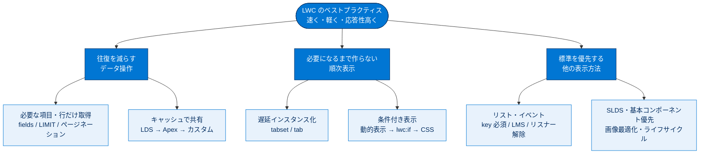

# Lightning Web コンポーネントのベストプラクティス 総まとめ

このトピックでは、クライアント側で動作する Lightning Web コンポーネント（LWC）を「速く・軽く・応答性高く」作るためのベストプラクティスを学びました。一貫した狙いは、**サーバーとの往復を減らす**こと、**必要になるまで作らない・見せない**こと、そして **Salesforce 標準（LDS・基本コンポーネント・SLDS）を最優先する**ことの3点です。データ取得の最適化からキャッシュ、順次表示、リスト・イベント・画像・ライフサイクルまで、パフォーマンスを底上げする具体策を一通り押さえました。

---

## 全体像

次の図は、このトピックで学んだベストプラクティスを「目的」ごとに俯瞰したものです。

---

## ユニット横断 早見表

| ユニット | 学んだこと | キーワード | 一言要点 |
| --- | --- | --- | --- |
| 01 データを操作する | サーバー往復の削減とキャッシュの使い分け | `getRecord` / `fields` / LIMIT / LDS / `@AuraEnabled(cacheable=true)` | 必要な項目・行だけ取り、まず LDS でキャッシュ |
| 02 順次表示と条件付き表示を使用する | 必要になるまで作らない・見せない設計 | 遅延インスタンス化 / `lightning-tabset` / `lwc:if` / CSS | tabset はデフォルト遅延、条件付き表示は宣言型→`lwc:if`→CSS |
| 03 他の表示方法について学ぶ | リスト・イベント・ライブラリ・画像・ライフサイクル | `for:each` / `key` / `bubbles` / `composed` / LMS / SLDS | 標準（基本コンポーネント・SLDS）を最優先、外部ライブラリは最後 |

---

## 🎯 試験頻出ポイント

> [!ポイント] このトピックで狙われやすい論点
>
> - **小さなコール多数より、大きなコール 1 回**。往復回数を減らすのが大原則。
> - サーバーコールの制限は **(1) 必要な項目だけ SELECT（`fields`）** と **(2) クエリに LIMIT** の**両方**。
> - キャッシュの優先順位は「**まず LDS → 次にキャッシュ可能な Apex → 最後にカスタムキャッシュ**」。
> - `@wire` で呼ぶ Apex には **`@AuraEnabled(cacheable=true)`** が必要。**そのメソッド内では DML 禁止**。
> - **デフォルトで遅延インスタンス化**されるのは **`lightning-tabset` / `lightning-tab`**。ただし **Lightning コンソールのサブタブは対象外**。
> - 条件付き表示の検討順は「**動的コンポーネント表示（宣言型）→ `lwc:if|elseif|else` → CSS**」。現行構文は `lwc:if`（古い `if:true|false` ではない）。
> - **`lwc:if` は破棄・再作成で状態が消える**／**CSS は事前作成で状態を保持**（初期読み込みは速くならない）。
> - リストの各要素には**一意の `key`** が必須。`iterator` は **`first` / `last`** を持つ。大量データは**ページネーション**か**仮想化**。
> - イベントの伝播は **`bubbles`（上方向）/ `composed`（シャドウ境界越え）**で制御（既定は両方 false 推奨）。
> - 兄弟・別フレームワーク間通信は **Lightning Message Service（LMS）**。
> - ライフサイクル外のリスナーは **`disconnectedCallback` で解除**し**メモリリーク**を防ぐ。
> - 基本コンポーネントの利点は「**すでに読み込み済みで追加ダウンロード不要**」。外部ライブラリは最後の手段、使うなら**縮小版**。

---

## 📖 用語早見表

| 用語 | ひとことの意味 |
| --- | --- |
| LWC（Lightning Web コンポーネント） | Web 標準に近い書き方で作る、クライアント側で動く UI 部品 |
| ラウンドトリップ（往復） | ブラウザーがサーバーに要求し応答を受け取る一連の通信。回数を減らすのが基本 |
| Lightning データサービス（LDS） | Apex なしでレコード操作・キャッシュ・FLS チェックを自動で行う仕組み |
| UI API | 画面構築に必要なデータ・メタデータをまとめて返す API。LDS が裏で利用 |
| `@wire` / ワイヤーアダプター | サーバーのデータを自動でつないで取得・キャッシュ・再取得する仕組み |
| `@AuraEnabled(cacheable=true)` | Apex の応答をクライアントキャッシュに保存する目印（メソッド内は DML 不可） |
| 冪等（idempotent） | 何回実行しても結果が変わらない処理。キャッシュ対象に向く |
| ページネーション | 大量レコードを「1 ページ N 件ずつ」に分割して取得・表示すること |
| 遅延インスタンス化（遅延読み込み） | 実際に使われる瞬間までコンポーネント作成を先送りすること |
| 順次表示（プログレッシブディスクロージャー） | 必要なタイミングで段階的に情報・機能を提示するデザイン手法 |
| 条件付き表示 | 条件が真のときだけ要素を表示する仕組み（`lwc:if` / CSS など） |
| `lwc:if` / `lwc:elseif` / `lwc:else` | 条件成立まで作成を遅延する現行の条件付き表示構文（状態は失われる） |
| SLDS | Salesforce 公式デザインシステム。CSS・ブループリント・設計トークン一式 |
| 基本コンポーネント | `lightning-button` などの標準 UI 部品。すでに読み込み済みで高速 |
| `key`（キー） | リストの各項目に付ける一意の識別子（通常はレコードの `Id`） |
| 仮想化 | 画面に見える分だけ作り、スクロールで中身を入れ替えて再利用する手法 |
| `bubbles` / `composed` | イベントの伝播範囲を決める設定（上方向／シャドウ境界越え） |
| Lightning Message Service（LMS） | 兄弟・別フレームワーク間を越えて通信する仕組み |
| ライフサイクルフック | `connectedCallback` などコンポーネントの各段階で呼ばれるメソッド |
| リフロー | サイズ確定後にレイアウトを再計算・再配置すること。サイズロックで回避 |

---

> [!豆知識] 「クライアント側で動く」が全ての出発点
>
> このトピックのベストプラクティスは、突き詰めると「LWC はブラウザー（クライアント側）で組み立てられる」という1点から導かれています。サーバーは遠いから往復を減らす、ブラウザーのメモリは有限だからリスナーを解除する、最初の表示を速くしたいから必要になるまで作らない――すべて同じ前提から派生した対策です。個別に暗記するより「クライアント側だからこうする」と結びつけると忘れにくくなります。

> [!豆知識] LDS が「自動で最新化」してくれる仕組み
>
> 同じレコードを表示する複数のコンポーネントがあるとき、1 つで更新すると LDS が残りにも変更を自動通知して画面を最新化します。各コンポーネントが個別に再取得しなくて済むので、コードも往復も減ります。「LDS をまず検討」と言われる理由は、単にコードが減るだけでなく、この UI 一貫性の自動管理まで含まれているからです。

> [!豆知識] 基本コンポーネントは「車輪の再発明」を防ぐ
>
> `lightning-button` や `lightning-record-form` などの基本コンポーネントは、スタイル・応答性・アクセシビリティ・クライアント側検証が最初から組み込まれています。自作するとこれら全部を自分で作り込む必要があり、しかも追加ダウンロードまで発生します。「作る前にまず基本コンポーネントを探す」が、開発時間とパフォーマンスの両方で得をする近道です。

---

## ✅ 理解度セルフチェック

> [!まとめ] 理解度を確認しよう（答えも併記）
>
> 1. サーバーコールで結果を制限する2つの方法は？
>    → **必要な項目だけ SELECT（`fields`）** と **クエリに LIMIT**。
> 2. キャッシュ方式の検討順は？
>    → **LDS → キャッシュ可能な Apex（`cacheable=true`）→ カスタムキャッシュ**。
> 3. （穴埋め）`@wire` で呼ぶ Apex メソッドには ____ を付け、そのメソッド内では ____ を行ってはいけない。
>    → **`@AuraEnabled(cacheable=true)`** ／ **DML（更新・挿入・削除）**。
> 4. （Yes/No）`lightning-tabset` のすべてのタブは、ページ表示時にまとめてインスタンス化される？
>    → **No**。デフォルトで遅延インスタンス化され、開かれるまで中身は作られない（ただしコンソールのサブタブは対象外）。
> 5. `lwc:if` と CSS の最大の違いは？
>    → `lwc:if` は破棄・再作成で**状態が失われる**／CSS は事前作成で**状態が保持される**（初期読み込みは速くならない）。
> 6. 兄弟コンポーネントや別フレームワーク間で通信する仕組みは？
>    → **Lightning Message Service（LMS）**。
