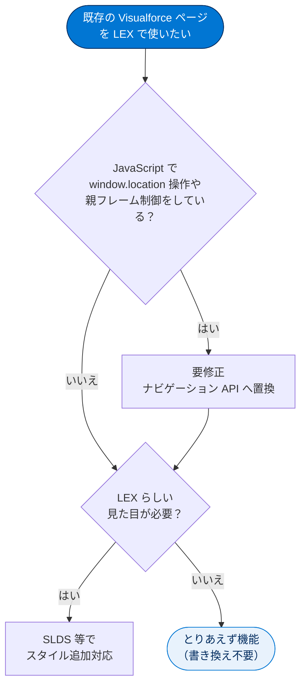
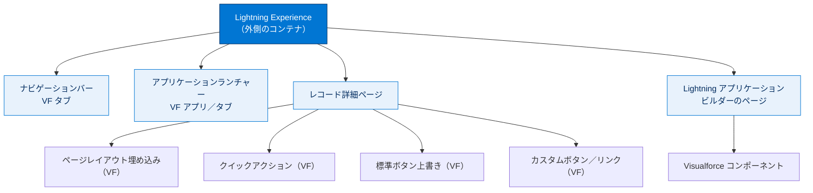
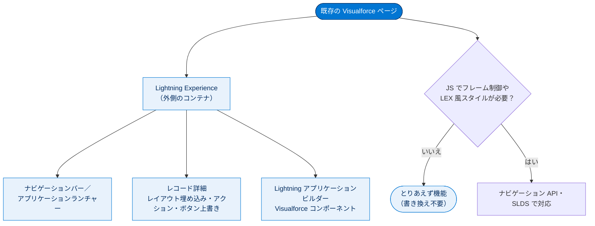

# Lightning Experience での Visualforce の使用

> [!注意] はじめに：Lightning Web コンポーネントとの関係
>
> Salesforce が公式に推奨する UI 構築方法は現在 **Lightning Web コンポーネント（LWC）** です。ただし既存組織には大量の Visualforce 資産が残り、認定試験でも出題範囲です。このモジュールでは Visualforce を Lightning Experience でどう活かすかを学びます。

---

## 学習の目的

この単元を完了すると、次のことができるようになります。

- Lightning Experience で Visualforce ページを使用する前に検討すべき要点を 2 つ挙げる。
- Lightning Experience で Visualforce を使用できる場所を 5 つ以上挙げる。

> [!ポイント] この単元のゴール
>
> 「**既存の Visualforce ページは、ほぼ手を加えずに Lightning Experience でも動く**」という大前提と、「**例外（JavaScript・スタイル・一部機能）には注意が必要**」の 2 点を押さえ、さらに「LEX のどこに Visualforce を配置できるか」を整理すれば試験対策は十分です。

---

## 前提となる用語

> [!用語] Visualforce（ビジュアルフォース）
>
> Salesforce 独自の **画面（ページ）を作るためのマークアップ言語**。HTML に似たタグ（`<apex:page>` など）で UI を組み立て、サーバー側ロジックは Apex（コントローラー）で書きます。標準画面で足りないカスタム UI に使います。

> [!用語] Lightning Experience（LEX）/ Salesforce Classic
>
> **LEX** は Salesforce の新しいモダンな UI。**Classic** は旧来の UI で、Visualforce はもともと Classic 向けに設計されました。ユーザーは両者を切り替えて利用でき、後述の「コンテナ」が異なるため Visualforce の動き方にも影響します。

> [!用語] コンテナ（Container）
>
> ページを内側に抱え込んで実行する入れ物。Classic では Visualforce がページ全体を所有しますが、LEX では Lightning という大きな入れ物の中で Visualforce が動きます（別単元「Visualforce アプリケーションコンテナの探索」で詳述）。

---

## Lightning Experience での Visualforce の使用

Lightning Experience で新しい UI が導入されても、**Visualforce が使えなくなるわけではありません**。大半のページはコードを書き換えずに LEX で機能します。

ただし新 UI では配置が変わっているため、Classic と LEX を切り替えても確実に機能するよう多少の処理が必要なことがあり、ごく少数ながら LEX で動作しない機能もあります。まず重要な項目を整理します。

| # | 重要な点 | ひとことで言うと |
| --- | --- | --- |
| 1 | Visualforce は LEX で「とりあえず機能」する | 重要な例外を除き、Classic でも LEX でも同じように動く |
| 2 | 標準コンポーネントの見た目は Classic 風 | LEX らしい見た目にするには追加作業が必要 |
| 3 | JavaScript には新しいルールがある | LEX では Visualforce がページ全体を「所有」していない |
| 4 | その他にも細かな変更点がある | 大半は「とりあえず機能」のための調整 |

> [!用語] 「とりあえず機能（works as is / out of the box）」
>
> コードを書き換えなくてもそのまま動く状態。Salesforce は「既存の Visualforce 資産を壊さない」ことを重視し、大半のページは手を加えずに LEX でも動作するよう設計されています。

> [!ポイント] 試験で問われる「2つの検討事項」
>
> LEX で Visualforce を使う前に検討すべき代表的な要点は次の 2 つです。
> 1. **JavaScript の挙動** — LEX では Visualforce が iframe 内で動き、ページ全体を制御できない。`window.location` の直接操作などは要注意。
> 2. **スタイル（見た目）** — 標準コンポーネントは Classic 風に表示される。LEX らしくするには追加対応が必要。

既存の Visualforce ページを LEX で使う前の判断フローを整理すると次のとおりです。

---

## Lightning Experience で Visualforce を使用できる場所

Classic 同様、LEX も Visualforce のカスタムページやアプリケーションで拡張できます。ただし **配置場所が変更** されている他、依然として配置できない場所もあります。詳細は単元末尾のリソースを参照してください。

> [!ポイント] 配置できる「7つの場所」を覚える
>
> 試験では「LEX のどこで Visualforce を使えるか」が問われます。
>
> | # | 配置場所 | 概要 |
> | --- | --- | --- |
> | 1 | アプリケーションランチャー | タブ化したページに一覧からアクセス |
> | 2 | ナビゲーションバー | アプリ内のタブとして常時表示 |
> | 3 | 標準ページレイアウト内 | レコード詳細にページを埋め込む |
> | 4 | Lightning アプリケーションビルダー | コンポーネントとしてページに追加 |
> | 5 | クイックアクション | アクションとして起動 |
> | 6 | 標準ボタン/リンクの上書き | 標準画面を自作ページに置き換える |
> | 7 | カスタムボタン/リンク | 新しいアクションとして追加 |

---

### 1. アプリケーションランチャーから Visualforce ページを開く

Visualforce のアプリケーションやカスタムタブは **アプリケーションランチャー** から使用できます。ナビゲーションバーのアプリケーションランチャーアイコンをクリックし、すべて表示するには **[すべて表示]** を選択します。カスタムアプリケーションを有効にすると、追加した Visualforce タブを含む項目がナビゲーションバーに表示されます。

> [!用語] アプリケーションランチャー（App Launcher）
>
> 画面左上の格子状アイコン（9 つの点）から開く、**アプリケーションとタブの一覧画面**。利用可能な機能をここから起動します。

> [!注意] タブに追加しないと一覧に出ない
>
> アプリケーションランチャーでアクセスできるようにするには、**Visualforce ページをタブに追加する必要があります**。「ページを作っただけ」では [すべての項目] に現れません。

---

### 2. Visualforce ページをナビゲーションバーに追加する

Visualforce タブをアプリケーションに追加し、ナビゲーションバーに **項目として常時表示** できます。

> [!用語] ナビゲーションバー（Navigation Bar）
>
> LEX 上部に横並びで表示される、タブ（メニュー項目）の帯。アプリケーションを切り替えると中身も切り替わります。

---

### 3. 標準ページレイアウト内に Visualforce ページを表示する

ページレイアウトに Visualforce ページを埋め込み、標準ページに **完全なカスタムコンテンツ** を表示できます。動作は Classic と同じですが、**確認にはレコードの [詳細] を表示する必要がある** 点が異なります。

> [!例] ページレイアウト埋め込みのイメージ
>
> 取引先（Account）の詳細ページに「関連する売上グラフ」を描く Visualforce ページを埋め込めば、ユーザーは取引先を開くだけで標準項目と一緒にカスタムグラフを見られます。

---

### 4. Lightning アプリケーションビルダーで Visualforce ページをコンポーネントとして追加する

Lightning アプリケーションビルダーでカスタムページを作る際、**Visualforce コンポーネント** で Visualforce ページを追加できます。

> [!用語] Lightning アプリケーションビルダー（Lightning App Builder）
>
> ドラッグ＆ドロップでページを組み立てる **ノーコードの画面作成ツール**。標準・カスタム（Visualforce や LWC を含む）コンポーネントを並べて構成します。

> [!注意] 「LEX で利用可能」を有効にする必要がある
>
> アプリケーションビルダーで使うには、そのページの **[Available for Lightning Experience, Lightning Communities, and the mobile app（Lightning Experience、Lightning コミュニティ、モバイルアプリケーションで利用可能）]** を有効にする必要があります。忘れるとコンポーネント一覧にページが現れません。

---

### 5. Visualforce ページをクイックアクションとして起動する

LEX は Classic と配置が異なりますが、**クイックアクションを追加する手順はほぼ同じ** です。オブジェクトのページレイアウトの適切なパブリッシャー領域にアクションを追加します。

> [!用語] クイックアクション（Quick Action）
>
> レコード画面などから素早く実行する操作ボタン。「グローバルアクション」（どこからでも）と「オブジェクト固有アクション」（特定オブジェクトのページ）があり、Visualforce ページをこのアクションとして起動できます。

---

### 6. 標準ボタンまたはリンクを上書きして Visualforce ページを表示する

オブジェクトのアクションを Visualforce ページで **上書き（override）** できます。上書きしたボタン/リンクをクリックすると、標準ページではなく作成したページが表示されます。設定は Classic とほぼ同じです。

> [!用語] アクションの上書き（Override）
>
> 標準の [新規]・[編集]・[表示] などのボタンが開く画面を、自作の Visualforce ページに **差し替える** 機能。

> [!例] 上書きの具体例
>
> 取引先責任者（Contact）の **[編集]** を Visualforce ページで上書きすると、[編集] を押したとき標準ではなく自作のカスタム編集画面が開きます。

---

### 7. カスタムボタンまたはリンクを使用して Visualforce ページを表示する

オブジェクトにアクションを定義し、新しいアクションをボタンやリンクとして作成できます。手順は Classic と同じです。

> [!注意] JavaScript ボタンは LEX で非サポート
>
> LEX では **JavaScript のボタンやリンクがサポートされていません**（Visualforce と URL の項目は可）。Classic で JavaScript ボタンを多用していた組織は移行時に置き換えが必要です。試験で狙われやすいポイントです。

---

## 配置場所の全体像（図解）

LEX という大きなコンテナの中で、Visualforce ページがどこに配置できるかを整理した図です。

---

## 試験対策：押さえておきたい追加ポイント

> [!ポイント] よくある出題パターン
>
> - **「すべての VF ページが LEX で壊れる」は誤り。** 大半は「とりあえず機能」する。壊れるのは `window.location` 操作などごく一部。
> - **標準コンポーネントは LEX でも Classic 風の見た目。** LEX に寄せるには追加作業が必要。
> - **JavaScript ボタンは LEX で非サポート**（Visualforce・URL ボタンは可）。
> - **アプリケーションビルダーで使うには「LEX で利用可能」のチェックが必須。**
> - **配置できる場所は最低 5 つ以上**（ランチャー・ナビゲーションバー・ページレイアウト・アプリケーションビルダー・クイックアクション・ボタン上書き・カスタムボタン）。

> [!まとめ] この単元のまとめ
>
> - Visualforce は重要な例外を除き、**LEX で「とりあえず機能」** する。
> - 使う前の検討事項は主に **JavaScript の挙動** と **スタイル（見た目）** の 2 点。
> - 配置できる場所は **アプリケーションランチャー / ナビゲーションバー / 標準ページレイアウト / Lightning アプリケーションビルダー / クイックアクション / 標準ボタン・リンクの上書き / カスタムボタン・リンク** の 7 つ。

---

## リソース

- Trailhead: 「Lightning Experience の機能」の「見つけ方: Lightning Experience のナビゲーションと設定」
- Trailhead: アプリケーションの簡易カスタマイズ
- Trailhead: Lightning アプリケーションビルダー
- Trailhead: Visualforce の基礎
- Visualforce 開発者ガイド
- Build Apps Visually with Lightning App Builder（Lightning アプリケーションビルダーを使用したアプリケーションの視覚的な構築）

---

## テスト

この単元を完了するには、テストのすべての質問に正しく解答する必要があります。

**+100 ポイント**

**問 1. 次の文のうち、誤っているものはどれですか？**

- A. Visualforce ページには、Lightning Experience 内であっても Salesforce Classic のスタイル設定が表示される。
- B. すべての Visualforce ページは Lightning Experience で破損し、修正する必要がある。
- C. JavaScript を使用する Visualforce ページでは、更新が必要となる場合がある。
- D. 上記のすべて

> [!ポイント] 解答の考え方
>
> 正解は **B**。「すべてのページが壊れる」は誤りで、大半は「とりあえず機能」します。A・C はどちらも正しい記述です。

**問 2. Lightning Experience のどこで Visualforce を使用できますか？**

- A. カスタムアプリケーション
- B. カスタムタブ
- C. クイックアクション
- D. 上記のすべて

> [!ポイント] 解答の考え方
>
> 正解は **D**。カスタムアプリケーション・カスタムタブ・クイックアクションのいずれでも Visualforce を使用できます。

---

## 🎓 この単元のまとめ

この単元では、既存の Visualforce ページが Lightning Experience（LEX）でも基本的にそのまま動くこと、検討すべき例外、そして LEX 内で Visualforce を配置できる場所を学びました。

次の図は、LEX という大きなコンテナの中に Visualforce ページがどこから入ってくるかを俯瞰したものです。

> [!まとめ] この単元の要点
>
> - Visualforce は重要な例外を除き、LEX で **「とりあえず機能」** する（「すべて壊れる」は誤り）。
> - 使う前の検討事項は主に **JavaScript の挙動** と **スタイル（見た目）** の 2 点。
> - 標準コンポーネントは LEX でも **Classic 風の見た目** のまま表示される。
> - 配置できる場所は **アプリケーションランチャー／ナビゲーションバー／標準ページレイアウト／Lightning アプリケーションビルダー／クイックアクション／標準ボタン・リンクの上書き／カスタムボタン・リンク** の 7 つ。
> - LEX では **JavaScript ボタン・リンクは非サポート**（Visualforce・URL ボタンは可）。

> [!豆知識] 「out of the box」は本当に箱から出してすぐ
>
> 「とりあえず機能（works as is / out of the box）」は IT 業界で「箱から出してそのまま使える」という意味の定番フレーズです。Salesforce が既存 Visualforce 資産の互換性をここまで重視するのは、十数年分のカスタム画面を抱える大企業が LEX へ移行する際に「全部作り直し」になると移行が止まってしまうため。互換性は単なる親切ではなく、新 UI を普及させるための経営判断でもあります。
