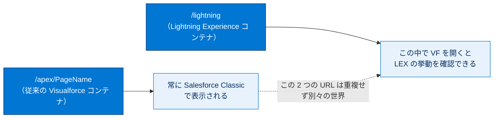
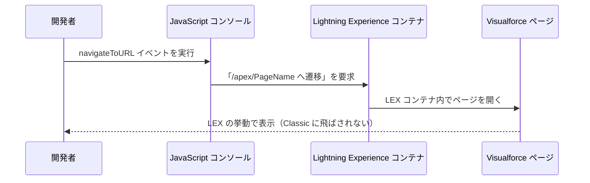
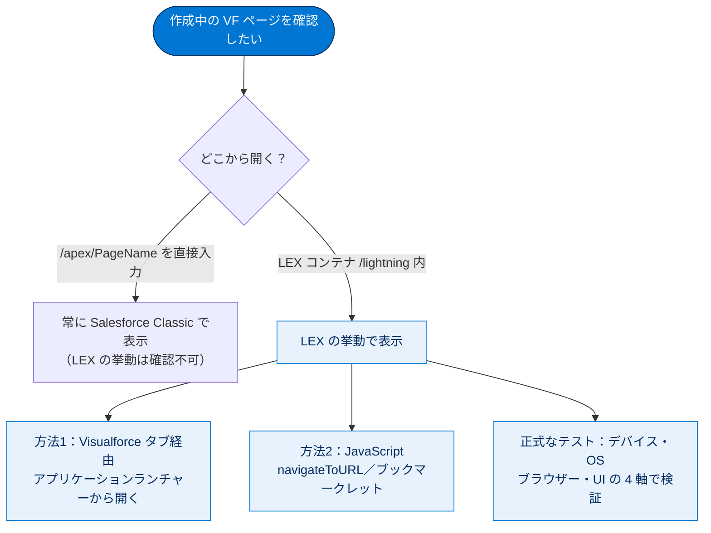

# Agentforce 360 Platform 用の Visualforce ページを開発する

## 学習の目的

この単元を完了すると、次のことができるようになります。

- Lightning Experience の開発環境の設定を完了する。
- Lightning Experience で作成中の Visualforce ページを表示する 2 通りの方法について説明する。
- Visualforce ページの作成中のプレビューと、正式なテストの違いを説明する。
- 正式なテストに含めるべき要素を示すテストマトリックスを作成する。

> [!ポイント] この単元のゴール
>
> LEX 向けの Visualforce 開発では、**「URL に `/apex/PageName` と打つと必ず Salesforce Classic で開く」** という落とし穴がカギです。LEX の挙動を確認するには `/lightning` コンテナ内からページを開く必要がある、という点を中心に、開発環境のセットアップとテストマトリックスの考え方を押さえましょう。

---

## 前提となる用語

> [!用語] Lightning Experience コンテナ（/lightning）
>
> Lightning Experience アプリケーション本体。`/lightning` という URL からアクセスする SPA（単一ページアプリケーション）です。Visualforce ページを LEX の見た目・挙動で動かすには、この `/lightning` コンテナの内側でページを開く必要があります。

> [!用語] 開発モードフッター（Development Mode Footer）
>
> ユーザー設定で「開発モード」を有効にすると Visualforce ページ下部に表示される編集パネル。ページを見ながらマークアップを編集できますが、**Salesforce Classic でしか使えません**（LEX では不可）。

> [!用語] 開発者コンソール（Developer Console）
>
> ブラウザー上で動く Salesforce 純正の開発ツール。Apex・Visualforce・SOQL などを記述・実行・デバッグできます。Classic と LEX で見た目・挙動は変わりません。

---

## Lightning Experience 向けの Visualforce ページの作成

LEX 向けの作成は Classic 向けと共通点もありますが、**主な違いは作成中にページを表示・テストする方法** です。このプロセスは **Salesforce モバイルページの作成と同じ** です。

---

## エディターの設定

コード記述に使う編集ツールは、LEX・Classic・Salesforce アプリケーションのどのページを作る場合でも、また次のどのツールを使う場合でも **設定プロセス自体は変わりません**。

| 編集ツール | 特徴 | LEX での利用 |
| --- | --- | --- |
| 開発者コンソール | ブラウザー上の純正ツール。独自 UI を持つ | 可（UI は Classic/LEX で同一） |
| Visual Studio Code 向け Salesforce 拡張機能 | ローカルの定番エディター。ネイティブ UI | 可 |
| [設定] のエディター | 設定画面内のシンプルなエディター | 可（常に Classic UI を維持） |
| 開発モードフッター | ページ下部のインライン編集パネル | **不可（Classic 専用）** |
| サードパーティ製ツール | 各種ベンダーのツール。独自 UI | 可 |

推奨ツールをすでに持っていれば、ここで何もする必要はありません。Visualforce のマークアップの記述・保存も同じです。

### 例外：開発モードフッター

開発モードを有効にし Classic を使っている場合は、開発モードフッターでの表示・編集に変更はありません。ところが LEX に切り替えてから従来の `https://yourInstance.salesforce.com/apex/PageName` という URL でアクセスすると、**Salesforce Classic に舞い戻った** ことに気付きます。

> [!注意] 開発モードは Classic 専用
>
> これは予想される動作です。`/apex/PageName` の URL に直接アクセスすると常に Salesforce Classic で開くため、Classic 専用の開発モードフッターもそこで使えます。**Visualforce の開発モードは Salesforce Classic でしか使えない** と覚えましょう。

---

## 開発中の Visualforce ページの表示

作成中の機能を操作して期待どおり動くか確認したくなります。`https://yourInstance.salesforce.com/apex/PageName` の URL でアクセスすれば頻繁に確認できますが、これは **Classic でのページ確認には機能しても、LEX の動作確認には機能しません**。

> [!注意] `/apex/PageName` は常に Classic で開く
>
> URL に直接アクセスしてページを表示すると、**UI 設定に関係なく常に Salesforce Classic（=「従来」の Visualforce コンテナ）で表示されます**。LEX 固有の動作を含むページは、通常の URL に直接アクセスしただけでは確認できません。試験頻出ポイントです。

### なぜそうなるのか（バックグラウンドのしくみ）

LEX でページを表示するには Lightning Experience コンテナアプリケーション、つまり **`/lightning` にアクセス** しなければなりません。`/lightning` にアクセス中は `/apex/PageName` にはアクセスできず、この 2 つは別々の URL で重複しません。



LEX の挙動を見るには、**Lightning Experience アプリケーション内からページを表示** します。方法は次のとおりです。

### 方法 1：タブを作ってアプリケーションランチャーから開く

特定の Visualforce ページに移動する手早い方法は、そのページの **タブを作成** し、アプリケーションランチャーの **[すべての項目]** から開くことです。長期的には「**開発中**」アプリケーションを作り、作業時に Visualforce タブを追加、本番ロールアウト時にタブを移動・削除します。

> [!手順] 「開発中」アプリケーションとタブをセットアップする
>
> 1. **[Setup（設定）]** の **[Quick Find（クイック検索）]** に `Apps`（アプリケーション）と入力し、**[App Manager（アプリケーションマネージャー）]** を選択する。
> 2. **[新規 Lightning アプリケーション]** をクリックし、作成中ページ用のカスタムアプリケーションを作成する。アクセスは **システム管理者または開発者向けプロファイルに制限** することを検討する。
> 3. **[設定]** の **[クイック検索]** に「アプリケーションメニュー」と入力し、**[アプリケーションメニュー]** を選択する。
> 4. 「開発中」アプリケーションが **[アプリケーションランチャーで表示]** に設定されていることを確認する。
> 5. **[Setup（設定）]** の **[Quick Find（クイック検索）]** に `Tabs`（タブ）と入力し、**[Tabs（タブ）]** を選択する。
> 6. **[Visualforce タブ]** セクションの **[New（新規）]** をクリックし、作成中ページ用のカスタムタブを作成する。タブは開発ユーザープロファイルのみに表示し、「開発中」アプリケーションのみに追加する。
> 7. 追加するページごとに上記を繰り返す。

### 方法 2：JavaScript コンソールやブックマークレットで開く

最も簡単なのは URL にページ名を入力する方法ですが、LEX でテストする場合は **JavaScript コンソールに次のコードを入力** することもできます。

```html
$A.get("e.force:navigateToURL").setParams(
    {"url": "/apex/pageName"}).fire();
```

これは LEX の `navigateToURL` イベントを実行し、`/apex/PageName` の入力と同じことを LEX 内で行います。



> [!用語] navigateToURL イベント
>
> LEX でページ遷移を行う標準イベント。`/apex/PageName` への遷移を **LEX コンテナの内側で** 実行するため、Classic に飛ばされず LEX の挙動を確認できます。

> [!注意] LEX 内でのみ実行可能
>
> この方法は **LEX で作業している場合に限り** 使えます。Classic で同じコードを実行すると失敗します。

もう少し簡便にするには、ブラウザーのメニュー/ツールバーに次の **ブックマークレット** を追加します（読みやすさのため折り返し）。

```html
javascript:(function(){
    var pageName = prompt('Visualforce page name:');
    $A.get("e.force:navigateToURL").setParams(
        {"url": "/apex/" + pageName}).fire();})();
```

> [!用語] ブックマークレット（Bookmarklet）
>
> ブラウザーのブックマークとして保存する小さな JavaScript プログラム。クリックすると現在のページ上で実行されます。ここではページ名の入力を促し、そのページへ遷移するイベントを発火させます。

移動したら、あとは **ブラウザーの再読み込み** で変更のたびにページが更新されます。

> [!ポイント] LEX で作成中ページを表示する「2通りの方法」
>
> 1. **Visualforce タブを作り**、アプリケーションランチャー（または「開発中」アプリ）から開く。
> 2. **JavaScript（`navigateToURL` イベント／ブックマークレット）** で LEX コンテナ内のページに遷移する。

---

## 複数の環境の Visualforce ページの確認

LEX・Classic・Salesforce アプリケーションで使うページは **対象のすべての環境で確認** すべきで、そのためには複数のブラウザー・デバイスで開く必要があります。

> [!注意] 環境セレクターやユーザーエージェント偽装に頼らない
>
> プロファイルメニューの環境セレクターで Classic と LEX を切り替えられますが、じきに使えなくなる見込みです。ブラウザーのユーザーエージェント操作によるモバイル偽装も厄介です。**複数のデバイス・複数のブラウザー** を使う方が確実です。

複数のデバイス／ブラウザーでページを表示し、1 人以上のテストユーザーも追加します。開発環境の設定例を示します。

### 開発環境の構成例

```text
┌────────────────────────┬──────────────┬─────────────┬──────────────────────┐
│ 環境                    │ ブラウザー     │ ユーザー      │ UI 設定               │
├────────────────────────┼──────────────┼─────────────┼──────────────────────┤
│ メインの開発環境          │ Chrome       │ 開発ユーザー   │ Salesforce Classic    │
│ Lightning Experience確認 │ Safari/Firefox│ テストユーザー │ Lightning Experience  │
│ Salesforce モバイル確認   │ SF アプリ      │ テストユーザー │ Lightning Experience  │
│ （iOS / Android デバイス）│              │             │                      │
└────────────────────────┴──────────────┴─────────────┴──────────────────────┘
```

| 環境 | 用途 | デバイス／ブラウザー | ユーザー | UI 設定 |
| --- | --- | --- | --- | --- |
| **メインの開発環境** | 組織変更、コード記述、Classic でのページ確認 | Chrome | 開発ユーザー | Salesforce Classic |
| **Lightning Experience の確認環境** | LEX でのページ設計・動作確認 | Safari または Firefox | テストユーザー | Lightning Experience |
| **Salesforce モバイルのレビュー環境** | Salesforce アプリでの設計・動作確認 | iOS / Android のスマホ・タブレット上の Salesforce アプリ | テストユーザー | Lightning Experience |

> [!注意] あくまで一例
>
> 上記は一例です。ポイントは、**2 つの異なるブラウザーで Classic と LEX に同時にアクセスできるようにする** ことと、**Salesforce アプリケーションを実際のデバイスでテストする** ことです。初期設定は煩わしくても、いったん設定すれば済み、このワークスペースは正式なテストにもそのまま使えます。

---

## Visualforce ページのテスト

本番リリース前のテストは重要な開発タスクで、LEX を採用していると一層複雑になります。

> [!用語] 略式のプレビュー vs 正式なテスト
>
> - **略式のプレビュー** … 作成中に「ちゃんと動くか」を確認する手軽な作業。
> - **正式なテスト（formal testing）** … 本番リリース前に、サポート対象のあらゆる環境を **体系的・網羅的** に検証する必須工程。

作成中の略式テスト用に用意した環境は、**正式なテストでもそのまま必要** です。LEX と Classic の両方をテストすべきで、同一ユーザー・同一ブラウザーで UI を切り替えても機能することも確認します。一方、ページを **隔離して体系的にテスト** すれば、他のコードの影響を切り離して基本機能を検証できます。ブラウザーは同じベンダーでも動作が異なるため、**サポート予定のあらゆるデバイス・ブラウザーでテストしない限り正式なテストとは言えません**。

### テストマトリックスに含めるべき要素

| テスト軸 | 内容 | 例 |
| --- | --- | --- |
| **デバイス** | サポート対象の各種デバイス | iPhone、iPad、各種 Android 端末、PC |
| **オペレーティングシステム** | サポート対象の各種 OS | iOS、Android、Windows、macOS |
| **ブラウザー** | 各種ブラウザー（SF アプリ内蔵ブラウザーを含む） | Chrome、Safari、Firefox、Edge |
| **UI コンテキスト** | 各種 UI コンテキスト | Lightning Experience、Salesforce Classic、Salesforce アプリケーション |

> [!ポイント] 「まとめて失敗する」要素は束ねられる
>
> 要素の中には **失敗するときはまとめて失敗する** ものがあり、全組み合わせをテストする必要はありません。たとえば Apple のモバイル端末は大半が最新 iOS に更新されるため、**デバイス・OS・ブラウザーが実質 1 つにまとまり**、最新 iOS と Salesforce アプリの iPhone 1 台・iPad 1 台で済むことが多いです。

> [!例] テストマトリックスの考え方
>
> 「3 デバイス × 3 OS × 4 ブラウザー × 3 UI = 108 通り」を全部は非現実的です。実際は「最新 iPhone（iOS + SF アプリ）」「最新 iPad」「Chrome + Classic」「Firefox + LEX」のように、**現実的に起こり得る代表的な組み合わせ** に束ねて数件〜十数件にします。

### 早期に、頻繁に、すべてをテストする

開発環境とテスト環境を近づければ **早い段階から完全なテストを行えます**。セカンダリデバイスのテストは終盤に後回しにされがちですが、終盤での問題発見は後戻りを強います。

> [!ポイント] テストの鉄則
>
> **早期に、頻繁に、すべてをテストする。**（Test early, test often, test everything.）

---

## 試験対策：押さえておきたい追加ポイント

> [!ポイント] よくある出題パターン
>
> - **`/apex/thePageName` に直接アクセスすると常に Salesforce Classic で開く。** LEX の挙動は確認できない。
> - **LEX で開くには `/lightning` コンテナ内から**（タブ経由、または `navigateToURL` の JavaScript）。`/one/one.app#/...` は古い表現で、現在は `navigateToURL` を使う。
> - **開発モードフッターは Salesforce Classic 専用。** LEX 向け開発の編集環境としては推奨されない。
> - 推奨される編集ツールは **開発者コンソール / [設定] のエディター / VS Code 拡張機能**。
> - **テスト対象の 4 軸** ＝ デバイス・OS・ブラウザー・UI コンテキスト。束ねられるものは束ねる。
> - テストを **終盤まで延期するのは NG**。早期・頻繁・網羅的に行う。

> [!まとめ] この単元のまとめ
>
> - LEX 向け開発の最大の違いは **作成中の表示・テスト方法**。`/apex/PageName` は常に Classic で開く。
> - LEX で作成中ページを表示する 2 通りの方法 ＝ **タブ経由** と **JavaScript（navigateToURL／ブックマークレット）**。
> - **略式プレビュー**（手軽な動作確認）と **正式なテスト**（網羅的・体系的な検証）は別物。
> - テストマトリックスの軸は **デバイス・OS・ブラウザー・UI コンテキスト** の 4 つ。まとめて失敗する要素は束ねてよい。

---

## リソース

- Trailhead: Visualforce ページの作成と編集
- Visualforce 開発者ガイド

---

## テスト

この単元を完了するには、テストのすべての質問に正しく解答する必要があります。

**+100 ポイント**

**問 1. Lightning Experience での Visualforce 開発の編集環境として、推奨されないものはどれですか？**

- A. 開発者コンソール
- B. [設定] のエディター
- C. 開発モードフッター
- D. Force.com IDE を含む Eclipse

> [!ポイント] 解答の考え方
>
> 正解は **C**。開発モードフッターは **Salesforce Classic でしか使えない** ため、LEX 向け開発の編集環境としては推奨されません。A・B は LEX でも使えます。

**問 2. 次の文のうち、正しいものはどれですか？**

- A. ブラウザーで `/apex/thePageName` に移動して、Visualforce ページを Lightning Experience に表示できる
- B. ブラウザーで `/one/one.app#/apex/thePageName` に移動して、Visualforce ページを Lightning Experience に表示できる
- C. 開発プロセスの終盤まで Visualforce ページのテストを延期しても、まったく問題ない
- D. デスクトップブラウザーを 1 つだけ使用して、Lightning Experience ページの Visualforce を適切にテストすることはできない

> [!ポイント] 解答の考え方
>
> 正解は **D**。正式なテストには複数のブラウザー・デバイスが必要です。A は誤り（`/apex/...` は常に Classic で開く）、C も誤り（テストは早期・頻繁に行うべき）です。

---

## 🎓 この単元のまとめ

この単元では、LEX 向け Visualforce 開発における「作成中の表示・テスト方法」の特殊性を学びました。`/apex/PageName` は常に Classic で開くため、LEX の挙動は `/lightning` コンテナの内側から確認する必要があります。

次の図は、URL の入り口によって表示されるコンテナが分かれるしくみと、LEX で確認する 2 つの方法を俯瞰したものです。



> [!まとめ] この単元の要点
>
> - LEX 向け開発の最大の違いは **作成中の表示・テスト方法**。`/apex/PageName` は **常に Classic** で開く。
> - LEX で作成中ページを表示する 2 通りの方法 ＝ **Visualforce タブ経由** と **JavaScript（`navigateToURL`／ブックマークレット）**。
> - **開発モードフッターは Salesforce Classic 専用**。LEX 向けの編集環境としては推奨されない。
> - **略式プレビュー**（手軽な動作確認）と **正式なテスト**（網羅的・体系的な検証）は別物。
> - テストマトリックスの軸は **デバイス・OS・ブラウザー・UI コンテキスト** の 4 つ。まとめて失敗する要素は束ねてよい。

> [!豆知識] ブックマークレットは「URL に化けた JavaScript」
>
> ブックマークレットの実体は `javascript:` で始まる URL です。ブラウザーは普通の Web アドレスの代わりにこの文字列を「いま開いているページ上で実行するコード」として解釈します。1990 年代後半から使われてきた古典的なテクニックで、拡張機能をインストールしなくてもワンクリックで定型処理を走らせられるため、開発者が手早く作業を自動化する道具として今も重宝されています。
