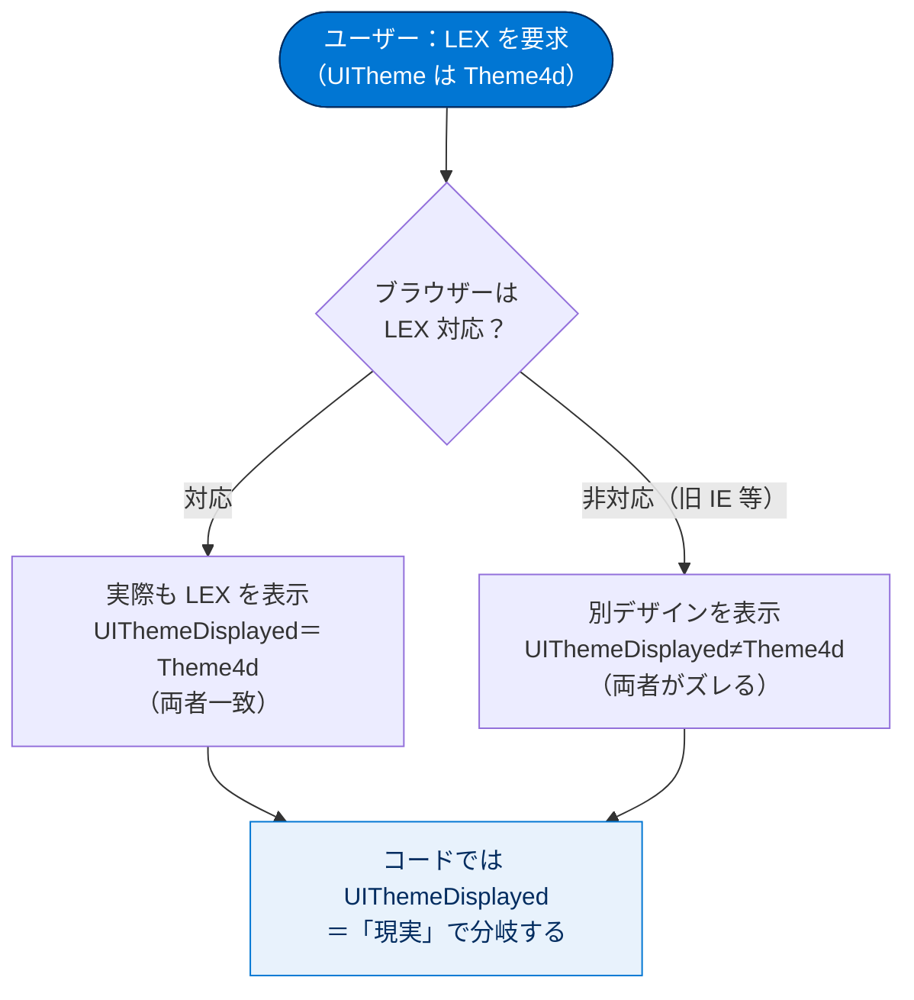
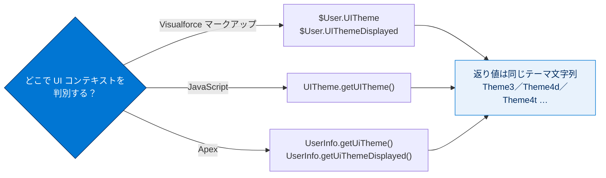

# Classic と Lightning Experience 間での Visualforce ページの共有

## 学習の目的

この単元を完了すると、次のことができるようになります。

- Salesforce Classic と Lightning Experience 間でページを共有するメリットを 2 つ挙げる。
- 要求された UI コンテキストと、実際の UI コンテキストの違いを説明する。
- 現在のユーザーの UI コンテキストをテストして判別する 3 種類の方法を説明する。

> [!ポイント] この単元のゴール
>
> カギは **「テーマ（Theme）」という文字列で現在の UI を判別する** ことと、**「要求された UI（UITheme）」と「実際の UI（UIThemeDisplayed）」は別物** という区別です。判別手段が **Visualforce マークアップ / JavaScript / Apex** の 3 通りある点も押さえましょう。

---

## Classic と Lightning Experience 間の Visualforce ページの共有

可能な限り、**Classic でも LEX でも正しく動作する Visualforce ページ** を作ることをお勧めします。組織のコードや設定の複雑性が緩和されます。また、Visualforce による標準アクションの上書き（override）など、**選択するまでもなく同じページが使われる状況** も多々あります（override アクションは Classic・LEX・Salesforce アプリのどれでも常に同じページを使用）。

> [!ポイント] ページ共有の「2つのメリット」
>
> 1. **コードが少なくて済む** — 書く・テストする・管理するコードがいずれも少なくなる。
> 2. **同じページが常に使われる場面に適合する** — override アクションのように、UI に関係なく同一ページが使われる状況に自然にフィットする。

> [!例] なぜ「1つのページ」が良いのか
>
> Classic 用と LEX 用に 2 つの別ページを作ると、「見た目は違うのに動作は同じ」を維持するのは容易でなく、修正のたびに 2 か所を直す必要があり片方の漏れがバグの温床になります。1 つのページで両対応する方が保守が楽です。

とはいえ、実行する **ユーザーエクスペリエンスコンテキスト** に応じて動作やスタイルを変えたい状況もあります。この単元では、すべての UX で機能するページの作り方と、コードでコンテキストを検出して変更する方法を見ます。

> [!用語] ユーザーエクスペリエンスコンテキスト（UX Context）
>
> ページが「いま、どの UI で表示されているか」を表す状態（Classic / LEX / Salesforce モバイルアプリなど）。この単元では **「テーマ（Theme）」という文字列** で判別します。

---

## テーマ（Theme）の値一覧

各コンテキストは「テーマ」を表す文字列で一意に識別されます。Visualforce・JavaScript・Apex のどの方法でも共通の値です。

| テーマ値 | 意味 |
| --- | --- |
| **Theme1** | 古い Salesforce テーマ |
| **Theme2** | Salesforce Classic 2005 ユーザーインターフェースのテーマ |
| **Theme3** | Salesforce Classic 2010 ユーザーインターフェースのテーマ |
| **Theme4d** | 最新の「Lightning Experience」 Salesforce のテーマ |
| **Theme4t** | Salesforce モバイルアプリケーションのテーマ |
| **Theme4u** | Lightning コンソールのテーマ |
| **PortalDefault** | Salesforce カスタマーポータルのテーマ |
| **Webstore** | Salesforce AgentExchange のテーマ |

> [!ポイント] 最頻出の3つを覚える
>
> - **Theme3** … Salesforce Classic（2010）
> - **Theme4d** … Lightning Experience（デスクトップ）
> - **Theme4t** … Salesforce モバイルアプリケーション

---

## Visualforce マークアップでの検出と対応

現在の UX コンテキストは `$User.UITheme` および `$User.UIThemeDisplayed` グローバル変数で判別します。Visualforce 式で使い、ページを LEX・Classic・Salesforce アプリに適応させます。

> [!用語] `$User.UITheme` と `$User.UIThemeDisplayed` の違い
>
> どちらも UI コンテキストのテーマ文字列を返しますが意味が異なります。
> - **`$User.UITheme`** … ユーザーに **表示すべき（要求された）** デザイン。
> - **`$User.UIThemeDisplayed`** … **実際に表示されている** デザイン。
>
> 有効値（Theme1〜Webstore）は両者で同じです。

> [!例] 「要求された UI」と「実際の UI」がズレる場合
>
> LEX を表示する設定と権限を持つユーザー（＝要求は LEX）が、LEX 非対応の古いブラウザー（旧 Internet Explorer など）を使うと **実際には LEX を表示できません**。このとき `$User.UITheme` は LEX を、`$User.UIThemeDisplayed` は実際の別デザインを返し、両者がズレます。

「要求された UI」と「実際の UI」がどこで分岐するかを図にすると次のとおりです。



> [!ポイント] 原則：コードでは `UIThemeDisplayed` を使う
>
> **コードでは `$User.UIThemeDisplayed`（実際に表示されているデザイン）を使うべきです。** ユーザーの「希望」ではなく「現実」に合わせて分岐するのが正しいためです。

### 使い方 1：個々のコンポーネントの `rendered` 属性

最も簡単なのは、コンポーネントの **`rendered` 属性** の Boolean 式で使う方法です。指定したコンテキストで表示されたときのみそのコンポーネントが描画されます。

> [!用語] `rendered` 属性
>
> Visualforce コンポーネントを **描画するかどうか** を真偽値で制御する属性。`true` で表示、`false` で出力されません。テーマ判定式を入れて「この UI のときだけ表示」を実現します。

```html
<apex:outputText value="This is Salesforce Classic."
    rendered="{! $User.UIThemeDisplayed() == 'Theme3' }"/>
```

### 使い方 2：ブロックごと `outputPanel` でラップする（推奨）

通常は **マークアップのまとまりを `<apex:outputPanel>` などのブロックレベルコンポーネントでラップ** し、UI ごとに別ブロックを作る方が効率的です。テーマ判定をブロックの `rendered` に一度だけ書けばよく、**パフォーマンスがよくコードも簡素** になります。

```html
<apex:outputPanel rendered="{! $User.UIThemeDisplayed == 'Theme3' }">
    <apex:outputText value="This is Salesforce Classic."/>
    <apex:outputText value="These are multiple components wrapped by an outputPanel."/>
</apex:outputPanel>
<apex:outputPanel rendered="{! $User.UIThemeDisplayed == 'Theme4d' }">
    <apex:outputText value="Everything is simpler in Lightning Experience."/>
</apex:outputPanel>
```

### 使い方 3：テーマごとに異なるスタイルシートを動的選択

**テーマごとに異なるスタイルシートを含める** 方法もあります。`<apex:stylesheet>` には `rendered` 属性がないため、**`rendered` を持つ別コンポーネント（`<apex:variable>` など）でラップ** します。次の例はサポート対象の最新 3 テーマに別スタイルシートを指定します。

```html
<apex:page standardController="Account">
    <!-- Salesforce Classic "Aloha" theme -->
    <apex:variable var="uiTheme" value="classic2010Theme"
        rendered="{!$User.UIThemeDisplayed == 'Theme3'}">
        <apex:stylesheet value="{!URLFOR($Resource.AppStyles,
                                         'classic-styling.css')}" />
    </apex:variable>
    <!-- Lightning Desktop theme -->
    <apex:variable var="uiTheme" value="lightningDesktop"
        rendered="{!$User.UIThemeDisplayed == 'Theme4d'}">
        <apex:stylesheet value="{!URLFOR($Resource.AppStyles,
                                         'lightning-styling.css')}" />
    </apex:variable>
    <!-- Salesforce mobile theme -->
    <apex:variable var="uiTheme" value="SalesforceApp"
        rendered="{!$User.UIThemeDisplayed == 'Theme4t'}">
        <apex:stylesheet value="{!URLFOR($Resource.AppStyles,
                                         'mobile-styling.css')}" />
    </apex:variable>
    <!-- Rest of your page -->
    <p>
        Value of $User.UIThemeDisplayed: {! $User.UIThemeDisplayed }
    </p>
</apex:page>
```

> [!注意] `<apex:variable>` の「ふつうではない」使い方
>
> これは変数の値を使わないため普通の使い方ではありません。`<apex:variable>` が、ラップした `<apex:stylesheet>` に自分の `rendered` 属性を「貸している」イメージです。**この方法では変数そのものは実際には作成されない**（未定義の動作）ため、`uiTheme` 変数を他で使うのは避けてください。

> [!用語] 静的リソース（Static Resource）と `$Resource` / `URLFOR`
>
> CSS・画像・JavaScript・ZIP などを Salesforce にアップロードして再利用する仕組み。Visualforce では `$Resource.リソース名` で参照し、ZIP 内のファイルは `URLFOR($Resource.AppStyles, 'classic-styling.css')` のように指定します。

---

## JavaScript での検出と応答

JavaScript を多用するページでは、**JavaScript コード内での UX コンテキスト検出** が重要です（特にナビゲーション管理で）。現在のテーマは **`UITheme.getUITheme()`** で取得します。

```html
function isLightningDesktop() {
  return UITheme.getUITheme === "Theme4d";
}
```

> [!用語] `UITheme.getUITheme()`
>
> JavaScript（静的リソースのスクリプトなど）から現在の UI テーマ文字列を取得するグローバルメソッド。返る値は `$User.UITheme` 等と同じ Theme1〜Webstore。**JavaScript でのテーマ判別はこの方法** と覚えましょう。

---

## Apex での UX コンテキストの判定

Apex では **`UserInfo.getUiTheme()`** および **`UserInfo.getUiThemeDisplayed()`** システムメソッドを使います。コントローラーのメソッドやプロパティがコンテキストに応じて動作を変える必要がある場合に使えます。

```apex
public with sharing class ForceUIExtension {
    // Visualforce のコントローラー拡張に必須の空コンストラクター
    public ForceUIExtension(ApexPages.StandardController controller) { }
    // System.UserInfo のテーマメソッドへのシンプルなアクセサー
    public String getContextUserUiTheme() {
        return UserInfo.getUiTheme();
    }
    public String getContextUserUiThemeDisplayed() {
        return UserInfo.getUiThemeDisplayed();
    }
}
```

> [!用語] コントローラー拡張（Controller Extension）
>
> 標準コントローラーの機能を Apex で拡張する仕組み。`ApexPages.StandardController` を受け取る **空コンストラクターが必須**。ここでは `UserInfo` のテーマメソッドを Visualforce 式から呼べるよう getter で公開しています。

返り得る値は `$User.UITheme` / `$User.UIThemeDisplayed` と同じ（Theme1〜Webstore）です。

> [!ポイント] ベストプラクティス：UI 判定はフロントエンドで
>
> これらを **サーバー側コントローラーで使うのはまれ** です。**コントローラー（拡張）は UX コンテキストに中立** にし、UI の違いは Visualforce や JavaScript の **フロントエンドコードで処理** するのがベストプラクティスです。

---

## 検出方法の使い分け（3つの方法）

> [!ポイント] 「どこで何を使うか」の対応表
>
> | 使う場所 | 使う API | 備考 |
> | --- | --- | --- |
> | **Visualforce マークアップ** | `$User.UITheme` / `$User.UIThemeDisplayed` | 通常は `UIThemeDisplayed` を使う |
> | **JavaScript** | `UITheme.getUITheme()` | クライアント側で判定 |
> | **Apex** | `UserInfo.getUiTheme()` / `UserInfo.getUiThemeDisplayed()` | 使用はまれ。UI 判定はフロント推奨 |



---

## SOQL および API アクセスを使用した Lightning Experience のクエリ

SOQL で現在のユーザーが選好する UX を直接照会することもできますが、**お勧めしません**。

> [!用語] SOQL（Salesforce Object Query Language）
>
> Salesforce のデータベースからレコードを取得する問い合わせ言語。SQL に似ていますが、Salesforce のオブジェクトに最適化されています。

```sql
SELECT UserPreferencesLightningExperiencePreferred FROM User WHERE Id = 'CurrentUserId'
```

結果は **未加工の選好値** のため、使用可能な値への変換が必要です。次は上記 SOQL を実行して結果をページに表示するシンプルな Visualforce ページです。

```html
<apex:page>
<script src="/soap/ajax/36.0/connection.js" type="text/javascript"></script>
<script type="text/javascript">
    // 選好値を照会する
    sforce.connection.sessionId = '{! $Api.Session_ID }';
    var uiPrefQuery = "SELECT Id, UserPreferencesLightningExperiencePreferred " +
                      "FROM User WHERE Id = '{! $User.Id }'";
    var userThemePreferenceResult = sforce.connection.query(uiPrefQuery);
    // 取得した結果をページに表示する
    document.addEventListener('DOMContentLoaded', function(event){
        document.getElementById('userThemePreferenceResult').innerHTML =
            userThemePreferenceResult;
    });
</script>
<h1>userThemePreferenceResult (JSON)</h1>
<pre><span id="userThemePreferenceResult"/></pre>
</apex:page>
```

> [!注意] SOQL での照会が非推奨な理由
>
> **SOQL の結果からわかるのは「ユーザーが現在選好している設定」であって、「画面上で実際に行われている UX」ではない** ためです。古いブラウザーで LEX を表示できないケースなど、実際の UX が選好値に反映されないことがあります。**実際の UX は `$User.UIThemeDisplayed` または `UserInfo.getUiThemeDisplayed()` で判別します。**

---

## 試験対策：押さえておきたい追加ポイント

> [!ポイント] よくある出題パターン
>
> - **テーマ値**：Theme3＝Classic、Theme4d＝LEX デスクトップ、Theme4t＝Salesforce モバイル。
> - **`UITheme`（要求された UI） vs `UIThemeDisplayed`（実際の UI）**。コードでは原則 **Displayed**。
> - **判別方法は 3 つ**：Visualforce（`$User.UITheme*`）・JavaScript（`UITheme.getUITheme()`）・Apex（`UserInfo.getUiTheme*()`）。
> - **コントローラーは UX 中立に**。UI の出し分けはフロントエンド（VF/JavaScript）で。
> - **SOQL（`UserPreferencesLightningExperiencePreferred`）での照会は非推奨**。選好値と実際の UX が一致しないことがあるため。
> - `<apex:stylesheet>` には `rendered` がないので **`<apex:variable>` でラップ** して出し分ける。

> [!まとめ] この単元のまとめ
>
> - ページ共有のメリットは **コードが少なく済む** ことと **同じページが常に使われる場面に適合する** こと。
> - **`UITheme`＝要求された UI、`UIThemeDisplayed`＝実際の UI**。ブラウザー非対応などでズレ得る。コードでは Displayed を使う。
> - UI 判別の 3 方法は **Visualforce / JavaScript / Apex**。UI 出し分けはフロントエンド推奨。
> - **SOQL での選好照会は非推奨**。実際の UX は `UIThemeDisplayed` 系で判別する。

---

## リソース

- `$User.UITheme` と `$User.UIThemeDisplayed`
- UserInfo クラス
- Visualforce 開発者ガイド
- 記事: Developing Cross-Device HTML5 Apps Using Visualforce（Visualforce を使用したクロスデバイス HTML5 アプリケーションの開発）

---

## テスト

この単元を完了するには、テストのすべての質問に正しく解答する必要があります。

**+100 ポイント**

**問 1. Salesforce Classic と Lightning Experience の両方で動作する Visualforce ページを作成するのが良いのはなぜですか？**

- A. 記述するコードが少なく、テストおよび管理する必要があるコードも少ないため
- B. ユーザーエクスペリエンスコンテキストに関係なく、Visualforce を使用するアクションの上書きで、同じページが常に使用されるため
- C. 2 つの異なるページを、外観を異なるように、かつ動作を同じにするのは容易ではないため
- D. 上記のすべて

> [!ポイント] 解答の考え方
>
> 正解は **D**。A・B・C はいずれもページ共有のメリットとして正しい記述です。

**問 2. Visualforce マークアップで使用するとき、次のどれによって、現在のユーザーエクスペリエンスコンテキストが分かりますか？**

- A. `$User.UITheme`
- B. `$User.UIThemeDisplayed`
- C. `UserInfo.getUiTheme()`
- D. `UserInfo.getUiThemeDisplayed()`
- E. 上記のいずれも該当しない

> [!ポイント] 解答の考え方
>
> 正解は **A と B**。Visualforce マークアップでは `$User.UITheme` と `$User.UIThemeDisplayed` を使います。C・D は Apex 用です。

**問 3. JavaScript の静的リソースで使用するとき、次のどれによって、現在のユーザーエクスペリエンスコンテキストが分かりますか？**

- A. `$User.UITheme`
- B. `$User.UIThemeDisplayed`
- C. `UserInfo.getUiTheme()`
- D. `UserInfo.getUiThemeDisplayed()`
- E. `UITheme.getUITheme()`

> [!ポイント] 解答の考え方
>
> 正解は **E**。JavaScript からは `UITheme.getUITheme()` でテーマを取得します。A・B は Visualforce 式、C・D は Apex 用です。

**問 4. Apex で使用するとき、次のうちどれによって、現在のユーザーエクスペリエンスコンテキストが分かりますか？**

- A. `$User.UITheme`
- B. `$User.UIThemeDisplayed`
- C. `UserInfo.getUiTheme()`
- D. `UserInfo.getUiThemeDisplayed()`
- E. 上記のいずれも該当しない

> [!ポイント] 解答の考え方
>
> 正解は **C と D**。Apex では `UserInfo.getUiTheme()`（要求された UI）と `UserInfo.getUiThemeDisplayed()`（実際の UI）を使います。A・B は Visualforce 式です。

**問 5. SOQL を使用しユーザーが選択する UX コンテキストを照会することが推奨されないのはなぜですか？**

- A. SOQL クエリは高性能でないため
- B. 戻り値がユーザーのブラウザーに表示されるものと一致しないことがあるため
- C. ユーザーが選択する UX コンテキストが、SOQL を介して使用できないため。
- D. 上記のすべて

> [!ポイント] 解答の考え方
>
> 正解は **B**。SOQL で得られるのは「選好値」であり、ブラウザー非対応などの理由で「実際に表示されている UX」と一致しないことがあります。実際の UX は `UIThemeDisplayed` 系で判別すべき、という単元の主旨どおりです。
