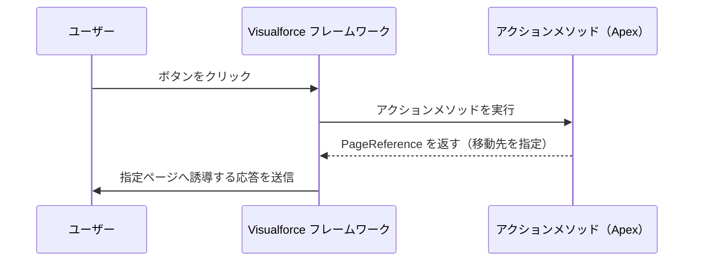
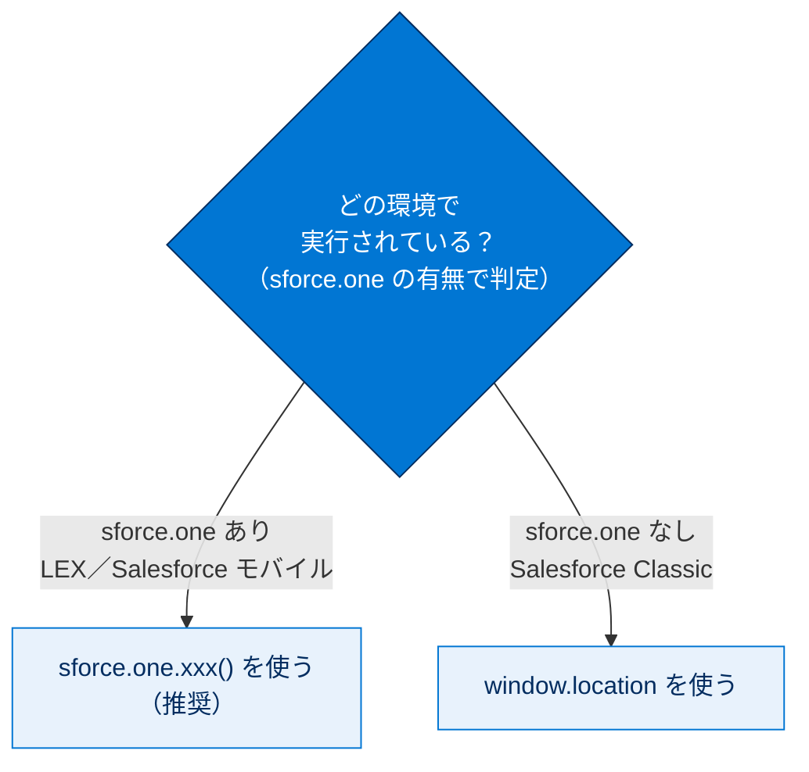
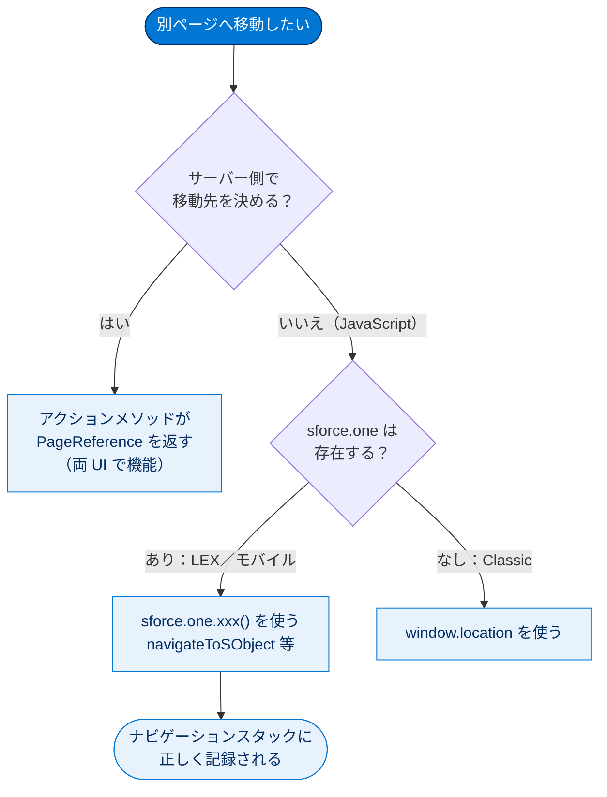

# ナビゲーションの管理

## 学習の目的

この単元を完了すると、次のことができるようになります。

- Visualforce の 3 つのナビゲーションメカニズムについて説明する。
- これらのうち Lightning Experience ではどれが機能しないかを説明する。
- Lightning Experience のナビゲーションイベントを 3 つ以上挙げ、その送信方法を説明する。

> [!ポイント] この単元のゴール
>
> Visualforce には「**従来（PageReference）**」と「**最新（sforce.one / JavaScript）**」のナビゲーションがあります。**Lightning Experience では `window.location` を直接設定してはいけない**こと、代わりに **`sforce.one` の関数**を使うことが最大の暗記ポイントです。Salesforce Classic では逆に `sforce.one` が使えず `window.location` を使う、という対比も押さえましょう。

---

## ナビゲーションの管理とは

ナビゲーション（アプリケーションフロー）はアプリケーション設計の中核です。Visualforce には移動を制御する多数の方法があり、Lightning Experience も独自のナビゲーションメカニズムを追加しています。嬉しいことに「従来」の Visualforce ナビゲーションは引き続き機能し、さらに Visualforce ページで LEX の新メカニズムも利用できます。

> [!用語] ナビゲーション（Navigation）
>
> ユーザーが画面間を「移動する」しくみ全般。ボタンやリンクで別ページへ移ったり、レコードの表示・編集画面を開いたりする動作を指します。Web アプリでは「どのページにどう移動させるか」を制御するコードが中心になります。

---

## Lightning Experience のナビゲーション

「ナビゲーション」には 2 つの側面があります。1 つは画面の UI 要素（クリックするボタンやメニュー項目）、もう 1 つはクリック後にバックグラウンドで Salesforce が何を行うかを決めるコードです。LEX の UI 設計は Classic と大きく異なります（配置の違いは Trailhead「Lightning Experience のナビゲーションと設定」を参照）。後者のナビゲーションは大半が Salesforce 組み込みですが、アクションの Visualforce ページでの上書きなどカスタマイズ可能なものもあり、いずれもコードで管理されます。

> [!例] 「2 種類のナビゲーション」を切り分ける
>
> - **見える側**：ボタンやメニューなど、クリックする UI 要素そのもの。
> - **見えない側**：クリック後にバックグラウンドで「次はどの画面か」を決めるコード。
>
> この単元で扱うのは主に後者、**コードで移動先を決めるしくみ**です。

---

## 従来の Visualforce ナビゲーション

「従来」のナビゲーションとは、突き詰めれば「**アクションメソッドの終了時にどうなるか**」です。アクションメソッドが移動先を示す **PageReference オブジェクト**を返すと、Visualforce フレームワークが正しい応答をブラウザーに送ります。標準コントローラーもアクションメソッドから PageReference を返すため、標準・カスタムいずれのコントローラーでも既存のナビゲーションは引き続き機能します。

> [!用語] PageReference（ページリファレンス）
>
> Apex 上で「次に表示するページ」を表すオブジェクト。アクションメソッドの戻り値として返すと、Salesforce がそのページへ誘導します。**サーバー側（Apex）で移動先を決めるナビゲーション**の代表例で、Classic でも LEX でも機能します。

> [!用語] アクションメソッド（Action Method）
>
> ボタンクリックなどに対応して実行される Apex のメソッド。多くは処理後に移動先を示す `PageReference` を返します。戻り値が `null` の場合は同じページにとどまります。

> [!例] PageReference を返すアクションメソッド
>
> ```apex
> public PageReference save() {
>     // レコードを保存する処理
>     update myRecord;
>     // 保存後に詳細ページへ移動するための PageReference を返す
>     PageReference detailPage = new PageReference('/' + myRecord.Id);
>     detailPage.setRedirect(true); // 完全なリダイレクトを行う
>     return detailPage; // ← この戻り値でユーザーの移動先が決まる
> }
> ```

「従来」のナビゲーション（PageReference）は、サーバー側で移動先が決まるやり取りです。



---

## 最新の Visualforce ナビゲーション

従来のナビゲーションが機能するのに最新の方法を学ぶ理由は一言、「**JavaScript**」です。Visualforce 開発者の多くが JavaScript を多用し、リモートオブジェクトや JavaScript Remoting を採用するにつれ、PageReference をルールとするサーバー側から、PageReference の存在しないブラウザー／JavaScript 側へアプリケーションの動作が移行しています。

> [!用語] sforce.one オブジェクト
>
> LEX（および Salesforce モバイルアプリ）で Visualforce ページを実行したときに **自動的に追加される JavaScript ユーティリティオブジェクト**。ナビゲーションをプログラムから起動する関数を多数持ちます。Salesforce Classic には存在しないため、使う前に有無を確認します。

LEX では **イベント**を使ってナビゲーションを管理します。Visualforce ページを LEX で実行すると `sforce.one` オブジェクトが自動追加され、その関数をページの JavaScript から直接、またはクリックなどのハンドラーとして呼び出します。

> [!注意] sforce.one は Salesforce Classic では使えない
>
> `sforce.one` は Classic では使用できません。使用するコードは **最初に `sforce.one` の有無をテスト**する必要があります。
>
> ```javascript
> // sforce.one が存在するか確認してから使う
> if (typeof sforce !== 'undefined' && sforce.one) {
>     sforce.one.navigateToSObject(recordId); // Lightning Experience / モバイル
> } else {
>     window.location.href = '/' + recordId;   // Salesforce Classic
> }
> ```

`sforce.one` の関数はドット表記で参照します（例：`sforce.one.navigateToSObject(...)`）。

| 関数 | 説明 |
| --- | --- |
| `back([refresh])` | `sforce.one` 履歴の以前の状態に移動します。ブラウザーの [戻る] と同じです。 |
| `navigateToSObject(recordId [, view])` | `recordId` で指定した sObject レコードに移動します。 |
| `navigateToURL(url [, isredirect])` | 指定した URL に移動します。 |
| `navigateToFeed(subjectId, type)` | `subjectId` で絞り込んだ、指定 `type` のフィードに移動します。 |
| `navigateToFeedItemDetail(feedItemId)` | 特定のフィード項目 `feedItemId` のコメントに移動します。 |
| `navigateToRelatedList(relatedListId, parentRecordId)` | `parentRecordId` の関連リストに移動します。 |
| `navigateToList(listViewId, listViewName, scope)` | `listViewId` で指定されたリストビューに移動します。 |
| `createRecord(entityName [, recordTypeId])` | 指定した `entityName`（「Account」「MyObject__c」など）の新規レコード作成ページを開きます。 |
| `editRecord(recordId)` | `recordId` で指定したレコードの編集ページを開きます。 |

> [!用語] sObject（エスオブジェクト）
>
> Salesforce 上のデータベースオブジェクト（テーブル）とその 1 行（レコード）を表す型の総称。取引先（Account）などの標準オブジェクトも `MyObject__c` のようなカスタムオブジェクトもすべて sObject です。

> [!ポイント] ナビゲーションイベントを 3 つ以上言えるようにする
>
> - `navigateToSObject(recordId)` … レコードの詳細ページへ移動
> - `navigateToURL(url)` … 任意の URL へ移動
> - `createRecord(entityName)` … 新規レコード作成ページを開く
> - `editRecord(recordId)` … レコード編集ページを開く
> - `back()` … 1 つ前の画面へ戻る

---

## ナビゲーションの問題とその修正方法

### window.location を直接設定しない

JavaScript で Visualforce ナビゲーションを作るときに何より大切なのは、**`window.location` を直接設定しないこと**です。理由は、LEX では設定する `window.location` が（Visualforce 側に）存在しないためです。LEX は Visualforce ページを iframe の中に入れて表示し、iframe 内のコードは外側（親フレーム）の `window.location` に直接アクセスできません。そのため `window.location = '...'` はナビゲーションを起こせず、「ボタンを押しても何も起こらない」状態になります。

> [!用語] 単一ページアプリケーション（SPA：Single Page Application）
>
> ページ全体を読み込み直さず JavaScript で画面の中身だけを差し替える方式。LEX は SPA のため、`window.location` でページ全体を遷移させる従来の方法と相性が悪いのです。

この制限を回避する手段はありますが、実行しないほうがよいでしょう。`sforce.one` を迂回すると LEX ナビゲーションスタックにイベントが記録されず、[戻る] ボタンなどスタックに依存する多くの機能が壊れるためです。

> [!用語] ナビゲーションスタック（Navigation Stack）
>
> ユーザーがどの画面をどの順序でたどったかを記録した履歴。`sforce.one` の関数を使うと正しく記録され、[戻る] ボタンなどが期待どおり動きます。`window.location` などで横入りすると履歴が壊れます。

### Salesforce Classic の問題

Classic では `sforce.one` が使えないため `window.location` を使う必要があります。両対応のため `if` 分岐が必要になるので、この複雑性を吸収するユーティリティメソッドでナビゲーション関数をラップすると、本体ロジックがわかりやすくなります。



> [!例] 環境差を吸収するユーティリティ関数
>
> ```javascript
> // ナビゲーションを 1 か所にまとめると、本体ロジックが読みやすくなる
> function navigateToRecord(recordId) {
>     if (typeof sforce !== 'undefined' && sforce.one) {
>         // Lightning Experience / モバイル
>         sforce.one.navigateToSObject(recordId);
>     } else {
>         // Salesforce Classic
>         window.location.href = '/' + recordId;
>     }
> }
> ```

### 静的 URL

Salesforce リソースへの**静的 URL は使用しない**でください。たとえば `link = '/' + accountId + '/e'` のような静的パターンでリンクを作らず、代わりに次のいずれかを使います。

- Visualforce マークアップ：`{!URLFOR($Action.Contact.Edit, recordId)}`
- JavaScript：`navigateToSObject(recordId)`

> [!注意] 静的 URL がなぜ危険か
>
> `/レコードID/e` のような URL の形は **Salesforce 内部の実装**で、予告なく変わり得ます。バージョンアップで形式が変わると、ハードコードしたリンクは一斉に壊れます。`$Action` や `sforce.one` の関数は「やりたいこと（編集・表示）」を指定するだけなので、内部 URL が変わっても動き続けます。

---

## 試験対策：押さえておきたい追加ポイント

> [!ポイント] ナビゲーション方式の対応表（最重要）
>
> | 方式 | Salesforce Classic | Lightning Experience |
> | --- | --- | --- |
> | アクションメソッドから `PageReference` を返す | 機能する | 機能する |
> | `{!URLFOR($Action.Contact.Edit, recordId)}` | 機能する | 機能する |
> | `sforce.one.navigateToSObject(recordId)` | **使えない** | 機能する |
> | `window.location` を直接設定 | 機能する | **機能しない** |
>
> 「Classic でサポートされないもの → `sforce.one`」「LEX でサポートされないもの → `window.location`」という対称的な出題がよくあります。

> [!まとめ] この単元の要点
>
> - 従来のナビゲーションは Apex の **`PageReference`** で移動先を決め、両 UI で機能する。
> - 最新のナビゲーションは **`sforce.one`** の JavaScript 関数で行い、ナビゲーションスタックに正しく記録される。
> - LEX では **`window.location` を直接設定してはいけない**（iframe 内のため機能しない）。
> - Classic では `sforce.one` が使えないので `window.location` を使う。両対応は `if` 分岐でラップする。
> - **静的 URL を組み立てない**。`$Action` や `sforce.one` の関数を使う。

---

## リソース

- Trailhead: Lightning Experience のナビゲーションと設定
- Trailhead: Lightning Experience のカスタマイズ: カスタムボタンとカスタムリンクの作成
- Visualforce 開発者ガイド: PageReference クラス
- Visualforce 開発者ガイド: $Action を使用した action メソッドへの動的参照
- Salesforce モバイルアプリケーション開発者ガイド: sforce.one オブジェクトを使用したナビゲーションとメッセージング

---

## テスト

この単元を完了するには、テストのすべての質問に正しく解答する必要があります。
+100 ポイント

**1. Salesforce Classic で、現在のページから別のページに移動する方法として、サポートされていないものはどれですか?**

- A. アクションメソッドから PageReference オブジェクトを返す
- B. 式 `{!URLFOR($Action.Contact.Edit, recordId)}` を使用してリンクを作成する
- C. `sforce.one.navigateToSObject(recordId)`
- D. `window.location.href` をページの URL に設定する

> [!ポイント] 解答のヒント
>
> `sforce.one` は **Salesforce Classic では使えない**（正解は C）。Classic では `window.location` がむしろ正規の手段です。

**2. Lightning Experience で、現在のページから別のページに移動する方法として、サポートされていないものはどれですか?**

- A. アクションメソッドから PageReference オブジェクトを返す
- B. `sforce.one.navigateToSObject(recordId)`
- C. 式 `{!URLFOR($Action.Contact.Edit, recordId)}` を使用してリンクを作成する
- D. `window.location.href` をページの URL に設定する

> [!ポイント] 解答のヒント
>
> LEX では **`window.location` を直接設定できない**のが鉄則です（正解は D）。iframe 内のため値を設定できず、ナビゲーションが停止します。

---

> [!注意] 日本語環境で受講する場合
>
> 技術的な関数名（`navigateToSObject` など）や属性名は翻訳されず英語のまま使用します。かっこ内の日本語訳は理解の補助とし、**コードに記述する識別子は英語のまま**にしてください。

---

## 🎓 この単元のまとめ

この単元では、Visualforce の「従来（PageReference）」と「最新（`sforce.one`）」のナビゲーション方式、そして Classic と LEX で使える手段が対称的に分かれることを学びました。

次の図は、実行環境を `sforce.one` の有無で判定し、それぞれ適切なナビゲーション手段に振り分ける流れを俯瞰したものです。



> [!まとめ] この単元の要点
>
> - 従来のナビゲーションは Apex の **`PageReference`** で移動先を決め、Classic でも LEX でも機能する。
> - 最新のナビゲーションは **`sforce.one`** の JavaScript 関数で行い、ナビゲーションスタックに正しく記録される。
> - LEX では **`window.location` を直接設定してはいけない**（iframe 内のため機能しない）。代わりに `sforce.one`。
> - Classic では `sforce.one` が **使えない** ので `window.location` を使う。両対応は `if` 分岐でラップする。
> - **静的 URL（`/レコードID/e` 等）を組み立てない**。`$Action` や `sforce.one` の関数を使う。

> [!豆知識] navigateToSObject の「SObject」は造語
>
> `sObject` は Salesforce の造語で、データベースのテーブル（とその 1 行）を抽象化した「Salesforce オブジェクト」の略です。標準・カスタムを問わずすべてのレコードを 1 つの型で扱えるため、`navigateToSObject(recordId)` のように「レコード ID さえ渡せば適切な詳細ページへ飛ぶ」汎用 API が成立します。オブジェクト名を意識せずに遷移できるのは、この抽象化のおかげです。
