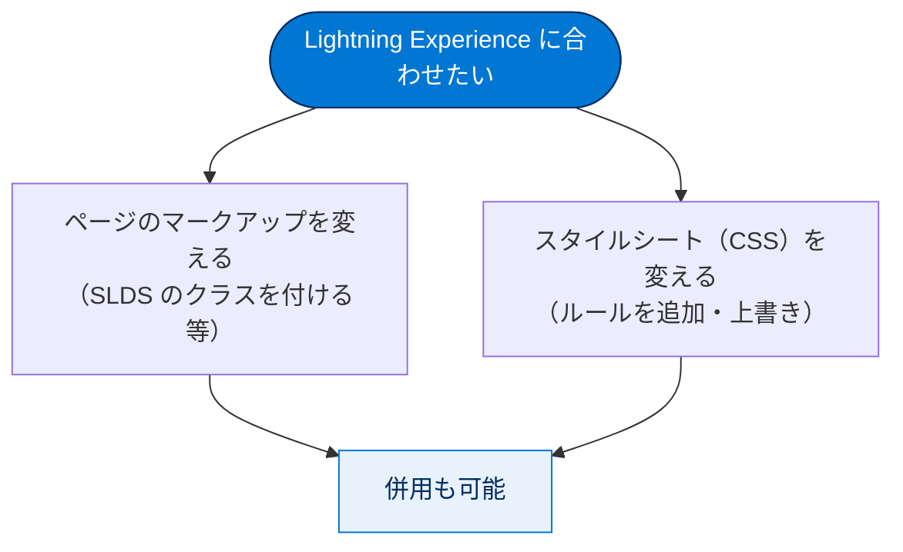
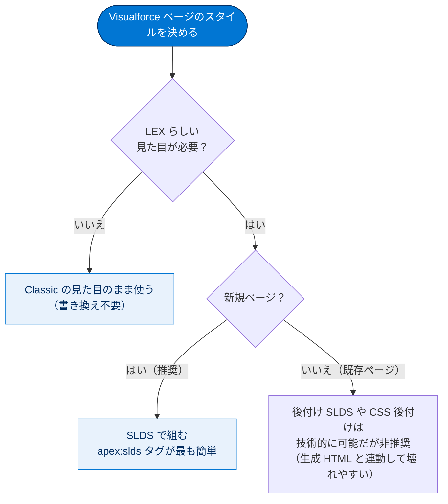

# 重要なビジュアルデザインの考慮事項について

## 学習の目的

この単元を完了すると、次のことができるようになります。

- Visualforce の組み込みコンポーネントのスタイル設定を変更する 2 通りの方法を説明する。
- Salesforce Classic と、CSS で変更可能な Lightning Experience のスタイル設定の 2 つの相違点を説明する。
- Visualforce ページに Salesforce Lightning Design System を適用する 2 通りの方法を説明する。

> [!ポイント] この単元のゴール
>
> Visualforce ページは**デフォルトで Salesforce Classic の見た目**のまま LEX に表示されます。LEX らしい外観にするには **Salesforce Lightning Design System（SLDS）** を使うのが唯一推奨される方法で、最も簡単な適用は **`<apex:slds />` タグ**を 1 行追加することです。この 2 点を中心に押さえましょう。

---

## 重要なビジュアルデザインの考慮事項について

Visualforce ページは、Classic でも LEX でも同じように表示されます（いずれかの UI 向けに改変した場合を除く）。組み込みコンポーネントが出力する HTML は LEX でもそのまま表示され、デフォルトで **Salesforce Classic のスタイルシート**が読み込まれます。このため `<apex:inputField>`・`<apex:outputField>`・`<apex:pageBlock>` などを使うページは Classic のビジュアルデザインを引き継ぎ、LEX の中に Classic が見え隠れします。

> [!用語] 組み込みコンポーネント（Built-in Component）
>
> `<apex:inputField>` や `<apex:pageBlock>` など、Visualforce が標準で用意する UI 部品。HTML を自動生成しますが、その HTML は **Salesforce Classic 用のスタイル**を前提に作られています。

> [!用語] スタイルシート（CSS：Cascading Style Sheets）
>
> Web ページの色・フォント・余白・レイアウトなど「見た目」を指定する仕組み。どの CSS が読み込まれるかで、同じ HTML でも見た目が大きく変わります。

既存ページの一般的な推奨事項は、**LEX のビジュアルデザインに合わせようとしないこと**です。LEX は発展途中で、スタイルを合わせるのは「移動中のターゲットを狙う」ようなものです。一方、新規ページや一定の作業をいとわない場合は、LEX に完全マッチするページを作る優れたツールがあります。

> [!例] なぜ「合わせようとしない」のか
>
> 組み込みコンポーネントの出力 HTML には Salesforce 内部の ID やクラス名が含まれます。これらを手がかりに無理やり Lightning 風にしても、Salesforce 側の仕様変更で壊れやすくなります。「Classic の見た目のまま使う」か「最初から SLDS で作る」かの二択が安全、というのが基本姿勢です。

---

## 標準コンポーネントのスタイル設定への影響

### 個別のコンポーネントのスタイル設定

HTML を生成する Visualforce コンポーネントには、パススルーの `style` および `styleClass` 属性があります。`style` は直接スタイルを設定し、`styleClass` は他で定義したスタイル用にクラスを添付します。

```html
<apex:page>
    <style type="text/css">
        .asideText { font-style: italic; }
    </style>
    <apex:outputText style="font-weight: bold;"
        value="This text is styled directly."/>
    <apex:outputText styleClass="asideText"
        value="This text is styled via a stylesheet class."/>
</apex:page>
```

> [!用語] style 属性 と styleClass 属性
>
> - **`style`**：その要素に**直接**CSS を書く（インラインスタイル）。例：`style="font-weight: bold;"`。
> - **`styleClass`**：別の場所（`<style>` ブロックや外部 CSS）で定義した**クラス名を割り当てる**。例：`styleClass="asideText"`。
>
> どちらも「パススルー属性」と呼ばれ、生成 HTML の `style` / `class` 属性へそのまま渡されます。

> [!ポイント] コンポーネントのスタイルを変える「2 通りの方法」
>
> 学習の目的の「組み込みコンポーネントのスタイル変更の 2 通り」とは、この **`style`（直接指定）** と **`styleClass`（クラス指定）** です。

### カスタムスタイルシートの追加

静的リソースと `<apex:stylesheet>` タグで、任意のページに独自のカスタムスタイルシートを追加できます。

> [!用語] 静的リソース（Static Resource）
>
> CSS・画像・JavaScript・ZIP などを Salesforce 組織にアップロードして保管する仕組み。`$Resource.リソース名` で参照できます。組織全体で **250 MB** の保存容量制限があります。

`app-styles.css` が「AppStylesheet」というスタンドアロンの静的リソースの場合は次のとおりです。

```html
<apex:stylesheet value="{!$Resource.AppStylesheet}"/>
```

`app-styles.css` が「AppStyles」という静的リソースアーカイブ（.zip / .jar など）に含まれる場合は `URLFOR` を使い、第 1 引数にアーカイブ名、第 2 引数にアーカイブ内のパスを指定します。

```html
<apex:stylesheet value="{!URLFOR($Resource.AppStyles, 'app-styles.css')}"/>
```

あとは `asideText` の例と同様、スタイルシート内のスタイルを `styleClass` 属性で参照します。ページ間でスタイルシートを共有でき、マークアップも最小限で済むため、これが CSS を追加する**推奨される方法**です。

> [!例] 単一ファイルか、アーカイブ内のファイルか
>
> - CSS を **1 ファイルだけ**静的リソースにした場合 → `{!$Resource.リソース名}`
> - CSS を画像などと **ZIP にまとめて**静的リソースにした場合 → `{!URLFOR($Resource.アーカイブ名, 'パス/ファイル名')}`

例外となるのが Salesforce Lightning Design System です。静的リソースとしてアップロードして `<apex:stylesheet>` で参照することもできますが、**`<apex:slds />`** をマークアップの任意の場所に追加するだけのほうが簡単です。

### Lightning Experience のさまざまなスタイル

ページが LEX で実行されている場合にのみカスタムスタイルシートを読み込むには、次のように書きます（「Classic と Lightning Experience 間での Visualforce ページの共有」の例に似ています）。

```html
<apex:page standardController="Account">
    <!-- Base styles -->
    <apex:stylesheet value="{!URLFOR($Resource.AppStyles, 'app-styles.css')}" />
    <!-- Lightning Desktop extra styles -->
    <apex:variable var="uiTheme" value="lightningDesktop"
        rendered="{!$User.UIThemeDisplayed == 'Theme4d'}">
        <apex:stylesheet value="{!URLFOR($Resource.AppStyles, 'lightning-styling.css')}" />
    </apex:variable>
    <!-- Rest of your page -->
</apex:page>
```

> [!用語] $User.UIThemeDisplayed と 'Theme4d'
>
> 現在ユーザーが見ている UI テーマを表すグローバル変数。値が **`'Theme4d'`** のときが **Lightning Experience（デスクトップ）** です。`rendered` 属性で判定し「Lightning のときだけ追加 CSS を読み込む」出し分けができます。

> [!注意] rendered 属性による出し分け
>
> 上の `<apex:variable>` は本来変数を作るタグですが、`rendered` の条件が **false のとき中身ごと出力されない**性質を利用し、Lightning のときだけ追加スタイルシートを読み込ませています。「Lightning のときだけ CSS を 1 枚足す例」として理解すれば十分です。

---

## スタイル設定の方法と推奨事項

LEX のビジュアルデザインにマッチさせるには、Lightning Design System を使ってページを新規作成します。既存ページを LEX にマッチさせるスタイル設定には次の **2 通りの方法**があり、個別にも組み合わせても使えます。

| 方法 | どこを変えるか | 概要 |
| --- | --- | --- |
| **マークアップを変更**して新しいスタイル設定を適用する | 自身のページ | ページ内のタグやクラスを書き換える |
| **既存のマークアップのスタイル設定ルールを変更**する | 自身のスタイルシート | CSS 側で見た目のルールを変える |



Lightning Design System を正しく使うとは、Visualforce ページに **新しいマークアップの SLDS スタイルシートを使う**ことで、これが LEX にマッチさせる**唯一のサポートされている方法**です。SLDS スタイルシートを Web サイトからダウンロードして他のスタイルシートと同様に使うか、**`<apex:slds>` コンポーネント**をマークアップに追加します。`<apex:slds>` を使うと SLDS スタイルシートを静的リソースとしてアップロードせず参照でき、構文を簡素化し **250 MB の静的リソース制限**に達するのを回避できます。

> [!ポイント] SLDS を適用する「2 通りの方法」
>
> 1. SLDS スタイルシートを **Web サイトからダウンロードして静的リソース**としてアップロードし、`<apex:stylesheet>` で参照する。
> 2. **`<apex:slds />` タグ**をページに追加する（アップロード不要・容量を消費しない・最も簡単）。

ページのスタイルをどう決めるかの判断フローは次のとおりです。



なお、SLDS スタイルシートを追加してページを修正する方法（既存ページへの後付け）や、既存／新規スタイルシートに新ルールを追加して既存マークアップを LEX に似せる方法も技術的には可能ですが、**いずれも推奨されません**。SLDS は特定のマークアップ向けに設計されており、Visualforce の生成 HTML はそれと異なるため、望まない連動関係が生じるためです。

> [!注意] 組み込みコンポーネントの HTML に依存しない
>
> 組み込みコンポーネントが吐き出す HTML の ID やクラス名は **内部実装の細部であり、予告なく変わり得ます**。これに合わせて CSS を書く（＝連動関係を作る）と、アップデートのたびに見た目が崩れるリスクを抱えます。新規ページは最初から **SLDS のマークアップ**で組むのが安全です。

---

## Salesforce Lightning Design System

> [!用語] Salesforce Lightning Design System（SLDS）
>
> LEX とそっくりな見た目のエンタープライズアプリを作る公式デザインフレームワーク。**高度な CSS フレームワーク・アイコンなどのグラフアセット・専用フォント（Salesforce Sans）** がセットになっています。決められたクラス名を HTML に付けるだけで Lightning らしい外観が得られ、独自ブランドに合わせた色などのカスタマイズも可能です。

SLDS は **新しいマークアップ構造とスタイルクラスを前提**とするため、新規ページ・アプリケーションへの使用が適切です。最新ブラウザーとベストプラクティスに対応する一方、既存の Visualforce ページに適用すると生成 HTML と静的コードの間に問題が生じ、困難になりがちです。

> [!ポイント] SLDS に含まれる 3 要素
>
> SLDS の中身は **(1) CSS フレームワーク／(2) アイコン（グラフアセット）／(3) Salesforce Sans フォント** の 3 つ。テストでも「SLDS には CSS・アイコン・フォントが含まれる」という選択肢が登場します。

---

## 試験対策：押さえておきたい追加ポイント

> [!ポイント] Classic スタイルと Lightning スタイルの相違点
>
> - **デフォルトの読み込み**：組み込みコンポーネントは**常に Salesforce Classic のスタイルシート**を使う。Lightning のスタイルは自動では当たらない。
> - **適用のしやすさ**：Classic スタイルは組み込みコンポーネントに自然に当たるが、Lightning スタイルは **SLDS の新しいマークアップ前提**のため、既存ページに簡単には適用できない。

> [!まとめ] この単元の要点
>
> - Visualforce ページはデフォルトで **Salesforce Classic の見た目**のまま LEX に表示される。
> - コンポーネント単位のスタイル変更は **`style`（直接）** と **`styleClass`（クラス）** の 2 通り。
> - 共通スタイルは**静的リソース + `<apex:stylesheet>`** で追加するのが推奨。
> - LEX に合わせる唯一の推奨方法は **SLDS** で、適用は **`<apex:slds />`** が最も簡単（容量を消費しない）。
> - 組み込みコンポーネントの **HTML 構造・ID・クラスに依存しない**（予告なく変わるため）。

---

## リソース

- Visualforce 開発者ガイド: Visualforce ページの外観と出力のカスタマイズ
- Visualforce 開発者ガイド: Lightning Design System の使用
- Lightning Design System for Developers: Components Overview（開発者のための Lightning Design System: コンポーネントの概要）
- Lightning Design System for Developers: Components: Buttons（開発者のための Lightning Design System: コンポーネント: ボタン）

---

## テスト

この単元を完了するには、テストのすべての質問に正しく解答する必要があります。
+100 ポイント

**1. 正しい説明を選択してください。**

- A. Visualforce ページでは、Salesforce Classic と Lightning Experience の両方で同じビジュアルスタイル設定を使用する。
- B. Lightning Experience に固有のスタイルシートは、Visualforce ページに簡単に追加できる。
- C. Lightning Design System は、Lightning Experience のビジュアルデザインをページに追加する、最適な方法である。
- D. 上記のすべて

> [!ポイント] 解答のヒント
>
> SLDS が Lightning の見た目を実現する**唯一推奨される方法**です（正解は C）。A は「合わせた場合を除き」同じというだけ、B は「簡単には追加できない」ので誤りです。

**2. 次の文のうち、正しいものはどれですか?**

- A. 新しい Visualforce ページを Lightning Experience 用に最初から作成している場合は、Lightning Design System を使用する必要がある。
- B. デフォルトでは、組み込みの Visualforce コンポーネントで Salesforce Classic のビジュアルデザインが常に使用される。
- C. Lightning Design System には、CSS スタイルシート、アイコン、フォントが含まれる。
- D. 上記のすべて

> [!ポイント] 解答のヒント
>
> A・B・C はいずれも本文に出てきた正しい記述です（正解は D「上記のすべて」）。新規は SLDS、デフォルトは Classic スタイル、SLDS は CSS・アイコン・フォント入り、と整理しましょう。

---

> [!注意] 日本語環境で受講する場合
>
> タグ名（`<apex:slds>` など）や属性名は翻訳されず英語のまま使用します。かっこ内の日本語訳は理解の補助とし、**コードに記述する識別子は英語のまま**にしてください。
