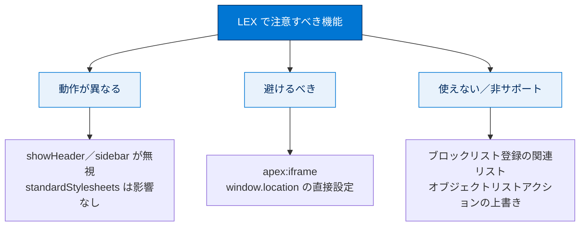
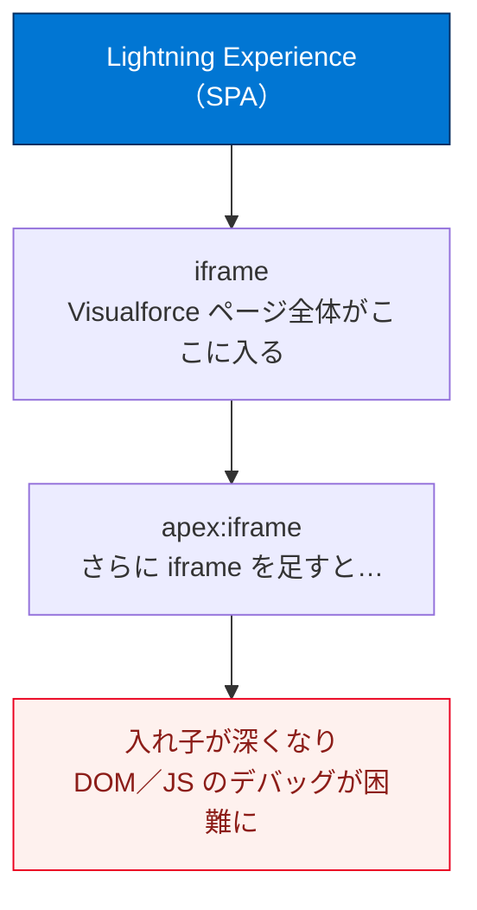

# Lightning Experience で使用を避けるべき機能について

## 学習の目的

この単元を完了すると、次のことができるようになります。

- Lightning Experience で実行するページには極力使用しないコンポーネントを 2 つ以上挙げる。
- Visualforce のページやコンポーネントを使用できない Lightning Experience の機能を 3 つ挙げる。

> [!ポイント] この単元のゴール
>
> LEX では **`<apex:page>` の `showHeader` / `sidebar` 属性が効かない**こと、**`<apex:iframe>` は極力避ける**こと、**ブロックリスト登録された関連リスト**や **`window.location` 直接設定**が使えないこと、**オブジェクトリストアクションの上書きが使えない**ことが頻出ポイントです。「使えない／避けるべきもの」を列挙できるようにしましょう。

---

## Lightning Experience で避けるべき機能の把握

一部の Visualforce コンポーネントは LEX で実行するページでは極力使用しないことが推奨されます。また LEX で動作が異なる機能や、Visualforce ページ／アプリケーションが使用できない・確実に機能しない場所も少数あります。LEX は発展途中であり、こうした問題はいずれ解消されていく見込みです。

> [!例] 「3 つのカテゴリ」で整理する
>
> 1. **動作が異なるもの**：`showHeader` / `sidebar` 属性が無視される、`standardStylesheets` は影響を受けない など。
> 2. **避けるべきもの**：`<apex:iframe>`、`window.location` の直接設定。
> 3. **使えない／サポートされないもの**：ブロックリスト登録の関連リスト、オブジェクトリストアクションの上書き。

LEX で注意すべき機能を 3 カテゴリに分類すると次のとおりです。

---

## Lightning Experience のヘッダーとナビゲーションメニューは抑制できない

LEX で Visualforce ページを実行すると常に標準の LEX UI が表示され、**LEX のヘッダーやサイドバーを抑制・変更する方法はありません**。特に `<apex:page>` の **`showHeader`** および **`sidebar`** 属性は適用されません。これは意図的なもので、完全カスタムのインターフェースが必要なら Classic で実行する必要があります。

> [!用語] showHeader 属性 と sidebar 属性
>
> `<apex:page>` の属性で、Classic ではページ上部の**ヘッダー**や左側の**サイドバー**の表示を制御できました（`showHeader="false"` でヘッダーを隠す等）。**LEX ではこれらの指定が無視され、常に標準 UI が表示されます。**

### Salesforce Classic のヘッダーとサイドバーは常に抑制

LEX に表示する場合、Classic の標準ヘッダーとサイドバーは常に抑制され、ページは `showHeader` / `sidebar` が **`false` に設定されているかのように動作**します。

> [!注意] standardStylesheets 属性は影響を受けない
>
> Classic の標準スタイルシートの有無を決める `<apex:page>` の **`standardStylesheets`** 属性は LEX の影響を受けません。LEX ではデフォルトの **`true`** ですが**変更可能**です。`showHeader` / `sidebar` とは扱いが異なる点に注意してください。

> [!ポイント] 属性ごとの挙動の違い（頻出）
>
> | `<apex:page>` の属性 | Lightning Experience での挙動 |
> | --- | --- |
> | `showHeader` | **無効**（常にヘッダー非表示扱い） |
> | `sidebar` | **無効**（常にサイドバー非表示扱い） |
> | `standardStylesheets` | **有効**（デフォルト `true`、変更可能） |
>
> 「LEX で無効になる属性はどれか」と問われたら、答えは **`showHeader` と `sidebar`** です。

---

## ブロックリストに登録済みの関連リスト

LEX では多数の関連リストがサポートされず、これらは「**ブロックリストに登録**」されて使用が明示的に阻止されます。Visualforce ではブロックリスト登録され、**`<apex:relatedList>`** タグが付けられます。詳細はオンラインヘルプ「データアクセスおよびビュー: Lightning Experience で使用できない機能とその新機能」を参照してください。

> [!用語] 関連リスト（Related List）と `<apex:relatedList>`
>
> **関連リスト**はレコード詳細ページに表示される「関連する子レコードの一覧」（例：取引先ページの商談一覧）。`<apex:relatedList>` はそれを Visualforce 上に表示するタグです。一部の関連リストは LEX でサポートされず、**ブロックリストに登録**されて使えません。

> [!用語] ブロックリスト（Blocklist）
>
> 「使用を明示的に禁止された一覧」のこと。LEX で正しく動作しない関連リストがここに登録され、`<apex:relatedList>` で表示しようとしても阻止されます。

---

## 避けるべきこと（iframe）

LEX の Visualforce ページで `<apex:iframe>` を使用できないわけではありませんが、**極力使用しないこと**を推奨します。Visualforce ページは LEX に表示されるとき**独自の iframe でラップ**されるため（「Visualforce アプリケーションコンテナの探索」参照）、さらに iframe を足すと環境が複雑化します。

> [!用語] iframe（インラインフレーム）と `<apex:iframe>`
>
> **iframe** はあるページの中に別のページを「枠」として埋め込む HTML の仕組み。`<apex:iframe>` はそれを Visualforce で行うタグです。LEX は Visualforce ページ自体を iframe で包むため、その中でさらに iframe を使うと**入れ子（ネスト）**が深くなり、JavaScript や DOM の扱いが複雑になります。

ネストされた iframe のデバッグは経験がないと困難なため、LEX で使うページにはこのタグを使わないことを推奨します。

> [!ポイント] 「極力避けるコンポーネント」を 2 つ言えるように
>
> 「極力使用しないコンポーネント 2 つ以上」の代表は、**`<apex:iframe>`** と、ブロックリスト登録された関連リストを表示する **`<apex:relatedList>`** です。

---

## window.location は直接設定できない

ページの JavaScript で直接 `window.location` を設定していると、LEX に表示したときに機能しません（Visualforce が iframe 内にあるため）。LEX でも機能するようコードを変更する必要があります（詳細は「ナビゲーションの管理」単元）。

> [!注意] 代わりに sforce.one を使う
>
> LEX では `window.location` を直接設定してもページ遷移は起こりません。代わりに **`sforce.one`** オブジェクトの関数（`navigateToSObject` など）を使います。Classic では `sforce.one` が無いので `window.location` を使う、という対比は「ナビゲーションの管理」単元の最重要ポイントです。

---

## sforce.one は Salesforce モバイルとは限らない

`sforce.one` は Salesforce アプリケーションと LEX の**両方**の Visualforce ページで使えるようになりました。`sforce.one` の有無でモバイルかデスクトップかを判定しているコードは変更が必要です。Classic・Salesforce アプリ・LEX の区別には、Visualforce・Apex・JavaScript でサポートされる正式な方法（「Classic と Lightning Experience 間での Visualforce ページの共有」単元参照）を使います。

> [!注意] 「sforce.one があるからモバイル」は誤り
>
> いまは**デスクトップの LEX でも `sforce.one` が存在**するため、「`sforce.one` がある＝モバイル」という前提のコードは誤動作します。環境判定は専用の正式な方法を使ってください。

---

## override アクションに関する変更

回避が難しい最も大きな変更は、**Visualforce による標準アクションの上書き**が LEX と Classic でわずかに異なることです。**オブジェクトリストアクションの上書きは、LEX では使用できません**。

Classic では、大半の標準オブジェクトとすべてのカスタムオブジェクトに対して上書きできる標準アクションが 6 つあります。

- オブジェクトタブ
- オブジェクトリスト
- レコードビュー
- レコード編集
- レコード作成
- レコード削除

> [!用語] 標準アクションの上書き（Override）
>
> 「レコードを表示する」「新規作成する」などの**標準動作を、自作の Visualforce ページに差し替える**機能。たとえば [新規] ボタンで独自フォームを開かせるカスタマイズができます。

LEX では最初の 2 つ（オブジェクトタブとオブジェクトリスト）が 1 つの**オブジェクトホーム**に統合されました。組織の UI 設定に関わらず両方を [設定] で上書きでき、**オブジェクトタブ**の上書きは LEX でも期待どおりホームページを上書きします。しかし LEX では UI から**オブジェクトリスト**アクションにアクセスできず起動手段がないため、その上書きは LEX 使用時には利用できません。重要な機能が含まれる場合は別の方法を探す必要があります。

| [設定] で上書き | Salesforce Classic | Lightning Experience | Salesforce アプリケーション |
| --- | --- | --- | --- |
| タブ | オブジェクトタブ | オブジェクトホーム | 検索 |
| リスト | オブジェクトリスト | **N/A** | オブジェクトホーム |
| 表示 | レコードビュー | レコードホーム | レコードホーム |
| 編集 | レコード編集 | レコード編集 | レコード編集 |
| New（新規） | レコード作成 | レコード作成 | レコード作成 |
| 削除 | レコード削除 | レコード削除 | レコード削除 |

> [!注意] 表中の「N/A」の意味
>
> 「N/A」は標準動作にアクセスできない／上書きできないという意味ではなく、**上書き（override）にアクセスできない**ということです。使用できないのは上書きの機能です。

> [!ポイント] 「使えない Lightning Experience の機能」を 3 つ挙げる
>
> 1. **オブジェクトリストアクションの上書き**（UI から起動できず利用不可）。
> 2. **`<apex:page>` の `showHeader` / `sidebar` 属性**（LEX のヘッダー・サイドバーを抑制できない）。
> 3. **ブロックリスト登録された関連リスト**（`<apex:relatedList>` で表示できない）。

---

## 試験対策：押さえておきたい追加ポイント

> [!まとめ] この単元の要点
>
> - LEX では **`showHeader` / `sidebar` 属性が無効**（ヘッダー・サイドバーは抑制不可）。`standardStylesheets` は影響を受けず変更可能。
> - **ブロックリスト登録の関連リスト**（`<apex:relatedList>`）はサポートされない。
> - **`<apex:iframe>` は極力避ける**（iframe の入れ子で複雑化・デバッグ困難）。
> - **`window.location` の直接設定は機能しない**。`sforce.one` を使う。
> - **`sforce.one` の有無でモバイル判定をしない**（デスクトップ LEX にも存在する）。
> - **オブジェクトリストアクションの上書きは LEX では使えない**（起動する UI が無い）。

---

## リソース

- Visualforce ページによる既存のページの上書き
- Visualforce 開発者ガイド

---

## テスト

この単元を完了するには、テストのすべての質問に正しく解答する必要があります。
+100 ポイント

**1. Lightning Experience では無効な `<apex:page>` の属性はどれですか?**

- A. `sidebar`
- B. `standardStylesheets`
- C. `showHeader`
- D. A と C

> [!ポイント] 解答のヒント
>
> `sidebar` と `showHeader` が無効で、`standardStylesheets` は有効（変更可能）です。正解は **D（A と C）** です。

**2. 次の文のうち、正しいものはどれですか?**

- A. Lightning Experience ホームページはカスタマイズできない。
- B. `<apex:relatedList>` タグでは、Lightning Experience にすべての関連リストが表示される。
- C. Lightning Experience では Visualforce を使用できない。
- D. 上記のすべて

> [!ポイント] 解答のヒント
>
> B は一部の関連リストがブロックリスト登録され表示されないため誤り、C は Visualforce 自体は使えるので誤りです。残る A が正しい記述です（LEX のヘッダー・ナビゲーションは抑制・カスタマイズできない）。

---

> [!注意] 日本語環境で受講する場合
>
> タグ名（`<apex:iframe>` など）や属性名（`showHeader` など）は翻訳されず英語のまま使用します。かっこ内の日本語訳は理解の補助とし、**コードに記述する識別子は英語のまま**にしてください。

---

## 🎓 この単元のまとめ

この単元では、LEX で「動作が異なる」「避けるべき」「使えない」機能を 3 カテゴリで整理しました。試験では「使えない／避けるべきもの」を列挙できることが重要です。

次の表は、LEX で注意すべき機能と推奨される対応を 1 枚に凝縮したものです。

| 機能 | LEX での扱い | カテゴリ | 推奨される対応 |
| --- | --- | --- | --- |
| `showHeader` / `sidebar` | 無効（常に false 扱い） | 動作が異なる | 完全カスタム UI は Classic で |
| `standardStylesheets` | 影響を受けない（既定 true・変更可） | 動作が異なる | そのまま利用可 |
| `<apex:iframe>` | 使用可だが極力避ける | 避けるべき | iframe の入れ子を避ける |
| `window.location` 直接設定 | 機能しない | 避けるべき | `sforce.one` を使う |
| ブロックリスト登録の関連リスト（`<apex:relatedList>`） | サポートされない | 使えない | 別の表示手段を検討 |
| オブジェクトリストアクションの上書き | 利用不可（起動 UI なし） | 使えない | 別の方法を探す |

> [!まとめ] この単元の要点
>
> - LEX では **`showHeader` / `sidebar` 属性が無効**（抑制不可）。`standardStylesheets` は影響を受けず変更可能。
> - **ブロックリスト登録の関連リスト**（`<apex:relatedList>`）はサポートされない。
> - **`<apex:iframe>` は極力避ける**（iframe の入れ子で複雑化・デバッグ困難）。
> - **`window.location` の直接設定は機能しない**。`sforce.one` を使う。
> - **`sforce.one` の有無でモバイル判定をしない**（デスクトップ LEX にも存在する）。
> - **オブジェクトリストアクションの上書きは LEX では使えない**（起動する UI が無い）。

> [!豆知識] 「ブロックリスト（blocklist）」という呼び方の変化
>
> かつてこの種の「禁止リスト」は blacklist と呼ばれていましたが、近年は包摂的な表現として blocklist（または denylist）へ言い換えが進んでいます。Salesforce の公式ドキュメントもこの流れに沿って用語を更新しており、`<apex:relatedList>` のブロックリストもその一例です。試験や実務で blacklist と blocklist の両方を見かけても、同じ「使用が禁止された一覧」を指すと理解しておけば混乱しません。
