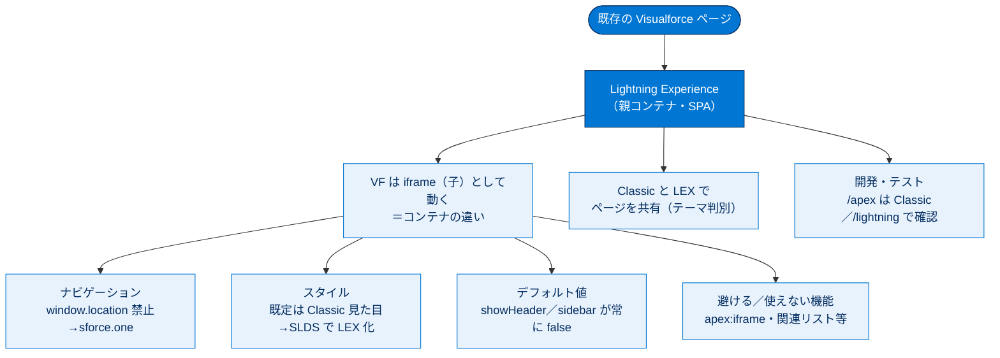

# Visualforce と Lightning Experience 総まとめ

このトピックでは、Salesforce Classic 時代に作られた Visualforce ページを、新しい Lightning Experience（LEX）でどう活かすかを学びました。核心は **「LEX では Visualforce が iframe（子）として LEX（親）の中で動く」** という一点で、ここからナビゲーション・スタイル・デフォルト値・使えない機能のすべてが派生します。大半のページは「とりあえず機能」しますが、JavaScript とスタイルには例外があり、それを理解して対応するのがこのトピックのゴールです。

---

## 全体像

次の図は、Visualforce ページが LEX という大きなコンテナの中でどう動き、どこで対応が必要になるかを 1 枚で俯瞰したものです。

---

## ユニット横断 早見表

| # | ユニット | 学んだこと | キーワード | 一言要点 |
| --- | --- | --- | --- | --- |
| 1 | LEX での Visualforce の使用 | LEX で VF が動く前提と配置場所 | とりあえず機能／7 つの配置場所 | 大半は書き換え不要、例外は JS とスタイル |
| 2 | Agentforce 360 用ページ開発 | 作成中の表示・テスト方法 | `/apex` は Classic／`/lightning`／テストマトリックス | LEX 確認は `/lightning` コンテナ内から |
| 3 | アプリケーションコンテナの探索 | iframe コンテナの違いと影響 | iframe／親子／postMessage／`showHeader` false | 「他人のものには手を出すな」 |
| 4 | Classic と LEX 間でのページ共有 | UI コンテキストの判別 | テーマ／`UIThemeDisplayed`／3 つの判別方法 | コードでは「実際の UI」で分岐 |
| 5 | ナビゲーションの管理 | 移動先を決めるしくみ | PageReference／`sforce.one`／`window.location` | LEX は `window.location` 禁止 |
| 6 | ビジュアルデザインの考慮事項 | LEX 風の見た目にする方法 | SLDS／`<apex:slds />`／`style`・`styleClass` | LEX 化の唯一推奨は SLDS |
| 7 | 使用を避けるべき機能 | 動作差・回避・非サポート | `<apex:iframe>`／関連リスト／リスト上書き | 「使えない／避ける」を列挙できるように |

---

## 🎯 試験頻出ポイント

> [!ポイント] このトピックで狙われやすい論点・暗記値
>
> - **大前提**：Visualforce は重要な例外を除き LEX で「とりあえず機能」する。「すべて壊れる」は誤り。
> - **コンテナ**：LEX では VF が **iframe（子）**、LEX が **親**。子は親に従う。
> - **URL**：`/apex/PageName` は **常に Salesforce Classic** で開く。LEX 確認は `/lightning` コンテナ内（タブ／`navigateToURL`）から。
> - **ナビゲーション**：LEX では **`window.location` 直接設定は機能しない** → `sforce.one`。Classic では `sforce.one` が無いので `window.location`。**静的 URL を組み立てない**。
> - **デフォルト値**：LEX では **`showHeader` と `sidebar` が常に false**。**`standardStylesheets` は影響を受けない**（既定 true・変更可）。
> - **テーマ値**：**Theme3＝Classic、Theme4d＝LEX デスクトップ、Theme4t＝Salesforce モバイル**。
> - **UI 判別**：`UITheme`＝要求された UI、`UIThemeDisplayed`＝実際の UI。コードでは原則 **Displayed**。判別は VF／JavaScript（`UITheme.getUITheme()`）／Apex（`UserInfo.getUiTheme*()`）の 3 方法。**SOQL での選好照会は非推奨**。
> - **スタイル**：既定は Classic 見た目。LEX 化の唯一推奨は **SLDS**（適用は `<apex:slds />` が最も簡単）。SLDS は **CSS・アイコン・フォント** の 3 要素。
> - **避ける／使えない**：`<apex:iframe>`（入れ子回避）、ブロックリスト登録の関連リスト（`<apex:relatedList>`）、**オブジェクトリストアクションの上書き**は LEX で利用不可。
> - **親フレームアクセス**：`window.parent`／`contentWindow` は NG（同一オリジンポリシー）→ **`window.postMessage`**。
> - **JavaScript ボタン**：LEX では非サポート（Visualforce・URL ボタンは可）。

---

## 📖 用語早見表

| 用語 | ひとことの意味 |
| --- | --- |
| Visualforce | `<apex:page>` 等のタグで UI を作る Salesforce 独自のマークアップ言語 |
| Lightning Experience（LEX） | Salesforce の新しいモダンな UI。`/lightning` の SPA |
| Salesforce Classic | 旧来の UI。Visualforce が本来想定したコンテナ |
| コンテナ | ページを内側に抱えて実行する入れ物。LEX では VF を iframe で包む |
| iframe | HTML 内に別ページを埋め込む窓。内外は別の参照コンテキスト |
| 同一オリジンポリシー | 別オリジンの中身への勝手なアクセスを禁じるブラウザーの規則 |
| `window.postMessage` | 異なるフレーム／オリジン間で安全にメッセージをやり取りする API |
| `sforce.one` | LEX／Salesforce アプリに自動挿入される JavaScript ナビゲーションオブジェクト |
| PageReference | Apex で「次に表示するページ」を表すオブジェクト（サーバー側遷移） |
| テーマ（Theme） | 現在の UI を識別する文字列（Theme3／Theme4d／Theme4t 等） |
| `$User.UIThemeDisplayed` | 実際に表示されている UI のテーマを返すグローバル変数 |
| SLDS | LEX 風の見た目を作る公式デザインフレームワーク（CSS・アイコン・フォント） |
| `<apex:slds />` | SLDS をアップロード不要・容量無消費で適用するタグ |
| `showHeader` / `sidebar` | Classic のヘッダー・サイドバー表示を制御する属性。LEX では無効 |
| 静的リソース | CSS・画像・JS 等を組織にアップロードして再利用する仕組み（250 MB 制限） |
| 関連リスト | レコード詳細に表示する子レコード一覧。一部は LEX で非サポート |

---

> [!豆知識] Visualforce は「Force.com の見える化」
>
> Visualforce という名前は、かつての開発プラットフォーム名「Force.com」と「visual（視覚的）」を組み合わせたもので、2008 年に登場しました。サーバー側で動く Apex コントローラーと、画面を記述するマークアップを分離する MVC 的な設計は、当時としては先進的でした。その思想は後継の Lightning Web コンポーネント（LWC）にも受け継がれています。

> [!豆知識] iframe は「互換性のための保険」だった
>
> LEX が Visualforce を iframe で包む設計は、性能だけ見れば理想的ではありません。それでもこの方式が選ばれたのは、既存の膨大な Visualforce 資産を「書き換えずに」動かすための互換レイヤーとして最も確実だったからです。新旧 UI の世代交代を「断絶」ではなく「地続き」にするための、現実的な妥協の産物といえます。

> [!豆知識] テスト「3 デバイス × 3 OS × 4 ブラウザー × 3 UI＝108 通り」の罠
>
> 真面目に全組み合わせをテストすると 100 通りを超えますが、実際は「まとめて失敗する」要素を束ねられます。たとえば最新 iOS の iPhone は OS・ブラウザー・SF アプリが実質 1 つにまとまるため、現実には数件〜十数件で済みます。網羅性と現実性のバランスを取るのがテストマトリックスの腕の見せどころです。

---

## ✅ 理解度セルフチェック

> [!まとめ] 答えながら総復習しよう（答えは各項目の末尾）
>
> 1. **○×**：すべての Visualforce ページは LEX で破損するため修正が必要である。 → **×**（大半は「とりあえず機能」する）
> 2. **穴埋め**：`/apex/PageName` に直接アクセスすると、UI 設定に関係なく常に（　　　）で表示される。 → **Salesforce Classic**
> 3. **穴埋め**：LEX では VF が（　　　）の内側で動き、LEX が親・VF が子の関係になる。 → **iframe**
> 4. **○×**：LEX では `window.location` を直接設定してページ遷移できる。 → **×**（機能しない。`sforce.one` を使う）
> 5. **穴埋め**：LEX デスクトップを表すテーマ値は（　　　）、Salesforce モバイルは（　　　）である。 → **Theme4d ／ Theme4t**
> 6. **穴埋め**：LEX で常に false 扱いになる `<apex:page>` の 2 属性は（　　　）と（　　　）。一方（　　　）は影響を受けない。 → **`showHeader` ／ `sidebar`**、影響を受けないのは **`standardStylesheets`**
> 7. **○×**：LEX を LEX らしい見た目にする唯一推奨の方法は SLDS で、`<apex:slds />` タグで容量を消費せず適用できる。 → **○**
