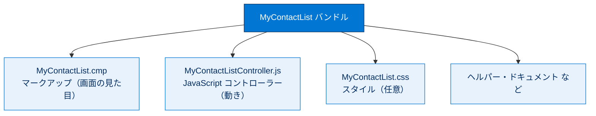
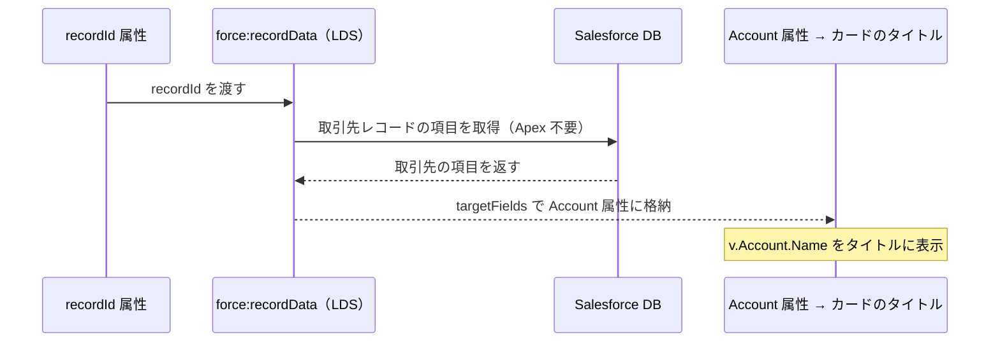

# Aura コンポーネントの作成

## 学習の目的

前ユニットで作った Apex コントローラー（`MyContactListController`）に対し、**画面側の Aura コンポーネント** を作ります。コンポーネントバンドルの作成・属性（データ入れ物）の定義・Lightning Data Service でのレコード取得・レコードページへの配置までを行います。

> [!ポイント] このユニットで覚えること
>
> - Aura コンポーネントは **マークアップ・JavaScript・CSS のバンドル** であること。
> - `controller="..."` で **連携する Apex クラス** を指定すること。
> - `aura:attribute` は **データを保存する入れ物** であること。
> - `force:recordData`（Lightning Data Service）で **現在のレコードの項目を取得** できること。

---

## Aura コンポーネントを作成してレコードページに追加する

> [!用語] コンポーネントバンドル（Component Bundle）
>
> 1つの Aura コンポーネントを構成する複数ファイルのまとまり。マークアップ（`.cmp`）・コントローラー（`.js`）・スタイル（`.css`）・ヘルパー・ドキュメントなどが1フォルダにまとまり、開発者コンソールでは右側のボタンパネルから各ファイルを開けます。

コンポーネントバンドルの構成（本クイックスタートで使う主なファイル）は次のとおりです。



> [!手順] コンポーネントバンドルを作成する
>
> 1. 開発者コンソールで **[File（ファイル）] | [New（新規）] | [Lightning Component（Lightning コンポーネント）]** を選択する。
> 2. コンポーネント名に `MyContactList` と入力する。
> 3. **[Lightning Record Page（Lightning レコードページ）]** をオンにして **[Submit（送信）]** をクリックする。

---

## Apex コントローラーへの参照を追加する

`aura:component` タグに Apex コントローラーへの参照 `controller="MyContactListController"` を追加します。

```html
<aura:component controller="MyContactListController" implements="flexipage:availableForRecordHome,force:hasRecordId" access="global" >
```

> [!ポイント] aura:component タグの属性の意味
>
> | 属性 | 役割 |
> | --- | --- |
> | `controller="MyContactListController"` | 連携する **Apex クラス** を指定。これで `getContacts` を呼べる |
> | `implements="flexipage:availableForRecordHome"` | **レコードページに配置可能** にするインターフェース |
> | `implements="...,force:hasRecordId"` | 表示中の **レコード ID（recordId）を自動で受け取れる** ようにする |
> | `access="global"` | パッケージ外を含め **どこからでも利用可能** にする |

> [!用語] recordId（レコード ID）
>
> 各レコードを一意に識別する 15 桁または 18 桁の ID。`force:hasRecordId` を実装すると、配置先レコードページの ID が自動で `recordId` 属性に入ります。前ユニットの Apex メソッドはこの ID を引数に取ります。

---

## 属性とレコードデータを追加する

次のコードをコンポーネントの 2 行目に追加します。

```html
<aura:attribute name="recordId" type="Id" />
<aura:attribute name="Account" type="Account" />
<aura:attribute name="Contacts" type="Contact" />
<aura:attribute name="Columns" type="List" />
<force:recordData aura:id="accountRecord"
                  recordId="{!v.recordId}"
                  targetFields="{!v.Account}"
                  layoutType="FULL"
                  />
<lightning:card iconName="standard:contact" title="{! 'Contact List for ' + v.Account.Name}">
    <!-- Contact list goes here -->
</lightning:card>
```

> [!用語] aura:attribute（属性）
>
> コンポーネント内でデータを保持する「変数」。`name`（名前）と `type`（型）を指定します。`type` には標準・カスタムオブジェクトや `Id`・`List`・`String` などが使えます。

定義した4つの属性の役割は次のとおりです。

| 属性名 | 型 | 用途 |
| --- | --- | --- |
| `recordId` | `Id` | 現在表示中の取引先レコードの ID |
| `Account` | `Account` | 取得した取引先レコード（タイトル表示用） |
| `Contacts` | `Contact` | Apex から取得する取引先責任者のリスト |
| `Columns` | `List` | データテーブルに表示する列の定義 |

---

## 値プロバイダー v. の仕組み

属性にアクセスするには、**値プロバイダー** `v.` を `v.recordId` や `v.Account` のように使います。値プロバイダーは関連する値をまとめてデータにアクセスする仕組みです。

> [!用語] 値プロバイダー（Value Provider）
>
> Aura でデータにアクセスする仕組み。マークアップ内では `{!v.属性名}` の形で属性を読み書きします。`v` は「view（このコンポーネントの属性）」を表し、次のユニットでは Apex メソッドを指す `c`（コントローラー）も登場します。

> [!例] {!v.recordId} の読み方
>
> 「このコンポーネントの `recordId` 属性の値を埋め込む」という意味です。`force:recordData` の `recordId="{!v.recordId}"` は、ページが表示している取引先の ID を Lightning Data Service に渡しています。

---

## Lightning Data Service と基本コンポーネント

このコンポーネントは **Lightning Data Service** の `force:recordData` で現在のレコードの項目を取得し、`Account` 属性に保存するため、取引先名をタイトルに表示できます。`lightning:card` は Lightning 基本コンポーネントで、`v.Account.Name` がカードのタイトルになります。

> [!用語] Lightning Data Service（LDS）／ force:recordData
>
> Apex を書かずにレコードの取得・作成・更新・削除ができる仕組み。`force:recordData` は現在のレコードの項目を読み込み、`targetFields` に指定した属性へ自動格納します。単純な取得処理ではこちらが推奨されます。今回は取引先名（`Account.Name`）の表示に使用。

`force:recordData` が `recordId` から取引先名をタイトルに表示するまでのやり取りは次のとおりです。



> [!用語] Lightning 基本コンポーネント（Lightning Base Components）
>
> Salesforce があらかじめ用意した再利用可能な UI 部品。`lightning:card`（カード枠）・`lightning:datatable`（表）などがあり、SLDS 準拠の見た目で手軽に使えます。

> [!手順] ここまでのマークアップを保存する
>
> 1. **[File（ファイル）] | [Save（保存）]** を選択する。

---

## コンポーネントをレコードページに配置する

> [!手順] レコードページにコンポーネントを追加する
>
> 1. アプリケーションランチャーで **[Accounts（取引先）]** を開く。
> 2. **[All Accounts（すべての取引先）]** に切り替え、**United Oil & Gas Corp** をクリックして開く。
> 3. **[Setup（設定）] 歯車** をクリックし、**[Edit Page（編集ページ）]** を選択してアプリケーションビルダーを起動する。
> 4. カスタムコンポーネントリストからコンポーネントをドラッグし、右側の列の上部、活動コンポーネントの上にドロップする。
> 5. **[Save（保存）]** をクリックする。
> 6. **[Activate（有効化）]** → **[Assign as Org Default（組織のデフォルトとして割り当て）]** をクリックする。
> 7. **[Desktop（デスクトップ）]** → **[Next（次へ）]** をクリックする。
> 8. **[Save（保存）]** をクリックし、左上の **[Back（戻る）]** でレコードページに戻る。

> [!注意] まだ取引先責任者は表示されません
>
> この段階ではカード枠（`lightning:card`）とタイトルだけが表示されます。中身のリストは次ユニットで **イベントハンドラーと JavaScript** を追加してから表示されます。`<!-- Contact list goes here -->` のコメント部分がその差し込み場所です。

---

## 試験対策：押さえておきたい追加ポイント

> [!ポイント] Aura マークアップでよく問われること
>
> - **`implements="flexipage:availableForRecordHome"`** がないとレコードページに配置できない。
> - **`force:hasRecordId`** を実装すると `recordId` 属性が自動で設定される（手動で渡す必要なし）。
> - マークアップ内で属性を参照するときは必ず **`{!v.属性名}`** の式構文を使う。
> - `force:recordData`（LDS）は **Apex なし** でレコードを読み書きでき、単純な取得処理では推奨。

---

## リソース

- Salesforce ヘルプ：Lightning Aura コンポーネント開発者ガイド
- Salesforce ヘルプ：Lightning Data Service（force:recordData）
- Salesforce ヘルプ：Lightning 基本コンポーネントリファレンス
- Salesforce ヘルプ：Lightning App Builder

---

> [!注意] 日本語環境で受講する場合
>
> Challenge は日本語の Trailhead Playground で開始し、かっこ内の翻訳を参照しながら進めます。評価は英語データに対して行われるため、**英語の値のみ** をコピー＆ペーストします。日本語組織で不合格になった場合は、(1) [地域（Locale）] を [米国（United States）]、(2) [言語（Language）] を [英語（English）] に切り替えてから、(3) [Check Challenge] をクリックすると通ることがあります。
