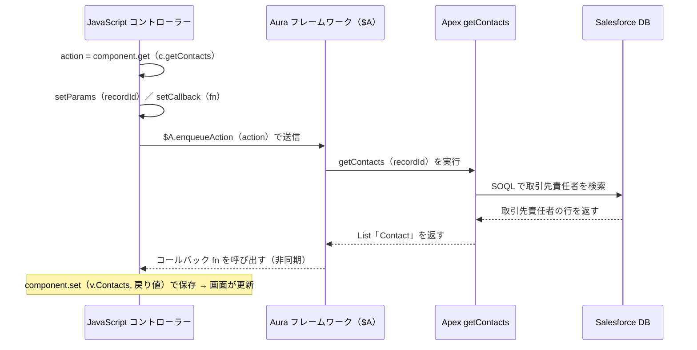
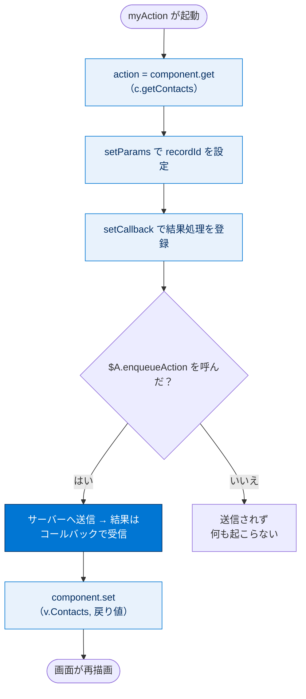

# 取引先責任者リストを取得する

## 学習の目的

前ユニットで作った Aura コンポーネントに、**サーバー側の Apex メソッドを呼び出して取引先責任者データを取得する処理** を追加します。コントローラー（JavaScript）に `getContacts` を呼び出すコードを書き、コンポーネント読み込み時に自動実行する **イベントハンドラー** を設定します。

> [!ポイント] このユニットで覚えること
>
> - JavaScript コントローラーから **`c.メソッド名`** で Apex メソッドを呼び出すこと。
> - 呼び出しは **`action`** を作り、`setParams` → `setCallback` → `$A.enqueueAction` の順で行うこと。
> - **`aura:handler`** の `init` イベントで、読み込み時に処理を起動できること。

---

## 取引先責任者の取得

JavaScript 関数をコールするイベントハンドラーを追加し、Salesforce からデータを取得します。

> [!用語] コントローラー（JavaScript コントローラー）
>
> Aura コンポーネントの「動き」を担当する JavaScript ファイル（`.js`）。ボタンクリックや初期化などの **イベントに応じた処理** を関数で定義します。サーバー側の Apex コントローラーとは別物なので混同に注意。

> [!手順] JavaScript コントローラーに取得処理を追加する
>
> 1. 開発者コンソールで **[MyContactList.cmp]** タブをクリックする。
> 2. 右のボタンパネルで **[CONTROLLER（コントローラー）]** をクリックする。
> 3. `myAction` 関数の本文の新しい行に次のコードを追加する。
> 4. **[File（ファイル）] | [Save（保存）]** を選択する。

```javascript
// Apex コントローラーの getContacts メソッドへの参照を取得する
var action = component.get("c.getContacts");
// メソッドに渡す引数（現在の取引先の recordId）を設定する
action.setParams({
    recordId: component.get("v.recordId")
});
// サーバーから結果が返ってきたときの処理を登録する
action.setCallback(this, function(data) {
    // 戻り値（取引先責任者リスト）を Contacts 属性に保存する
    component.set("v.Contacts", data.getReturnValue());
});
// アクションを実行キューに追加してサーバーへ送信する
$A.enqueueAction(action);
```

---

## コードを1ステップずつ読み解く

この JavaScript 関数は、値プロバイダー `c.` を `c.getContacts` のように使って Apex の `getContacts` メソッドを呼び出し、現在の取引先の `recordId` を渡し、結果を `Contacts` 属性に入れます。

> [!手順] 各行が何をしているか
>
> 1. `var action = component.get("c.getContacts");` … 値プロバイダー **`c`（コントローラー）** で、サーバー側 Apex の `getContacts` への参照（アクション）を取得。
> 2. `action.setParams({ recordId: ... });` … 引数を設定。`component.get("v.recordId")` で現在の取引先 ID を取り出して渡す。
> 3. `action.setCallback(this, function(data){ ... });` … サーバー処理は **非同期** なので、結果が返ったときに実行するコールバックを登録。
> 4. `component.set("v.Contacts", data.getReturnValue());` … `data.getReturnValue()` で戻り値（取引先責任者リスト）を取り出し、`Contacts` 属性に保存。
> 5. `$A.enqueueAction(action);` … アクションを **実行キューに追加** してサーバーへ送信。

> [!用語] 値プロバイダー c.（コントローラー）
>
> Aura で **Apex メソッドやクライアント側メソッドを参照する** 値プロバイダー。`c.getContacts` でメソッドへの参照（アクション）が得られます。前ユニットの `v.`（属性）と対になる概念です。

> [!用語] $A.enqueueAction とコールバック（Callback）
>
> サーバー通信は時間がかかるため、`setCallback(this, fn)` の `fn` は **応答が返った後** に実行されます（非同期処理）。`$A` は Aura フレームワーク全体を表すオブジェクトで、`$A.enqueueAction(action)` がアクションを実行キューに入れてサーバーへ送信します。**この呼び出しを忘れるとサーバー処理は実行されません。**

> [!例] データが流れる順番
>
> 取引先ページを開く → `myAction` が動く → `c.getContacts` に `recordId` を渡してサーバー送信 → Apex が SOQL で検索 → 結果が返る → コールバックで `Contacts` 属性へ保存 → 画面が更新される。

クライアントの JavaScript からサーバーの Apex を経て DB に届き、非同期で結果が戻るまでのやり取りは次のとおりです。



`$A.enqueueAction` を呼ばないとアクションは送信されない、という分岐を図にすると次のとおりです。



---

## init イベントハンドラーを追加する

コンポーネント読み込み時に `myAction` を自動実行するハンドラーをマークアップに追加します。

> [!手順] マークアップに init ハンドラーを追加する
>
> 1. **[MyContactList.cmp]** タブをクリックする。
> 2. 最後の `aura:attribute` タグの下に次のマークアップを追加する。
> 3. **[File（ファイル）] | [Save（保存）]** を選択する。

```html
<aura:handler name="init" value="{!this}" action="{!c.myAction}" />
```

> [!用語] aura:handler / init イベント
>
> `aura:handler` はイベントを「待ち受け（リスン）」して指定関数を実行するタグ。`name="init"` は **初期化（ページ読み込み）時に発火する特別なイベント**、`value="{!this}"` はこのコンポーネント自身、`action="{!c.myAction}"` は実行する関数を指定します。

> [!ポイント] init ハンドラーの定番パターン
>
> 「表示時に自動でデータを読み込みたい」場合の定番。`name="init" value="{!this}" action="{!c.関数名}"` の3点セットで覚えましょう。

---

## 試験対策：押さえておきたい追加ポイント

> [!ポイント] Aura のサーバー呼び出しでよく問われること
>
> - 定番手順は **`component.get("c.メソッド")` → `setParams` → `setCallback` → `$A.enqueueAction`** の順。
> - `$A.enqueueAction` を呼ばないとアクションは送信されない。
> - サーバー処理は **非同期** なので、結果は必ず `setCallback` の中で受け取る。
> - コールバックでは `response.getState()` で `SUCCESS` / `ERROR` / `INCOMPLETE` を判定するのが実務のベストプラクティス（本教材では簡略化）。
> - データ参照は **`v.`**、メソッド参照は **`c.`**。`v.getContacts` や `c.recordId` のような取り違えは動作しません（頻出）。

---

## リソース

- Salesforce ヘルプ：Lightning Aura コンポーネント開発者ガイド
- Salesforce ヘルプ：サーバー側のコントローラーの呼び出し
- Salesforce ヘルプ：値プロバイダーリファレンス

---

> [!注意] 日本語環境で受講する場合
>
> Challenge は日本語の Trailhead Playground で開始し、かっこ内の翻訳を参照しながら進めます。評価は英語データに対して行われるため、**英語の値のみ** をコピー＆ペーストします。日本語組織で不合格になった場合は、(1) [地域（Locale）] を [米国（United States）]、(2) [言語（Language）] を [英語（English）] に切り替えてから、(3) [Check Challenge] をクリックすると通ることがあります。
