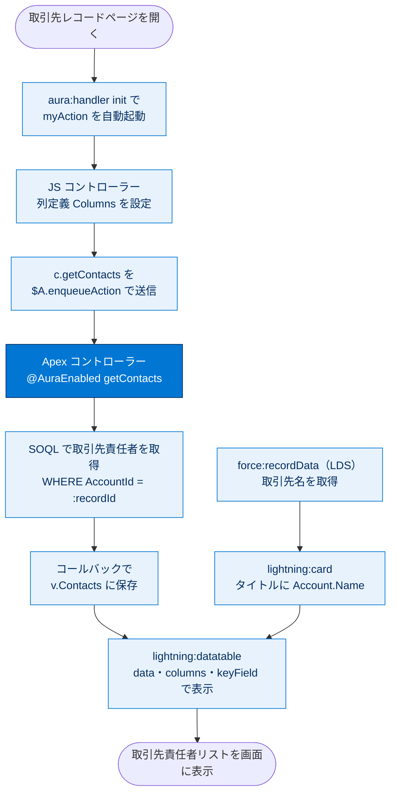

# クイックスタート Aura コンポーネント 総まとめ

このトピックでは、組織の取引先責任者リストを表示する1つの Lightning（Aura）コンポーネントを、4つの部品を組み合わせて完成させました。サーバー側の **Apex コントローラー** でデータを用意し、画面側の **Aura コンポーネントバンドル** にマークアップ・属性・JavaScript を組み込み、`init` イベントで読み込み時にサーバーからデータを取得し、最後に `lightning:datatable` で表として表示する、という Aura 開発の基本ループを一通り体験しました。これにより「クライアントとサーバーがどう連携してデータを画面に出すか」という Lightning コンポーネントの全体像を押さえられます。

---

## 全体像：4つの部品とデータの流れ

---

## ユニット横断の早見表

| ユニット | 学んだこと | キーワード | 一言要点 |
| --- | --- | --- | --- |
| 01 サーバー側の Apex コントローラー | データを返す Apex メソッドの作成 | `@AuraEnabled`・`static`・SOQL・バインド変数 | コンポーネントから呼ぶには `@AuraEnabled` が必須 |
| 02 Aura コンポーネントの作成 | バンドル作成・属性定義・LDS でレコード取得 | `controller`・`implements`・`aura:attribute`・`force:recordData`・`v.` | マークアップで器を作り Apex と紐付ける |
| 03 取引先責任者リストを取得する | JS から Apex を呼び結果を保存・init で自動起動 | `c.メソッド`・`setParams`・`setCallback`・`$A.enqueueAction`・`init` | サーバー呼び出しは4ステップ＋非同期コールバック |
| 04 リストを表示およびプレビューする | datatable と列定義でデータを表示 | `lightning:datatable`・`data`・`columns`・`keyField`・`{label,fieldName,type}` | 表示は3要素セット、`fieldName` をデータと一致させる |

---

## 🎯 試験頻出ポイント

> [!ポイント] このトピックで狙われやすい論点・暗記値
>
> - **`@AuraEnabled` がない Apex メソッドはコンポーネントから呼び出せない**（Aura・LWC 共通の最頻出）。呼び出すメソッドは **`public`/`global` かつ `static`**。
> - SOQL のバインド変数は **`:変数名`**。SOQL インジェクション対策にもなる。Apex は **ガバナ制限**（同期 SOQL 100 回など）の対象。
> - **`implements="flexipage:availableForRecordHome"`** がないとレコードページに配置できない。**`force:hasRecordId`** で `recordId` 属性が自動設定される。
> - 値プロバイダーは **`v.` = 属性（view）**、**`c.` = コントローラー（メソッド）**。取り違えは動かない（頻出）。
> - サーバー呼び出しの順序は **`component.get("c.メソッド")` → `setParams` → `setCallback` → `$A.enqueueAction`**。`$A.enqueueAction` を忘れると送信されない。
> - サーバー処理は **非同期**。結果は `setCallback` 内で **`data.getReturnValue()`** で受け取る。
> - `lightning:datatable` の必須3要素は **`data`・`columns`・`keyField`**。列定義は **`{label, fieldName, type}`** の配列で、`fieldName` はデータ項目名と一致させる。
> - 単純なレコード取得は **`force:recordData`（LDS）で Apex なし**にできる。
> - Aura は **従来方式**。現在の推奨は **LWC（Lightning Web コンポーネント）**。

---

## 📖 用語早見表

| 用語 | ひとことの意味 |
| --- | --- |
| Lightning コンポーネントフレームワーク | モバイル／デスクトップ対応の動的 Web UI を作る開発基盤 |
| Aura コンポーネント | マークアップ・JS・CSS をバンドル化した従来方式の UI 部品 |
| LWC（Lightning Web コンポーネント） | Web 標準準拠の後継方式。現在の推奨 |
| コンポーネントバンドル | 1コンポーネントを構成する `.cmp`・`.js`・`.css` などのまとまり |
| `@AuraEnabled` | Apex メソッドをコンポーネントから呼べるようにするアノテーション |
| Apex | Salesforce 上で動くサーバー側プログラミング言語 |
| SOQL | Salesforce のレコードを取得する問い合わせ言語 |
| バインド変数（`:変数名`） | SOQL に Apex 変数を安全に埋め込む記法 |
| ガバナ制限 | マルチテナントで実行回数・処理量に設けられた上限 |
| `aura:attribute` | コンポーネント内でデータを保持する入れ物（変数） |
| 値プロバイダー `v.` | 属性（view）の値を参照する仕組み |
| 値プロバイダー `c.` | Apex／クライアントメソッドを参照する仕組み |
| `controller` 属性 | コンポーネントが連携する Apex クラスの指定 |
| `force:hasRecordId` | 表示中レコードの `recordId` を自動受け取りする実装 |
| `force:recordData`（LDS） | Apex なしでレコードを取得・更新する Lightning Data Service |
| Lightning 基本コンポーネント | `lightning:card`・`lightning:datatable` など標準提供の UI 部品 |
| `aura:handler` / `init` | イベントを待ち受けるタグ／読み込み時に発火する初期化イベント |
| `$A.enqueueAction` | サーバーアクションを実行キューに入れて送信する関数 |
| コールバック | サーバー応答が返った後に実行される関数（非同期処理） |
| `lightning:datatable` | 行と列の表を表示する基本コンポーネント |
| `keyField` | datatable で各行を一意に識別する項目（通常 `Id`） |
| SLDS | Salesforce 標準の見た目を再現するデザインシステム |

---

> [!豆知識] 「v と c」は MVC の名残
>
> 値プロバイダーの `v` は view（属性＝表示データ）、`c` は controller（処理＝メソッド）を表します。これは Model-View-Controller という古典的な設計パターンに由来し、Aura が「データ」と「振る舞い」を明確に分けて扱う設計であることを示しています。`v.recordId`（データを読む）と `c.myAction`（処理を呼ぶ）の使い分けは、この役割分担そのものです。

> [!豆知識] このコンポーネントは「コードを書かない人」のために作る
>
> 完成したコンポーネントは、システム管理者が **Lightning App Builder の画面上でドラッグ＆ドロップ**してレコードページに配置できます。一度作れば、コードを書けない管理者でも複数のページで再利用できるのが Lightning コンポーネントの大きな価値です。「開発者が部品を作り、管理者が組み立てる」という分業がプラットフォームの思想に組み込まれています。

> [!豆知識] Aura から LWC へ：同じ考え方が活きる
>
> このトピックは Aura が題材ですが、`@AuraEnabled` の Apex 連携・`recordId` の受け取り・`lightning:datatable` などの基本コンポーネントは **LWC でもほぼ同じ概念**で登場します（記法は `lightning-datatable` のようにケバブケースに変わります）。Aura で身につけた「クライアントとサーバーの連携」の流れは、推奨方式の LWC へそのまま橋渡しできます。

---

## ✅ 理解度セルフチェック

> [!まとめ] 理解度を確認しよう（答え付き）
>
> 1. Apex メソッドをコンポーネントから呼び出すために必ず付けるアノテーションは？
>    → **`@AuraEnabled`**
> 2. 「属性の値を参照する値プロバイダー」と「メソッドを参照する値プロバイダー」はそれぞれ何？
>    → 属性は **`v.`**、メソッドは **`c.`**
> 3. サーバーアクションを実際に送信する関数を呼び忘れると何が起きる？（穴埋め：`$A.________`）
>    → **`$A.enqueueAction`**。呼ばないとアクションは送信されず何も起こらない
> 4. レコードページに配置できるようにするために `aura:component` に必要な `implements` の値は？
>    → **`flexipage:availableForRecordHome`**（加えて `force:hasRecordId` で `recordId` を自動受け取り）
> 5. `lightning:datatable` の必須3要素を挙げよ。
>    → **`data`・`columns`・`keyField`**
> 6. Apex を書かずにレコードを取得・更新できる仕組みの名前は？
>    → **Lightning Data Service（LDS）／`force:recordData`**
