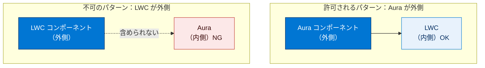
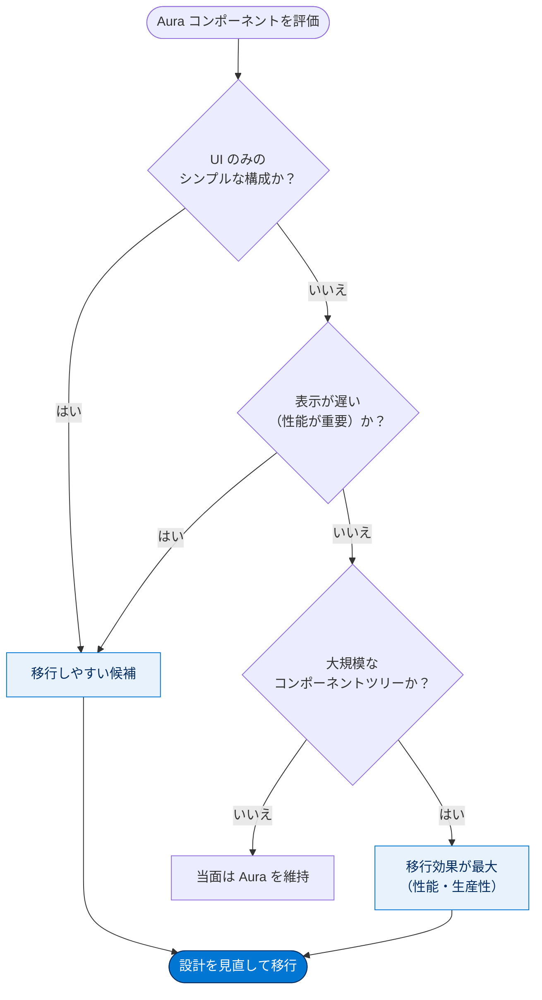

# Lightning Web コンポーネントを Aura コンポーネントと連携させる方法について

## 学習の目的

この単元を完了すると、次のことができるようになります。

- Lightning Web コンポーネントの利点を挙げる。
- Aura コンポーネントと Lightning Web コンポーネントを連携させる方法を説明する。
- コンポーネントを移行させることが妥当な状況を判断する。

> [!ポイント] この単元のゴール
>
> Salesforce には **2 つのコンポーネント開発モデル**（Aura と Lightning Web）があります。押さえる要点は 3 つ：(1) LWC の利点、(2) 同じアプリで共存させるときのルール、(3) Aura から LWC へ移行すべきタイミング。特に「Aura に LWC は入れられるが、LWC に Aura は入れられない」という一方向ルールは頻出です。

---

## 新しいプログラミングモデル

Lightning コンポーネントは、**Aura コンポーネントモデル（元のモデル）** と **Lightning Web コンポーネントモデル（新しいモデル）** の 2 つで作成できます。LWC は、元の Aura モデル構築時には存在しなかった **Web 標準** に適合させるために考案されました。

> [!用語] プログラミングモデル（Programming Model）
>
> コンポーネントを「どのような書き方・仕組みで作るか」を定めた開発の枠組みです。Salesforce には古くからある **Aura モデル** と、新しい **LWC モデル** の 2 種類があり、同じ「Lightning コンポーネント」を作る 2 つの流派と考えるとわかりやすいです。

> [!用語] Web 標準（Web Standards）
>
> W3C などの標準化団体が定めた、ブラウザー共通で動作する Web 技術の取り決めです。HTML テンプレートやカスタム要素といった「Web コンポーネント」の仕様が代表例です。LWC はこの標準に乗ることで、特定フレームワークに依存しない軽くて速いコンポーネントを実現します。

> [!注意] 「Lightning Web コンポーネント」という言葉の二重の意味
>
> 「Lightning Web コンポーネント」には次の 2 つの意味があり、文脈で使い分けます。
>
> - **プログラミングモデル**を表す場合（＝開発の枠組み）
> - **コンポーネント自体**を表す場合（＝実際に作った部品）
>
> 同様に「Aura コンポーネント」もモデルと部品の両方を指します。LWC モデルで LWC を作成し、Aura モデルで Aura コンポーネントを作成します。

> [!例] 2 つのモデルの関係をたとえると
>
> Aura と LWC は、同じ目的地へ向かう **2 種類の乗り物** のようなものです。Aura は信頼できる従来型の車、LWC は最新の Web 標準で作られた速い新型車。古い車（Aura）で走ってきた道路（アプリ）に、新型車（LWC）を後から合流させて一緒に走らせることができます。

---

## Lightning Web コンポーネントとは?

LWC は、**W3C の Web コンポーネント標準** の実装です。ブラウザーで適切に実行される Web コンポーネントをサポートし、Salesforce 対応ブラウザーで動作させるために必要な機能のみを追加します。

> [!用語] W3C（World Wide Web Consortium）
>
> Web 技術の標準仕様を策定する国際的な標準化団体です。LWC が「W3C 標準の実装」であるとは、Salesforce 独自の発明ではなく世界共通の Web の作法に従って作られている、という意味です。

> [!用語] Web コンポーネント（Web Components）
>
> ブラウザーにネイティブで備わる、再利用可能な UI 部品を作るための標準技術群です。主に「カスタム要素」「HTML テンプレート」「Shadow DOM」から構成されます。フレームワークを介さずブラウザー自身が解釈するため動作が速く、知識を他でも応用できます。

---

## Lightning Web コンポーネントの利点

LWC を採用する主なメリットは、次の 3 つの観点に整理できます。

| 観点 | 内容 | 受講者へのメリット |
| --- | --- | --- |
| **最新の JavaScript** | HTML テンプレート、カスタム要素など ES6+ の仕様や Web 標準が使える | フレームワーク内で最新の言語機能をそのまま使える |
| **開発者の生産性と満足度** | 標準の JavaScript / HTML / CSS をそのまま使う。記述量が減り、判読・管理・単体テストが容易 | 学習が速く、好みの開発ツールも使える |
| **コードのパフォーマンス** | より多くの処理がフレームワークではなくブラウザーでネイティブ実行される | コンポーネントの表示が高速になる |

> [!用語] ES6（ECMAScript 2015 / 最新の JavaScript）
>
> JavaScript の言語仕様「ECMAScript」の第 6 版（2015 年）以降を指し、「ES6+」「最新の JavaScript」と呼ばれます。`class` 構文、アロー関数、`import` / `export` によるモジュールなどが追加されました。LWC はこの ES6+ をそのまま採用するため、一般的な JavaScript の知識が通用します。

> [!例] 「記述量が減る」とは
>
> Aura では属性定義やイベントの取り回しに独自タグや記法が多く必要でした。LWC では標準の JavaScript クラスのプロパティやメソッドとして書けるため、同じ機能でも行数が少なく見通しがよくなり、バグも見つけやすく単体テストも書きやすくなります。

---

## 前提条件

このモジュールに取りかかる前に、「**Lightning Web Components Basics**」モジュールを修了してください。本モジュールは **Aura コンポーネントモデルを十分に理解していること** を前提とし、LWC との比較を除き Aura 機能は説明しません。Aura に不慣れな場合は『**Lightning Aura コンポーネント開発者ガイド**』を参照します。また **ES6 JavaScript** の理解も必要です。不安があれば「**Modern JavaScript Development**」モジュールで確認できます。

> [!注意] このモジュールは「中級者向け」
>
> 本単元は、Aura コンポーネントと最新の JavaScript の両方をある程度理解している人が対象です。基礎に不安があれば、前提モジュール（LWC Basics / Modern JavaScript Development）を先に終わらせておくと理解しやすくなります。

---

## コンポーネントの共存共栄

コンポーネントは別のコンポーネントのボディに追加できます。この構成によって、シンプルな部品から複雑なコンポーネントを構築できます。コンポーネントの構成は Aura・LWC のどちらにとっても基本的な概念です。

> [!用語] コンポーネントの構成（Composition / コンポジション）
>
> 小さなコンポーネントを別のコンポーネントの中に入れ子（ネスト）にして、より大きく複雑なコンポーネントを組み立てる考え方です。レゴブロックのように小さな部品を積み重ねるイメージです。「ボディに追加する」とは、あるコンポーネントの中身として別のコンポーネントを配置することを指します。

Salesforce は同一アプリで Aura と LWC を組み合わせられるようにしました。新しい LWC を記述して Aura ベースのアプリに追加できます。また Aura・LWC は **どちらもイベントと通信できます**。ただし、構成にはうまく連携させるための **ルール** があります。

### 重要：含められる方向のルール

2 つのモデルを組み合わせるときには **一方向の決まったルール** があります。これは試験頻出の最重要ポイントです。

| 親（外側）のコンポーネント | 子（内側）に含められるか | 可否 |
| --- | --- | --- |
| **Aura** コンポーネント | **Lightning Web** コンポーネントを含める | ✅ 許可 |
| **Lightning Web** コンポーネント | **Aura** コンポーネントを含める | ❌ 不可 |

- **許可**: Aura に LWC を含めることが **できる**。
- **不可**: LWC に Aura を含めることは **できない**。
- ネストツリーの **一番外側が LWC なら、配下のいずれも Aura にできない**。

> 一番外側が LWC なら、ツリー内のどこにも Aura は置けません。

> [!ポイント] 「Aura は外側、LWC は内側」だけ覚える
>
> 試験では「Aura に LWC を含められるか?」「LWC に Aura を含められるか?」の形でほぼ確実に問われます。覚え方は **「LWC は Aura の中には入れるが、LWC の中に Aura は入れられない」** の一方向ルール。外側が LWC ならその配下はすべて LWC でなければなりません。

> [!例] なぜ一方向なのか（イメージ）
>
> 新しい LWC は最新の Web 標準の「容れ物」で、中身も同じ最新仕様で揃える必要があります。一方、古くから多機能な Aura は新しい LWC を「来客」として受け入れる懐の深さを持ちます。だから「Aura（ホスト）→ LWC（ゲスト）」の方向だけが許される、と覚えると納得しやすいです。

連携の利点の 1 つは、**ある Aura コンポーネントを LWC に移行してもアプリが引き続き機能すること** です。新規を LWC にしても Aura への投資を継続活用できます。また **ES6 モジュール** で書いたコードは LWC からも Aura からも呼び出せ、Aura 開発者に最新の JavaScript 開発の扉が開かれます。

> [!用語] ES6 モジュール（ES6 Modules）
>
> JavaScript のコードを「部品（モジュール）」として切り出し、`export` で公開し `import` で他ファイルから読み込んで再利用する仕組みです。共通ロジックを 1 か所にまとめれば、LWC からも Aura からも同じコードを呼び出せ、重複が減り保守しやすくなります。

---

## 移行戦略

LWC モデルは Aura モデルと基本的に **異なります**。Aura から LWC への移行は **1 行ずつ変換すればよいものではなく**、コンポーネント全体の設計を見直すよい機会です。移行前に **属性、インターフェース、構造、パターン、データフロー** を検証します。

> [!注意] 「機械的な 1 行変換」ではない
>
> Aura と LWC は内部の仕組みが根本的に違うため、1 行ずつ置き換える単純作業にはなりません。移行はむしろ、そのコンポーネントの設計（属性・データの流れなど）を見直し作り直す機会だと捉えるのが正しい姿勢です。

- 最も移行しやすいのは **UI のみを表示するシンプルなコンポーネント**。
- 移行候補に挙げられるのは **パフォーマンスが極めて重要な Aura コンポーネント**。
- 個々より **大規模なコンポーネントツリー** を移行するほうが、性能・生産性の向上が大きい。

1 つ移行し終えると、次の作業（大規模移行する／新規のみ LWC にする／当面 Aura を使い続ける）が妥当かを判断しやすくなります。判断はユースケースや使用可能なリソースに左右されます。

> [!ポイント] 移行を検討すべきコンポーネントの見極め
>
> 試験では「どんな状況で Aura → LWC 移行を検討すべきか」が問われます。判断基準は次のとおり：
>
> - **表示が遅い（パフォーマンスが重要な）コンポーネント** → 移行候補。LWC はネイティブ実行で高速化が見込める。
> - **UI のみのシンプルなコンポーネント** → 最も移行しやすい。
> - **大規模なコンポーネントツリー** → 移行効果（性能・生産性）が最も大きい。
>
> 「Apex を使っているか」「CSS を使っているか」「Aura をほとんど使っていないか」は移行判断の直接の理由には **なりません**。

> [!まとめ] この単元の要点
>
> - Salesforce には **Aura** と **LWC** の 2 つのプログラミングモデルがある。
> - LWC の利点は **最新の JavaScript / 高い生産性 / 高速なパフォーマンス**（Web 標準ベース）。
> - 共存ルールは一方向：**Aura に LWC は含められる ✅ / LWC に Aura は含められない ❌**。外側が LWC なら配下はすべて LWC。
> - 移行は 1 行変換ではなく **設計の見直し**。移行候補は **UI のみ／パフォーマンス重視／大規模ツリー**。
> - ES6 モジュールで共通コードを書けば、Aura からも LWC からも再利用できる。

---

## 試験対策：押さえておきたい追加ポイント

> [!ポイント] Aura と LWC の比較（暗記用）
>
> | 比較項目 | Aura コンポーネント | LWC |
> | --- | --- | --- |
> | 位置づけ | 元（従来）のモデル | 新しいモデル |
> | ベース技術 | Salesforce 独自フレームワーク中心 | W3C の **Web 標準** |
> | JavaScript | 独自記法が多い | **標準の ES6+ JavaScript** |
> | パフォーマンス | フレームワーク経由 | ブラウザーで **ネイティブ実行**＝高速 |
> | 入れ子の可否 | LWC を **含められる** | Aura を **含められない** |
> | イベント通信 | 可能 | 可能（双方とも通信できる） |

> [!ポイント] よくある出題パターン
>
> - 正誤「Aura に LWC を含められる」→ **正しい**。逆（LWC に Aura）は **誤り**。
> - 移行を検討すべき状況 → **「UI の表示に時間がかかる（パフォーマンス問題）」** が正解になりやすい。
> - LWC の利点 → **最新の JavaScript・生産性・パフォーマンス** の 3 本柱。
> - 「移行は 1 行ずつ変換できる」→ **誤り**（設計の見直しが必要）。

> [!注意] 用語の混同に注意
>
> 「Lightning Web コンポーネント」が**モデル**か**部品**かは文脈次第です。「Lightning コンポーネント」は Aura と LWC の **総称** として使われることがあります。設問の文脈でどちらを指すかを意識して読み解きましょう。

---

## リソース

- ブログ投稿: Introducing Lightning Web Components（Lightning Web コンポーネントの概要）
- Lightning Aura Components Developer Guide（Lightning Aura コンポーネント開発者ガイド）
- Lightning Web Components Developer Guide（Lightning Web コンポーネント開発者ガイド）

---

## テスト

この単元を完了するには、テストのすべての質問に正しく解答する必要があります。

**+100 ポイント**

**1. 正誤問題: Aura コンポーネントに Lightning Web コンポーネントを含めることができる。**

- A. 正しい
- B. 誤り

**2. Aura コンポーネントから Lightning Web コンポーネントへの移行を検討すべき状況は次のどれですか?**

- A. Aura コンポーネントをほとんど使用していない場合
- B. Aura コンポーネントで CSS を使用している場合
- C. Aura コンポーネントの UI の表示に時間がかかる場合
- D. Aura コンポーネントで Apex を使用している場合
