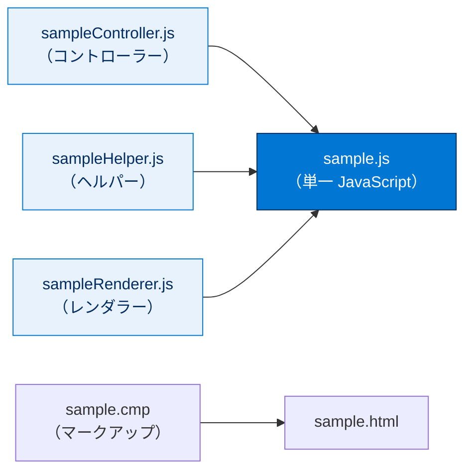
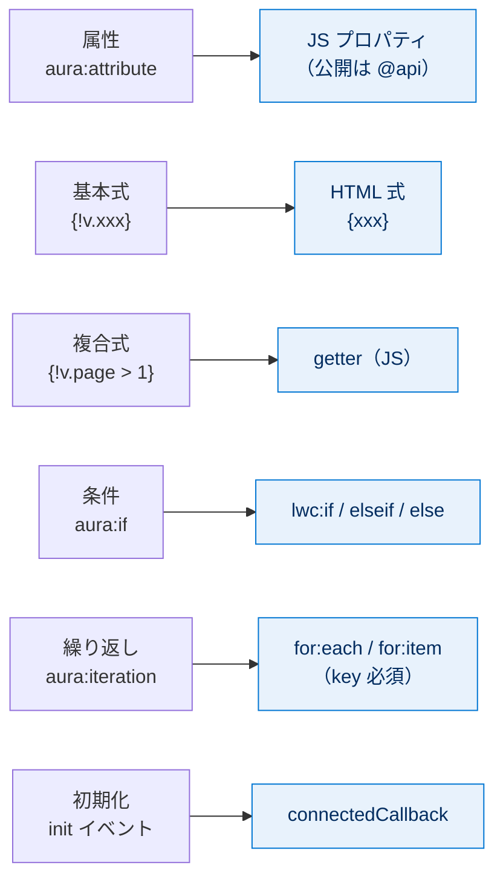
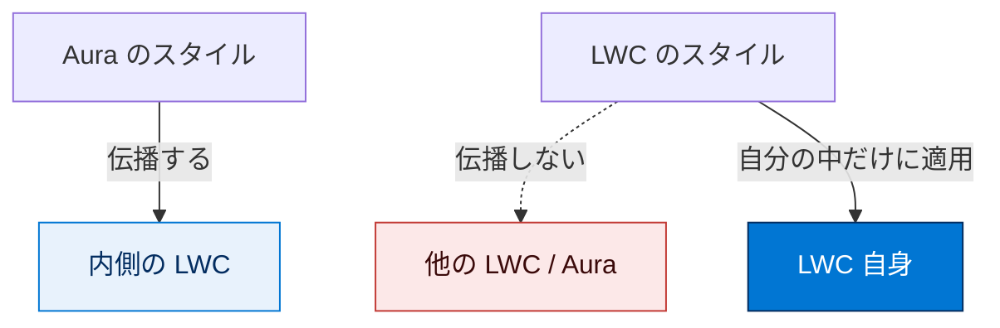

# マークアップと CSS の移行

## 学習の目的

この単元を完了すると、次のことができるようになります。

- Aura コンポーネントから Lightning Web コンポーネントへ HTML とマークアップを移行する。
- Aura コンポーネントから Lightning Web コンポーネントへ CSS を移行する。

> [!ポイント] この単元のゴール
>
> Aura の「マークアップ（.cmp）」「CSS（.css）」が、LWC の「HTML（.html）」「JavaScript（.js）」「CSS（.css）」にどう移行されるかを押さえます。とくに **属性 → JSプロパティ**、**式 `{!v.xxx}` → `{xxx}`／getter**、**`aura:if` → `lwc:if`**、**`aura:iteration` → `for:each`**、**init → connectedCallback()**、**`.THIS` 削除**、**shadow DOM によるスタイルのカプセル化** が頻出です。

---

## DreamHouse アプリケーション

2 つのモデルを比較する最善の方法は、同じコンポーネントを両モデルで書いたコードを見比べることです。本単元では Salesforce のサンプルアプリ **DreamHouse**（不動産業向け）のコンポーネントを使います。DreamHouse には Aura 版と LWC 版があり、それぞれ別の GitHub リポジトリで公開されています。

- DreamHouse Aura コンポーネントの GitHub リポジトリ
- DreamHouse Lightning Web コンポーネントの GitHub リポジトリ

Aura のスニペットが LWC コードにどうマッピングされるか、概念がどう変換されるかをコアスニペット中心に説明します。

> [!用語] DreamHouse（ドリームハウス）
>
> Salesforce が学習用に公開している不動産業向けのサンプルアプリ。同じ機能を Aura 版と LWC 版の両方で実装しているため、「同じ画面を Aura と LWC で書くとどう違うか」を見比べる教材として最適です。

---

## コンポーネントのバンドル

Aura と LWC ではバンドルのファイル構造が異なります。

> [!用語] コンポーネントバンドル（Component Bundle）
>
> 1 つのコンポーネントを構成するファイルをひとまとめにしたフォルダ。Aura ではマークアップ・コントローラー・ヘルパー・CSS など複数ファイルに役割が分かれますが、LWC では HTML / JavaScript / 設定ファイルに集約されます。

| リソース | Aura のファイル | LWC のファイル |
| --- | --- | --- |
| マークアップ | `sample.cmp` | `sample.html` |
| 管理者（コントローラー） | `sampleController.js` | `sample.js` |
| ヘルパー | `sampleHelper.js` | `sample.js` |
| レンダラー | `sampleRenderer.js` | `sample.js` |
| CSS | `sample.css` | `sample.css` |
| ドキュメント | `sample.auradoc` | 現在利用できません。 |
| 設計 | `sample.design` | `sample.js-meta.xml` |
| SVG | `sample.svg` | HTML に含めるか、静的リソースとしてアップロード |

> [!ポイント] 複数の JS が 1 つにまとまる
>
> Aura の **コントローラー・ヘルパー・レンダラー**（3 つの個別 JavaScript ファイル）は、LWC では **1 つの JavaScript ファイル（`sample.js`）** にまとまります。「3 → 1」のイメージが頻出です。



- LWC には **HTML・JavaScript・設定ファイル**が必須。CSS と追加 JavaScript は省略可。
- UI を表示しない **サービスコンポーネント／ライブラリ** は、JavaScript ファイルとメタデータ設定ファイルが必須。

> [!用語] 設定ファイル（`*.js-meta.xml`）
>
> LWC のメタデータ値を定義する XML ファイル。Lightning アプリケーションビルダー向けのデザイン設定（どのページに置けるか等）を含みます。Aura でインターフェースが定義していたメタデータ（`flexipage:availableForRecordHome` など）を、LWC では `targets` などで宣言します。

---

## マークアップの移行

Aura のマークアップは `.cmp` ファイルにあり、`<aura:component>` で始まります。LWC のマークアップは `.html` ファイルにあり、`<template>` で始まり、動的コンテンツの HTML とディレクティブを含めます。

> [!用語] テンプレート（template）
>
> LWC の HTML ファイルのルートとなる `<template>` タグ。描画される構造を宣言する「ひな型」で、Aura の `<aura:component>` に相当します。条件分岐や繰り返しのために内側に `<template>` を入れ子にできます。

> [!用語] ディレクティブ（directive）
>
> `<template>` などに付ける LWC 専用の特別な属性。`lwc:if`、`for:each`、`for:item` などがあり、「条件によって表示する」「リストを繰り返す」といった動的な振る舞いを宣言的に指示します。

次の表が対応関係の早見表です。

| Aura（移行元） | LWC（移行先） |
| --- | --- |
| 属性 `<aura:attribute>` | JavaScript プロパティ（`@api` プロパティなど） |
| 基本的な式 `{!v.xxx}` | HTML の式 `{xxx}` |
| 複合式 `{!v.page > 1}` | JavaScript の **getter** |
| 条件 `<aura:if>` | ディレクティブ `lwc:if` / `lwc:elseif` / `lwc:else` |
| 繰り返し `<aura:iteration>` | ディレクティブ `for:each` / `for:item` |
| 初期化 `init` イベント | ライフサイクルフック `connectedCallback()` |
| 基本コンポーネント `lightning:xxx` | `lightning-xxx`（ケバブケース） |
| CSS の `.THIS` | （削除）標準 CSS |



---

### 属性は JavaScript プロパティになる

Aura のマークアップ（`.cmp`）の `<aura:attribute>` を、LWC の JavaScript プロパティに移行します。`PropertySummary` の属性例：

```html
<aura:attribute name="recordId" type="Id" />
<aura:attribute name="property" type="Property__c" />
```

LWC（`propertySummary.js`）では JavaScript プロパティを使います。

```javascript
import { LightningElement, api } from 'lwc';
export default class PropertySummary extends LightningElement {
    @api recordId;
    property;
        ...
}
```

`@api` デコレーターは `recordId` を公開プロパティにします。公開プロパティはコンポーネントの公開 API の一部で、Lightning アプリケーションビルダーや親コンポーネントから設定できます。

> [!用語] `@api` デコレーター（public property decorator）
>
> プロパティの直前に付けると、そのプロパティを**外部に公開**する LWC の目印。`@api` 付きは親コンポーネントや Lightning アプリケーションビルダーから値を設定できます。`<aura:attribute>` のうち外部から渡したいものが相当します。`@api` を付けない `property` は内部だけで使う非公開プロパティです。

> [!例] 属性 → プロパティの読み替え
>
> `<aura:attribute name="recordId" type="Id" />` → `@api recordId;`。型（`type="Id"`）は LWC では宣言しません。属性名だけが残るイメージです。

---

### Aura の基本的な式は HTML の式になる

属性参照などの基本的な式を、LWC の HTML 式に移行します。`PropertyPaginator` の例：

```html
<aura:component >
    <aura:attribute name="page" type="integer"/>
    <aura:attribute name="pages" type="integer"/>
    <aura:attribute name="total" type="integer"/>
    <div class="centered">{!v.total} properties • page {!v.page} of {!v.pages}</div>
</aura:component>
```

`paginator` LWC の同等の構文：

```html
<template>
    {totalItemCount} items • page {currentPageNumber} of {totalPages}
</template>
```

> [!注意] Aura の式構文（`{!v.}`）は LWC では使わない
>
> LWC の動的コンテンツには**感嘆符（`!`）や値プロバイダー（`v.`）構文がありません**。Aura に慣れていると `{!v.xxx}` と書きがちですが、LWC では `{xxx}` と書きます。

`{currentPageNumber}` と `{totalPages}` は `paginator.js` の **getter** を参照します。

```javascript
import { LightningElement, api } from 'lwc';
export default class Paginator extends LightningElement {
    /** The current page number. */
    @api pageNumber;
    /** The number of items on a page. */
    @api pageSize;
    /** The total number of items in the list. */
    @api totalItemCount;
    get currentPageNumber() {
        return this.totalItemCount === 0 ? 0 : this.pageNumber;
    }
    get totalPages() {
        return Math.ceil(this.totalItemCount / this.pageSize);
    }
}
```

> [!用語] getter（ゲッター）
>
> `get プロパティ名() { ... }` と書くメソッド。HTML から `{currentPageNumber}` のように参照すると内部メソッドが実行され、**計算結果が返されます**。LWC では値を加工・判定したいときに使い、Aura でマークアップに書いていた計算を JavaScript 側に逃がす受け皿です。

---

### Aura の条件式は HTML の条件式になる

`<aura:if>` を、LWC の `lwc:if` / `lwc:elseif` / `lwc:else` に移行します。`BrokerDetails` の条件付きマークアップ：

```html
<aura:if isTrue="{!v.property.Broker__c}">
    <lightning:recordForm recordId="{!v.property.Broker__c}"
      objectApiName="Broker__c"
      fields="{!v.brokerFields}" columns="2"/>
</aura:if>
```

`brokerCard` LWC の同様の HTML：

```html
<template lwc:if={property.data}>
    <lightning-record-form object-api-name="Broker__c"
      record-id={brokerId} fields={brokerFields}
      columns="2">
    </lightning-record-form>
</template>
```

> [!注意] 属性値を囲む引用符がない
>
> LWC の動的コンテンツでは `{brokerId}` 参照を囲む引用符がありません。入力ミスではありません。**動的な値（プロパティ参照）は `record-id={brokerId}` のように引用符なし**、**静的な文字列**（`columns="2"` など）は従来どおり引用符付きで書きます。

`<template>` 内のコンテンツは `lwc:if` の結果に応じて条件付きで表示されます。

> [!例] `aura:if` → `lwc:if` の読み替え
>
> `<aura:if isTrue="{!v.xxx}">` の `isTrue` が、LWC では入れ子の `<template>` に付く `lwc:if={xxx}` になります。3 分岐は `lwc:if` / `lwc:elseif` / `lwc:else` を組み合わせます。

---

### Aura の複合式は JavaScript ロジックになる

比較演算や 3 項演算子などの **Aura 複合式** を LWC の JavaScript getter に移行します。`PropertyPaginator` の `{!v.page > 1}` の例：

```html
<aura:if isTrue="{!v.page > 1}">
    <lightning:buttonIcon iconName="utility:left" variant="border" onclick="{!c.previousPage}"/>
</aura:if>
```

Aura はマークアップに多くのロジックを書けますが、単体テストしにくい欠点があります。LWC では複合式を JavaScript に移すことで単体テストでき、コードが安定します。

> [!ポイント] なぜ式を JavaScript に移すのか
>
> Aura はマークアップに `{!v.page > 1}` のようなロジックを直接書けますが、**マークアップ内のロジックは単体テストしにくい**。LWC では同じ判定を getter（JavaScript）に移すことで Jest などで**単体テスト可能**になります。「ロジックはマークアップではなく JavaScript へ」が LWC の設計思想です。

`paginator` LWC の同様の HTML：

```html
<template lwc:if={isNotFirstPage}>
    <lightning-button-icon icon-name="utility:chevronleft" onclick={previousHandler}></lightning-button-icon>
</template>
```

`{isNotFirstPage}` は `paginator.js` の getter で評価されます。

```javascript
import { LightningElement, api } from 'lwc';
export default class Paginator extends LightningElement {
    /** The current page number. */
    @api pageNumber;
    get isNotFirstPage() {
        return this.pageNumber > 1;
    }
}
```

> [!例] 複合式 → getter の読み替え
>
> Aura の `{!v.page > 1}` が、LWC では getter `get isNotFirstPage() { return this.pageNumber > 1; }` になり、HTML 側は `lwc:if={isNotFirstPage}` とシンプルになります。「比較や三項演算子は getter に追い出す」と覚えましょう。

---

### Aura のイテレーションは HTML のイテレーションになる

`<aura:iteration>` を、LWC の `for:each` ディレクティブに移行します。

> [!用語] イテレーション（iteration＝繰り返し）
>
> 配列やリストの要素を 1 つずつ取り出し、同じ HTML を要素の数だけ繰り返し描画すること。「物件タイルを物件の数だけ並べる」のような一覧表示で使います。

`PropertyTileList.cmp` の Aura 構文：

```html
<aura:iteration items="{!v.properties}" var="property">
    <c:PropertyTile property="{#property}"/>
</aura:iteration>
```

`propertyTileList` LWC の同様の HTML：

```html
<template for:each={properties.data.records} for:item="property">
    <c-property-tile property={property} key={property.Id}
      onselected={handlePropertySelected}></c-property-tile>
</template>
```

> [!注意] `for:each` には `key` が必須
>
> LWC の繰り返しでは各要素に一意の `key`（例 `key={property.Id}`）を指定します。`key` は LWC が「どの要素が変わったか」を効率よく追跡するための識別子で、ないと正しく描画されません。Aura の `<aura:iteration>` には不要でした。`items`→`for:each`、`var`→`for:item` の対応も押さえましょう。

---

### Aura の初期化子はライフサイクルフックになる

Aura の `init` イベントハンドラーを、LWC の `connectedCallback()` メソッドに置き換えます。`connectedCallback()` はコンポーネントが DOM に挿入されたときに起動します。

> [!用語] ライフサイクルフック（lifecycle hook）
>
> コンポーネントが「生成 → DOM 挿入 → 再描画 → 破棄」といったライフサイクルの各タイミングで自動的に呼ばれるメソッド。LWC では `connectedCallback()`（DOM 挿入時）や `disconnectedCallback()`（DOM から外れたとき）などがあります。

`PropertyCarousel` Aura の `init` ハンドラー（コントローラーの `onInit` 関数で初期化）：

```html
<aura:handler name="init" value="{!this}" action="{!c.onInit}" />
```

LWC（`propertySummary.js`）では `connectedCallback()` を使います。

```javascript
export default class PropertySummary extends LightningElement {
    ...
    connectedCallback() {
        // initialize component
    }
}
```

> [!ポイント] init → connectedCallback()
>
> Aura では `<aura:handler name="init" ...>` で宣言してコントローラー関数で初期化しました。LWC では宣言不要で、クラスに `connectedCallback()` メソッドを書くだけです。「初期化処理は connectedCallback() に書く」が頻出です。

---

## 基本コンポーネントの移行

LWC に Aura コンポーネントは含められませんが、Lightning 基本コンポーネントは `lightning` 名前空間で Salesforce が提供し、Aura・LWC の両方で使えます。ただし構文が異なります。

> [!用語] 基本コンポーネント（Lightning Base Components）
>
> Salesforce が `lightning` 名前空間であらかじめ用意した再利用可能な UI 部品（ボタン、入力欄、レコードフォームなど）。ゼロから作らずに済む「ビルディングブロック」で、**Aura でも LWC でも使えますが書き方（構文）が違います**。

`lightning:formattedNumber` を使う Aura コンポーネント：

```html
<aura:component>
    <lightning:formattedNumber value="5000" style="currency"
      currencyCode="USD" />
</aura:component>
```

> [!手順] 基本コンポーネントを LWC 構文に変換する
>
> 1. 名前空間とコンポーネント名を区切る**コロンをダッシュに**（`lightning:` → `lightning-`）。
> 2. キャメルケースのコンポーネント名を**ダッシュ区切り**に（`formattedNumber` → `formatted-number`）。
> 3. キャメルケースの属性名を**ダッシュ区切り**に（`currencyCode` → `currency-code`）。

同等の LWC：

```html
<template>
    <lightning-formatted-number value="5000" style="currency"
      currency-code="USD">
    </lightning-formatted-number>
</template>
```

> [!注意] カスタム要素は自己終了タグにできない
>
> HTML 仕様ではカスタム要素のタグは自己終了（`/>`）にできません。LWC は基本的にカスタム要素なので、`<lightning-formatted-number>` には `</lightning-formatted-number>` という**別個の終了タグ**が必要です。自己終了が許される Aura（`<lightning:formattedNumber ... />`）とは異なります。

> [!用語] キャメルケースとケバブケース
>
> **キャメルケース（camelCase）** は `formattedNumber` のように単語の頭を大文字でつなぐ書き方。**ケバブケース（kebab-case）** は `formatted-number` のようにダッシュ（`-`）でつなぐ書き方。HTML のカスタム要素・属性は小文字のケバブケースが標準のため、LWC では Aura のキャメルケースをケバブケースに変換します。

---

## Aura の CSS は標準 CSS になる

LWC では標準 CSS 構文を使い、Aura 専用の `.THIS` クラスを削除します。`PropertyTile` Aura の CSS：

```css
.THIS .lower-third {
    position: absolute;
    bottom: 0;
    left: 0;
    right: 0;
    color: #FFF;
    background-color: rgba(0, 0, 0, .3);
    padding: 6px 8px;
}
.THIS .lower-third > p {
    padding: 0;
    margin: 0;
}
.THIS .truncate {
  width: 100%;
  white-space: nowrap;
  overflow: hidden;
  text-overflow: ellipsis;
}
```

`propertyTile` LWC の同様の CSS（`THIS` は Aura 固有で LWC では使いません）：

```css
.lower-third {
    position: absolute;
    bottom: 0;
    left: 0;
    right: 0;
    color: #FFF;
    background-color: rgba(0, 0, 0, .3);
    padding: 6px 8px;
}
.lower-third > p {
    padding: 0;
    margin: 0;
}
.truncate {
  width: 100%;
  white-space: nowrap;
  overflow: hidden;
  text-overflow: ellipsis;
}
```

> [!ポイント] `.THIS` を削除するだけ
>
> Aura ではスタイルがそのコンポーネントだけに効くよう `.THIS` を先頭に付けていました。LWC では後述の **shadow DOM** がスタイルを自動でコンポーネント内に閉じ込めるため、`.THIS` は不要です。移行は基本的に「`.THIS ` を消すだけ」です。

---

## Lightning Design System を使用してスタイルを設定する

Lightning Experience や Salesforce モバイルアプリ上のカスタムコンポーネントでは、`import` や静的リソースなしで Lightning Design System を使えます。SLDS の CSS クラスを HTML 要素に割り当てるだけで完了です。

> [!用語] Lightning Design System（SLDS）
>
> Salesforce 公式の **CSS デザインフレームワーク**。あらかじめ用意された CSS クラス（`slds-` で始まる）を HTML 要素に付けるだけで、Salesforce 標準の見た目（余白・色・グリッド等）に統一できます。Lightning Experience やモバイルアプリ上では追加読み込みなしで利用できます。

---

## Shadow DOM を使用した CSS のカプセル化

LWC では、ページから内部要素を隠す **shadow DOM** という Web 標準メカニズムを使います。これにより、コンポーネントのスタイルシートのスタイルはそのコンポーネントに範囲設定され、親・子・兄弟コンポーネントには適用されません。厳格なルールですが、スタイルを失わず異なるコンテキストでコンポーネントを再利用でき、ページの他部分のスタイルが上書きされるのも防ぎます。

> [!用語] shadow DOM（シャドウ DOM）
>
> コンポーネント内部の HTML 要素とスタイルを、外側のページから「影」のように隠して**カプセル化**する Web 標準の仕組み。内部の CSS は外に漏れず、外の CSS も中に侵入しません。どのページに置いても見た目が崩れず、安全に再利用できます。

> [!例] スタイルが閉じていると何が嬉しいか
>
> ある画面で作った「物件タイル」を別の画面に置いても、shadow DOM でスタイルが内部に閉じているため、置き先ページの CSS に影響されず**同じ見た目**を保てます。逆にタイルの CSS が置き先のレイアウトを壊すこともありません。

LWC の shadow DOM は Web 標準と少し異なり、**自動的に作成**されます（開発者が実装する必要はありません）。また、shadow DOM をネイティブ非対応のブラウザーでも機能します。

> [!注意] スタイルの伝播は「Aura → LWC」の一方向
>
> - **Aura のスタイル → 内側の LWC**：伝播する。
> - **LWC のスタイル → 他の LWC / Aura**：伝播しない（自分の中に閉じる）。
>
> 試験では「LWC のスタイルシートは何のスタイルに影響するか？」が問われ、答えは **LWC 自身のみ** です。



---

## 試験対策：押さえておきたい追加ポイント

> [!ポイント] Aura → LWC 移行の頻出対応（暗記必須）
>
> | 観点 | Aura | LWC |
> | --- | --- | --- |
> | マークアップのルートタグ | `<aura:component>` | `<template>` |
> | 属性 | `<aura:attribute>` | JavaScript プロパティ（公開は `@api`） |
> | 式（基本） | `{!v.xxx}` | `{xxx}`（`!` と `v.` なし） |
> | 式（複合・比較） | `{!v.page > 1}` | getter に移す |
> | 条件 | `<aura:if isTrue="...">` | `lwc:if` / `lwc:elseif` / `lwc:else` |
> | 繰り返し | `<aura:iteration>`（`items` / `var`） | `for:each` / `for:item`（`key` 必須） |
> | 初期化 | `init` イベント + コントローラー | `connectedCallback()` |
> | 基本コンポーネント | `lightning:formattedNumber` | `lightning-formatted-number` |
> | カスタム要素の終了 | 自己終了 `/>` 可 | 終了タグ必須 |
> | CSS スコープ | `.THIS` | `.THIS` 削除（shadow DOM が自動でスコープ） |

> [!ポイント] よく狙われる細かい点
>
> - **LWC に Aura は入れられない**（逆＝Aura に LWC は入れられる）。基本コンポーネントは両モデルで使える。
> - LWC の動的値は**引用符なし**（`record-id={brokerId}`）、静的値は引用符あり（`columns="2"`）。
> - `for:each` の各要素には一意の **`key`** が必須。
> - LWC のスタイルシートは**自分自身にのみ影響**する（子にも親にも伝播しない）。Aura のスタイルは内側の LWC に**伝播する**。
> - shadow DOM は LWC で**自動生成**され、開発者が実装する必要はない。

---

## リソース

- Lightning Aura コンポーネント開発者ガイド: コンポーネントの作成
- Lightning Aura コンポーネント開発者ガイド: Lightning ページと Lightning アプリケーションビルダーのコンポーネントの設定
- Lightning Web コンポーネント開発者ガイド: Component Lifecycle Hooks（コンポーネントのライフサイクルフック）
- Lightning Web コンポーネント開発者ガイド: コンポーネントの設定ファイル

---

## テスト

この単元を完了するには、テストのすべての質問に正しく解答する必要があります（+100 ポイント）。

**第 1 問：Aura の属性は Lightning Web コンポーネントに何を移行しますか？**

- A. `<template>` タグ
- B. JavaScript 関数
- C. JavaScript プロパティ
- D. HTML の `<attribute>` タグ

**第 2 問：Lightning Web コンポーネントのスタイルシートは何のスタイルに影響しますか？**

- A. Lightning Web コンポーネントのみ
- B. Lightning Web コンポーネントとその子 Lightning Web コンポーネント
- C. Lightning Web コンポーネントとその子 Aura コンポーネント
- D. Lightning Web コンポーネントとその親 Aura コンポーネント

> [!ポイント] 解答の考え方
>
> - 第 1 問：Aura の `<aura:attribute>` は LWC では **JavaScript プロパティ**（外部公開なら `@api`）になります。→ **C**。
> - 第 2 問：LWC のスタイルは shadow DOM により**自分自身にのみ**適用され、子にも親にも伝播しません。→ **A**。
