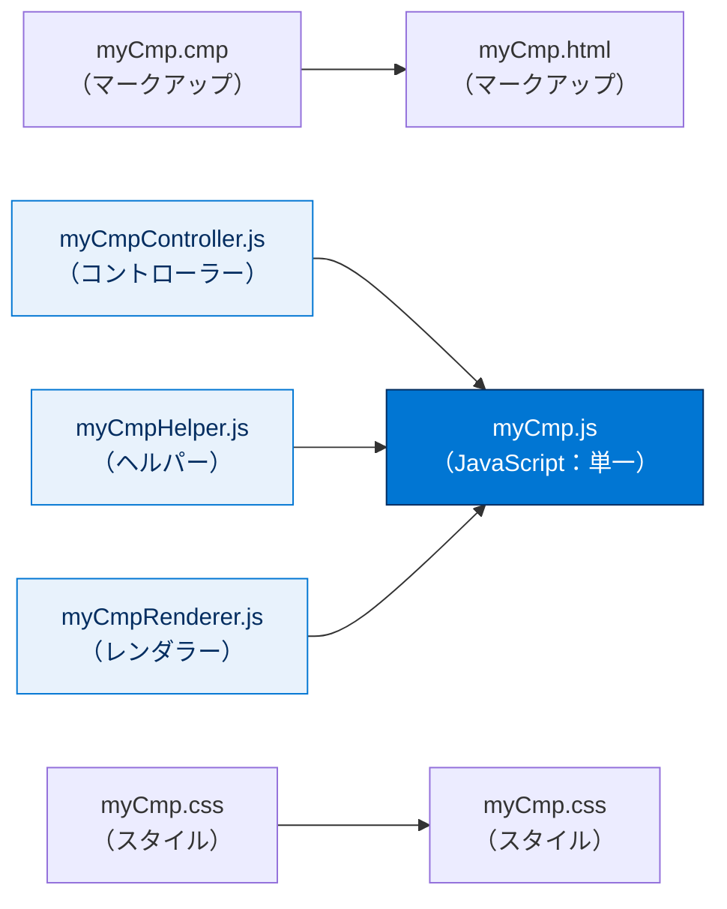
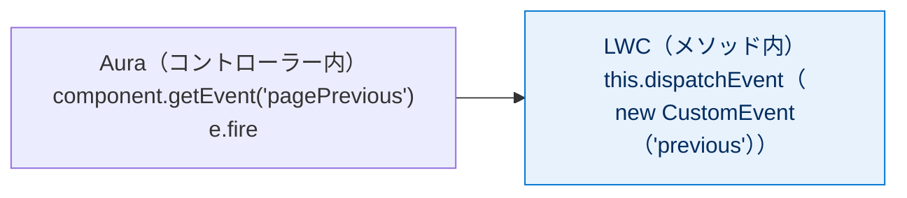
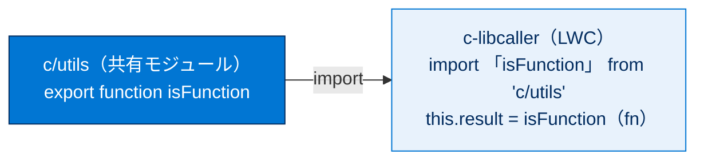
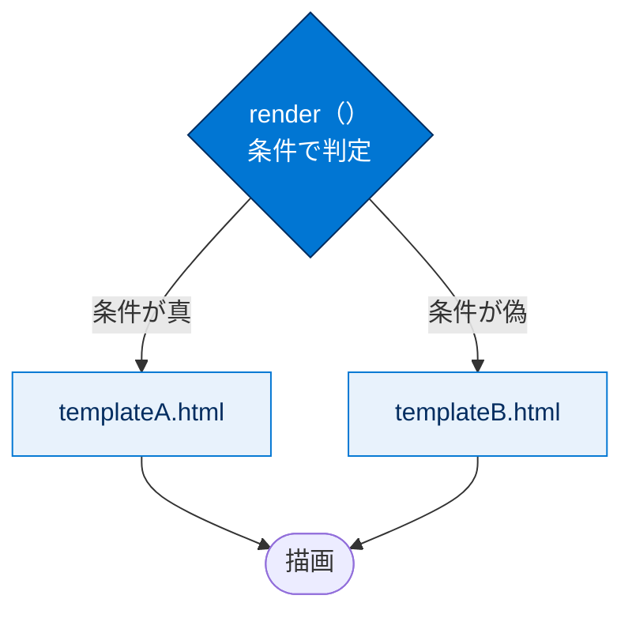

# JavaScript の移行

## 学習の目的

この単元を完了すると、次のことができるようになります。

- Aura コンポーネントから Lightning Web コンポーネントへ JavaScript を移行する。
- Aura コンポーネントと Lightning Web コンポーネント間でコードを共有する。

> [!ポイント] この単元のゴール
>
> Aura では JavaScript が「コントローラー」「ヘルパー」「レンダラー」と**複数ファイルに分かれ**、独自のオブジェクトリテラル形式で書かれていました。LWC ではこれらが**1 つの JavaScript ファイル**にまとまり、**標準の ES6 モジュール**で書かれます。「複数ファイル＆独自形式 → 単一ファイル＆ES6 標準」という移行の方向性を押さえましょう。

> [!用語] Aura コンポーネント / Lightning Web コンポーネント（LWC）
>
> **Aura** は旧世代の UI フレームワークで、`.cmp` の独自マークアップとコントローラー・ヘルパー・レンダラーといった複数の JavaScript ファイルで構成されます。**LWC** は Web 標準（HTML・JavaScript・CSS）ベースの新しいフレームワークで、ブラウザーのネイティブ機能を活用して動作が軽く、一般的な Web 開発の知識をそのまま使えます。

---

## JavaScript モジュールの使用

JavaScript は LWC の心臓です。前単元では Aura の属性が JavaScript プロパティにマッピングされる点を確認しました。ここでは JavaScript ファイルを詳しく見ます。Aura のクライアント側コントローラー・ヘルパー・レンダラーの個別ファイルを、LWC の 1 つの JavaScript ファイルに移行します。

> [!用語] クライアント側コントローラー・ヘルパー・レンダラー
>
> Aura で JavaScript を書く 3 種類のファイルです。
> - **クライアント側コントローラー**：ボタンクリックなどのユーザー操作（イベント）に応答する関数を書く場所。
> - **ヘルパー**：コントローラーから呼び出す共通処理をまとめる補助ファイル。
> - **レンダラー**：DOM の描画方法をカスタマイズするファイル（使用頻度は低い）。
>
> LWC では、これら 3 つの役割をすべて **1 つの `.js` ファイル**に集約します。

> [!例] ファイル構成の違い（Aura → LWC）
>
> 3 つの JavaScript ファイルが 1 つに統合される点がポイントです。



Aura のコントローラーは、名前―値ペアのオブジェクトリテラル表記の JavaScript オブジェクトです。`PropertyPaginatorController.js` の例：

> [!用語] オブジェクトリテラル（Object Literal）
>
> `{ キー: 値, キー: 値 }` のように波かっこ `{}` の中に「名前（キー）」と「値」のペアを並べて JavaScript オブジェクトを直接書く記法。Aura のコントローラーは、関数を値に持つこのオブジェクトリテラルを `( ... )` で囲んだ独特な形です。

```javascript
({
    previousPage : function(component) {
        var pageChangeEvent = component.getEvent("pagePrevious");
        pageChangeEvent.fire();
    },
    nextPage : function(component) {
        var pageChangeEvent = component.getEvent("pageNext");
        pageChangeEvent.fire();
    }
})
```

Aura の形式は ES6 標準が確立される数年前に設計されました。LWC の JavaScript ファイルは ES6 モジュールなので標準の JavaScript を使い、他の最新フレームワーク向けの JavaScript によく似ています。

> [!用語] ES6 モジュール / import / export
>
> ES6（ECMAScript 2015）で標準化された JavaScript の「モジュール」の仕組み。1 ファイル＝1 モジュールとして扱い、`export` で機能を公開し、`import` で他モジュールの機能を取り込みます。Salesforce 独自ではなく**世界共通の標準**です。LWC の `.js` は必ず `import` でフレームワークの部品を取り込み、`export default` でコンポーネントクラスを公開します。

paginator LWC の JavaScript：

```javascript
import { LightningElement, api } from 'lwc';
export default class Paginator extends LightningElement {
    /** The current page number. */
    @api pageNumber;
    /** The number of items on a page. */
    @api pageSize;
    /** The total number of items in the list. */
    @api totalItemCount;
    previousHandler() {
        this.dispatchEvent(new CustomEvent('previous'));
    }
    nextHandler() {
        this.dispatchEvent(new CustomEvent('next'));
    }
    get currentPageNumber() {
        return this.totalItemCount === 0 ? 0 : this.pageNumber;
    }
    get isFirstPage() {
        return this.pageNumber === 1;
    }
    get isLastPage() {
        return this.pageNumber >= this.totalPages;
    }
    get totalPages() {
        return Math.ceil(this.totalItemCount / this.pageSize);
    }
}
```

重要なのは、LWC では標準の JavaScript モジュールが使われるという点です。

> [!用語] CustomEvent（カスタムイベント）
>
> `new CustomEvent('イベント名')` で作る Web 標準のイベントオブジェクト。LWC では子から親へ通知を送るときに使い、`this.dispatchEvent(...)` で発火します。Aura の `component.getEvent(...).fire()` に相当する処理を、標準の DOM の仕組みで実現します。

> [!用語] getter（ゲッター）
>
> `get プロパティ名() { return ... }` の形で定義する特別なメソッド。呼び出し側からは「プロパティ（値）」のように見えます。上の `currentPageNumber` や `totalPages` がこれで、HTML から `{currentPageNumber}` のように値として参照でき、計算結果を表示用に整える用途でよく使います。

> [!例] Aura の発火と LWC の発火の対応
>
> どちらも「前ページへ」イベントを発火しますが、LWC は Web 標準の `CustomEvent` と `dispatchEvent` を使う点が違います。



---

## Aura と Lightning Web コンポーネント間でのコードの共有

LWC と Aura の間で JavaScript コードを共有するには、コードを ES6 モジュールに配置します。どちらのモデルからも共有コードにアクセスでき、すべてを LWC へ移行しなくても新機能を共有できます。

> [!ポイント] 共有のカギは「ES6 モジュール」
>
> 共通の処理を **ES6 モジュール（例：`utils.js`）** として 1 か所に書けば、**LWC からも Aura からも**利用できます。Aura を一気に LWC へ移行しきれない過渡期でも、ロジックを二重に書かず共有できるのが大きなメリットです。

`utils.js` ES6 モジュールの例（`isFunction()` をエクスポート）：

```javascript
/* utils.js */
/**
 * Returns whether provided value is a function
 * @param {*} value - the value to be checked
 * @return {boolean} true if the value is a function, false otherwise
 */
export function isFunction(value) {
    return typeof value === 'function';
}
```

utils モジュールを使う c-libcaller LWC：

```javascript
/* libcaller.js */
import { LightningElement } from 'lwc';
// import the library
import { isFunction } from 'c/utils';
export default class LibCaller extends LightningElement {
    result;
    checkType() {
        // Call the imported library function
        this.result = isFunction(
            function() {
                console.log('I am a function');
            }
        );
    }
}
```

c-libcaller は utils をインポートし、エクスポートされた isFunction 関数を呼びます。引数が関数なので `result` は true になります。

> [!例] LWC からの共有モジュール利用の流れ
>
> `import` で取り込み、ふつうの関数として呼び出すだけです。



同じ utils モジュールを使う `libcallerAura.cmp`：

```html
<aura:component>
    <aura:handler name="init" value="{!this}" action="{!c.doInit}"/>
    <p>Aura component calling the utils lib</p>
    <!-- add the lib component -->
    <c:utils aura:id="utils" />
</aura:component>
```

libcallerAura には c:utils ES6 モジュールへの参照が含まれ、JavaScript から参照を取得できるよう aura:id を付けています。

> [!用語] aura:id
>
> Aura のマークアップ上で要素やコンポーネントに付ける「ローカルの目印（ID）」。JavaScript（コントローラー）側から `cmp.find('目印')` でその要素を探すために使います。ここでは `aura:id="utils"` を付けることで、コントローラーから ES6 モジュールの参照を取得します。

`libcallerAuraController.js`：

```javascript
({
    doInit: function(cmp) {
        // Call the lib here
        var libCmp = cmp.find('utils');
        var result = libCmp.isFunction(
            function() {
                console.log(" I am a function");
            }
        );
        console.log("Is it a function?: " + result);
    }
})
```

コントローラーは `cmp.find('utils')` で aura:id に一致させてモジュール参照を取得し、`isFunction()` を呼びます。引数が関数なので `result` は true になります。

> [!ポイント] 同じモジュールへのアクセス方法が違う
>
> 同じ `utils` モジュールでも、取り込み方が 2 つのモデルで異なります。
>
> | | LWC | Aura |
> | --- | --- | --- |
> | アクセス方法 | JavaScript の `import { isFunction } from 'c/utils';` | マークアップに `<c:utils aura:id="utils" />` を置き、`cmp.find('utils')` で参照を取得 |
> | 呼び出し | `isFunction(fn)` | `libCmp.isFunction(fn)` |
>
> **LWC＝`import` 文／Aura＝マークアップに置いて `aura:id` で探す**、と覚えましょう（試験で問われます）。

---

## サードパーティ JavaScript ライブラリの使用

Aura・LWC でサードパーティ JavaScript ライブラリを使うには、ライブラリを静的リソースとしてアップロードします。操作する構文は 2 つのモデルで異なります。

> [!用語] サードパーティ JavaScript ライブラリ / 静的リソース（Static Resource）
>
> **サードパーティライブラリ** は Salesforce 以外の第三者が作った汎用ライブラリ（チャート描画やカレンダーなど）。**静的リソース** は JavaScript・CSS・画像・ZIP などのファイルを Salesforce 組織に保管しておく仕組みで、コンポーネントから名前で参照して読み込めます。外部ライブラリを安全に配置・配信する置き場所です。

Aura はマークアップで `<ltng:require>` タグを使います。

```html
<ltng:require scripts="{!$Resource.resourceName}"
    afterScriptsLoaded="{!c.afterScriptsLoaded}" />
```

resourceName が静的リソース名です。読み込まれると `afterScriptsLoaded` アクションが呼ばれます。LWC は JavaScript でインポートします。

```javascript
import resourceName from '@salesforce/resourceUrl/resourceName';
```

その後 `loadScript` と `loadStyle` でライブラリを読み込みます。

> [!用語] loadScript / loadStyle
>
> LWC で外部のスクリプト（JavaScript）やスタイル（CSS）を読み込む関数。`lightning/platformResourceLoader` から `import` して使います。静的リソースをインポートしたあとこの関数に渡してライブラリを読み込みます。Aura の `<ltng:require>` タグに相当する役割を JavaScript 側で担います。

> [!ポイント] サードパーティライブラリ読み込みの対応表
>
> | | Aura | LWC |
> | --- | --- | --- |
> | 読み込み場所 | マークアップ | JavaScript |
> | 使うもの | `<ltng:require>` タグ | `@salesforce/resourceUrl/...` の `import` ＋ `loadScript` / `loadStyle` |
> | 読み込み完了後 | `afterScriptsLoaded` アクション | `loadScript(...)` が返す Promise の `.then()` |
>
> 「Aura＝`ltng:require`／LWC＝`loadScript`・`loadStyle`」と覚えましょう。

---

## コンポーネントの動的な作成

Aura では `$A.createComponent()` で JavaScript からコンポーネントを動的に作成できますが、LWC には相当するものがありません。

> [!用語] $A.createComponent()
>
> Aura で、実行時にコンポーネントを「動的に」生成する API。マークアップに事前に書くのではなく、コードの中でその場で部品を作って差し込めました。LWC にはこれに直接対応する仕組みがありません。

これは意図的な決定です。Aura ではこのパターンがバグの多い複雑なコードにつながったためです。改善策として、LWC では複数の HTML テンプレートを用意し、`render()` メソッドでニーズに応じて切り替えます。これは他フレームワークのルート分割に近いパターンです。

> [!注意] 動的作成は LWC では「ない」と覚える
>
> 「LWC で `$A.createComponent()` に相当するものは？」の答えは **「存在しない（意図的に提供していない）」** です。代わりに**複数の HTML テンプレートを用意し `render()` で切り替える**のが LWC 流。Aura のクセで「動的作成 API があるはず」と探さないよう注意しましょう。

> [!例] 複数テンプレートの切り替えイメージ
>
> 状況に応じて返すテンプレートを選び、「動的に画面を作る」のと同じ効果を安全な形で実現します。



---

## リファクタリングの機会

JavaScript の移行は 1 行ごとの変換ではなく、コンポーネントの設計を見直す良い機会です。新しいモデルへの移行は、同じ目的地へ続く新しい道を進むようなもので、Aura ではおそらく使わなかった JavaScript モジュールなどの ES6 機能を活かす好機でもあります。新機能の概要は「JavaScript の最新機能」Trailhead モジュールを参照してください。

> [!ポイント] 「機械的な変換」ではなく「設計の見直し」
>
> 移行は「Aura のコードを 1 行ずつ LWC に置き換える作業」ではありません。**ES6 モジュール・クラス・ゲッターなどの標準機能を活かし、コンポーネントの設計そのものを良くするチャンス**ととらえるのが Salesforce 推奨の考え方です。

---

## 試験対策：押さえておきたい追加ポイント

> [!ポイント] Aura → LWC 対応の総まとめ
>
> | 観点 | Aura コンポーネント | LWC |
> | --- | --- | --- |
> | JavaScript の形式 | 独自のオブジェクトリテラル形式 | **ES6 モジュール（標準 JavaScript）** |
> | ファイル構成 | コントローラー・ヘルパー・レンダラーに分割 | **単一の `.js` ファイル**に集約 |
> | イベント発火 | `cmp.getEvent('x').fire()` | `this.dispatchEvent(new CustomEvent('x'))` |
> | コード共有 | ES6 モジュールをマークアップに置き `cmp.find()` で参照 | ES6 モジュールを `import` |
> | 外部ライブラリ | マークアップの `<ltng:require>` | `@salesforce/resourceUrl/...` ＋ `loadScript` / `loadStyle` |
> | 動的コンポーネント作成 | `$A.createComponent()` | **相当機能なし**（複数テンプレート＋`render()` で代替） |

> [!ポイント] よく問われる暗記事項
>
> - **LWC の JavaScript ファイルの形式は「ES6 モジュール」**（JSON でも XML でも HTML マッシュアップでもない）。
> - **Aura が ES6 モジュールにアクセスする方法は、マークアップに `aura:id` を付けて `cmp.find()` で参照を取る**。`import` 文は LWC 側のやり方。
> - LWC のコード共有・外部ライブラリ・イベントはいずれも **Web 標準（ES6 / DOM）** に寄せられている。
> - **`$A.createComponent()` の LWC 版は存在しない**。動的 UI は複数テンプレートの切り替えで実現する。

> [!注意] `c/` プレフィックスと名前付けに注意
>
> 共有モジュールを LWC で取り込むときは `import { isFunction } from 'c/utils';` のようにデフォルト名前空間 `c/` を付けます。ファイル名・フォルダー名はキャメルケース（`utils`）で、参照は `c/utils`。この対応を取り違えるとインポートに失敗します。

---

## リソース

- Lightning Aura コンポーネント開発者ガイド: JavaScript の使用
- Lightning Web コンポーネント開発者ガイド: LWC と Aura 間での JavaScript コードの共有

---

## テスト

この単元を完了するには、テストのすべての質問に正しく解答する必要があります。（+100 ポイント）

**1. Lightning Web コンポーネントの JavaScript ファイルの形式は何ですか?**

- A. JSON ファイル
- B. ES6 モジュール
- C. XML ファイル
- D. HTML-JavaScript マッシュアップファイル

**2. Aura コンポーネントでは、どのような方法で ES6 モジュールにアクセスしますか?**

- A. import ステートメントを使用する。
- B. モジュールを参照する属性を追加する。
- C. ヘルパーを使用してモジュールをスキャンする。
- D. マークアップのモジュール参照に aura:id 属性を追加する。

> [!まとめ] この単元の要点
>
> - Aura の**複数 JavaScript ファイル（コントローラー・ヘルパー・レンダラー）**は、LWC では**単一の `.js` ファイル（ES6 モジュール）**にまとまる。
> - コード共有は **ES6 モジュール**で行い、LWC は `import`、Aura は `aura:id` ＋ `cmp.find()` でアクセスする。
> - サードパーティライブラリは**静的リソース**にアップロードし、Aura は `<ltng:require>`、LWC は `loadScript` / `loadStyle` で読み込む。
> - **`$A.createComponent()` による動的作成は LWC にはない**。複数テンプレートと `render()` で代替する。
> - 移行は機械的な変換ではなく、**ES6 標準を活かして設計を見直す好機**である。
