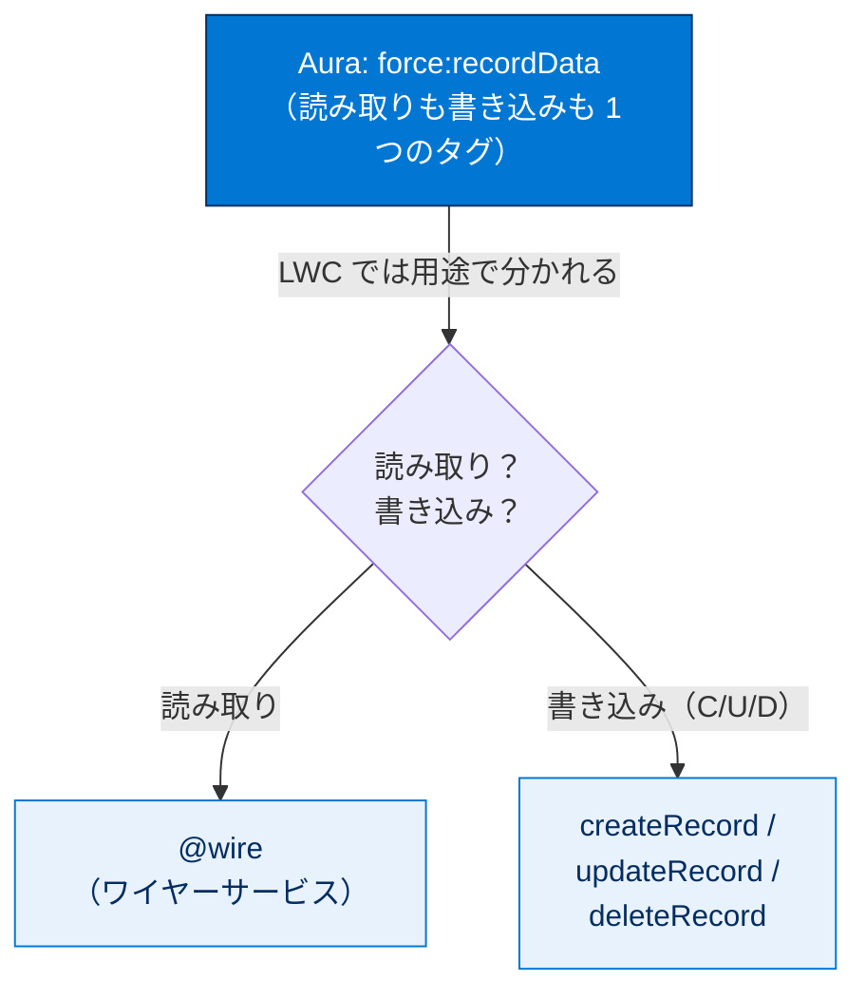
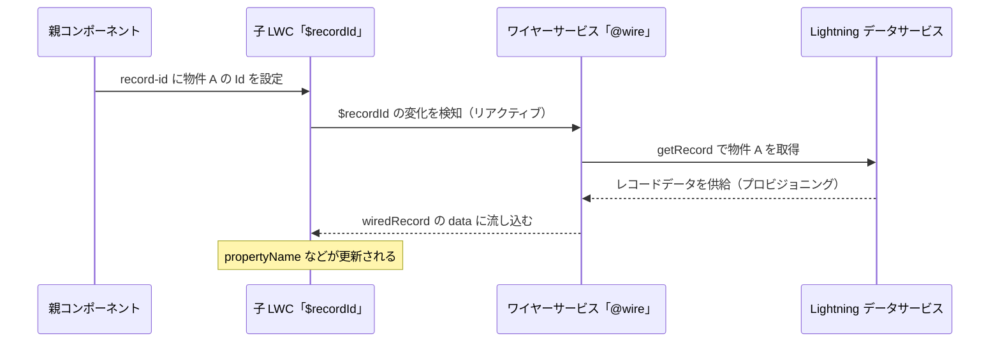
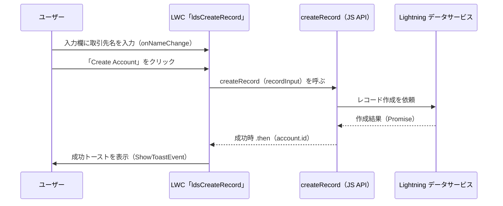
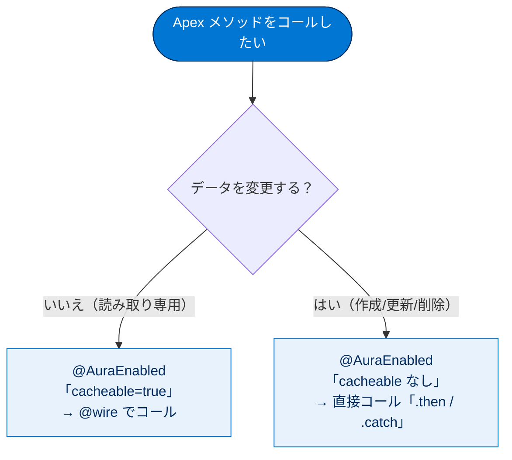

# Salesforce データの操作

## 学習の目的

この単元を完了すると、次のことができるようになります。

- 基本コンポーネントを使用して、1 つのレコードを処理するフォームを作成する。
- ワイヤーサービスを使用してデータを取得する。
- データを作成して更新する。
- Apex メソッドをコールする。

この単元では、Aura コンポーネントと LWC の Salesforce データの**読み取り方法**と**書き込み方法**を比較します。Aura 用に開発した Apex は LWC でも再利用できますが、LWC にはデータ処理の別手段があるため Apex が不要になる場合もあります。

> [!ポイント] この単元のゴール
>
> Aura と LWC で「Salesforce データをどう扱うか」を対応づけて理解するのがゴールです。特に **読み取りは `@wire`（ワイヤーサービス）、書き込み（作成・更新・削除）は `@wire` を使わず JavaScript API または Apex の直接コール**、という使い分けは試験頻出です。

| データ操作 | Aura の手段 | LWC の手段 |
| --- | --- | --- |
| 標準フォーム | `lightning:recordForm` など | `lightning-record-form` など |
| カスタム UI でのデータ処理 | `force:recordData` | Lightning データサービス（`@wire` / JavaScript API） |
| データ読み取り | `force:recordData`・Apex | `@wire`（ワイヤーサービス） |
| データ書き込み（作成/更新/削除） | `force:recordData`・Apex | `createRecord` / `updateRecord` / `deleteRecord`（JavaScript API） |
| Apex メソッドのコール | `$A.enqueueAction` | `@wire` または直接コール（import した関数） |

> [!用語] 基本コンポーネント（Base Component）
>
> Salesforce が標準で提供する、すぐ使える UI 部品。`lightning` 名前空間に属し、入力欄（`lightning-input`）・ボタン（`lightning-button`）・レコードフォーム（`lightning-record-form`）などがあります。ゼロから作らずこれらを組み合わせて画面を構築できます。

> [!注意] 詳細モジュールの案内
>
> Salesforce データ操作の詳細は Trailhead の「Lightning Web コンポーネントと Salesforce データ」モジュールを参照してください。本単元は Aura 開発者が LWC へ移行する際の「対応表」として読むと理解しやすくなります。

---

## 1 つのレコードを処理するフォームの作成

ユーザーがレコードを表示・編集・作成できるフォームは、Aura・LWC どちらも `lightning` 名前空間の基本コンポーネントを使います。これらはフォームレイアウトを持ち、レコードの **CRUD 変更**を処理するため Apex は不要です。内部では **Lightning データサービス**でレコードの更新をキャッシュし、コンポーネント間で共有します。

> [!用語] CRUD（クラッド）
>
> データ操作の基本 4 種、**Create（作成）・Read（参照）・Update（更新）・Delete（削除）** の頭文字。アプリのデータ操作の大半はこの 4 つに分類できます。

> [!用語] Lightning データサービス（LDS：Lightning Data Service）
>
> レコードの読み書きを Apex なしで行える仕組み。取得したレコードを**キャッシュ**し、複数のコンポーネント間で共有します。あるコンポーネントが更新すると、同じレコードを表示している他のコンポーネントにも自動反映されます。`lightning-record-form` などの基本コンポーネントや `@wire`、`createRecord` は内部でこの LDS を利用します。LDS は公開 **ユーザーインターフェース API** 上に構築され、そのサブセットをサポートします。

> [!用語] ユーザーインターフェース API（User Interface API）
>
> レコード・レイアウト・項目情報などを、画面構築に必要な形でまとめて取得できる REST API。LDS はこの API の上に作られ、これを通じてレコードを安全かつ効率的に読み書きします。

Aura と LWC では動作は同じですが命名規則が異なります。

### Form 関数（Aura と LWC の対応表）

| Form 関数 | Aura コンポーネント | LWC |
| --- | --- | --- |
| 編集、表示、参照のみモードをサポート | `lightning:recordForm` | `lightning-record-form` |
| 参照のみのフォーム | `lightning:recordViewForm` | `lightning-record-view-form` |
| 編集可能なフォーム | `lightning:recordEditForm` | `lightning-record-edit-form` |

> [!ポイント] 命名規則の違いを覚える
>
> Aura は **コロン区切り＋キャメルケース**（`lightning:recordForm`）、LWC は **ハイフン区切り**（`lightning-record-form`）。属性も Aura は `objectApiName`、LWC は `object-api-name`。試験ではこの綴りの違いが問われます。

大半のユースケースでは `lightning-record-form` から始めるとよいです（view と edit の機能を結合し簡単に使えます）。カスタム項目レイアウトなど高度なケースでは `lightning-record-view-form` と `lightning-record-edit-form` を使います。

> [!例] 3 つのフォームの使い分け
>
> - **表示・編集・新規作成をまとめて行いたい** → `lightning-record-form`（一番手軽）
> - **項目を読み取り専用で見せたいだけ** → `lightning-record-view-form`
> - **入力欄の配置を細かく作り込みたい** → `lightning-record-edit-form`

`BrokerDetails` Aura コンポーネントの例：

```html
<lightning:recordForm
  objectApiName="Broker__c"
  recordId="{!v.property.Broker__c}"
  fields="{!v.brokerFields}"
  columns="2"/>
```

対応する `brokerCard` LWC の HTML：

```html
<lightning-record-form
  object-api-name="Broker__c"
  record-id={brokerId}
  fields={brokerFields}
  columns="2">
</lightning-record-form>
```

> [!例] 並べて見る Aura → LWC
>
> `objectApiName="Broker__c"` → `object-api-name="Broker__c"`、`recordId="{!v.property.Broker__c}"` → `record-id={brokerId}`。Aura の値バインド `{!v.xxx}` が LWC では `{xxx}` になる点もあわせて確認しましょう。

---

## 1 つのレコードを処理するカスタム UI

Aura で `lightning:recordForm` より UI を細かく管理したい場合は、マークアップに `<force:recordData>` タグを使えます。

> [!用語] force:recordData（フォース・レコードデータ）
>
> Aura で LDS を使い 1 件のレコードを読み書きするタグ。Apex なしでレコードを取得・保存でき、フォームの見た目を自由に作れます。**LWC にはこのタグは存在せず**、`@wire` や `createRecord` などに置き換わります。

`PropertySummary` Aura コンポーネントの例：

```html
<force:recordData aura:id="service"
      recordId="{!v.recordId}"
      targetFields="{!v.property}"
      fields="['Id',
              'Thumbnail__c',
              'Address__c',
              'City__c',
              'State__c',
              'Zip__c',
              'Price__c',
              'Beds__c',
              'Baths__c',
              'Broker__r.Id',
              'Broker__r.Name',
              'Broker__r.Title__c',
              'Broker__r.Mobile_Phone__c',
              'Broker__r.Email__c',
              'Broker__r.Picture__c']" />
```

LWC では `<force:recordData>` の代わりに LDS の複数の技法が用意され、**読み込みか書き込みかで使う技法が異なります**。`@wire` や JavaScript API は、`lightning-record-*-form` で要件を満たせない場合にのみ使用を検討します。

> [!ポイント] まず基本コンポーネント、次に LDS の技法
>
> LWC でデータを扱う優先順位は、**(1) `lightning-record-form` などの基本コンポーネント → (2) 足りなければ `@wire` / JavaScript API** の順。いきなり低レベル API を使わず、コードの少ない手段から検討するのがベストプラクティスです。



---

## ワイヤーサービスを使用したデータの取得

LWC では Salesforce データを**読み取る**ために、LDS 上に構築された**リアクティブなワイヤーサービス**を使います。JavaScript クラスで `@wire` を使い、`lightning/ui*Api` 名前空間のワイヤーアダプターからデータを読み取ります（提供アダプターは「リソース」参照）。**独自のカスタムワイヤーアダプターは記述できません。**

> [!用語] ワイヤーサービス（Wire Service）と @wire
>
> LWC で Salesforce データを読み取る仕組み。JavaScript のプロパティや関数に `@wire` デコレーターを付けると、Salesforce がデータを「配線（wire）」して自動的に流し込みます。取得タイミングを自分で制御せず、宣言的に「このデータが欲しい」と書くだけで済みます。

> [!用語] リアクティブ変数 / プロビジョニング
>
> **リアクティブ変数** は先頭に `$` を付けた変数（例 `'$recordId'`）。値が変わるとワイヤーサービスが自動的に反応して新しいデータを取り直すため「リアクティブ（反応的）」と呼ばれます。データの取得は「要求」ではなく **プロビジョニング**（供給）と呼び、ワイヤーアダプターがデータを用意してコンポーネントに流し込み、データの所有・管理はアダプター側が持ち続けます。

`@wire` でレコードを取得する `propertySummary.js` の例：

```javascript
import { LightningElement, api, wire } from 'lwc';
import { getRecord, getFieldValue } from 'lightning/uiRecordApi';
import NAME_FIELD from '@salesforce/schema/Property__c.Name';
import PICTURE_FIELD from '@salesforce/schema/Property__c.Picture__c';
export default class PropertySummary extends LightningElement {
    @api recordId;
    propertyName;
    pictureURL;
    // recordId が変わるたびに getRecord が呼ばれ、指定項目のデータが流し込まれる
    @wire(getRecord, { recordId: '$recordId', fields: [NAME_FIELD, PICTURE_FIELD] })
    wiredRecord({ error, data }) {
        if (data) {
            // 取得したレコードから各項目の値を取り出す
            this.propertyName = getFieldValue(data, NAME_FIELD);
            this.pictureURL = getFieldValue(data, PICTURE_FIELD);
        } else if (error) {
            // エラー処理。詳細は error.message に入っている
        }
    }
}
```

このコードは `lightning/uiRecordApi` から `getRecord` ワイヤーアダプターをインポートします。`ui*Api` を使う場合は、オブジェクトや項目への参照をインポートすることを**強くお勧めします**。Salesforce がオブジェクト・項目の存在を検証するため、コードが確実に機能します。

```javascript
import NAME_FIELD from '@salesforce/schema/Property__c.Name';
```

> [!用語] @salesforce/schema（スキーマインポート）
>
> オブジェクトや項目を、文字列ではなく「参照」としてインポートする仕組み。`@salesforce/schema/Property__c.Name` をインポートすると Salesforce がコンパイル時に項目の存在を**検証**し、項目名のタイプミスや削除済み項目の参照といった事故を防げます。

> [!用語] @api デコレーター
>
> LWC のプロパティを**外部（親コンポーネント）に公開**して値を渡せるようにする印。`@api recordId;` と書くと、親の HTML から `record-id={...}` でこの子コンポーネントに値を渡せます。

`$recordId` は `$` 付きなので、値が変わるとワイヤーサービスが新しいデータを取得してプロビジョニングし、結び付いた `wiredRecord` 関数が呼ばれます。レコードデータは `data` 引数に、エラーは `error` 引数に返されます。

> [!例] $recordId が変わると何が起きるか
>
> 1. 親が `record-id` に「物件 A の Id」を設定する。
> 2. `$recordId` が変わり、ワイヤーサービスが物件 A のデータを流し込む。
> 3. `wiredRecord` の `data` に物件 A のデータが入り `propertyName` などが更新される。
> 4. 物件 B に切り替えると再び `$recordId` が変わり、自動で物件 B のデータへ更新される。



---

## JavaScript API メソッドを使用したデータの書き込み

`createRecord` はレコードを作成し、`updateRecord` や `deleteRecord` も使えます。内部で LDS を使うため Apex は不要です。

> [!ポイント] 読み取りは @wire、書き込みは JavaScript API（試験頻出）
>
> **レコードの作成・更新・削除に `@wire` を使ってはいけません。** ワイヤーサービスはフロー管理を LWC エンジンに委任します。この委任は読み取りには有益ですが、書き込みでは開発者がタイミングや結果を制御したいため不向きです。
>
> - **読み取り（Read）** → `@wire`（ワイヤーサービス）
> - **書き込み（Create / Update / Delete）** → `createRecord` / `updateRecord` / `deleteRecord`（JavaScript API、`@wire` は使わない）

> [!注意] なぜ書き込みに @wire を使わないのか
>
> `@wire` はリアクティブで、依存変数が変わるたびに**自動で何度も発火**します。「作成」を `@wire` でやると意図しないタイミングで何度もレコードが作成される恐れがあります。書き込みは「ボタンを押した一度だけ」など明示的に行いたいので、制御できる JavaScript API を使います。

`createRecord` で取引先を作成する `ldsCreateRecord` LWC：

```javascript
import { LightningElement } from 'lwc';
import { ShowToastEvent } from 'lightning/platformShowToastEvent';
import { createRecord } from 'lightning/uiRecordApi';
import ACCOUNT_OBJECT from '@salesforce/schema/Account';
import NAME_FIELD from '@salesforce/schema/Account.Name';
export default class LdsCreateRecord extends LightningElement {
    accountId;
    name;
    // 入力欄の値が変わるたびに name プロパティへ反映する
    onNameChange(event) {
        this.name = event.target.value;
    }
    createAccount() {
        // 作成するレコードの内容（オブジェクト名と項目値）を組み立てる
        const recordInput = {
            apiName: ACCOUNT_OBJECT.objectApiName,
            fields: {
                [NAME_FIELD.fieldApiName]: this.name,
            }
        };
        // createRecord は Promise を返す。成功時 .then、失敗時 .catch
        createRecord(recordInput)
            .then(account => {
                this.accountId = account.id;
                // 成功トーストを表示する
                this.dispatchEvent(
                    new ShowToastEvent({
                        title: 'Success',
                        message: 'Account created',
                        variant: 'success',
                    }),
                );
            })
            .catch(error => {
                // エラー処理。詳細は error.message に入っている
            });
    }
}
```

> [!用語] Promise（プロミス）
>
> 「あとで結果が返ってくる処理」を表す JavaScript の仕組み。サーバーとのやり取りで時間がかかる処理に使い、成功なら `.then(...)`、失敗なら `.catch(...)` が実行されます。`@wire` を使わない書き込み系メソッドはこの Promise を返します。

> [!用語] ShowToastEvent（ショウトーストイベント）
>
> 画面上部などに「成功しました」「エラーが発生しました」といった一時的な通知（トースト）を表示するイベント。`lightning/platformShowToastEvent` からインポートし `dispatchEvent` で発火します。`title`・`message`・`variant`（`success` / `error` / `warning` / `info`）を指定します。

`createRecord` はレコードが正常に作成されると解決する Promise を返します。`ldsCreateRecord` の HTML には `createAccount()` を呼ぶボタンと、取引先名を設定する `lightning-input` があります。

```html
<template>
    <lightning-card title="LdsCreateRecord" icon-name="standard:record">
        <div class="slds-m-around_medium">
            <lightning-input label="Id" disabled value={accountId}></lightning-input>
            <lightning-input label="Name" onchange={onNameChange} class="slds-m-bottom_x-small"></lightning-input>
            <lightning-button label="Create Account" variant="brand" onclick={createAccount}></lightning-button>
        </div>
    </lightning-card>
</template>
```

> [!例] 書き込みの流れ
>
> 1. ユーザーが `lightning-input` に取引先名を入力 → `onNameChange` で `name` が更新。
> 2. 「Create Account」ボタンをクリック → `createAccount()` が呼ばれる。
> 3. `createRecord` がレコードを作成し、成功すると Id が返り、成功トーストが表示される。



---

## カスタムデータへのアクセスでの Apex の使用

LDS の技法は Apex 不要でコードが少なくて済みます。ただし既存の Aura 用 Apex は LWC でも再利用でき、**SOQL クエリ**が必要な場合は Apex メソッドが必要です。

> [!用語] SOQL（ソークル：Salesforce Object Query Language）
>
> Salesforce のデータベースからレコードを取得する問い合わせ言語。SQL に似ますが Salesforce のオブジェクトと項目を対象にします。LDS では取得できない複雑な条件（複数オブジェクトの結合や集計など）が必要なときは Apex の中で SOQL を書きます。

> [!注意] LDS で足りないときだけ Apex
>
> まず基本コンポーネントや `@wire`（LDS）で済むか検討し、**それでは取得できない複雑なデータや、既存 Apex を再利用したいときに限って Apex メソッドを使う**のが原則です。

Aura は JavaScript コントローラー／ヘルパーから Apex をコールします。`getPictures()` を呼ぶ `PropertyCarousel` のヘルパー：

```javascript
({
    loadPictures : function(component) {
        var propertyId = component.get("v.recordId");
        component.set("v.files", []);
        if (!propertyId) {
            return;
        }
        // Apex メソッド getPictures をアクションとして取得
        var action = component.get("c.getPictures");
        action.setParams({
            "propertyId": propertyId,
        });
        // サーバーからの応答を受け取るコールバックを設定
        action.setCallback(this, function (response) {
            var state = response.getState();
            if (state === "SUCCESS") {
                var files = response.getReturnValue();
                component.set("v.files", files);
            }
            else if (state === "INCOMPLETE") {
                // 未完了状態の処理
            }
            else if (state === "ERROR") {
                // エラー状態の処理
            }
        });
        // アクションをキューに入れて実行
        $A.enqueueAction(action);
    }
})
```

Aura ではデータアクセスのたびに同様の**定型コード**が必要です。LWC では Apex メソッドの構文が異なります。

> [!ポイント] Aura と LWC で Apex の呼び方が違う
>
> Aura では `component.get("c.メソッド名")` でアクションを取り、`setParams`・`setCallback`・`$A.enqueueAction` という**定型コード**が必要でした。LWC では Apex メソッドを **import するだけ**で関数として使え、定型コードが大幅に減ります。

LWC は Apex クラスからメソッドをインポートでき、`@wire` で**宣言的**に、またはコードで**直接**コールできます。

### Apex メソッドの Lightning Web コンポーネントへの公開

Apex メソッドを LWC に公開するには、メソッドが **`static`** で、かつ **`global` または `public`** で、**`@AuraEnabled`** アノテーションを付ける必要があります。これらは Aura で Apex を使う場合と同じ要件です。`@AuraEnabled` は Aura・LWC のどちらからもコールできることを意味し、同じ Apex を両モデルで使えます。

> [!用語] @AuraEnabled（オーラ・イネーブルド）
>
> Apex メソッドを Aura・LWC から呼び出せるようにするアノテーション（目印）。付けないとフロントエンドの JavaScript からアクセスできません。名前に「Aura」と入っていますが LWC でも同じものを使います。

> [!ポイント] LWC に Apex を公開する条件（暗記）
>
> 1. **`static`** であること
> 2. **`global` または `public`** であること
> 3. **`@AuraEnabled`** アノテーションが付いていること
>
> この 3 条件は Aura でも LWC でも共通です。

### ワイヤーサービスを使用した Apex メソッドのコール

Apex メソッドが**キャッシュ可能（データを変更しない）** なら、ワイヤーサービスで呼べます。メソッドに **`@AuraEnabled(cacheable=true)`** を付けます。

> [!用語] cacheable=true（キャッシュ可能）
>
> Apex メソッドの結果を**キャッシュ（一時保存）して再利用してよい**という宣言。データを読み取るだけ（変更しない）のメソッドに付けます。これを付けたメソッドだけが `@wire` で呼べます。キャッシュにより同じ呼び出しが高速化します。

> [!注意] 書き込み系の Apex に @wire は禁止
>
> データを作成・更新・削除する Apex には `@wire` を使いません。これらは `cacheable=true` を付けられず（データを変更するため）、書き込み系と同様に直接コールします。

`getAccounts()` を持つ `MyAccountController`：

```apex
// MyAccountController.cls
public with sharing class MyAccountController {
    @AuraEnabled(cacheable=true)
    public static List<Account> getAccounts() {
        return [SELECT Id, Name FROM Account
            WHERE AnnualRevenue > 1000000];
    }
}
```

ワイヤーサービスで `getAccounts()` をコールする JavaScript：

```javascript
import { LightningElement, wire } from 'lwc';
import getAccounts from '@salesforce/apex/MyAccountController.getAccounts';
export default class HelloApexAccounts extends LightningElement {
    accounts=[];
    // cacheable=true なので @wire で読み取れる
    @wire(getAccounts, {})
    wiredAccounts({ error, data }) {
        if (error) {
            this.error = error;
        } else if (data) {
            this.accounts = data;
        }
    }
}
```

import の構文に注目します。

```javascript
import getAccounts from '@salesforce/apex/MyAccountController.getAccounts';
```

- `MyAccountController` は Apex クラス名。
- `getAccounts` はインポートする `@AuraEnabled` メソッド。

> [!用語] @salesforce/apex（Apex インポート）
>
> Apex クラスの `@AuraEnabled` メソッドを LWC に取り込む特別なインポートパス。`@salesforce/apex/クラス名.メソッド名` の形式で書き、import した名前を JavaScript の関数として使えます。

### Apex メソッドの直接的なコール

Apex メソッドが**データを変更（作成・更新・削除）するためキャッシュ可能でない**場合は、コードで直接コールします。`getContactList()` を呼ぶ LWC：

```javascript
import { LightningElement } from 'lwc';
import getContactList from '@salesforce/apex/ContactController.getContactList';
export default class ApexContactList extends LightningElement {
    contacts;
    getContacts() {
        // @wire ではなく直接コール。Promise を返す
        getContactList()
            .then(result => {
                this.contacts = result;
            })
            .catch(error => {
                // エラー処理。詳細は error.message に入っている
            });
    }
}
```

import はワイヤーサービスの例と同じですが、`@wire` アノテーションがなく、`getContactList()` が Promise を返します。

> [!ポイント] Apex 呼び出しの 2 つのスタイル
>
> | スタイル | 使う場面 | アノテーション | 呼び出し方 |
> | --- | --- | --- | --- |
> | `@wire` でコール | 読み取り専用（変更しない） | `@AuraEnabled(cacheable=true)` | `@wire(getAccounts, {})` |
> | 直接コール（import した関数を実行） | データを変更する／結果を自分で制御したい | `@AuraEnabled`（cacheable なし） | `getContactList().then(...).catch(...)` |



---

## 外部 API の使用

LWC での外部 API の使用は Aura と同様です。デフォルトでは LWC の JavaScript からサードパーティ API をコールできません。リモートサイトを **CSP 信頼済みサイト**として追加し、アセット読み込みやそのドメインへの API 要求を許可します。

> [!用語] CSP 信頼済みサイト（CSP Trusted Site）
>
> CSP は Content Security Policy（コンテンツセキュリティポリシー）の略で、Web ページが外部とやり取りできる相手を制限するセキュリティの仕組み。Salesforce では、信頼できる外部サイトを「CSP 信頼済みサイト」として登録しない限り、API 要求やアセット読み込みはブロックされ、悪意あるサイトとの通信を防ぎます。

サードパーティのサイトからの JavaScript 実行の制限は Aura・LWC で同じです。サードパーティライブラリを使うには、**静的リソース**としてアップロードします。

> [!用語] 静的リソース（Static Resource）
>
> JavaScript ライブラリ・CSS・画像・ZIP などを Salesforce 組織に保存する仕組み。外部ライブラリを CDN から直接読むのではなく、いったん静的リソースとしてアップロードして利用します。

---

## 試験対策：押さえておきたい追加ポイント

> [!ポイント] データ操作手段の使い分け（最重要）
>
> - **読み取り（Read）= `@wire`**。リアクティブで、`$` 付き変数が変わると自動再取得。
> - **書き込み（Create / Update / Delete）= `createRecord` / `updateRecord` / `deleteRecord`**。`@wire` は使わず開発者がタイミングを制御。Promise を返す。
> - Apex を `@wire` で呼べるのは **`@AuraEnabled(cacheable=true)`** が付いた**読み取り専用**メソッドだけ。
> - データを変更する Apex は **直接コール**（import した関数を `.then()/.catch()` で実行）。

> [!ポイント] LWC で Apex を使う条件のまとめ
>
> - メソッドは **`static`** ＋（**`public` または `global`**）＋ **`@AuraEnabled`**。
> - 読み取り専用なら **`cacheable=true`** を追加して `@wire` 可。
> - `@salesforce/apex/クラス名.メソッド名` で import する。

> [!ポイント] Aura → LWC 命名・構文の対応
>
> | 観点 | Aura | LWC |
> | --- | --- | --- |
> | コンポーネント名 | `lightning:recordForm` | `lightning-record-form` |
> | 属性名 | `objectApiName` | `object-api-name` |
> | 値バインド | `{!v.recordId}` | `{recordId}` |
> | カスタムデータ処理 | `force:recordData` | `@wire` / `createRecord` 等 |
> | Apex 呼び出し | `$A.enqueueAction(action)` | import した関数（`@wire` または直接コール） |

> [!まとめ] この単元の要点
>
> - フォームは Aura も LWC も基本コンポーネントを使い、CRUD を Apex なしで処理できる（内部は LDS）。
> - LWC は `lightning-record-form` から始め、足りなければ view/edit フォーム、さらに `@wire` / JavaScript API へ。
> - **読み取りは `@wire`、書き込みは JavaScript API**。書き込みに `@wire` は使わない。
> - SOQL や既存資産が必要なら Apex メソッド。`@AuraEnabled`（読み取り専用は `cacheable=true`）。
> - 外部 API は CSP 信頼済みサイト登録、外部ライブラリは静的リソースが必要。

---

## リソース

- Lightning Aura Components Developer Guide: Calling a Server-Side Action（サーバー側のアクションのコール）
- Lightning Aura Components Developer Guide: Manage Trusted URLs（信頼済み URL の管理）
- Lightning Aura コンポーネント開発者ガイド: 外部 JavaScript ライブラリの使用
- Lightning Web コンポーネント開発者ガイド: Salesforce データの操作
- Lightning Web コンポーネント開発者ガイド: Create a Form To Work with Records（レコードを処理するフォームの作成）
- Lightning Web コンポーネント開発者ガイド: lightning/ui*Api ワイヤーアダプターと関数
- Lightning Web コンポーネント開発者ガイド: createRecord(recordInput)

---

## テスト

この単元を完了するには、テストのすべての質問に正しく解答する必要があります。（+100 ポイント）

> [!注意] 解答のヒント
>
> - 1 問目は「表示・編集・作成をすべて行える基本コンポーネント」を選ぶ設問です。3 つのフォームを結合したコンポーネントを思い出しましょう。
> - 2 問目は `@wire` の役割を問う設問です。「読み取りは `@wire`、書き込みは JavaScript API」を思い出しましょう。

**1. Salesforce レコードを表示、編集、作成するフォームを作成する基本コンポーネントはどれですか?**

- A. `lightning-record-view-form`
- B. `lightning-record-form`
- C. `lightning-swiss-army-knife`
- D. `lightning-form`

**2. JavaScript ファイルで @wire を使用する目的は何ですか?**

- A. データを作成するため
- B. データを読み取るため
- C. データを更新するため
- D. データを削除するため
