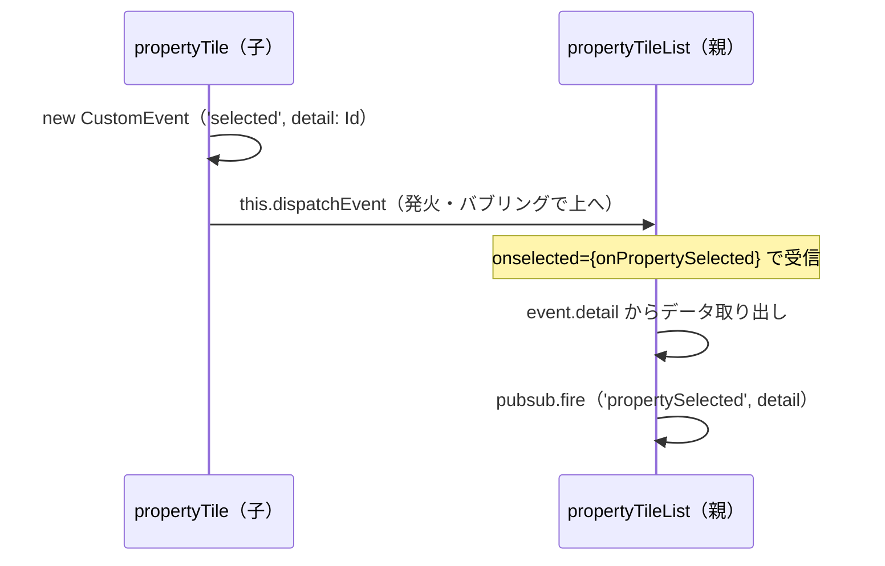
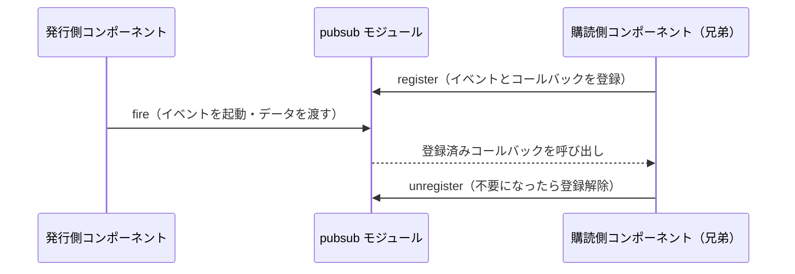
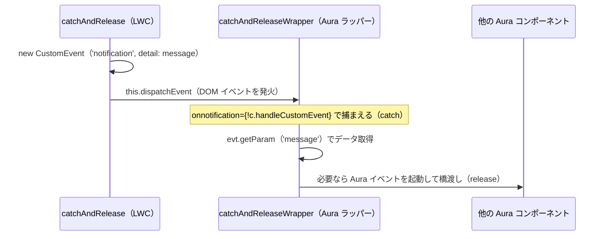

# イベントとの通信

## 学習の目的

この単元を完了すると、次のことができるようになります。

- Aura コンポーネントのイベントモデルが Lightning Web コンポーネントでどのように変わるかを説明する。
- Lightning Web コンポーネントから Aura コンポーネントにイベントを送信する。

> [!ポイント] この単元のゴール
>
> Aura の独自イベントモデル（コンポーネントイベント／アプリケーションイベント）が、LWC では **Web 標準の DOM イベント** と **pub-sub パターン** に置き換わる、という対応関係を頭に入れることがゴールです。`event.fire()` が `this.dispatchEvent()` に、`aura:handler` が `on` プレフィックスの宣言型ハンドラーに、という対応を覚えれば試験でも実務でも迷いません。

---

## イベントが重要な理由

コンポーネント間で通信が行われるとき、本当のアプリケーションの魔法が起こります。通信にイベントを使うのは Web 標準であり、Aura・LWC のどちらでもイベントは通信の中核です。

> [!用語] イベント（Event）/ DOM イベント（DOM Event）
>
> **イベント** は、あるコンポーネントで「何かが起きた」ことを他のコンポーネントに知らせる仕組み。ボタンを押した、項目を選択したといった出来事を「発火」し、「リスンしている」別のコンポーネントが受け取って処理します。コンポーネントを疎結合に保ったまま連携させる基本手段です。**DOM イベント** は DOM（ブラウザーが HTML をツリー構造として扱う仕組み）上で発生・伝播する Web 標準のイベントで、`click` や `change` も含まれます。LWC は独自モデルを持たず、この Web 標準の DOM イベントをそのまま使います。

> [!例] イベントを「呼び鈴」にたとえる
>
> 子コンポーネントを「玄関先の訪問者」、親を「家の中の人」と考えます。訪問者が **呼び鈴を鳴らす（イベントを発火する）** と、家の中の人が **気づいて対応する（イベントを処理する）**。誰が来たかの情報（`detail`）も一緒に伝わります。コンポーネントは互いの内部を直接いじらず、この「呼び鈴」でやり取りします。

---

## コンポーネントイベントは DOM イベントになる

Aura のコンポーネントイベントを LWC の Web 標準 DOM イベントに移行します。DOM イベントを理解していれば、LWC でも同じ伝達動作をすることがわかります。

> [!用語] コンポーネントイベント / アプリケーションイベント
>
> Aura の 2 種類のイベント。**コンポーネントイベント** は、自分自身か自分を含む（階層的に上位の）コンポーネントだけが処理でき、発火元から親へ上へ伝わります（LWC の DOM イベントのバブリングに似ています）。**アプリケーションイベント** は、階層に関係なくそのイベントに登録したすべてのコンポーネントが受信できるブロードキャスト型で、LWC では pub-sub パターンに置き換わります。

| Aura コンポーネント | Lightning Web コンポーネント | 補足 |
| --- | --- | --- |
| コンポーネントイベント | 標準 DOM イベント（`Event` / `CustomEvent`） | 階層の上位に伝播する点が共通 |
| アプリケーションイベント | pub-sub（publish-subscribe）パターン | `pubsub.js` モジュールで実現 |
| `event.fire()` | `this.dispatchEvent(myEvent)` | イベントを発火する DOM 標準メソッド |
| `<aura:registerEvent>` | （不要） | DOM イベントなので登録タグは要らない |
| `<aura:handler>` / アクション宣言 | `on` プレフィックスの宣言型ハンドラー | 例：`onnotification={handleNotification}` |
| `<aura:method>` | `@api` を付けた JavaScript メソッド | 親から子のメソッドを呼ぶ |

> [!ポイント] まず覚える対応関係
>
> 試験では「Aura の○○は LWC の何にマッピングされるか」が直接問われます。最低限この 3 つは即答できるように：
>
> - **コンポーネントイベント → DOM イベント**
> - **`aura:handler` → `on` プレフィックス**（`onselected` など）
> - **アプリケーションイベント → pub-sub パターン**

---

## イベントの作成とディスパッチ

Aura 専有の `Event` の代わりに、標準 DOM インターフェースの `Event` または `CustomEvent` を使います。一貫したエクスペリエンスのため `CustomEvent` を強く推奨します（フレームワークがブラウザー間の差異にパッチを適用するため、`CustomEvent` を使うと確実にカバーされます）。Internet Explorer は `CustomEvent` をネイティブ非対応ですが、LWC モデルがサポートを追加します。

> [!用語] CustomEvent / detail（ペイロード）
>
> **CustomEvent** は、開発者が自由な名前と任意のデータを付けて発火できる DOM イベント。`new CustomEvent('イベント名', { detail: データ })` の形で作ります。標準の `Event` でもイベントは作れますが、`CustomEvent` はデータ（**detail**）を持たせられ、ブラウザー間の差異も LWC が吸収するため推奨されます。受け取った側は `event.detail` でデータを取り出します（detail は「ペイロード＝荷物の中身」とも呼ばれます）。

LWC には、`<aura:registerEvent>` タグ（イベントを起動できることの登録）に相当するものがありません。標準 DOM イベントのおかげで不要です。Aura の `event.fire()` の代わりに、LWC では `this.dispatchEvent(myEvent)` 標準 DOM メソッドを使います。

> [!用語] dispatchEvent（ディスパッチイベント）
>
> 作成したイベントを「実際に発火する」DOM 標準メソッド。`this.dispatchEvent(イベント)` と書くと、そのコンポーネントを起点にイベントが DOM に流れ出し、上位のコンポーネントへ伝播します。Aura の `event.fire()` に相当します。

`propertyTile` LWC でイベントを作成・ディスパッチする例：

```javascript
export default class PropertyTile extends LightningElement {
    @api property;
    propertySelected() {
        // 'selected' という名前のカスタムイベントを作成し、detail に物件 Id を載せる
        const selectedEvent = new CustomEvent('selected', {
            detail: this.property.Id,
        });
        // 作成したイベントを発火（ディスパッチ）する
        this.dispatchEvent(selectedEvent);
    }
}
```

`CustomEvent()` の第 1 引数はイベント名（`selected`）、第 2 引数はイベント動作を設定するオブジェクトで、ここで `detail`（データペイロード）を設定します。処理コンポーネントはこのデータを読み取れます。この例では `this.property.Id` を渡します。

> [!注意] イベント名は小文字で
>
> DOM イベント名は **すべて小文字** にし、大文字やアンダースコアを使いません（`selected`、`propertychange` など）。HTML テンプレート側の `on` ハンドラー（`onselected` など）が小文字で解決されるためです。`mySelectedEvent` のようなキャメルケースにすると宣言型ハンドラーが結びつかず動作しません。

> [!用語] @api（エーピーアイ・デコレーター）
>
> LWC で、プロパティやメソッドを**コンポーネントの外（親や利用側）に公開する**デコレーター。例の `@api property;` は「`property` を親から渡してもらえる公開プロパティにする」という意味です。Aura の `aura:attribute` の公開や `aura:method` に相当します。

---

## イベントの処理

Aura ではマークアップで `<aura:handler>` タグを使うか、別のコンポーネントを参照するときにハンドラーアクションを宣言します。次の Aura は `c:child` の通知イベントに `handleNotification` ハンドラーを宣言します。

```html
<c:child notification="{!c.handleNotification}"/>
```

LWC では類似の宣言型ハンドラーを使い、イベント名に `on` プレフィックスを付けます。

```html
<c-child onnotification={handleNotification}></c-child>
```

> [!用語] 宣言型ハンドラー（Declarative Handler）と on プレフィックス
>
> HTML テンプレートで、子コンポーネントのタグに直接「このイベントが来たらこの関数で処理する」と書く方法。イベント名の先頭に **`on`** を付けます（`notification` → `onnotification`、`selected` → `onselected`）。Aura の `<aura:handler>` や `{!c.handleNotification}` のアクション宣言に相当します。

> [!例] 名前の付け替えルール
>
> 発火するイベント名 → ハンドラー属性名 の変換は、先頭に `on` を足すだけです。
>
> | 発火するイベント名 | テンプレートのハンドラー属性 |
> | --- | --- |
> | `selected` | `onselected` |
> | `notification` | `onnotification` |
> | `propertyview` | `onpropertyview` |

`handleNotification` 関数は JavaScript ファイルで定義します。なお、JavaScript で `addEventListener()` 標準メソッドを使ってプログラムでハンドラーを設定することもできます。

> [!注意] 宣言型とプログラム的、2 通りのハンドラー設定
>
> ハンドラー設定は 2 つあります。テンプレートに `onxxx={...}` と書く **宣言型** が基本で読みやすいですが、JavaScript 側で `addEventListener('xxx', handler)` と書く **プログラム的** な設定も使えます。どちらも結果は同じです。

DreamHouse では、`propertyTile` が発火する `selected` イベントを `propertyTileList` が HTML で処理します。

```html
<template for:each={properties} for:item="property">
    <c-property-tile property={property} key={property.Id} onselected={onPropertySelected}></c-property-tile>
</template>
```

`onselected={onPropertySelected}` で `on` プレフィックス付きの宣言型ハンドラーを設定しています。`onPropertySelected` は `propertyTileList.js` で定義します。

```javascript
onPropertySelected(event) {
    // pub-sub パターンで 'propertySelected' イベントを発火し、受け取った detail を渡す
    pubsub.fire('propertySelected', event.detail);
}
```

`selected` 起動時に `detail` が `this.property.Id` に設定されていました。ハンドラーは `event.detail` でイベントデータをアンパックし、プロパティ ID を取得します。次にアプリケーションイベントと `pubsub.fire()` を説明します。

> [!例] イベントが流れる全体像



> [!用語] バブリング（伝播）
>
> 発火したイベントが、発生元から DOM ツリーの**上位（親、その親…）へ順に伝わる**動きを「バブリング（泡が上に昇るイメージ）」または「伝播」と呼びます。LWC の DOM イベントはこの上向きの伝播を行うため、親が子のイベントを受け取れます。

---

## アプリケーションイベントは Publish-Subscribe パターンになる

Aura のアプリケーションイベントを LWC の pub-sub（publish-subscribe）パターンに移行します。あるコンポーネントがイベントを公開し、登録した他のコンポーネントがそれを受信・処理します。登録しているすべてのコンポーネントが受信します。

> [!用語] pub-sub（publish-subscribe：パブサブ）パターン
>
> 「**発行（publish）** する側」と「**購読（subscribe）** する側」を仲介役で結ぶ設計パターン。発行側は誰が聞いているか知らずに発行し、購読登録したすべてのコンポーネントが受け取ります。階層でつながっていない **兄弟コンポーネント同士** の通信に向き、Aura のアプリケーションイベントの代替です。

標準 DOM イベントは階層の上位にのみ伝播するため、まず DOM イベントを選ぶと動作が予測しやすくなります。アプリケーションイベント（pub-sub）はどのコンポーネントも処理できるため、複雑なアプリでは予期しない結合を生み、保守しにくくなることがあります。ただし、Lightning ページや Lightning アプリケーションビルダーで使う関連しない兄弟コンポーネント同士の通信など、pub-sub が適する場面もあります。

> [!注意] まずは DOM イベントを優先する
>
> どんな場面でも **第 1 選択は標準 DOM イベント**。階層を上に伝わるだけなので動作が予測しやすく、結合をゆるく保てます。pub-sub は「親子でつながっていない兄弟同士で通信する」など、DOM イベントでは届かないときの**次善の手段**。多用すると依存関係が見えにくくなり保守が難しくなります。

DreamHouse では `pubsub.js` モジュールを使います（自由にコピーして使用可）。pubsub モジュールは 3 つのメソッドをエクスポートします。

| メソッド | 役割 |
| --- | --- |
| `register` | イベントのコールバックを **登録** します。 |
| `unregister` | イベントのコールバックを **登録解除** します。 |
| `fire` | イベントをリスナーに対して **起動** します。 |

> [!ポイント] pubsub の 3 メソッドは暗記
>
> `pubsub.js` がエクスポートする **`register` / `unregister` / `fire`** と役割（登録・登録解除・起動）はセットで覚えましょう。購読を始めるとき `register`、不要になったら `unregister`、発行するとき `fire` の流れです。



---

## 囲んでいる Aura コンポーネントへのイベントの送信

LWC は DOM イベントをディスパッチします。囲んでいる LWC と同様に、囲んでいる Aura コンポーネントもこれらのイベントをリスン・キャプチャ・処理でき、必要なら Aura イベントを起動して他の Aura コンポーネントやアプリケーションコンテナと通信できます。これは、Aura ではサポートされるが LWC では現在サポートされないイベントやインターフェースを使う場合に役立ちます。

> [!例] 「catch and release（捕まえて放す）」という考え方
>
> LWC が DOM イベントを発火すると、それを囲む Aura コンポーネントが **捕まえて（catch）**、必要なら Aura イベントとして **放つ（release）** ことができます。これで、まだ LWC では使えない Aura 固有の機能を、Aura ラッパーを橋渡しに利用できます。サンプル名 `catchAndRelease` はこの動きを表します。

カスタム `notification` イベントを起動する LWC：

```javascript
// catchAndRelease.js
import { LightningElement } from 'lwc';
export default class CatchAndRelease extends LightningElement {
    /**
     * Handler for 'Fire My Toast' button.
     * @param {Event} evt click event.
     */
    handleFireMyToast(evt) {
        const eventName = 'notification';
        const event = new CustomEvent(eventName, {
            detail: { message: 'See you on the other side.' }
        });
        this.dispatchEvent(event);
    }
}
```

囲んでいる Aura ラッパーがカスタムイベントにハンドラーを追加します。`onnotification` が `on` プレフィックス付きのイベント名と一致し、`notification` イベントを処理します。

```html
<!-- catchAndReleaseWrapper.cmp -->
<aura:component implements="force:appHostable">
    <c:catchAndRelease onnotification="{!c.handleCustomEvent}"/>
</aura:component>
```

> [!注意] メモ
>
> `onnotification` ハンドラーは、DOM イベントがバブルする最初の Aura コンポーネントでのみ指定できます。

ラッパーのコントローラーの `handleCustomEvent` 関数がイベントを処理します。

```javascript
// catchAndReleaseWrapperController.js
({
    handleCustomEvent: function(cmp, evt) {
        // Get details from the DOM event fired by the Lightning web component
        var msg = evt.getParam('message') || '';
    }
})
```

LWC がディスパッチした通知イベントは `detail: { message: 'See you on the other side.' }` を設定し、Aura 側は `evt.getParam('message')` でデータにアクセスします。

> [!ポイント] detail の受け取り方が Aura と LWC で違う
>
> 同じ `detail` でも受け取り方の文法が異なります。
>
> - **LWC 側**：`event.detail`（プロパティとして直接アクセス）
> - **Aura 側**：`evt.getParam('message')`（`getParam()` メソッドでキー指定）
>
> LWC が発火したイベントを Aura ラッパーが受けるこのパターンでは、Aura 側は `getParam()` で取り出します。

イベントは自由に処理でき、必要なら新しい Aura イベントを起動して他の Aura コンポーネントと通信できます。



---

## リソース

- Lightning Aura コンポーネント開発者ガイド: イベントとの通信
- Lightning Web コンポーネント開発者ガイド: イベントの移行

---

## まとめ（補足トピック）

さらに学ぶ一番の方法はコードで試すことです。次のステップのアイデア：

- DreamHouse アプリケーションコードを調べ、コンポーネントの連携を確認する。
- GitHub の lwc-recipes リポジトリで、一般的なユースケース向けのコードサンプルを参照する。
- Sample Gallery（サンプルギャラリー）のサンプルアプリケーションを参照する。

### コンポーネントのテスト

- Aura では **Lightning Testing Service** でコンポーネントをテストします。
- LWC では単体テストに **Jest** を使います。Jest で全テストケースを賄えなければ、残りは Lightning Testing Service でテストします（「Test Lightning Web Components」参照）。

> [!用語] Jest（ジェスト）
>
> JavaScript 用の単体テストフレームワーク。LWC のコンポーネントロジックをブラウザーなしで高速にテストできます。Aura の Lightning Testing Service の代わりに、LWC では Jest が標準のテスト手段です。

### Aura メソッドは JavaScript メソッドになる

Aura の `<aura:method>` を、LWC の `@api` デコレーターを付けた JavaScript メソッドに移行します。JavaScript メソッドはコンテインメント階層で下位と通信するために使い、たとえば親が子のメソッドをコールします。メソッドはコンポーネントの API の一部です（詳細は「Call Methods on Child Components」参照）。

> [!ポイント] 通信の「向き」で使い分ける
>
> - **子 → 親（上向き）**：イベント（`dispatchEvent`）を使う。
> - **親 → 子（下向き）**：子の `@api` メソッドを親から呼ぶ。
>
> イベントは上に伝わるもの、`@api` メソッドは親が下の子を直接操作するもの、と方向で整理すると混乱しません。

### インターフェースの移行

Aura のインターフェースは主にマーカーインターフェースとして使われ、コンポーネントの特定の使用方法を有効にします。LWC では、使用方法を設定ファイルや `@api` デコレーターで定義します（詳細は「Migrate Interfaces」参照）。

> [!用語] マーカーインターフェース（Marker Interface）
>
> 属性・イベント・メソッドを持たない**空のインターフェース**。中身はないが「このコンポーネントはこういう使い方ができる」という目印として機能します。たとえば `force:appHostable` を実装すると「Lightning アプリケーションのタブとして表示できる」使い方が有効になります。LWC では設定ファイル（`*.js-meta.xml`）や `@api` で表現します。

### アクセス制御の移行

Aura では `access` システム属性でバンドルのリソース（コンポーネントや属性など）へのアクセスを管理します。LWC ではメカニズムが異なり、JavaScript プロパティデコレーターと設定ファイルで定義します（詳細は「Migrate Access Controls」参照）。

---

## 試験対策：押さえておきたい追加ポイント

> [!ポイント] Aura → LWC 対応の総まとめ表
>
> | 観点 | Aura コンポーネント | LWC |
> | --- | --- | --- |
> | コンポーネント間イベント | コンポーネントイベント | DOM イベント（`Event` / `CustomEvent`） |
> | ブロードキャストイベント | アプリケーションイベント | pub-sub パターン（`register`/`unregister`/`fire`） |
> | イベント発火 | `event.fire()` | `this.dispatchEvent(evt)` |
> | イベント登録宣言 | `<aura:registerEvent>` | 不要 |
> | イベント処理（宣言） | `<aura:handler>` / アクション宣言 | `on` プレフィックス（`onselected` 等） |
> | データの取り出し | `evt.getParam('key')` | `event.detail` |
> | 子のメソッド呼び出し | `<aura:method>` | `@api` メソッド |
> | インターフェース | マーカーインターフェース | 設定ファイル / `@api` |
> | アクセス制御 | `access` システム属性 | デコレーター / 設定ファイル |

> [!ポイント] 試験で間違えやすい点
>
> - イベント名は **小文字**、ハンドラーは先頭に **`on`**（`selected` → `onselected`）。キャメルケースのイベント名は宣言型ハンドラーで拾えない。
> - データの受け渡しは `CustomEvent` の **`detail`**。LWC 側は `event.detail`、Aura ラッパー側は `evt.getParam()`。
> - **DOM イベントが第 1 選択**。pub-sub は兄弟コンポーネント通信などに限定。
> - LWC には `<aura:registerEvent>` に **相当するタグがない**（DOM イベントなので登録不要）。

> [!まとめ] この単元の要点
>
> - コンポーネント間の連携は **イベント** が中核。LWC は独自モデルを捨て **Web 標準の DOM イベント** を使う。
> - Aura のコンポーネントイベント → **DOM イベント**、アプリケーションイベント → **pub-sub パターン**。
> - 発火は `this.dispatchEvent(new CustomEvent('名前', { detail: データ }))`、処理は `on` プレフィックスの宣言型ハンドラー。
> - 受け取ったデータは LWC では `event.detail`、Aura ラッパーでは `evt.getParam()` で取り出す。
> - 囲んでいる **Aura が LWC の DOM イベントを捕まえて** 処理し、必要なら Aura イベントに橋渡しできる（catch and release）。
> - `aura:method` → `@api` メソッド、マーカーインターフェース → 設定ファイル / `@api`、`access` → デコレーター / 設定ファイル、と移行する。

---

## テスト

この単元を完了するには、テストのすべての質問に正しく解答する必要があります。

+100 ポイント

**問 1. Aura のコンポーネントイベントは Lightning Web コンポーネントの何にマッピングされますか?**

- A. JavaScript メソッド
- B. DOM イベント
- C. API コール
- D. Apex イベント

**問 2. Aura ハンドラーは Lightning Web コンポーネントにどのようなプレフィックスを追加しますか?**

- A. aura
- B. in
- C. on
- D. gotcha
