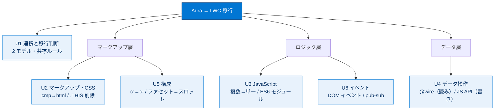

# Aura 開発者向け Lightning Web コンポーネント 総まとめ

このトピックでは、すでに Aura コンポーネントを理解している開発者が、新しい Lightning Web コンポーネント（LWC）モデルへ移行するための知識を体系的に学びました。2 つのプログラミングモデルの違いと共存ルールから始まり、マークアップ・CSS・JavaScript・Salesforce データ操作・コンポーネント構成・イベント通信という各レイヤーで「Aura の何が LWC の何に対応するか」を対応づけて押さえます。一貫したテーマは「LWC は Salesforce 独自の仕組みを捨て、**Web 標準（ES6・DOM・Web コンポーネント）** に寄せる」という方向性です。

---

## 全体像：Aura → LWC 移行マップ

次の図は、このトピックの 6 ユニットが「コンポーネントを構成する各要素」とどう対応するかを 1 枚で俯瞰したものです。

---

## ユニット横断 早見表

| ユニット | 学んだこと | キーワード | 一言要点 |
| --- | --- | --- | --- |
| **01 連携と移行判断** | 2 つのモデルの関係・LWC の利点・共存ルール・移行タイミング | Aura / LWC / Web 標準 / 共存ルール | Aura に LWC は OK、**LWC に Aura は NG**（一方向） |
| **02 マークアップと CSS の移行** | `.cmp`/`.css` → `.html`/`.js`/`.css` への変換 | `lwc:if` / `for:each` / `@api` / `.THIS` / shadow DOM | 属性→JSプロパティ、`{!v.x}`→`{x}`、`.THIS` は削除 |
| **03 JavaScript の移行** | 複数 JS ファイル → 単一 ES6 モジュール、コード共有 | ES6 モジュール / `import` / `dispatchEvent` | 独自オブジェクトリテラル → 標準 ES6 へ |
| **04 Salesforce データの操作** | 読み書きの手段の対応、Apex の呼び方 | `@wire` / `createRecord` / LDS / `@AuraEnabled` | **読みは `@wire`、書きは JS API** |
| **05 コンポーネントの構成** | 構成用語・参照構文・スロット・データバインド | 所有者/親/子 / `c-` / `<slot>` / 一方向バインド | LWC は **一方向バインド**・自己終了タグ不可 |
| **06 イベントとの通信** | イベントモデルの移行・catch and release | DOM イベント / `CustomEvent` / pub-sub / `on` プレフィックス | 子→親はイベント、親→子は `@api` メソッド |

---

## 🎯 試験頻出ポイント

> [!ポイント] このトピックで狙われやすい論点（暗記推奨）
>
> - **共存の一方向ルール**：Aura に LWC は含められる ✅ ／ LWC に Aura は含められない ❌。外側が LWC なら配下はすべて LWC。
> - **基本コンポーネントは両モデルで使える**（ただし構文が違う。Aura は `lightning:formattedNumber`、LWC は `lightning-formatted-number`）。
> - **マークアップ対応**：`<aura:attribute>`→JS プロパティ（`@api`）、`{!v.x}`→`{x}`、`<aura:if>`→`lwc:if`、`<aura:iteration>`→`for:each`（**`key` 必須**）、`init`→`connectedCallback()`。
> - **LWC の JS ファイルの形式は ES6 モジュール**。Aura の 3 ファイル（コントローラー・ヘルパー・レンダラー）は LWC では単一 `.js`。
> - **データは読み＝`@wire`、書き＝`createRecord`/`updateRecord`/`deleteRecord`**。書き込みに `@wire` は使わない。
> - **Apex 公開条件**：`static` ＋（`public` or `global`）＋ `@AuraEnabled`。読み取り専用は `cacheable=true` を付けて `@wire` 可。
> - **データバインドは LWC が一方向**（Aura は双方向）。子の変更は親へ**イベント**で通知。
> - **イベント**：コンポーネントイベント→DOM イベント、アプリケーションイベント→pub-sub。発火は `dispatchEvent`、処理は **`on` プレフィックス**、データは `detail`。
> - **自己終了タグ**：LWC は不可（`<c-foo></c-foo>`）、Aura は可（`<c:foo />`）。
> - **ファセット（Aura）= スロット `<slot>`（LWC）**。
> - **CSS は `.THIS` を削除**するだけ。shadow DOM が自動でスコープを閉じ、LWC のスタイルは自分自身にのみ影響。

---

## 📖 用語早見表

| 用語 | ひとことの意味 |
| --- | --- |
| **Aura コンポーネント** | 従来の Salesforce 独自フレームワークで作る UI コンポーネント |
| **LWC（Lightning Web Component）** | W3C の Web コンポーネント標準ベースの新しい UI コンポーネント |
| **Web 標準 / Web コンポーネント** | ブラウザー共通の技術仕様。カスタム要素・HTML テンプレート・Shadow DOM など |
| **ES6 モジュール** | `import`/`export` で機能を共有する標準 JavaScript のモジュール仕組み |
| **`@api`** | プロパティ／メソッドを親（外部）に公開する LWC のデコレーター |
| **getter** | `get 名()` で定義し、HTML から値のように参照できる計算メソッド |
| **`connectedCallback()`** | コンポーネントが DOM に挿入されたときに呼ばれるライフサイクルフック |
| **shadow DOM** | コンポーネント内部の要素・スタイルを外から隠してカプセル化する仕組み |
| **SLDS** | Salesforce 公式の CSS デザインフレームワーク（`slds-` クラス） |
| **LDS（Lightning データサービス）** | Apex なしでレコードを読み書き・キャッシュ共有する仕組み |
| **`@wire`（ワイヤーサービス）** | データを宣言的に読み取るリアクティブな仕組み（読み取り専用） |
| **`createRecord` 等** | レコードを作成・更新・削除する JavaScript API（書き込み用） |
| **`@AuraEnabled`** | Apex メソッドを Aura・LWC から呼べるようにするアノテーション |
| **`cacheable=true`** | 読み取り専用 Apex の結果をキャッシュ可能にする宣言（`@wire` 可の条件） |
| **CustomEvent / detail** | 任意のデータ（detail）を載せて発火できる Web 標準の DOM イベント |
| **pub-sub パターン** | 発行・購読を仲介役で結ぶ、兄弟コンポーネント通信向けの設計 |
| **スロット（`<slot>`）** | 親から渡されたマークアップを差し込むプレースホルダー（Aura のファセット相当） |
| **データバインド** | コンポーネント間でプロパティ値を結びつけ連動させる仕組み |

---

> [!豆知識] 「Lightning」という名前には 2 つの意味が混在している
>
> Salesforce の「Lightning」は、UI フレームワーク（Aura/LWC の総称＝Lightning コンポーネント）と、ユーザー体験全体（Lightning Experience）の両方を指す紛らわしい言葉です。試験でも「Lightning コンポーネント」が Aura と LWC の総称なのか、特定のモデルなのかは文脈で判断する必要があります。「Lightning Web コンポーネント」自体も、開発の枠組み（モデル）と実際に作った部品の両方を指すため、設問では「どちらの意味か」を意識して読むのがコツです。

> [!豆知識] 移行は「全部 LWC」でなくてよい — 共存が前提に設計されている
>
> Salesforce が Aura と LWC の共存を許したのは、既存の Aura 資産を捨てさせないためです。ES6 モジュールでロジックを共有すれば Aura からも LWC からも同じコードを呼べ、Aura ラッパーで LWC を囲めば（catch and release）LWC にまだない Aura 固有機能も使えます。「一気に全移行」ではなく「価値の高いところから段階的に」進められるよう、移行戦略そのものが製品設計に組み込まれているのです。

> [!豆知識] LWC が速い本当の理由は「フレームワークが薄い」こと
>
> LWC のパフォーマンス上の利点は、HTML テンプレートやカスタム要素、イベントといった処理を**ブラウザーがネイティブに実行する**点にあります。Aura は当時の Web 標準が未成熟だったため、これらの機能をフレームワーク（JavaScript）側で再現する必要があり、その分のオーバーヘッドがありました。LWC は「ブラウザーができることはブラウザーに任せる」設計で、フレームワークが担う部分を薄くしたことで軽量・高速になっています。

---

## ✅ 理解度セルフチェック

> [!まとめ] このトピックを思い出せるか確認しよう（答えは各設問の下）
>
> **Q1.** Aura コンポーネントの中に LWC を含めることはできる？ 逆（LWC の中に Aura）はできる？
> **A1.** Aura に LWC は **できる ✅**。LWC に Aura は **できない ❌**（一方向ルール）。
>
> **Q2.** Aura の `<aura:attribute>` は LWC では何になる？ 外部に公開したいときは何を付ける？
> **A2.** **JavaScript プロパティ**になる。公開するには **`@api`** デコレーターを付ける。
>
> **Q3.** LWC でデータを **読み取る**ときと **書き込む**ときに使う手段は、それぞれ何？
> **A3.** 読み取りは **`@wire`（ワイヤーサービス）**、書き込みは **`createRecord` / `updateRecord` / `deleteRecord`（JavaScript API）**。書き込みに `@wire` は使わない。
>
> **Q4.** 穴埋め：LWC のデータバインドは（　　）方向で、子から親へ値を返したいときは（　　）を使う。
> **A4.** **一**方向 ／ **イベント**（`dispatchEvent`）。
>
> **Q5.** Aura のコンポーネントイベントとアプリケーションイベントは、LWC では何にマッピングされる？
> **A5.** コンポーネントイベント → **DOM イベント**（`Event`/`CustomEvent`）、アプリケーションイベント → **pub-sub パターン**。
>
> **Q6.** Apex メソッドを LWC に公開する 3 条件は？ `@wire` で呼べる追加条件は？
> **A6.** **`static`** ＋（**`public` または `global`**）＋ **`@AuraEnabled`**。`@wire` で呼ぶには読み取り専用にして **`cacheable=true`** を付ける。
