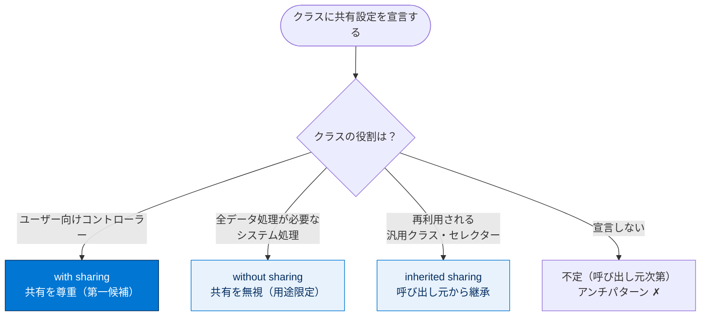
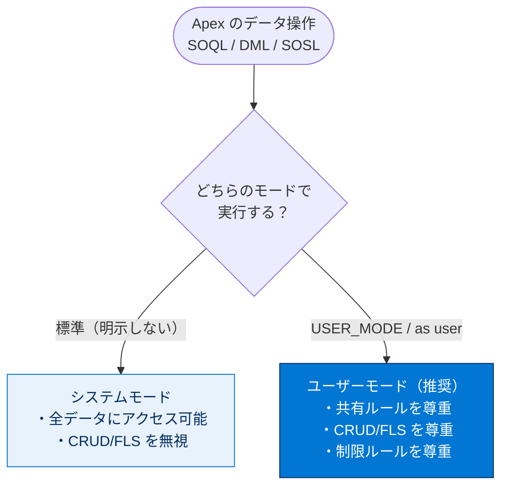
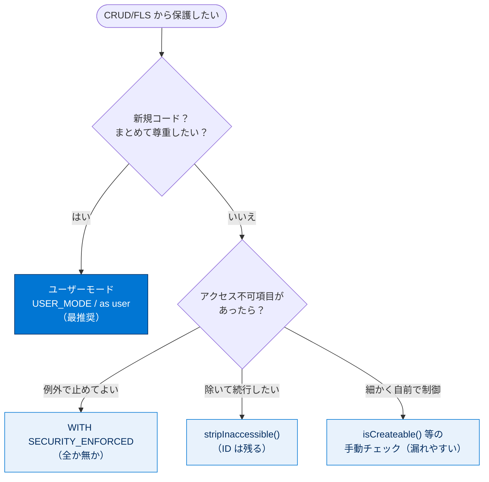
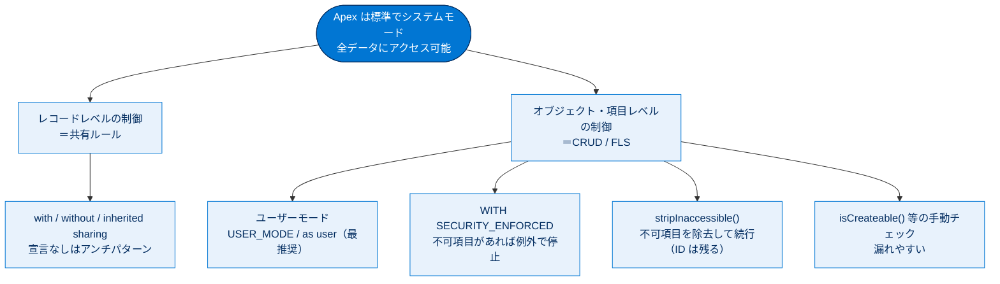

# セキュアな Apex コントローラーの作成

## 学習の目的

この単元を完了すると、次のことができるようになります。

- Apex において共有ルールがなぜ重要なのかを説明する。
- 共有ルール（Sharing Rules）を適用（強制）する。
- 作成・参照・更新・削除（CRUD）および項目レベルセキュリティ（FLS）の違反から保護する方法を説明する。

> [!ポイント] この単元のゴール
>
> Apex は**標準でシステムモードで動き、組織内のすべてのデータを読み書きできてしまう**。だからこそ開発者が意図的に「ユーザーの権限を尊重させる」必要がある。`with sharing` / `without sharing` / `inherited sharing`、ユーザーモード（`USER_MODE` / `as user`）、CRUD/FLS チェックメソッド、`stripInaccessible()` の4本柱を押さえれば試験対策は十分。

---

## Apex のセキュリティと共有

**Apex のコードは標準でシステムモードで実行され、組織内のすべてのデータを読み取り・更新できる**。そのため開発者は自分の責任で、共有ルールを適用し、オブジェクト・項目の権限を設定し、CRUD/FLS 違反から保護しなければならない。どのコードをシステムモードで、どのコードをユーザーモードで実行するかの判断も開発者に委ねられる。

> [!用語] システムモード / ユーザーモード
>
> - **システムモード**：実行中のユーザーの権限を無視してすべてのデータにアクセスできる状態。オブジェクト権限・FLS・共有ルールが適用されない。Apex の標準動作。
> - **ユーザーモード**：現在のユーザーの権限・FLS・共有ルール・制限ルールをすべて尊重する状態（Spring '23 導入）。`WITH USER_MODE`（SOQL）や `as user` / `AccessLevel.USER_MODE`（DML）で明示的に有効化する。

> [!例] システムモードの怖さ
>
> 給与項目 `Salary__c` を FLS で一般社員に非表示にしていても、Apex がシステムモードで `SELECT Salary__c` を実行し結果を表示すると、**FLS が無視され給与が見えてしまう**。

---

## 共有ルールの適用

Apex は通常システムコンテキストで実行され、オブジェクト権限・FLS・共有ルールが適用されない（隠れた項目・オブジェクトでコードが止まらないための仕様）。トリガーや Web サービスなど全データアクセスが必要なシステム処理ではこれが正しい動作だが、ユーザー向けクラスでは「現在のユーザーの共有ルールを強制する」よう指定できる。

> [!用語] 共有ルール（Sharing Rules）
>
> 「誰がどのレコードを参照・編集できるか」を決めるレコードレベルのアクセス制御。組織の共有設定（OWD）をベースに条件付きでアクセスを広げる。Apex は標準でこれを無視するため、クラス単位で「強制する／しない」を明示宣言する。

| キーワード | 意味 | 動作 |
| --- | --- | --- |
| `with sharing` | 共有ルールを**強制する** | 現在のユーザーの共有ルールを適用して実行 |
| `without sharing` | 共有ルールを**強制しない** | 共有ルールを無視（システムコンテキスト相当） |
| `inherited sharing` | **呼び出し元から継承** | 呼び出したクラスの共有モードで実行 |

> [!注意] 宣言を省略すると「不定」になる
>
> 共有宣言を**まったく書かない**と適用は「不定（呼び出し元次第）」になり、セキュリティ上のアンチパターン。意図が継承なら `inherited sharing` を**明示**する。なお `executeAnonymous`（匿名ブロック）と Chatter in Apex は例外で、**常に現在のユーザーの完全な権限**で実行される。

---

### With Sharing

`with sharing` は、そのクラスに現在のユーザーの共有ルールを強制する（明示的にオプトインが必要）。

```apex
// 現在のユーザーの共有ルールを尊重するクラス
public with sharing class AccountController {
    public List<Account> getMyAccounts() {
        // ユーザーが参照権を持つ取引先だけが返る
        return [SELECT Id, Name FROM Account];
    }
}
```

### Without Sharing

`without sharing` は、現在のユーザーの共有ルールを強制しないことを保証する。`with sharing` クラスから呼ばれたときに強制をオフにできる。

```apex
// 共有ルールを無視し、全レコードにアクセスできるクラス（用途を限定して使う）
public without sharing class SystemLevelService {
    public Integer countAllCases() {
        // 共有設定に関わらず全ケース件数を返す
        return [SELECT COUNT() FROM Case];
    }
}
```

### Inherited Sharing

共有宣言を明示しないクラスは適用が呼び出し元依存の「不定」になり、アンチパターン。**`inherited sharing` を明示的に宣言**すると意図が明確になり、宣言漏れの曖昧さやセキュリティ解析ツールの誤検知を避けられ、AgentExchange セキュリティレビューにも合格できる。`inherited sharing` クラスは次のエントリポイントから使われたとき **`with sharing` として実行**される。

- Aura コンポーネントのコントローラー
- Visualforce のコントローラー
- Apex REST サービス
- その他、Apex トランザクションへのあらゆるエントリポイント

```apex
// 呼び出し元の共有モードを継承する。エントリポイントでは with sharing 相当で動く
public inherited sharing class ReusableSelector {
    public List<Contact> getContacts() {
        return [SELECT Id, LastName FROM Contact];
    }
}
```

> [!ポイント] 3キーワードの使い分け（頻出）
>
> - **`with sharing`**：ユーザー向けコントローラー。共有を尊重したいとき（第一候補）。
> - **`without sharing`**：全データアクセスが必要なシステム処理。用途を限定して慎重に。
> - **`inherited sharing`**：再利用される汎用クラスやセレクター。呼び出し元の文脈に従わせたいとき。
> - **空白（宣言なし）はアンチパターン**。意図を明示する。

共有キーワードの選択は、クラスの役割で決まる。



> [!注意] 共有設定は「定義されたクラス」のものが効く
>
> メソッドの共有設定は、**呼び出し元ではなくメソッドが定義されているクラス**の設定が適用される。`with sharing` クラスで定義したメソッドを `without sharing` クラスから呼ぶと、そのメソッドは共有ルールを強制して実行される。また **`Pricebook2` を使う SOQL/SOSL は `with sharing` を無視**し、全価格表レコードを返す。

共有ルールを強制すると、SOQL/SOSL は**返る行数が少なくなる**ことがあり、DML は権限不足で**失敗する**ことがある（例：アクセス権のない外部キー値の指定）。

---

## オブジェクト権限と項目権限の適用

### ユーザーモードでの操作

Apex のデータ操作（SOQL・DML・SOSL）は標準でシステムモードで実行され、全オブジェクト・項目に完全な CRUD アクセスを持つ。Spring '23 で、実行モードを開発者が選べるようになった。**ユーザーモードで実行すると、共有ルール・CRUD・FLS が尊重・強制される**。

> [!用語] CRUD と FLS
>
> - **CRUD（Create / Read / Update / Delete）**：オブジェクト単位の権限。
> - **FLS（Field-Level Security）**：項目単位の権限（例：`Amount` を参照・編集できるか）。
>
> ユーザーモードは両方に加え共有ルール・制限ルールも自動で尊重する。



#### ユーザーモードでレコードを参照する

SOQL に **`WITH USER_MODE`** を使うと、ユーザーがアクセスできるレコードだけが取得される（クエリ完了後はシステムモードに戻る）。

```sql
List<Account> acc = [SELECT Id FROM Account WITH USER_MODE];
```

#### ユーザーモードでレコードを挿入する

挿入は、ユーザーが**作成権限**と対象項目（例：`Opportunity.Amount`）への**編集権限（FLS）**の両方を持つ場合のみ実行される。

```apex
Opportunity o = new Opportunity();
o.Amount = 500;
insert as user o;   // as user で FLS / CRUD を尊重して挿入
```

```apex
Opportunity o = new Opportunity();
o.Amount = 500;
database.insert(o, AccessLevel.USER_MODE);  // AccessLevel でモードを明示
```

#### ユーザーモードでレコードを更新する

```apex
Account a = [SELECT Id, Name, Website FROM Account WHERE Id = :recordId];
a.Website = 'https://example.com';
update as user a;   // as user で更新権限・FLS を尊重
```

#### ユーザーモードで SOSL を実行する

```apex
String querystring = 'FIND :searchString IN ALL FIELDS RETURNING ';
queryString += 'Lead(Id, Salutation, FirstName, LastName, Name, Email, Company, Phone),';
queryString += 'Contact(Id, Salutation, FirstName, LastName, Name, Email, Phone),';
queryString += 'Account(Id, Name, Phone)';
List<List<SObject>> searchResults = search.query(queryString, AccessLevel.USER_MODE);
```

> [!ポイント] ユーザーモードが最推奨
>
> **ユーザーモードは共有・CRUD・FLS 違反を避ける最推奨手段**。`WITH USER_MODE`（SOQL）、`as user`（DML）、`AccessLevel.USER_MODE`（`database` メソッド・SOSL）の3つの書き方をセットで覚える。手動チェックより簡潔で漏れがない。

---

## WITH SECURITY_ENFORCED を使う

`WITH SECURITY_ENFORCED` を SOQL の `SELECT` に組み込むと、**項目レベル・オブジェクトレベルのセキュリティを自動検証**できる（サブクエリやリレーションにも適用）。

> [!手順] WITH SECURITY_ENFORCED の配置ルール
>
> 1. `WHERE` 句があればその**後ろ**、なければ `FROM` 句の**後ろ**に挿入する。
> 2. `ORDER BY`・`LIMIT`・`OFFSET`・集計関数の句よりも**前**に置く。

```sql
SELECT Id, (SELECT LastName FROM Contacts)
FROM Account
WHERE Name like 'Acme'
WITH SECURITY_ENFORCED
```

ユーザーが `LastName` への項目アクセス権を持つ場合に `Id` と `LastName` を返す。注意点:

- ポリモーフィック項目のリレーションのたどりはサポート外（`Owner`・`CreatedBy`・`LastModifiedBy` は例外）。
- `ELSE` 句を含む `TYPEOF` 式はサポート外。
- AgentExchange セキュリティレビューで使う場合は **API バージョン 48.0 以降**。

参照項目・オブジェクトがアクセス不可の場合、`System.QueryException` をスローしてデータを保護する。

> [!注意] SECURITY_ENFORCED は「全か無か」
>
> 1つでもアクセス不可の項目があると**例外をスローしてクエリ全体を失敗**させる。アクセス不可項目だけを除いて続行したい場合は後述の `stripInaccessible()` を使う。この挙動の違いが試験で問われる。

---

## CRUD/FLS チェックメソッドを使う

`Schema.DescribeSObjectResult` や `Schema.DescribeFieldResult` のメソッドを明示的に呼び、**現在のユーザーのアクセス権をコードでチェック**して、権限がある場合のみ DML やクエリを実行する制御もできる。

> [!用語] describe メソッド
>
> オブジェクト・項目のメタ情報を実行時に取得する仕組み。`isAccessible()`（参照可）、`isCreateable()`（作成可）、`isUpdateable()`（更新可）、`isDeletable()`（削除可）で現在のユーザーの権限を判定する。

| メソッド | チェック内容 |
| --- | --- |
| `isCreateable()` | 作成（Create）権限があるか |
| `isAccessible()` | 参照（Read）権限があるか |
| `isUpdateable()` | 更新（Update）権限があるか |
| `isDeletable()` | 削除（Delete）権限があるか |

### isCreateable()

挿入前に、オブジェクトの作成権と項目の編集権の両方を確認する。

```apex
// 商談オブジェクトと Amount 項目の両方に作成権があるか確認
if (!Schema.sObjectType.Opportunity.isCreateable()
    || !Schema.sObjectType.Opportunity.fields.Amount.isCreateable()) {
    ApexPages.addMessage(new ApexPages.Message(ApexPages.Severity.ERROR,
        'Error: Insufficient Access'));
    return null;   // 権限がなければ処理を中断
}
Opportunity o = new Opportunity();
o.Amount = 500;
database.insert(o);
```

### isAccessible()

項目を取得する前に、その項目への参照権を確認する。

```apex
// Opportunity.ExpectedRevenue 項目への参照権があるか確認
if (!Schema.sObjectType.Opportunity.isAccessible()
    || !Schema.sObjectType.Opportunity.fields.ExpectedRevenue.isAccessible()) {
    ApexPages.addMessage(new ApexPages.Message(ApexPages.Severity.ERROR,
        'Error: Insufficient Access'));
    return null;
}
Opportunity[] myList = [SELECT ExpectedRevenue FROM Opportunity LIMIT 1000];
```

### isUpdateable()

更新前に、項目とオブジェクトへの編集権を確認する。

```apex
// SOQL クエリで商談 "o" を取得済みと仮定
if (!Schema.sObjectType.Opportunity.isUpdateable()
    || !Schema.sObjectType.Opportunity.fields.StageName.isUpdateable()) {
    ApexPages.addMessage(new ApexPages.Message(ApexPages.Severity.ERROR,
        'Error: Insufficient Access'));
    return null;
}
o.StageName = 'Closed Won';
update o;
```

### isDeletable()

削除の DML 前に `isDeletable()` を使う。

```apex
if (!Lead.sObjectType.getDescribe().isDeletable()) {
    delete l;
    return null;
}
```

更新・作成・参照と違い、**削除では CRUD チェック（オブジェクトを削除できるか）だけ**を行う。レコードまるごとを削除し項目を削除するわけではないため、FLS チェックは不要。

> [!注意] CRUD/FLS チェックは「手動」で漏れやすい
>
> 手動の `isCreateable()` 等は項目を追加するたびにコード修正が必要で**チェック漏れが起きやすい**。新しいコードでは**ユーザーモード（`USER_MODE` / `as user`）や `WITH SECURITY_ENFORCED`、`stripInaccessible()`** を優先する。

---

## stripInaccessible() を使う

`stripInaccessible` は、**ユーザーがアクセスできない項目・リレーション項目をクエリ／サブクエリの結果から取り除く**。DML 前にアクセス不可項目を除去して例外を回避したり、信頼できないソースからデシリアライズした sObject をサニタイズしたりにも使える。

`Security` クラスと `SObjectAccessDecision` クラス経由でアクセスする。アクセスチェックは指定操作（create・read・update・delete）における現在のユーザーの FLS に基づく。戻り値は**アクセス不可項目を除いた点を除きソースと同一の sObject リスト**で、順序も保たれる。クエリされていない項目は例外なく null になる。

> [!用語] stripInaccessible / SObjectAccessDecision
>
> `Security.stripInaccessible(...)` はレコードからアクセス不可項目を「そぎ落とす」メソッド。戻り値の `SObjectAccessDecision` から `getRecords()` で安全なレコードを取り出す。`WITH SECURITY_ENFORCED` が「例外で止める」のに対し、こちらは「**アクセス不可項目を黙って除いて続行**」できる。

> [!注意] ID 項目は除去されない／AggregateResult はサポート外
>
> DML 実行時の問題を避けるため、**`ID` 項目は決して除去されない**。また `AggregateResult` sObject はサポートされず、ソースが `AggregateResult` 型だと例外がスローされる。

除去された項目は `isSet` で特定する。下例では `social_security_number__c` がアクセス不可のため `isSet` が `false` を返す。

```apex
SObjectAccessDecision securityDecision = Security.stripInaccessible(sourceRecords);
Contact c = securityDecision.getRecords()[0];
System.debug(c.isSet('social_security_number__c')); // "false" と表示される
```

---

## 試験対策：押さえておきたい追加ポイント

CRUD/FLS 違反からの保護手段は、状況に応じて使い分ける。次の判断フローで第一候補を絞り込む。



> [!ポイント] CRUD/FLS を守る5つの手段の比較（頻出）
>
> | 手段 | 仕組み | 特徴 |
> | --- | --- | --- |
> | ユーザーモード（`USER_MODE` / `as user`） | SOQL/DML/SOSL をユーザー権限で実行 | **最推奨**。共有+CRUD+FLS をまとめて尊重 |
> | `WITH SECURITY_ENFORCED` | SOQL で FLS/オブジェクト権限を自動検証 | 1つでも不可なら**例外**で停止 |
> | `stripInaccessible()` | アクセス不可項目を結果から除去 | 例外で止めず**続行**できる。ID は残る |
> | CRUD/FLS チェックメソッド | `isCreateable()` 等を手動で呼ぶ | 細かく制御できるが**漏れやすい** |
> | 共有キーワード | `with` / `without` / `inherited sharing` | **レコードレベル**（共有ルール）の制御 |

> [!ポイント] よく問われる事実
>
> - Apex は**標準でシステムモード**。何もしなければ共有・CRUD・FLS は無視される。
> - `executeAnonymous` は**常に現在のユーザーの完全な権限**で実行される。
> - メソッドの共有設定は「**定義されたクラス**」のものが適用される。
> - `Pricebook2` のクエリは `with sharing` を無視し、全レコードを返す。
> - 削除（delete）は **CRUD チェックのみ**でよい（FLS チェック不要）。
> - 共有句を書かないのはアンチパターン。継承なら `inherited sharing` を明示する。

---

## リソース

- Salesforce ヘルプ：匿名ブロック（Anonymous Blocks）
- Salesforce ヘルプ：データベース操作でのユーザーモードの強制
- Salesforce ヘルプ：WITH SECURITY_ENFORCED を使用した SOQL クエリのフィルタ
- Salesforce ヘルプ：DescribeSObjectResult クラス / DescribeFieldResult クラス
- Salesforce ヘルプ：ユーザーへのデータアクセス権の付与
- Salesforce ヘルプ：with sharing、without sharing、inherited sharing キーワードの使用
- Salesforce ヘルプ：stripInaccessible メソッドによるセキュリティの強制

---

## テスト

この単元を完了するには、テストのすべての質問に正しく解答する必要があります。（+100 ポイント）

**1. Apex クラスにおいて「without sharing」キーワードは何をしますか？**

- A. 現在のユーザーの共有ルールを強制する
- B. 現在のユーザーの共有ルールをバイパス（無視）する
- C. 現在のユーザーに継承共有を指定する
- D. CRUD アクセスを強制する

**2. 開発者はいつ Apex クラスで「with sharing」キーワードを使うべきですか？**

- A. 現在のユーザーの共有ルールをバイパスしたいとき
- B. CRUD アクセスを強制したいとき
- C. 現在のユーザーに継承共有を指定したいとき
- D. DML 関数に共有ルールを強制させたいとき

> [!まとめ] この単元の要点
>
> - Apex は標準で**システムモード**＝全データにアクセスでき、共有・CRUD・FLS は適用されない。だからこそ開発者が明示的に保護する。
> - **共有ルール**：`with sharing` / `without sharing` / `inherited sharing` の3キーワードで制御。空白はアンチパターン。
> - **CRUD/FLS の保護**：最推奨は**ユーザーモード**。ほかに `WITH SECURITY_ENFORCED`（例外で停止）、`stripInaccessible()`（除去して続行）、手動チェックメソッド。
> - 削除は CRUD チェックのみ。`executeAnonymous` は常にユーザー権限。`Pricebook2` は共有を無視。

> [!注意] 日本語環境で受講する場合
>
> この単元は Trailhead の英語教材の翻訳。コードやキーワード（`with sharing`、`WITH USER_MODE` など）は**英語のまま**正確に記述・コピー&ペーストする。日本語訳は理解の補助。

---

## 🎓 この単元のまとめ

この単元では、Apex が標準でシステムモード（全データアクセス）で動くという前提のもと、「共有ルール（レコードレベル）」と「CRUD/FLS（オブジェクト・項目レベル）」の2階層をどう守るかを学びました。

次の図は、Apex のセキュリティを「レコードレベルの共有」と「オブジェクト・項目レベルの CRUD/FLS」の2系統で俯瞰したものです。



> [!まとめ] この単元の要点
>
> - Apex は標準で**システムモード**＝共有・CRUD・FLS を無視するため、開発者が明示的に保護する。
> - **共有ルール（レコードレベル）**は `with sharing` / `without sharing` / `inherited sharing` で制御。宣言なしは「不定」でアンチパターン。
> - **CRUD/FLS（オブジェクト・項目レベル）**の保護は、最推奨が**ユーザーモード**（`USER_MODE` / `as user` / `AccessLevel.USER_MODE`）。
> - `WITH SECURITY_ENFORCED` は**全か無か（例外で停止）**、`stripInaccessible()` は**除去して続行（ID は残る）**と挙動が対照的。
> - 削除は CRUD チェックのみ、`executeAnonymous` は常にユーザー権限、`Pricebook2` は共有を無視。

> [!豆知識] ユーザーモードは Spring '23 の新顔
>
> `WITH USER_MODE` や `as user` は 2023年春（Spring '23）に正式リリースされた比較的新しい構文です。それ以前は `isAccessible()` 等を1項目ずつ手で書くか `WITH SECURITY_ENFORCED` を使うしかなく、チェック漏れの温床でした。「1行足すだけで共有・CRUD・FLS をまとめて尊重できる」のは、長年の開発者の悩みに対する答えだったわけです。
