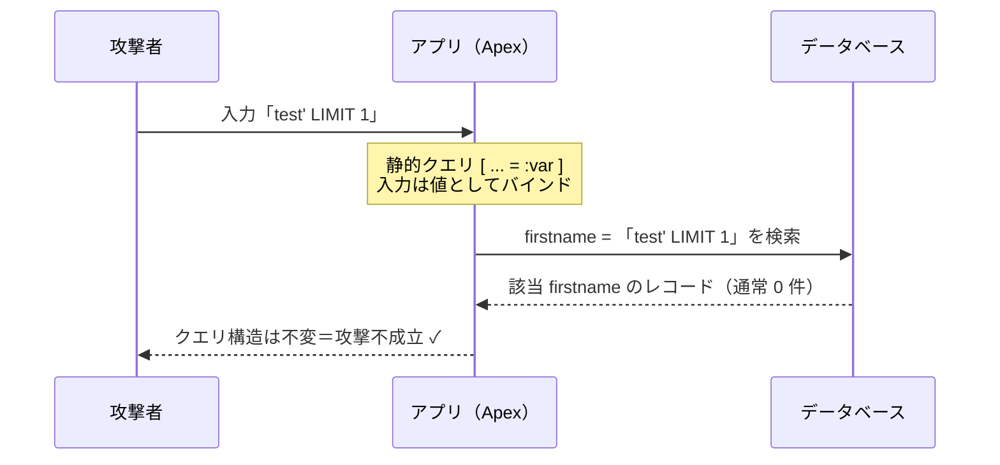

# SOQL インジェクションの緩和（対策）

## 学習の目的

この単元を完了すると、次のことができるようになります。

- SOQL が SQL とどう違うかを定義する。
- SOQL の脆弱性を説明する。
- SOQL インジェクション攻撃を防ぐ方法を学ぶ。

> [!ポイント] この単元のゴール
>
> SOQL は SQL に似るが**参照（SELECT）専用**。それでも**ユーザー入力をそのままクエリ文字列に連結すると SOQL インジェクションが起きる**。対策の本命は**静的クエリ＋バインド変数（`:変数`）**。これを軸に、`String.escapeSingleQuotes()`・型キャスト・文字置換・許可リスト（allowlist）の5手法を「いつ使えるか」とセットで覚える。

---

## SOQL と SQL の違い

Lightning Platform では SQL ではなく SOQL を使う。SOQL は本質的に **Salesforce プラットフォーム専用にカスタマイズされた SQL** であり、データ変更はできず参照（クエリ）専用。

> [!用語] SOQL と SQL
>
> - **SOQL（Salesforce Object Query Language）**：Salesforce のデータベースから**レコードを参照する言語**。データを変更する機能はない（読みは「ソークル」）。
> - **SQL（Structured Query Language）**：一般的な RDB を操作する標準言語。SELECT に加え INSERT・UPDATE・DELETE もできる。SOQL はその制限版。

SOQL に**ない**ものは次のとおり。

| SQL にあって SOQL にないもの | 補足 |
| --- | --- |
| `INSERT` / `UPDATE` / `DELETE` 文 | SOQL は `SELECT` のみ。データ変更は Apex の DML |
| コマンド実行（command execution） | OS コマンド等を実行する機能はない |
| `JOIN` 文 | 親・関連オブジェクトの情報は取得可（上下5階層まで）。例：`SELECT Name, Phone, Account.Name FROM Contact` |
| `UNION` 演算子 | 複数クエリ結果の結合はできない |
| クエリの連鎖（chaining） | 複数クエリをつなげて実行できない |

---

## SOQL はインジェクション攻撃に脆弱か？

制限が多くても、**開発者がユーザー入力を誤って信頼すると、SOQL インジェクションで情報が露出**する。

> [!用語] SOQL インジェクション（SOQL Injection）
>
> 攻撃者が**入力欄に細工した文字列を入れて SOQL クエリの構造そのものを書き換える**攻撃。本来見られないデータを引き出せる。原因は「ユーザー入力を検証せずにクエリ文字列へ連結している」こと。

例として、学区の人員を役職（title）や年齢（age）で検索できるカスタムページを考える。アプリは送信された `textualTitle` を**直接 SOQL クエリに差し込んでいる**。

```apex
String query = 'SELECT Id, Name, Title__c FROM Books';
String whereClause = 'Title__c like \'%' + textualTitle + '%\' ';
List<Books> whereclause_records = database.query(query + ' where ' + whereClause);
```

役職検索に次の文字列を入れると、攻撃者はシングルクォートを閉じて別条件を追加し、**文法的に正しいクエリ**で「低評価の人員」を特定できてしまう。

```text
%' and Performance_rating__c<2 and name like '%
```

```sql
-- 攻撃前（開発者の想定）
Title__c like '%' + textualTitle + '%'

-- 攻撃後（インジェクション成立）
Title__c like '% %' and Performance_rating__c<2 and name like '% %'';
```

> [!例] インジェクションが起きる仕組みを図解
>
> ```mermaid
> sequenceDiagram
>     participant U as 攻撃者
>     participant App as アプリ（Apex）
>     participant DB as データベース
>     U->>App: 入力「%' and Performance_rating__c<2 and name like '%」
>     Note over App: 検証せずにクエリ文字列へ連結
>     App->>App: 開発者の ' を攻撃文字列が閉じる<br/>＝クエリ構造が書き換わる
>     App->>DB: SELECT ... WHERE Title__c like '%'<br/>AND Performance_rating__c<2 AND name like '%'
>     DB-->>App: 低評価の人員レコードを返す
>     App-->>U: 本来見られないデータが露出 ✗
> ```

> [!注意] 「制限が多い＝安全」ではない
>
> SOQL は `INSERT` 等が使えず SQL インジェクションほど破壊的ではないが、**機密データの漏洩**は十分起こり得る。上の例では本来知り得ない「低評価の人員」を特定できた。「SOQL だから安全」と油断しない。

---

## SOQL インジェクションの防止

対策は**クエリで何を達成したいかによって使い分ける**。

| 手法 | 概要 | 主に有効な場面 |
| --- | --- | --- |
| 静的クエリ＋バインド変数 | `:変数` でユーザー入力を「値」として扱う | **最推奨**。可能な限りこれ |
| `String.escapeSingleQuotes()` | シングルクォートをエスケープ | 入力が**文字列でクォートに囲まれる**場合 |
| 型キャスト（Typecasting） | Integer/Boolean などに変換し不正入力を弾く | 入力が**数値・真偽値**の場合 |
| 文字置換（Replacing characters） | 危険な文字を除去（ブロックリスト） | 他手法が使えない場合の最終手段 |
| 許可リスト（Allowlisting） | 「既知の正しい値」だけを許可 | 項目名・オブジェクト名など**選択肢が限定**される場合 |

---

### 静的クエリとバインド変数

SOQL インジェクションを防ぐ**最初かつ最も推奨される方法**。次の脆弱なコードは、ユーザー入力 `var` をクエリに直接連結している。

```apex
String query = 'select id from contact where firstname =\'' + var + '\'';
queryResult = Database.execute(query);
```

これを**静的クエリ＋バインド変数**へ書き換える。

```sql
queryResult = [select id from contact where firstname = :var]
```

> [!用語] 静的クエリ／バインド変数（Bind Variable）
>
> **静的クエリ**は角括弧 `[ SELECT ... ]` で書く、構造が固定されたクエリ。その中の `:var` のようにコロン付きで埋め込む変数が**バインド変数**。中身は「コード」ではなく**ただの値（データ）**として扱われるため、構造を書き換えられない。

バインド変数を使うと、同じ攻撃入力でも「コード」ではなく「値」として扱われ、攻撃が成立しない。



ユーザーが `test' LIMIT 1` を入力しても、DB は「`test' LIMIT 1` という firstname の人」を探すだけで、クエリの外へ脱出できない。バインド変数は次の句でのみ使用できる。

- `FIND` 句内の検索文字列
- `WHERE` 句内のフィルタリテラル
- `WHERE` 句内の `IN` / `NOT IN` 演算子の値（ID や文字列のリストで特に有用。型は任意）
- `WITH DIVISION` 句内のディビジョン名
- `LIMIT` / `OFFSET` 句内の数値

> [!ポイント] 第一選択は必ず「バインド変数」
>
> SOQL インジェクション対策の**最推奨は静的クエリ＋バインド変数（`:var`）**。これが使える場面では他手法より先にこれを使う。バインド変数が使えない句（`SELECT` する項目名や `FROM` オブジェクト名など）でのみ他手法を検討する。

---

### 型キャスト（Typecasting）

すべてを文字列扱いすると入力が想定枠外へはみ出せるが、適切な場面で整数や真偽値にキャストすれば誤った入力は弾かれる。クエリへ差し込む際は `string.valueOf()` で文字列に戻す（`database.query()` は文字列しか受け取らないため）。

例として年齢フィルタで検索する脆弱なコード（`textualAge` を直接連結、**シングルクォートなし**）。ペイロード `1 limit 1` がコードとして扱われ1件だけ返ってしまう。

```apex
public String textualAge {get; set;}
// [...]
whereClause += 'Age__c >' + textualAge + '';
whereclause_records = database.query(query + ' where ' + whereClause);
```

ここで `string.escapeSingleQuotes()` で包んでも、最終クエリにシングルクォートが1つもないため無効。

```sql
'Select Name, Role__c, Title__c, Age__c from Personnel__c where Age__c > 1 limit 1'
```

そこで `textualAge` の宣言を `String` から `Integer` に変え、`string.valueOf()` で包む。`1 limit 1` は整数に変換できず**エラー**になり、インジェクションが防がれる。

```apex
whereClause += 'Age__c >' + string.valueOf(textualAge) + '';
```

> [!ポイント] 型キャストが効く理由
>
> 型キャストは**ユーザーが数値や真偽値を入れる場面**の SOQL インジェクションを防ぐ。`Integer` や `Boolean` に変換できない値（`1 limit 1` など）は変換時に弾かれる。シングルクォートで囲まれない数値項目には、エスケープより型キャストが有効。

---

### シングルクォートのエスケープ

ユーザー制御の文字列をクエリに含める際の緩和策が `string.escapeSingleQuotes()`。

> [!用語] String.escapeSingleQuotes()
>
> 文字列中のシングルクォート `'` をバックスラッシュでエスケープ（`\'`）する関数。攻撃者の入力を**文字列の境界内に閉じ込め**、コードとして扱われるのを防ぐ。**ただし入力が文字列でシングルクォートに囲まれている場合にのみ有効**。

役職検索の脆弱コード（最終クエリで変数がシングルクォートに囲まれる）には、この関数が有効。

```apex
String query = 'SELECT Id, Name, Title__c FROM Books';
String whereClause = 'Title__c like \'%' + textualTitle + '%\' ';
List<Books> whereclause_records = database.query(query + ' where ' + whereClause);
```

`textualTitle` を `String.escapeSingleQuotes()` で包めば、攻撃者は SOQL インジェクションでクエリの動作を変えられなくなる。

```apex
String whereClause = 'Title__c like \'%' + String.escapeSingleQuotes(textualTitle) + '%\' ';
```

> [!注意] エスケープが効かない場面に注意
>
> この解決策は**文字列にのみ**適用できる。**シングルクォートに囲まれない数値項目（前述の年齢の例）では無力**で、型キャスト等の別対策が必要。

---

### 文字置換（Replacing Characters）

エスケープ・型キャスト・許可リストのいずれも使えない場面の最終手段。ユーザー入力から「悪い文字」を除去する（ブロックリスト方式）。

> [!用語] 許可リスト（Allowlist）とブロックリスト（Blocklist）
>
> - **許可リスト**：「これだけ OK」という**良い値の一覧**を作り、それ以外を拒否する方式。
> - **ブロックリスト**：「これは NG」という**悪い文字・値の一覧**を作り、それを除去・拒否する方式。
>
> セキュリティでは**許可リストの方が常に強力**。「少数の正しい入力」を予測する方が「あらゆる悪い入力」を予測するより簡単だから。

次の脆弱コードでは、スペース除去も効果的（型キャストや許可リストも有効）。

```apex
String query = 'select id from user where isActive=' + var;
```

ペイロード `true AND ReceivesAdminInfoEmails=true` はスペース除去で `trueANDRecievesAdminInfoEmails=true` になり無効化される。

```sql
true AND ReceivesAdminInfoEmails=true
```

```apex
String query = 'select id from user where isActive=' + var.replaceAll('[^\\w]', '');
```

> [!注意] 文字置換は「第一防衛線」にしない
>
> 文字置換（ブロックリスト）は第一防衛線にしない。まずはバインド変数・型キャスト・許可リストを検討する。

---

### 許可リスト（Allowlisting）

ユーザー制御の値が**テキストでなければならず、かつシングルクォートを含まない**場合に使う。`SELECT` する項目や `FROM` オブジェクトなど、**クエリの他の部分がユーザー制御下に置かれる**ときによく起こる。許可してよい「既知の正しい値」のリストを作り、それ以外を拒否する。

> [!例] 許可リストが必要な場面
>
> 並び替え対象の項目名をユーザーに選ばせる場合、`ORDER BY [ユーザー入力]` の項目名はバインド変数で渡せずクォートにも囲まれない。そこで `{'Name', 'CreatedDate', 'Amount'}` のような**許可された項目名の集合**を用意し、入力がこの集合に含まれる場合だけクエリに使う。含まれなければ拒否する。

---

## 試験対策：押さえておきたい追加ポイント

> [!ポイント] 5手法の使い分け早見表（頻出）
>
> ```mermaid
> flowchart TD
>     S(["入力をクエリに使いたい"]) --> Q1{"バインド変数 :var が<br/>使える句？"}
>     Q1 -->|"はい"| BIND["静的クエリ＋バインド変数<br/>（最推奨）"]
>     Q1 -->|"いいえ"| Q2{"入力は数値・真偽値？"}
>     Q2 -->|"はい"| CAST["型キャスト<br/>Integer / Boolean"]
>     Q2 -->|"いいえ"| Q3{"文字列でクォートに<br/>囲まれる？"}
>     Q3 -->|"はい"| ESC["escapeSingleQuotes()"]
>     Q3 -->|"いいえ"| Q4{"値の選択肢が<br/>限定できる（項目名等）？"}
>     Q4 -->|"はい"| ALLOW["許可リスト（allowlist）"]
>     Q4 -->|"いいえ"| REPL["文字置換（最終手段）"]
>     classDef hl fill:#0176D3,stroke:#032D60,color:#fff;
>     classDef soft fill:#E8F2FC,stroke:#0176D3,color:#032D60;
>     class BIND hl;
>     class CAST,ESC,ALLOW,REPL soft;
> ```

> [!ポイント] よく問われる事実
>
> - SOQL インジェクションは**ユーザー入力を信頼し、クエリで誤って扱う**ことで発生する。
> - 動的クエリでの**最推奨対策はバインド変数**（静的クエリ）。
> - `escapeSingleQuotes()` は**シングルクォートに囲まれた文字列**にしか効かない（数値項目には無力）。
> - **許可リスト > ブロックリスト**（許可リストの方が常に強力）。
> - SOQL は SELECT 専用だが、それでも**情報漏洩**は起こり得る。

---

## リソース

- Salesforce ヘルプ：セキュアコーディングガイドライン（Secure Coding Guidelines）
- Salesforce ヘルプ：リレーションクエリ（Relationship Queries）
- 外部サイト：OWASP — SQL Injection

---

## テスト

この単元を完了するには、テストのすべての質問に正しく解答する必要があります。（+100 ポイント）

**1. Salesforce アプリケーションで SOQL インジェクションはどのように発生しますか？**

- A. DML 操作を実行することによって
- B. SOQL クエリで WITH SECURITY_ENFORCED 句を使うことによって
- C. ユーザー入力を信頼し、SOQL クエリ内で誤って扱うことによって
- D. 複数のクエリを連鎖させることによって

**2. 動的クエリを使うとき、SOQL インジェクション攻撃を防ぐために推奨される手法はどれですか？**

- A. バインド変数を使った静的クエリ
- B. ユーザー入力の文字を置換する
- C. string.escapeSingleQuotes() でシングルクォートをエスケープする
- D. ユーザー入力に許可リストを実装する

> [!まとめ] この単元の要点
>
> - SOQL は SELECT 専用だが、**ユーザー入力をクエリ文字列に連結すると SOQL インジェクション**が起こり情報漏洩につながる。
> - 攻撃の本質は「**入力が値ではなくコードとして扱われ、クエリの構造が書き換わる**」こと。
> - 対策5手法：**①バインド変数（最推奨）→ ②型キャスト → ③escapeSingleQuotes（文字列+クォート時）→ ④許可リスト → ⑤文字置換（最終手段）**。
> - **許可リストはブロックリストより常に強力**。

> [!注意] 日本語環境で受講する場合
>
> この単元は Trailhead の英語教材の翻訳。コードやキーワード（`escapeSingleQuotes()`、バインド変数 `:var` など）は**英語のまま**正確に記述する。日本語訳は理解の補助。

---

## 🎓 この単元のまとめ

この単元では、SELECT 専用の SOQL であってもユーザー入力をクエリ文字列に連結すると SOQL インジェクションで情報漏洩が起こることと、その5つの対策手法を「使える場面」とセットで学びました。

次の表は、5手法を「優先順位・仕組み・有効な場面」で整理した要点です。上から順に検討するのが基本方針です。

| 優先 | 手法 | 仕組み | 有効な場面 |
| --- | --- | --- | --- |
| ① | 静的クエリ＋バインド変数（`:var`） | 入力を「コード」でなく「値」として扱う | **最推奨**。バインド変数が使える句なら必ずこれ |
| ② | 型キャスト（Integer / Boolean） | 変換できない不正入力を弾く | 入力が**数値・真偽値**（クォートに囲まれない） |
| ③ | `String.escapeSingleQuotes()` | `'` をエスケープし境界内に閉じ込める | 入力が**文字列でクォートに囲まれる**場合のみ |
| ④ | 許可リスト（allowlist） | 既知の正しい値だけを許可 | 項目名・オブジェクト名など**選択肢が限定**される |
| ⑤ | 文字置換（blocklist） | 危険な文字を除去 | 他が使えないときの**最終手段** |

> [!まとめ] この単元の要点
>
> - SOQL は **SELECT 専用**だが、ユーザー入力を信頼してクエリ文字列に連結すると **SOQL インジェクション**で情報漏洩が起こる。
> - 攻撃の本質は「**入力が値ではなくコードとして扱われ、クエリ構造が書き換わる**」こと。
> - 第一選択は常に**静的クエリ＋バインド変数（`:var`）**。値として扱われるため構造を書き換えられない。
> - `escapeSingleQuotes()` は**文字列＋クォートで囲まれる場合のみ**有効（数値項目には無力）。数値・真偽値には**型キャスト**。
> - **許可リスト（allowlist）はブロックリスト（blocklist）より常に強力**。「正しい少数」を予測する方が易しいため。

> [!豆知識] バインド変数が使える句は決まっている
>
> バインド変数（`:var`）はどこでも使えるわけではなく、`WHERE` 句のフィルタ値・`IN`/`NOT IN` の値・`LIMIT`/`OFFSET` の数値・`FIND` 句の検索文字列・`WITH DIVISION` のディビジョン名に限られます。逆に `SELECT` する項目名や `FROM` のオブジェクト名はバインドできないため、ここがユーザー制御になる場合に「許可リスト」が出番になります。「対策の使い分けは、そもそもバインド変数が使えるかどうかで枝分かれする」と覚えておくと整理しやすいです。
