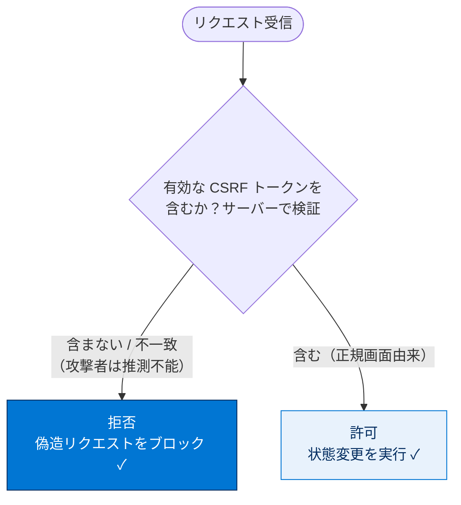

# クロスサイトリクエストフォージェリ（CSRF）の緩和

## 学習の目的

この単元を完了すると、次のことができるようになります。

- クロスサイトリクエストフォージェリ（CSRF）の脆弱性を定義する。
- Lightning Platform アプリケーションで CSRF 脆弱性を特定する。
- コードレベル・組織レベルの保護を使って CSRF 脆弱性を防ぐ。

> [!ポイント] この単元のゴール
>
> CSRF は「**ログイン中のユーザーのブラウザを利用して、本人が意図しない操作を信頼済みサイトに実行させる**」攻撃。鍵は **①状態を変える GET リクエストを使わない（POST/PUT を使う）②推測困難な CSRF トークンを検証する**こと。Salesforce は標準で CSRF トークンを付与するが、開発者側もページ読み込み時の自動 DML を避けるなどの注意が必要。

---

## CSRF とは？

CSRF は、**悪意あるアプリケーションが、ユーザーのブラウザに、現在認証済みの信頼済みサイトへ意図しない操作を実行させる**脆弱性。

> [!用語] CSRF（Cross-Site Request Forgery：クロスサイトリクエストフォージェリ）
>
> 攻撃者が、**被害者がログイン中のサイトに対し、被害者本人になりすました状態でリクエストを送らせる**攻撃。被害者のブラウザが持つ認証情報（セッション Cookie 等）が自動送信されることを悪用する（読みは「シーサーフ」）。

例として「School District Management（学区管理）」組織を考える。全在校生を一覧するアプリで、Honor Roll リンクをクリックすると `/promote?UserId=<userid>` への **GET リクエスト**が送られ、ページ読み込み時に URL パラメータを読んで生徒を優等生名簿へ昇格させる。

ここで、組織にログイン後に別サイトを閲覧し、`www.beststudents.com/promote?user_id=123` というリンクをクリックすると、**そのリンクは管理者（あなた）の権限で実行され、気づかぬうちに生徒を昇格**させてしまう。

> [!例] CSRF 攻撃の流れを図解
>
> ```mermaid
> sequenceDiagram
>     participant U as あなた（管理者）
>     participant Mal as 悪意あるサイト
>     participant SF as 信頼済みサイト<br/>School District
>     U->>SF: ① ログイン（セッション有効）
>     U->>Mal: ② 別の悪意あるサイトを閲覧しリンクをクリック
>     Mal-->>U: ③ ブラウザに GET を送らせる仕掛け
>     U->>SF: GET /promote?UserId=123<br/>（セッション Cookie が自動付与）
>     Note over SF: ④ 正規の管理者からの<br/>正当なリクエストと誤認
>     SF-->>U: ⑤ 生徒123 を優等生名簿へ昇格<br/>（あなたは意図していない！）✗
> ```

---

## CSRF 攻撃を防ぐ

CSRF の成功には、標的ユーザーが認証済みの状態で攻撃ページを訪れる必要があり、攻撃者側の巧妙な仕掛け（多くはフィッシング）が要る。しかし**成功時の影響は深刻**で、データ削除やアカウント乗っ取りに及ぶ。

優等生名簿の例では、攻撃成功に**パラメータの正確な名前（`userID`）と値**が必要だった。ここで必須パラメータに `token` を追加し、その値を**リクエストごとに変わるランダムで一意な値**にすれば、攻撃者は現在値を推測できず攻撃を防げる。これが最も一般的な CSRF 防止手法。

> [!用語] CSRF トークン（Anti-CSRF Token）
>
> リクエストごと（またはセッションごと）に発行される、**ランダムで推測困難な秘密の値**。正規の画面から送られたリクエストにだけ含まれ、サーバーはこれを検証して一致しないリクエスト（＝偽造）を拒否する。

> [!ポイント] CSRF トークンが機能するための4条件（頻出）
>
> 1. **状態を変えるすべての機密リクエスト**（DB 操作を伴うもの）にトークンを含める。
> 2. トークンは**リクエストまたはユーザーのセッションに一意**である。
> 3. トークンは**推測困難**である（長く、高度な暗号化）。
> 4. サーバーがトークンを**検証**し、意図したユーザー由来か確認する。



---

## Salesforce プラットフォームで CSRF から保護する

Salesforce は**標準で CSRF 保護**を備える。Salesforce リソースへのリクエストには疑似ランダムな CSRF トークンが付与され、ハイパーリンクの再利用・配布や、特権アカウントによる意図しない状態変更を防ぐ。

> [!注意] 標準保護だけに頼らない
>
> 標準でトークンが付くからといって、**開発者がコードの書き方に無頓着でよいわけではない**。特にカスタムの Lightning アプリでは、コードの構造によって CSRF 脆弱性を生み込む可能性がある。

最も単純な CSRF 攻撃は、**状態を変えるパラメータを伴う HTTP GET リクエスト**を使う（例：`GET mywebsite.com?change_username="joe"`）。

> [!ポイント] GET で状態を変えない（最重要対策）
>
> **状態を変える HTTP GET リクエストを使わないだけで、多くの CSRF 脆弱性を排除**できる。状態変更が必要なときは GET ではなく **POST や PUT** を使う。GET はブックマークやリンククリックで簡単に発火するため状態変更に向かない。

> [!用語] HTTP GET / POST / PUT と Origin ヘッダー
>
> - **GET**：データの「取得」用。URL に含めて送るためリンククリック等で簡単に発火＝CSRF で悪用されやすい。
> - **POST / PUT**：データの「作成・更新」用。本文（body）で送り、状態変更に適する。
> - **Origin ヘッダー**：リクエストが「どのサイトから発信されたか」を示す HTTP ヘッダー。ブラウザが自動設定し JavaScript から改ざんできない（禁止ヘッダー）。サーバーが検証すれば、信頼できない別サイト（攻撃者）由来のリクエストを拒否できる。

Lightning アプリを API 経由でサードパーティと統合する場合、独自の CSRF トークンを持たせられる。`XMLHttpRequest` の `setRequestHeader()` で追加する。

```html
<script>
var o = XMLHttpRequest.prototype.open;
XMLHttpRequest.prototype.open = function(){
    var res = o.apply(this, arguments);
    var err = new Error();
    this.setRequestHeader('anti-csrf-token', csrf_token);  // 独自の CSRF トークンを付与
    return res;
};
</script>
```

---

## Lightning のページ読み込みイベントでの CSRF

CSRF 脆弱性が生まれやすいもうひとつの場所が、**`onInit` や `afterRender` のようなページ読み込みイベントで、サーバー側 DML 操作が自動実行される**ケース。緩和するには、**DML はページとの操作（ボタンクリック等）の結果としてのみ実行**されるようにする。

```javascript
({
    doInit: function(cmp) {
        var action = cmp.get("c.updateField"); // CSRF に脆弱：読み込み時に自動で DML が走る
        // [...]
        $A.enqueueAction(action);
    },
    handleClick: function(cmp, event) {
        var action = cmp.get("c.updateField"); // CSRF に脆弱でない：クリック操作の結果として実行
        // [...]
        $A.enqueueAction(action);
    }
})
```

> [!注意] ページ読み込みで DML を走らせない
>
> `doInit`（`onInit`）のような**初期化イベントで状態変更 DML を実行するのは CSRF に脆弱**。攻撃者は被害者にページを開かせるだけで DML を発火させられる。状態変更は**必ずユーザーの明示的な操作（クリック等）をトリガー**にする。

> [!例] 脆弱なコードと安全なコードの対比
>
> | | `doInit`（読み込み時） | `handleClick`（クリック時） |
> | --- | --- | --- |
> | 実行タイミング | ページが開いた瞬間に自動 | ユーザーがボタンを押したとき |
> | ユーザーの意図 | **なし**（開いただけ） | **あり**（押した） |
> | CSRF 脆弱性 | **あり ✗** | なし ✓ |

---

## 試験対策：押さえておきたい追加ポイント

> [!ポイント] CSRF 対策まとめ（頻出）
>
> | 対策 | 内容 |
> | --- | --- |
> | **状態変更に GET を使わない** | 状態変更は POST/PUT で。GET はリンククリックで簡単に発火 |
> | **CSRF トークンの検証** | 推測困難・一意・全機密リクエストに含める・サーバーで検証 |
> | **Origin ヘッダーの検証** | 発信元サイトを確認し、別サイト由来を拒否 |
> | **ページ読み込みで DML しない** | DML はユーザー操作（クリック等）の結果として実行 |
> | **Salesforce 標準保護** | 標準で CSRF トークンを付与（ただし頼り切らない） |

> [!ポイント] よく問われる事実
>
> - CSRF は「ログイン中ユーザーのブラウザ」を悪用し、**本人の意図しない操作**を信頼済みサイトに実行させる。
> - 防止には **Origin ヘッダー検証 + 独自 CSRF トークン**の組み合わせが有効。
> - Lightning ページが脆弱になるのは、**ページ読み込みイベントで状態変更 DML が自動実行**されるとき。
> - **標準の CSRF トークンだけに頼らない**、**GET で状態を変えない**のが基本。

---

## リソース

- Web サイト：OWASP クロスサイトリクエストフォージェリ（CSRF）防止チートシート

---

## テスト

この単元を完了するには、テストのすべての質問に正しく解答する必要があります。（+100 ポイント）

**1. 開発者は Salesforce Lightning アプリケーションで CSRF 攻撃をどう防げますか？**

- A. POST や PUT リクエストの使用を避ける
- B. Salesforce 標準の CSRF トークンだけに依存する
- C. 状態を変えるパラメータを伴う HTTP GET リクエストを使う
- D. Origin ヘッダーを検証し、独自の CSRF トークンを実装する

**2. Lightning ページはいつ CSRF に脆弱になりますか？**

- A. サーバー側操作に POST や PUT リクエストを使うとき
- B. ページ読み込みイベントの一部としてサーバー側 DML 操作が自動実行されるとき
- C. XMLHttpRequest に CSRF トークンを含めないとき
- D. Lightning コンポーネントに許可リストを実装しないとき

> [!まとめ] この単元の要点
>
> - **CSRF**：ログイン中ユーザーのブラウザを悪用し、信頼済みサイトに意図しない状態変更を実行させる攻撃。
> - 攻撃成功には「**被害者が認証済み**」かつ「**攻撃者がパラメータ名と値を用意できる**」ことが必要。
> - 防止の柱：**①状態変更に GET を使わない（POST/PUT）②推測困難な CSRF トークンを検証 ③Origin ヘッダー検証 ④ページ読み込みで DML しない**。
> - Salesforce は標準で CSRF トークンを付与するが、**コード設計の注意は依然として必要**。

> [!注意] 日本語環境で受講する場合
>
> この単元は Trailhead の英語教材の翻訳。コードやキーワード（`setRequestHeader()`、`doInit` など）は**英語のまま**正確に記述する。日本語訳は理解の補助。
