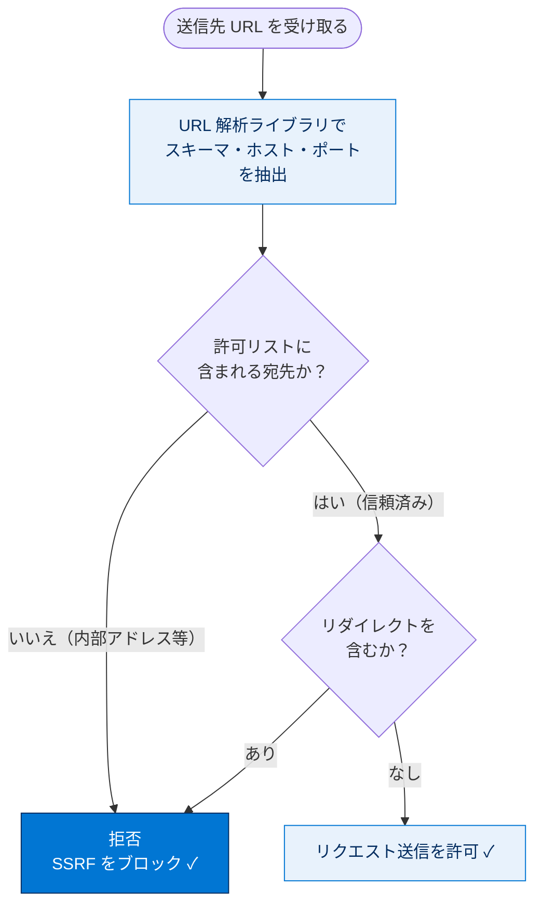

# サーバーサイドリクエストフォージェリ（SSRF）の緩和

## 学習の目的

この単元を完了すると、次のことができるようになります。

- サーバーサイドリクエストフォージェリ（SSRF）の脆弱性を定義する。
- Lightning Platform アプリケーションで SSRF 脆弱性を特定する。
- コードレベル・組織レベルの保護を使って SSRF 脆弱性を防ぐ。

> [!ポイント] この単元のゴール
>
> SSRF は「**攻撃者がサーバーを騙して、サーバーに任意の宛先へリクエストを送らせる**」攻撃。特に危険なのは、外部から届かない**社内サービスやクラウドのメタデータエンドポイント**（例：`http://169.254.169.254`）へサーバー経由でアクセスされること。対策は **①入力（URL）の検証・サニタイズ ②許可リスト（送信先の制限）③URL 解析ライブラリ ④ネットワーク分離**の組み合わせ。

---

## サーバーサイドリクエストフォージェリとは？

SSRF は、**攻撃者がサーバーを騙して、内部・外部のサービスやシステムへリクエストを送らせる**脆弱性。不正アクセスやデータ露出につながる。

> [!用語] SSRF（Server-Side Request Forgery）
>
> 攻撃者がリクエストの**宛先（URL）を細工**し、**サーバー自身に任意の場所へアクセスさせる**攻撃。サーバーは社内ネットワークの内側にいることが多く、外部の攻撃者が直接届かない社内サービスへ、サーバーを「踏み台」にして到達できてしまう（読みは「エスエスアールエフ」）。

> [!用語] CSRF と SSRF の違い
>
> 「誰がリクエストを送らされるか」が違う。
> - **CSRF**：被害者の**ブラウザ（クライアント）**を悪用して、意図しないリクエストを送らせる。
> - **SSRF**：**サーバー**を悪用して、攻撃者が指定した宛先へリクエストを送らせる。

例として「School District Management（学区管理）」組織を考える。**社内向けアドレス**の内部サービスから生徒情報を取得するアプリがあり、API リクエストに含まれるアドレスへ GET する設計（例：`studentApi=https://192.168.0.1/student`）。攻撃者はこの API 呼び出しを傍受し、**エンドポイント値をメタデータサービス（例：`http://169.254.169.254`）への呼び出しに差し替え**、機密の構成データを抜き取る。クラウドサービスやNoSQL DB は内部インターフェースに認証なしの REST を公開していることがあり、これが悪用される。

> [!例] SSRF 攻撃の流れを図解
>
> ```mermaid
> sequenceDiagram
>     participant A as 攻撃者
>     participant Srv as サーバー（Apex）
>     participant Int as 社内の生徒サービス
>     participant Meta as クラウドのメタデータ<br/>169.254.169.254（非公開）
>     Note over A,Srv: 正常時
>     A->>Srv: studentApi=https://192.168.0.1/student
>     Srv->>Int: GET /student
>     Int-->>Srv: 生徒情報（正規）
>     Note over A,Srv: 攻撃時：宛先を傍受して差し替え
>     A->>Srv: studentApi=http://169.254.169.254/...
>     Srv->>Meta: サーバーが信じて GET（踏み台化）
>     Meta-->>Srv: 認証情報・構成データ
>     Srv-->>A: 機密データが漏洩 ✗
> ```

> [!注意] メタデータエンドポイントが狙われる
>
> `http://169.254.169.254` のようなクラウドのメタデータエンドポイントは外部から直接届かないが、**サーバー自身からはアクセスできる**ことがある。SSRF はこの「サーバーからしか届かない内部リソース」へサーバーを踏み台に到達させ、認証情報や構成データを盗む。これが SSRF の最も危険なシナリオ。

---

## SSRF 攻撃の防止

**リクエストの範囲を検証・制限**するのが対策の基本。効果的なのは次の組み合わせ。

| 手法 | 内容 |
| --- | --- |
| 入力の検証・サニタイズ | URL 値を検証し、悪意ある URL の注入を防ぐ |
| 許可リスト（Allowlisting） | スキーマ・ポート・宛先を制限し、信頼済みエンドポイントのみ許可 |
| URL 解析ライブラリ | リクエスト前に URL を解析・検証する |
| ネットワーク分離 | サーバーが内部リソースへリクエストできる範囲を制限 |

### 入力の検証とサニタイズ

`studentApi` のような入力値を検証・サニタイズし、**悪意ある URL の注入を防ぐ**。

> [!用語] サニタイズ（Sanitize）
>
> ユーザー入力から危険な部分を取り除き安全な形に整える処理。SSRF では「想定外のスキーマ（`file://` 等）や内部アドレスを含む URL」を弾くことを指す。

### 許可リストの実装

**URL のスキーマ・ポート・宛先の許可リスト**を強制し、HTTP リダイレクトを無効化して、送信リクエストを信頼済みエンドポイントだけに制限する。

> [!ポイント] SSRF 対策の本命は許可リスト
>
> 「サーバーがどこへリクエストしてよいか」を**信頼済みの宛先だけに限定**するのが最も効果的。`https://api.trusted-partner.com` のような正規の宛先だけを許可し、内部アドレス（`192.168.*`、`169.254.169.254` 等）はすべて拒否する。リダイレクト無効化は、許可済み URL から内部アドレスへ転送されるのを防ぐため。

許可リストによる送信先チェックの判断フロー。



### URL 解析ライブラリの使用

URL 解析ライブラリでリクエスト前に URL を解析・検証し、**期待されるパターンに適合**することを保証する。

### ネットワーク分離

ネットワーク分離で、サーバーが内部リソースへリクエストできる能力を制限する。万一 SSRF が起きても**影響範囲を限定**できる。

---

## SSRF に対する Salesforce プラットフォームの保護

Salesforce は**標準で SSRF 保護**を備える。加えて Lightning アプリ開発者は次のベストプラクティスを使える。

### GET リクエストを避ける

CSRF 防止と同様、HTTP GET を避け **POST や PUT** を使い、SSRF によるデータ持ち出しのリスクを最小化する。

### Origin ヘッダーを検証する

サードパーティ API と統合する際は **Origin ヘッダーを検証**し、リクエストが**信頼できるソースから発信されている**ことを確認する。

### Anti-SSRF トークンを実装する

Lightning 内で `setRequestHeader()` を使い、`XMLHttpRequest` に独自の **Anti-SSRF トークン**を追加できる。

```html
<script>
var o = XMLHttpRequest.prototype.open;
XMLHttpRequest.prototype.open = function(){
    var res = o.apply(this, arguments);
    this.setRequestHeader('anti-ssrf-token', ssrf_token);  // 独自の Anti-SSRF トークンを付与
    return res;
};
</script>
```

---

## Lightning のページ読み込みイベントでの SSRF

SSRF も、**`onInit` や `afterRender` のようなページ読み込みイベントでサーバー側操作が引き起こされる**ケースで脆弱になりやすい。緩和には、**サーバー側操作はユーザーの操作（ボタンクリック等）への応答としてのみ開始**されるようにする。

> [!注意] ページ読み込みでの自動実行に注意（CSRF と共通）
>
> SSRF も CSRF と同様、**ページ読み込みイベントで自動的にサーバー側操作が走ると危険**。攻撃者は被害者にページを開かせるだけで不正リクエストを発火させられる。サーバー側操作は**必ずユーザーの明示的な操作をトリガー**にする。

---

## 試験対策：押さえておきたい追加ポイント

> [!ポイント] CSRF と SSRF の比較（頻出・混同注意）
>
> | 観点 | CSRF | SSRF |
> | --- | --- | --- |
> | 悪用される主体 | ユーザーの**ブラウザ（クライアント）** | **サーバー** |
> | 攻撃の狙い | 意図しない状態変更を実行させる | 内部リソース・メタデータへの不正アクセス／データ露出 |
> | 典型的な標的 | 信頼済みサイトの状態変更操作 | 社内サービス、メタデータエンドポイント（`169.254.169.254` 等） |
> | 共通の対策 | GET を避け POST/PUT、Origin ヘッダー検証、トークン、ページ読み込みで自動実行しない | 同左 ＋ 入力検証・サニタイズ、許可リスト、URL 解析、ネットワーク分離 |

> [!ポイント] よく問われる事実
>
> - SSRF は「**サーバーになりすまして内部リソースへ不正リクエスト**」を送る攻撃。
> - SSRF 対策の柱：**①入力の検証・サニタイズ ②許可リスト（宛先制限・リダイレクト無効化）③URL 解析ライブラリ ④ネットワーク分離**。
> - Lightning アプリでは **GET を避け POST/PUT、Origin ヘッダーを検証、Anti-SSRF トークンを付与**。
> - ページ読み込みイベントでの**自動サーバー側操作は SSRF/CSRF 両方の温床**。
> - メタデータエンドポイント（`169.254.169.254` 等）が主要な標的。

---

## テスト

この単元を完了するには、テストのすべての質問に正しく解答する必要があります。（+100 ポイント）

**1. サーバーサイドリクエストフォージェリ（SSRF）とは何ですか？**

- A. 内部データベースをセキュアにする手法
- B. 攻撃者がユーザーのクライアントになりすまして内部リソースへ不正なリクエストを行える、Web アプリケーションの脆弱性
- C. セキュアなデータ伝送のためのプロトコル
- D. データ露出を防ぐための方法

**2. 開発者は Salesforce Lightning アプリケーションで SSRF 攻撃をどう防げますか？**

- A. 状態を変える POST や PUT リクエストを避ける
- B. 内部リソースへの無制限なアクセスを許可する
- C. ユーザー入力の検証を無視する
- D. 送信リクエストの許可 URL を許可リストにする

> [!まとめ] この単元の要点
>
> - **SSRF**：攻撃者がサーバーを騙し、サーバー自身に任意の宛先（特に内部リソース・メタデータエンドポイント）へリクエストを送らせる攻撃。
> - **CSRF はクライアント、SSRF はサーバー**が悪用される点が最大の違い。
> - 対策の柱：**入力検証・サニタイズ／許可リスト（宛先制限・リダイレクト無効化）／URL 解析ライブラリ／ネットワーク分離**。
> - Lightning では **GET を避ける・Origin ヘッダー検証・Anti-SSRF トークン・ページ読み込みで自動 DML しない**。
> - Salesforce は標準で SSRF 保護を備えるが、開発者側の対策も併用する。

> [!注意] 日本語環境で受講する場合
>
> この単元は Trailhead の英語教材の翻訳。コードやキーワード（`setRequestHeader()`、`onInit` など）は**英語のまま**正確に記述する。日本語訳は理解の補助。
