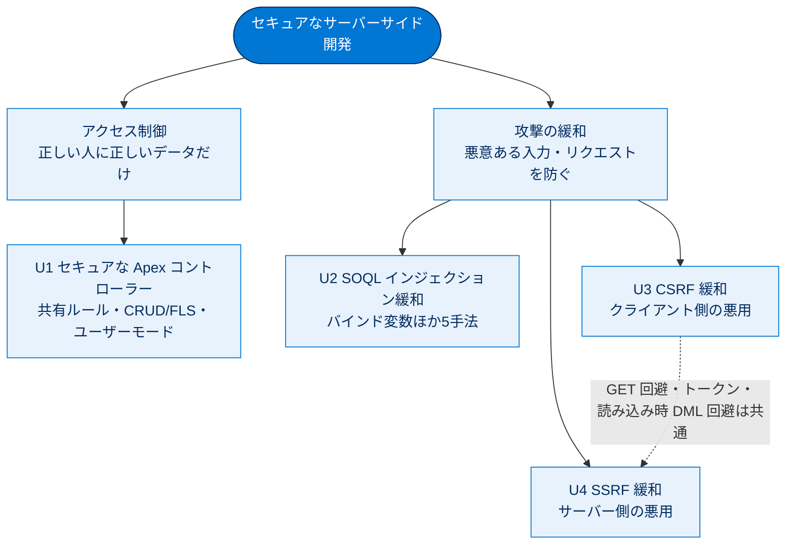

# セキュアなサーバーサイド開発 総まとめ

このトピックでは、Salesforce のサーバーサイド（主に Apex とサーバー側ロジック）で起こりうる代表的なセキュリティリスクと、その緩和策を学びました。出発点は「**Apex は標準でシステムモードで動き、共有ルール・CRUD・FLS をすべて無視する**」という事実です。そのうえで、データアクセス制御（共有ルール・CRUD/FLS）、SOQL インジェクション、CSRF、SSRF という4つの観点から、開発者が自ら防御を組み込む方法を整理しました。「制限やプラットフォーム標準の保護があるから安全」と油断せず、コードの書き方そのもので守ることが一貫したテーマです。

## 全体像

次の図は、このトピックで扱う4ユニットを「アクセス制御」と「攻撃緩和」の2系統で俯瞰したものです。

## ユニット横断 早見表

| ユニット | 学んだこと | キーワード | 一言要点 |
| --- | --- | --- | --- |
| U1 セキュアな Apex コントローラー | 共有ルールと CRUD/FLS の強制方法 | `with/without/inherited sharing`、`USER_MODE`、`WITH SECURITY_ENFORCED`、`stripInaccessible()` | Apex は標準でシステムモード。明示的に保護する |
| U2 SOQL インジェクション緩和 | 入力連結による情報漏洩と5つの対策 | バインド変数 `:var`、型キャスト、`escapeSingleQuotes()`、許可リスト、文字置換 | 最推奨は静的クエリ＋バインド変数 |
| U3 CSRF 緩和 | クライアント（ブラウザ）悪用の防止 | CSRF トークン、Origin ヘッダー、GET 回避、読み込み時 DML 回避 | ログイン中ユーザーのブラウザを悪用させない |
| U4 SSRF 緩和 | サーバー悪用による内部リソース露出の防止 | 許可リスト、URL 解析、サニタイズ、ネットワーク分離、`169.254.169.254` | サーバーを踏み台にした内部アクセスを防ぐ |

## 🎯 試験頻出ポイント

> [!ポイント] このトピックで狙われやすい論点
>
> - **Apex は標準でシステムモード**。何もしなければ共有ルール・CRUD・FLS は無視される。
> - 共有キーワードは `with sharing`（強制）/ `without sharing`（無視）/ `inherited sharing`（呼び出し元から継承）。**宣言なしは「不定」でアンチパターン**。
> - メソッドの共有設定は「**定義されたクラス**」のものが適用される。`executeAnonymous` は**常にユーザー権限**、`Pricebook2` のクエリは**共有を無視**。
> - CRUD/FLS 保護の最推奨は**ユーザーモード**（`WITH USER_MODE` / `as user` / `AccessLevel.USER_MODE`）。`WITH SECURITY_ENFORCED` は**全か無か（例外）**、`stripInaccessible()` は**除去して続行（ID は残る）**。
> - 削除（delete）は **CRUD チェックのみ**で FLS チェック不要。
> - SOQL インジェクション対策の第一選択は**静的クエリ＋バインド変数（`:var`）**。`escapeSingleQuotes()` は**文字列＋クォートに囲まれる場合のみ**有効（数値項目には無力）。
> - **許可リスト（allowlist）> ブロックリスト（blocklist）**。許可リストの方が常に強力。
> - **CSRF＝クライアント（ブラウザ）悪用、SSRF＝サーバー悪用**。混同に注意。
> - CSRF/SSRF 共通の基本：**状態変更に GET を使わない（POST/PUT）/ Origin ヘッダー検証 / トークン / ページ読み込みイベントで自動 DML しない**。
> - SSRF の主要標的はクラウドのメタデータエンドポイント（`169.254.169.254` など）。本命対策は**許可リスト（宛先制限・リダイレクト無効化）**。

## 📖 用語早見表

| 用語 | ひとことの意味 |
| --- | --- |
| システムモード | 実行ユーザーの権限を無視し全データにアクセスする状態（Apex の標準） |
| ユーザーモード | 共有ルール・CRUD・FLS・制限ルールをすべて尊重する状態（Spring '23） |
| 共有ルール（Sharing Rules） | 誰がどのレコードを参照・編集できるかを決めるレコードレベルの制御 |
| `with / without / inherited sharing` | クラス単位で共有ルールを強制／無視／呼び出し元から継承する宣言 |
| CRUD | オブジェクト単位の作成・参照・更新・削除権限 |
| FLS（項目レベルセキュリティ） | 項目単位の参照・編集権限 |
| `WITH SECURITY_ENFORCED` | SOQL で FLS/オブジェクト権限を自動検証し、不可があれば例外で停止 |
| `stripInaccessible()` | アクセス不可項目を結果から除去して続行する（ID は残す） |
| SOQL | Salesforce のレコードを参照する SELECT 専用のクエリ言語 |
| SOQL インジェクション | ユーザー入力を連結しクエリ構造を書き換えられてしまう攻撃 |
| バインド変数（`:var`） | 静的クエリ内で入力を「コード」でなく「値」として埋め込む仕組み |
| 許可リスト（Allowlist） | 既知の正しい値だけを許可する方式（ブロックリストより強力） |
| CSRF | ログイン中ユーザーのブラウザを悪用し意図しない操作をさせる攻撃 |
| CSRF トークン | リクエストごとの推測困難な秘密値。サーバーが検証して偽造を拒否 |
| Origin ヘッダー | 発信元サイトを示す、JS から改ざんできないヘッダー |
| SSRF | サーバーを騙して任意の宛先（内部リソース等）へリクエストさせる攻撃 |
| メタデータエンドポイント | `169.254.169.254` などサーバーからのみ届く内部情報の入口 |

## 豆知識

> [!豆知識] 守る対象は「2階層 × 2方向」で整理できる
>
> アクセス制御は「**レコードレベル（共有ルール）**」と「**オブジェクト・項目レベル（CRUD/FLS）**」の2階層、攻撃緩和は「**入ってくる入力（SOQL インジェクション・CSRF）**」と「**出ていくリクエスト（SSRF）**」の2方向で捉えると頭が整理されます。試験では「どのレイヤーの話か」を取り違えると選択肢を誤りやすいので、まず階層・方向を意識しましょう。

> [!豆知識] CSRF と SSRF は名前が似て紛らわしい
>
> 「Cross-Site Request Forgery」と「Server-Side Request Forgery」は1文字違いで、どちらも「Request Forgery（リクエストの偽造）」です。覚え方は頭文字で、**C は Client（クライアント＝ブラウザ）を、S は Server（サーバー）を**それぞれ悪用する、と紐付けると混同しません。攻撃の「誰が送らされるか」を押さえるのがポイントです。

> [!豆知識] プラットフォーム標準保護は「最後の砦」であって「免罪符」ではない
>
> Salesforce は CSRF トークンや SSRF 保護を標準で備えますが、教材は一貫して「標準保護だけに頼るな」と釘を刺します。読み込み時の自動 DML や、ユーザー入力のクエリ連結など、**開発者のコードの書き方が脆弱性を作り込む**ケースは標準保護では防げません。プラットフォームの保護は前提条件、コードレベルの防御は開発者の責任、という二段構えで考えるのが安全です。

## ✅ 理解度セルフチェック

> [!まとめ] 確認問題（答えは各項目の末尾）
>
> 1. 共有宣言を一切書かない Apex クラスの共有挙動は「強制」になる？ → **いいえ。「不定（呼び出し元次第）」でアンチパターン**。
> 2. CRUD/FLS をまとめて尊重する最推奨手段は？ → **ユーザーモード（`WITH USER_MODE` / `as user` / `AccessLevel.USER_MODE`）**。
> 3. アクセス不可項目があったとき、`WITH SECURITY_ENFORCED` と `stripInaccessible()` の挙動の違いは？ → **前者は例外で全体停止、後者は不可項目を除去して続行（ID は残る）**。
> 4. SOQL インジェクション対策で、数値項目（クォートに囲まれない）に `escapeSingleQuotes()` は有効？ → **いいえ。型キャストを使う**。
> 5. ブラウザを悪用するのは CSRF と SSRF のどちら？ → **CSRF（C＝Client）。SSRF はサーバーを悪用**。
> 6. SSRF で頻出する標的アドレス `169.254.169.254` は何のエンドポイント？ → **クラウドのメタデータエンドポイント（リンクローカルで外部からは直接届かない）**。
