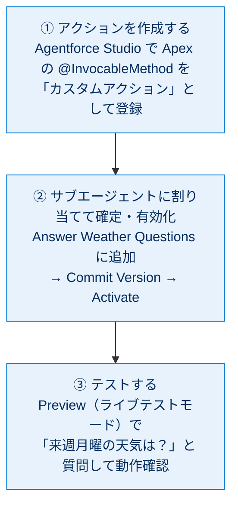
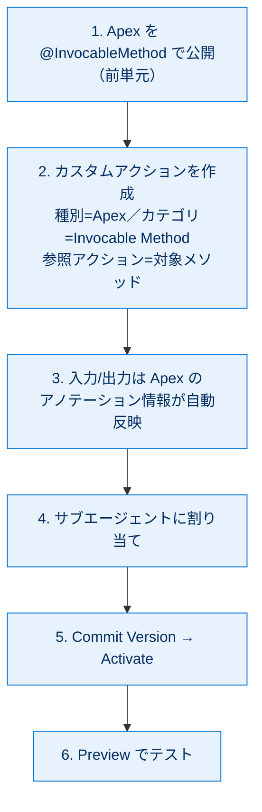

# Apex エージェントアクションを作成する

## 学習の目的

この単元を完了すると、次のことができるようになります。

- Apex エージェントアクションを作成する。
- エージェントアクションをサブエージェントに追加する。
- エージェントアクションをテストする。

> [!ポイント] この単元のゴール
>
> 前単元で準備した `@InvocableMethod`（`CheckWeather`）を、**Agentforce Builder** 上で「エージェントアクション」として登録します。Apex のパラメーター（入力/出力）が**自動でアクションに引き継がれる**様子を確認し、アクションを**サブエージェントに割り当て**、最後に**プレビューで動作テスト**する流れを体験します。

---

## 全体の流れ

この単元でやることは大きく次の 3 ステップです。



> [!用語] サブエージェント / Agentforce Builder
>
> **サブエージェント**は 1 つの AI エージェント内で特定の役割を担当する小さな単位。「天気の質問に回答する」専門のサブエージェント（Answer Weather Questions）に天気アクションを割り当てると、天気の質問が来たときにそのサブエージェントが対応します。**Agentforce Builder** は、エージェントの構成（サブエージェント・アクション・指示など）を編集し、その場でプレビューできる画面で、前単元で有効化した Agentforce Studio の中核ツールです。

---

## Apex エージェントアクションを構築する

Apex の準備ができたので、これをアクションに追加します。Apex のパラメーターが自動的にアクションに引き継がれる様子を確認できます。

> [!手順] Check Weather アクションを作成する
>
> 1. アプリケーションランチャーで **[Agentforce Studio (Agentforce スタジオ)]** を検索して選択します。
> 2. **[Agent Customization (エージェントのカスタマイズ)]** をクリックします。
> 3. **[New Version (新規バージョン)]** をクリックします。
> 4. **[Subagents (サブエージェント)]** で **[Answer Weather Questions (天気の質問に回答)]** を選択します。
> 5. **[Actions Available For Reasoning (推論に使用可能なアクション)]** で **[Select action (アクションを選択)]** → **[Create a custom action (カスタムアクションを作成)]** を選択します。
> 6. **[Action Name (アクション名)]** に `Check Weather`（天気を確認）と入力します。
> 7. **[Description (説明)]** に `This action will return the local weather information.`（このアクションを実行すると、現地の天気予報が返されます。）と入力します。
> 8. **[Reference Action Type (参照アクション種別)]** で **[Apex]** を選択します。
> 9. **[Reference Action Category (参照アクションカテゴリ)]** で **[Invocable Method (呼び出し可能なメソッド)]** を選択します。
> 10. **[Reference Action (参照アクション)]** で **[Check Weather (天気を確認)]** を選択します。
> 11. **[Create and Open (作成して開く)]** をクリックします。

> [!用語] 参照アクション種別／カテゴリ（Reference Action Type / Category）
>
> カスタムアクションが「何の処理を呼び出すか」を指定する設定。**種別 = Apex**、**カテゴリ = Invocable Method** を選ぶことで、前単元で作った `@InvocableMethod`（`CheckWeather`）をアクションの中身として参照できます。

> [!注意] 値はそのまま英語で入力する
>
> **[Action Name]** や **[Description]** に入力する値は、かっこ内の日本語は意味の説明であり、**実際に入力するのは英語の値**です。`Check Weather` や `This action will return the local weather information.` のように英語の文字列をそのまま入力してください（Challenge は英語データで評価されます）。

### 入力（Inputs）の確認

**[Inputs (入力)]** の `dateToCheck` には、前単元で `WeatherRequest.dateToCheck` に書いた情報が自動で引き継がれます。必要に応じて編集・追加できます。

> [!ポイント] Apex の `@InvocableVariable` が入力欄に自動反映される
>
> - `required=true` → **[Require Input (入力が必要)]** がデフォルトでオン。
> - `description` → 入力指示として事前入力。
> - 型 `Date` → 入力のデータ型として設定。

> [!手順] 入力を設定する
>
> 1. **[Require Input to execute action (アクションを実行するために入力を必須にする)]** がデフォルトでオンになっていることを確認します（Apex の `required=true` により自動設定）。
> 2. 事前入力された内容のとおり入力します。

### 出力（Outputs）の確認

出力は次の 3 つです。各 **[Instructions (指示)]** は対応する `description` から、**[Data Type (データ型)]** は Apex のデータ型から取得されています。

| 出力変数 | Apex のデータ型 | 説明（Instructions の元） |
| --- | --- | --- |
| `minTemperature` | `Decimal`（数値） | 指定日の最低気温（摂氏） |
| `maxTemperature` | `Decimal`（数値） | 指定日の最高気温（摂氏） |
| `temperatureDescription` | `String`（テキスト） | 指定日の気温の説明文 |

> [!手順] 出力を設定して保存・確定・有効化する
>
> 1. 3 つ目の出力 `temperatureDescription` で **[Show in conversation (会話に表示)]** をオンにします。
> 2. **[保存]** をクリックします。
> 3. **[Commit Version (バージョンを確定)]** を 2 回クリックします。
> 4. **[Activate (有効化)]** を 2 回クリックします。

> [!用語] Show in conversation / Commit Version / Activate
>
> **Show in conversation** は、その出力変数の値を会話画面にそのまま表示するかの設定。`temperatureDescription` はユーザー向けの説明文なので、オンにすると回答に反映されます。エージェントの構成変更は**バージョン**として管理され、**Commit Version** で 1 バージョンとして確定し、**Activate** で実際に動作する状態にします。

> [!注意] 確定・有効化を忘れない
>
> アクションを作って保存しただけでは「下書き」です。**Commit Version → Activate** まで完了して初めてプレビューや本番で使えます。テストして動かないときは有効化が済んでいるか確認しましょう。

これでアクションが完成しました。次はこのアクションをテストします。

---

## 天気を確認しよう

Agentforce Builder では、このツールで直接エージェントを操作してプレビューできます。

> [!用語] Preview / ライブテストモード（Live Test Mode）
>
> 作成中のエージェントと実際に会話して動作を確認できるテスト機能。本番に出す前に、正しいアクションを選び期待どおり回答するかをその場で検証できます。

> [!手順] プレビューでアクションをテストする
>
> 1. Agentforce Builder で **[Preview (プレビュー)]** をクリックします。
> 2. **[Live Test Mode (ライブテストモード)]** になっていることを確認します。
> 3. **[Describe your task or ask a question (タスクについて説明するか、質問する)]** ボックスに `What's the weather like this Monday?`（この月曜日の天気はどんな感じですか?）と入力して Enter キーを押します。
> 4. エージェントが正確な日付を尋ねたら、次の月曜日の日付を選択して送信します。

**[Conversation (会話)]** ペインに、リクエストと Coral Cloud の気温を示すエージェントの応答が表示されます。実行ステップを見ると、次の流れで **Check Weather** アクションが選択されたことがわかります。

> [!例] エージェントの内部での動き
>
> ```mermaid
> sequenceDiagram
>     actor U as ユーザー
>     participant M as "メインエージェント"
>     participant Sub as "Answer Weather Questions<br/>サブエージェント"
>     participant Act as "Check Weather アクション<br/>CheckWeather → WeatherService"
>     U->>M: "この月曜日の天気は？"
>     Note over M: 「入力」質問を受け取る／「推論」どう対応するか考える
>     M->>Sub: "サブエージェントに移行"
>     Note over Sub: 「推論」天気の質問 → Check Weather を選択
>     Sub->>Act: "アクションを実行"
>     Act-->>Sub: "気温データを取得"
>     Sub-->>U: "回答文を生成して返す"
> ```

> [!ポイント] テスト時に「ステップ」を確認する意義
>
> プレビューでは、エージェントが**どのアクションを・どの順序で**使ったかが見られます。意図したアクション（Check Weather）が選ばれているかを確認することで、`description` の書き方やアクションの割り当てが適切だったかを検証できます。

お疲れさまでした。すでに組織で使える Apex 機能を AI エージェントで活用する大きな一歩を踏み出しました。

---

## 試験対策：押さえておきたい追加ポイント

> [!ポイント] Apex アクション作成の流れ（暗記）
>
> 1. Apex を **`@InvocableMethod`** で公開する（前単元）。
> 2. Agentforce Studio で **カスタムアクションを作成**し、種別=**Apex**、カテゴリ=**Invocable Method**、参照アクションに対象メソッドを指定する。
> 3. 入力/出力は **Apex のアノテーション情報が自動反映**される。
> 4. アクションを**サブエージェントに割り当て**る。
> 5. **Commit Version → Activate** で確定・有効化する。
> 6. **Preview** でテストする。



> [!ポイント] よくある「動かない」原因チェックリスト
>
> - アクションを **Activate（有効化）** していない。
> - Apex クラスへの**アクセス権限**がエージェントに付与されていない（権限セット）。
> - `@InvocableMethod` の **`description` が曖昧**で、AI が正しく選べない。
> - アクションを**サブエージェントに割り当てて**いない。

> [!ポイント] 宣言型（フロー）アクションとの使い分け
>
> Apex アクションは、外部 API 呼び出し（コールアウト）や複雑なロジックなど**宣言型では実現しにくい処理**に向いています。単純なレコード操作ならコード不要のフローアクションのほうが保守しやすい場合もあります。試験では「どんなときに Apex を選ぶか」が問われます。

---

## リソース

- Salesforce ヘルプ: エージェントアクションの手順のベストプラクティス
- YouTube: Best Practices for Building Agentforce Apex Actions | TDX 2025: Developer Highlights
- Salesforce 開発者ブログ: Build Advanced Custom Agent Actions with Code（高度なカスタムエージェントアクションをコードで構築）

---

## ハンズオン Challenge（+500 ポイント）

> [!まとめ] あなたの Challenge：Check Weather エージェントアクションを作成する
>
> この単元は各自のハンズオン組織で実行します。**[起動]** をクリックして開始するか、組織の名前をクリックして別の組織を選びます。
>
> **採点対象**
> - 上記の詳細を使用して **[Check Weather (天気を確認)]** エージェントアクションが作成されていること。
> - **[Check Weather (天気を確認)]** エージェントアクションが（サブエージェントに）**割り当てられている**こと。
>
> **設定値（正確にそのまま入力）**
> - Action Name：`Check Weather`
> - Description：`This action will return the local weather information.`
> - Reference Action Type：`Apex`
> - Reference Action Category：`Invocable Method`
> - Reference Action：`Check Weather`
> - サブエージェント：`Answer Weather Questions`

> [!注意] 日本語環境で受講する場合
>
> Challenge は日本語の Trailhead Playground で開始し、かっこ内の翻訳を参照して進めます。評価は英語データを対象に行われるため、**英語の値のみ**をコピーして貼り付けます。不合格だった場合は、(1) [Locale (地域)] を [United States (米国)]、(2) [Language (言語)] を [English (英語)] に切り替えてから、(3) [Check Challenge (Challenge を確認)] をクリックすると通ることがあります。

---

## 🎓 この単元のまとめ

この単元では、前単元で `@InvocableMethod` 化した Apex を、Agentforce Builder 上で「カスタムアクション」として登録し、サブエージェントに割り当て、Preview で動作テストするまでの一連の流れを学びました。Apex のアノテーション情報が入力/出力欄に自動で引き継がれるのが大きなポイントです。

次の表は、アクションを「作って終わり」にしないための工程と、各工程の役割をまとめたものです。

| 工程 | 操作 | 役割・忘れると起きること |
| --- | --- | --- |
| アクション作成 | 種別=Apex／カテゴリ=Invocable Method | 対象の `@InvocableMethod` を参照アクションに指定 |
| 入力/出力の確認 | Apex のアノテーションが自動反映 | `required`・`description`・型がそのまま設定される |
| サブエージェントに割り当て | Answer Weather Questions に追加 | 割り当てないとそのアクションは選ばれない |
| 確定 | Commit Version | 確定しないと「下書き」のまま |
| 有効化 | Activate | 有効化しないとプレビュー・本番で動かない |
| テスト | Preview（ライブテストモード） | 意図したアクションが選ばれたかステップで確認 |

> [!まとめ] この単元の要点
>
> - カスタムアクション作成では **種別=Apex／カテゴリ=Invocable Method／参照アクション=対象メソッド** を指定する。
> - Apex の `@InvocableVariable`（`required`・`description`・データ型）は**アクションの入力/出力欄に自動反映**される。
> - アクションは**サブエージェント（Answer Weather Questions）に割り当て**て初めて使われる。
> - 作って保存しただけでは「下書き」。**Commit Version → Activate** で確定・有効化して初めて動く。
> - **Preview（ライブテストモード）** で実際に会話し、実行ステップから意図したアクションが選ばれたかを検証できる。

> [!豆知識] エージェントは「バージョン管理」されている
>
> エージェントの構成変更（アクション追加・指示の変更など）は、ソースコードのように**バージョン単位**で管理されます。Commit Version で 1 つのバージョンとして確定し、Activate で本番稼働させる仕組みは、リリース管理の考え方そのもの。これにより「動いていた旧バージョンに戻す」といった運用も可能になり、AI エージェントを安全に改善し続けられます。
