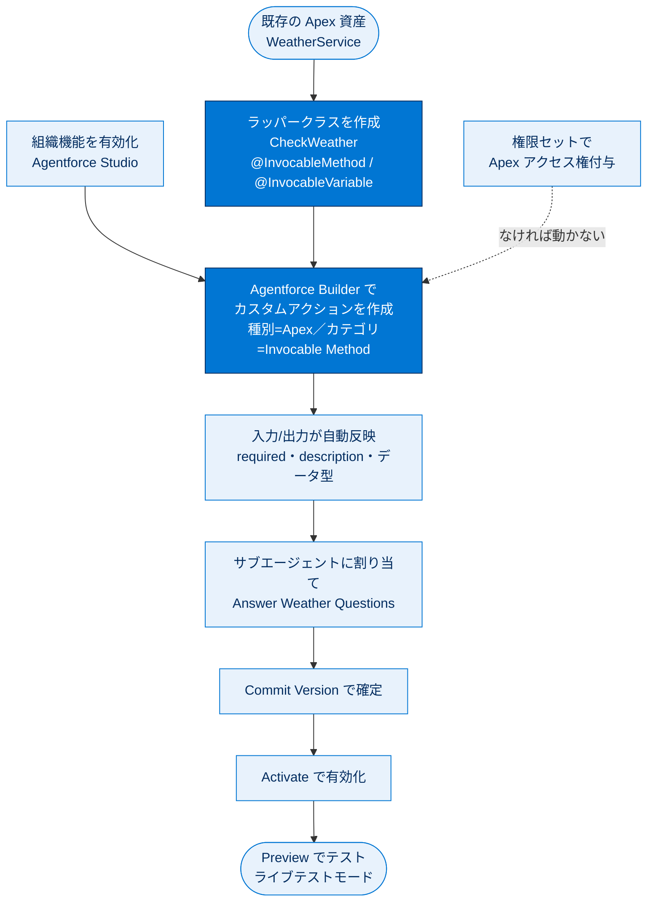

# Apex を使用したエージェントのカスタマイズ 総まとめ

このトピックでは、AI エージェント（Agentforce）に独自の能力を追加する手段である **エージェントアクション** を、**Apex** を使って構築する方法を学びました。既存の Apex クラスを直接書き換えずにラッパークラスへ `@InvocableMethod` を付けて公開し、それを Agentforce Builder 上でカスタムアクションとして登録、サブエージェントに割り当て、Commit Version → Activate で確定・有効化し、Preview でテストするまでの一連の流れが核心です。Coral Cloud Resorts の天気を答える `WeatherService` → `CheckWeather` を題材に、Apex のメタ情報がそのままアクションの入力/出力に引き継がれる仕組みを体験しました。

---

## 🗺️ トピック全体像

---

## 📚 ユニット横断 早見表

| ユニット | 学んだこと | キーワード | 一言要点 |
| --- | --- | --- | --- |
| 01 Apex アクションを作成する準備 | アクションの概念と、Apex を `@InvocableMethod` で公開する準備 | エージェントアクション／`@InvocableMethod`／`@InvocableVariable`／ラッパークラス／権限セット | 既存 Apex を書き換えず、呼び出すラッパーに `@InvocableMethod` を付けて公開する |
| 02 Apex エージェントアクションを作成する | 公開した Apex を Builder でアクション化し、割り当て・有効化・テスト | カスタムアクション／参照アクション種別=Apex／サブエージェント／Commit Version／Activate／Preview | 種別=Apex で登録 → サブエージェントに割り当て → Commit → Activate → Preview |

---

## 🎯 試験頻出ポイント

> [!ポイント] 暗記しておきたい論点
>
> - **`@InvocableMethod` のシグネチャ**：`public`（または `global`）かつ `static`、引数は **List 型を 1 つだけ**、戻り値は **List 型** または `void`。**1 クラスに 1 メソッド**だけ。バルク処理前提。
> - **`@InvocableVariable`**：入力/出力に使う変数に付ける。**`public` 必須**。`required=true` で入力必須、`label` で表示名、`description` で説明。
> - **自動反映**：Apex の `required`・`description`・データ型が、エージェントアクション作成画面の入力/出力にそのまま引き継がれる。画面で入力し直す必要はない。
> - **`description` は AI 向け**：AI がアクションをいつ・どう使うか判断する材料。曖昧だと正しく選べない。
> - **アクションを動かす 3 前提**：(1) 機能の有効化（Agentforce Studio）、(2) `@InvocableMethod` 化、(3) 権限の付与（権限セット）。
> - **作成後の必須工程**：サブエージェントへの**割り当て** → **Commit Version** → **Activate**。これを忘れると動かない（定番の不具合原因）。
> - **Apex を選ぶ場面**：外部 API 呼び出し（コールアウト）や複雑なロジックなど、宣言型（フロー）では実現しにくい処理。単純なレコード操作はフローが向く場合もある。

---

## 📖 用語早見表

| 用語 | ひとことの意味 |
| --- | --- |
| Agentforce | Salesforce 上で AI エージェントを構築・運用するプラットフォーム |
| エージェントアクション | AI エージェントが依頼を達成するために実行する具体的な処理（機能の部品） |
| Agentforce Studio | エージェント・アクションを作成/編集/テストする管理画面 |
| Agentforce Builder | 構成を編集しその場でプレビューできる Studio の中核ツール |
| `@InvocableMethod` | メソッドをフロー・REST・Agentforce から呼び出せる「アクション」にするアノテーション |
| `@InvocableVariable` | リクエスト/レスポンスのフィールドを入力/出力にするアノテーション |
| ラッパークラス | 既存クラスを書き換えず呼び出すだけの新クラス（`@InvocableMethod` を付ける） |
| HTTP コールアウト | Apex から外部 Web サービス（API）へ HTTP 要求を送り応答を受け取る仕組み |
| サブエージェント | エージェント内で特定の役割を担当する小さな単位 |
| 参照アクション種別 / カテゴリ | アクションが呼び出す処理を指定する設定（種別=Apex／カテゴリ=Invocable Method） |
| Show in conversation | 出力変数の値を会話画面にそのまま表示するかの設定 |
| Commit Version | エージェントの構成変更を 1 バージョンとして確定する操作 |
| Activate | 確定したバージョンを実際に動作する状態にする操作 |
| Preview / ライブテストモード | 作成中のエージェントと実際に会話して動作確認するテスト機能 |
| 権限セット | オブジェクト・項目・Apex クラスへのアクセス権をまとめて付与する仕組み |

---

> [!豆知識] 「Invocable」は「呼び出し可能な」という意味
>
> `@InvocableMethod` の Invocable は「呼び出せる」という形容詞。このアノテーションを 1 つ付けるだけで、同じ Apex メソッドが**フロー（宣言型）・REST API（外部アプリ）・Agentforce（AI エージェント）**という 3 つの入口から再利用できるようになります。1 つの実装を多方面から活用できる、コードの「再利用ハブ」のような役割です。

> [!豆知識] 既存資産をそのまま AI に活かせるのが Agentforce の強み
>
> Coral Cloud の `WeatherService` のように、組織にすでにある Apex 機能を AI エージェントから呼び出せるのが大きな利点です。AI のためにゼロから作り直す必要はなく、ラッパーを 1 枚かぶせるだけで既存ロジックを活用できます。「持っている資産を AI 化する」発想がポイントです。

> [!豆知識] バルク処理が前提だから引数も戻り値も List
>
> `@InvocableMethod` の引数と戻り値が必ず List 型なのは、フローやエージェントが**複数レコードをまとめて処理（バルク化）**できるよう設計されているためです。サンプルの `CheckWeather` も `requests[0]` のように List で受け取り、`new List<WeatherResponse>{ response }` で List として返しています。ガバナ制限を意識した Salesforce らしい設計思想です。

---

## ✅ 理解度セルフチェック

> [!まとめ] 知識の確認（答えは各項目の末尾）
>
> 1. 既存の Apex クラスをエージェントから使えるようにするとき、元クラスを直接書き換えるべき？ → **いいえ。書き換えず、呼び出すラッパークラスに `@InvocableMethod` を付けるのがベストプラクティス。**
> 2. `@InvocableMethod` を付けるメソッドの引数と戻り値の型は？ → **引数は List 型を 1 つだけ、戻り値は List 型（または `void`）。**
> 3. 1 つの Apex クラスに `@InvocableMethod` は複数付けられる？ → **いいえ。1 クラスにつき 1 メソッドだけ。**
> 4. Apex アクションを作成し、サブエージェントに割り当てた後に必要な 2 つの操作は？ → **Commit Version（確定）→ Activate（有効化）。**
> 5. 「アクションを追加したのにエージェントが動かない」よくある原因を 2 つ挙げよ。 → **(1) Activate していない／サブエージェントに割り当てていない、(2) Apex クラスへのアクセス権が権限セットで付与されていない。**
> 6. アクション作成画面の入力/出力欄に表示される `description` やデータ型は、どこから来る？ → **Apex の `@InvocableVariable`／`@InvocableMethod` のアノテーション情報から自動反映される。**
