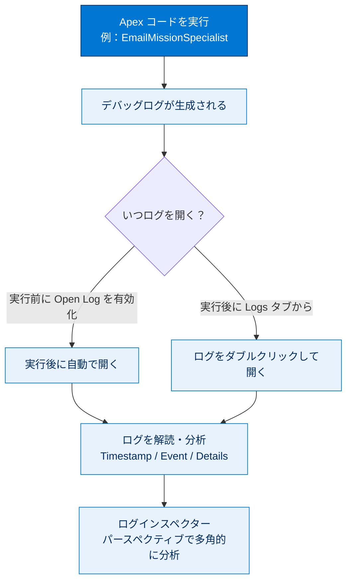
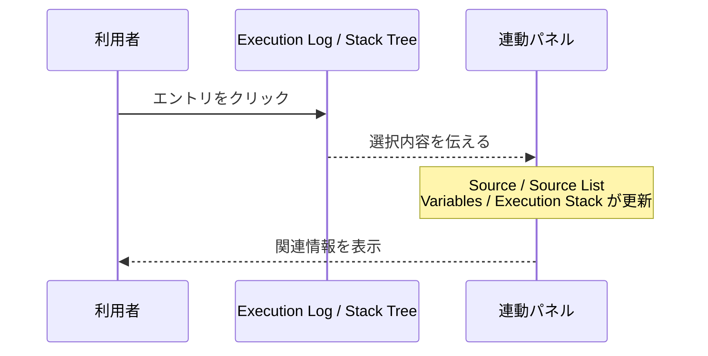
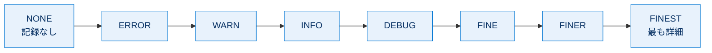
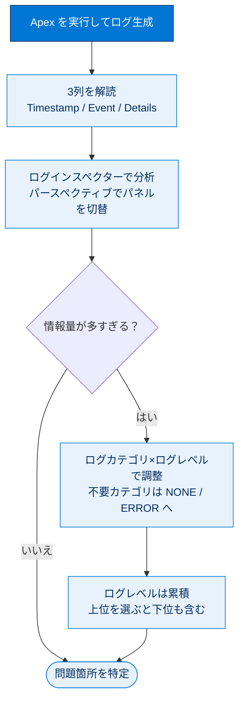

# ログの生成と分析

## 学習の目的

この単元を完了すると、次のことができるようになります。

- デバッグログを生成して表示する。
- ログデータ（タイムスタンプ・イベント・詳細）を解読する。
- ログインスペクターとパースペクティブを使ってログを多角的に分析する。
- ログカテゴリとログレベルを使って記録する情報量を制御する。

> [!ポイント] この単元のゴール
>
> **デバッグログの読み方**、**ログインスペクター／パースペクティブ**による分析、**ログカテゴリとログレベル**による情報量の調整。この3つが柱です。特にログレベルが**累積（cumulative）**である点は試験頻出です。

---

## デバッグログの表示

ログはシステムやプログラムの問題を見つけられる場所の1つです。開発者コンソールで各種デバッグログを確認すれば、コードの動作理解やパフォーマンス問題の特定ができます。

デバッグログを生成し、分析するまでの大きな流れは次のとおりです。



> [!用語] デバッグログ（Debug Log）
>
> コード実行時に、どの処理がどの順番で・どんな結果になったかを記録した実行記録。「コードの実行を時系列で残した足跡」とイメージしてください。

### テキストエディターでのログの表示

ログを生成するため、以前作成した `EmailMissionSpecialist` クラスを実行します。ログの表示方法は2通りです。

| 表示方法 | タイミング | 操作 |
| --- | --- | --- |
| 実行前に開く設定をする | 実行**前** | [Enter Apex Code] ウィンドウの **[Open Log]** を有効にする → 実行後に自動で開く |
| 一覧から開く | 実行**後** | **[Logs]** タブに表示されたログをダブルクリックする |

> [!手順] 実行と同時にログを開く
>
> 1. **[Debug] | [Open Execute Anonymous Window]** を選択する。
> 2. **[Enter Apex Code]** ウィンドウに次のコードが入っているか確認する。`Enter your email address` を自身のメールアドレスに置き換える。
> 3. **[Open Log]** オプションを選択する。
> 4. **[Execute]** をクリックする。

```apex
EmailMissionSpecialist em = new EmailMissionSpecialist();
em.sendMail('Enter your email address', 'Flight Path Change',
   'Mission Control 123: Your flight path has been changed to avoid collision '
   + 'with asteroid 2014 QO441.');
```

表示されたログは数字と単語の羅列に見えます。次にその解読方法を説明します。

---

## ログデータの解読

もう一度 `EmailMissionSpecialist` を実行しますが、今回は**わざとエラーを生成**させ、[Logs] タブで結果ログを確認します。

> [!手順] エラーを発生させてログを確認する
>
> 1. **[Debug] | [Open Execute Anonymous Window]** を選択する。
> 2. 無効なメールアドレス（`testingemail` など）を入力した次のコードを貼り付ける。
> 3. **[Open Log]** オプションを**選択解除**する。
> 4. **[Execute]** をクリックする。エラーダイアログが表示される。
> 5. **[OK]** をクリックし、**[Logs]** タブの新しいログをダブルクリックする。最新が不明なら **[Time]** 列ヘッダーで生成時間順に並べ替える。

```apex
EmailMissionSpecialist em = new EmailMissionSpecialist();
em.sendMail('testingemail', 'Flight Path Change',
   'Mission Control 123: Your flight path has been changed to avoid collision '
   + 'with asteroid 2014 QO441.');
```

各列の意味がわかればデバッグログを解読できます。

| 列 | 意味 |
| --- | --- |
| **Timestamp** | イベント発生時間。ユーザーのタイムゾーンで `HH:mm:ss:SSS` 形式。 |
| **Event** | ログエントリをトリガーしたイベント。例：無効なメールで `FATAL_ERROR`。 |
| **Details** | コードの行の詳細と、実行されたメソッド名。 |

> [!例] エラー時のログの読み方
>
> 無効なメールで実行するとログに `FATAL_ERROR` が現れます。その行の **Timestamp** で発生時刻、**Details** でどのメソッドのどの行かが分かり、エラーの発生箇所と内容を特定できます。

実行ログの表示内容は次のオプションで変更できます。

| オプション | 効果 |
| --- | --- |
| **This Frame** | 現在のフレームのイベントのみ表示 |
| **Executable** | 実行可能なイベントのみ表示 |
| **Debug Only** | `USER_DEBUG` イベントのみ表示 |
| **Filter** | 入力テキスト（メソッド名など）でログを絞り込む |

さらに **[File] | [Open Raw Log]** で**未加工ログ（Raw Log）**として表示できます。未加工ログのタイムスタンプ括弧内には、イベント開始からの経過時間がナノ秒単位で示されます。

### System.debug() で値を追跡する

特定の値をすばやく見つけたいときは `System.debug()` メソッドが有効です。

> [!用語] System.debug()
>
> コードの任意の場所に書くと、指定した文字列や変数の値をデバッグログに出力するメソッド。出力は **[Debug Only]** で絞り込めます。

```apex
System.debug('Your Message');             // メッセージを表示
System.debug(yourVariable);               // 変数の値を表示
System.debug('Your Label: ' + yourVariable);  // ラベル付きで表示
```

> [!例] ラベル付きで出力すると読みやすい
>
> `System.debug('件数: ' + theseContacts.size());` のように**ラベル＋値**で出すと、ログ上でどの値か一目でわかります。

---

## ログインスペクターを使用する

**ログインスペクター**は膨大なログを見やすくするビューアです。**[Debug] | [View Log Panels]** で確認できます。

> [!用語] ログインスペクター（Log Inspector）
>
> 1本のデバッグログを複数の「パネル」に分けて多角的に見られるビューア。実行の流れ・ソースコード・変数の値・実行時間などを互いに連動させて確認できます。

> [!注意] このメニューが使えるのはデバッグログ表示時のみ
>
> **[Debug] | [View Log Panels]** は、**デバッグログのタブを表示している場合のみ**使えます。未加工ログのタブ表示時はグレー表示になります。

ログパネルは相互に連携します。**[Execution Log]** または **[Stack Tree]** のエントリをクリックすると、他のパネル（**[Source]**・**[Source List]**・**[Variables]**・**[Execution Stack]**）が更新され関連情報が表示されます。



### ログインスペクターのパネル一覧

| パネル | 表示される内容 |
| --- | --- |
| **Stack Tree** | トップダウンのツリービュー。あるクラスが別クラスを呼ぶと、呼ばれた側が子として表示される。 |
| **Execution Stack** | 選択項目のボトムアップビュー。そのエントリを呼び出した操作が表示される。 |
| **Execution Log** | コード実行中に発生したすべてのアクション。 |
| **Source** | 選択したログエントリ生成時に実行中だったコードの行。 |
| **Source List** | イベント記録時に実行中だったコードのコンテキスト。例：無効値入力時は `execute_anonymous_apex`。 |
| **Variables** | 選択エントリ生成時の変数と、割り当てられた値（範囲内）。 |
| **Execution Overview** | 実行時間やヒープサイズなど、実行中コードの統計。 |

### パースペクティブとパースペクティブマネージャー

> [!用語] パースペクティブ（Perspective）
>
> ログインスペクターのパネルをグループ化した**レイアウト（表示の組み合わせ）**。目的に応じてパネルの組み合わせを切り替えられます。

| 定義済みパースペクティブ | 含まれるパネル |
| --- | --- |
| **デバッグ** | 実行ログ、ソース、変数 |
| **分析** | スタックツリー、実行ログ、実行スタック、実行概要 |

> [!手順] パースペクティブを切り替える・自作する
>
> 1. 切り替えは **[Debug] | [Switch Perspectives]** または **[Debug] | [Perspective Manager]**。
> 2. 自作するには、表示したいパネルの組み合わせを設定し、**[Debug] | [Save Perspective As]** を選択する。
> 3. 名前を入力して **[OK]** をクリックする。

---

## ログデータを操作して必要な情報を検索

ログの行数が増大すると貴重な情報を見逃しかねません。開発者コンソールの**ログカテゴリ**と**ログレベル**で情報量を制御できます。

### ログカテゴリ

> [!用語] ログカテゴリ（Log Category）
>
> ログに記録される**情報の種類（分類）**。種類ごとに「どれくらい詳しく記録するか（ログレベル）」を別々に設定できます。

代表的なログカテゴリは次の2つです。

| ログカテゴリ | 記録される内容 |
| --- | --- |
| **Apex コード（ApexCode）** | Apex メソッドの開始・終了など、Apex コード関連のイベント。 |
| **データベース（Database / DB）** | DML、SOSL・SOQL クエリなど、データベースイベント関連のログ。 |

> [!用語] DML（Data Manipulation Language、データ操作言語）
>
> レコードの作成・更新・削除などデータベースの中身を操作する命令の総称。Apex の `insert` / `update` / `delete` などがこれにあたり、データベースカテゴリのログに記録されます。

### ログレベルとその変更方法

> [!用語] ログレベル（Log Level）
>
> 各ログカテゴリについて**どの程度の詳細を記録するか**を決める設定。最小の `NONE` から最大の `FINEST` まで段階があります。



左に行くほど記録は少なく、右に行くほど多くなります。ログレベルは**累積**で、上位を選ぶとその下位もすべて含みます。

> [!ポイント] ログレベルは「累積」（最重要・頻出）
>
> ログレベルは**累積（cumulative）**です。`INFO` にすると下位の `ERROR`・`WARN` の情報**も**記録されます。逆に `ERROR` にすると**エラーメッセージのみ**になり、警告やそれ以上詳細な情報は記録されません。「上位レベルを選ぶと、その下位もすべて含む」と覚えましょう。なお記録の開始レベルはイベントごとに異なり、たとえば一部の ApexCode イベントは `INFO` から始まるため、`ERROR` ではそれらを受け取れません。

> [!例] ロボットの警告を黙らせる
>
> 不要なデータベースの記録をログに出したくないときは、**DB カテゴリ**のログレベルを `NONE` または `ERROR` に設定します。すると情報が減り、本当の問題を特定しやすくなります。

> [!手順] ログレベルを変更する
>
> 1. **[Debug] | [Change Log Levels]** を選択する。
> 2. **[General Trace Setting for You]** タブで **[Add/Change]** をクリックする。
> 3. **[Change DebugLevel]** ウィンドウで、各カテゴリのログレベルを選択する。

> [!注意] FINEST はログ制限に注意
>
> `FINEST` にすると、コードが**ログの制限に達して実行に時間がかかる**ことがあります。なおレベル更新時にすべてのレベルが表示されなくても問題ありません（記録を増やすレベルのみリストされます）。

---

## 試験対策：押さえておきたい追加ポイント

> [!ポイント] この単元の頻出ポイント整理
>
> - デバッグログの 3 列は **Timestamp / Event / Details**。
> - `USER_DEBUG`（＝ `System.debug()` の出力）だけ見たいときは **[Debug Only]**。
> - **未加工ログ**の括弧内は、イベント開始からの経過時間（**ナノ秒**）。
> - **ログレベルは累積**：`INFO` を選ぶと `ERROR`・`WARN` も含む。`ERROR` ならエラーのみ。
> - ログレベルの上限 `FINEST` はログ制限・性能に注意。
> - **ログインスペクター**のメニューはデバッグログ表示時のみ有効（未加工ログでは不可）。
> - **パースペクティブ**＝パネルのレイアウト。自作して保存できる。

---

## リソース

- Salesforce ヘルプ：[Logs（ログ）] タブ
- Salesforce ヘルプ：ログインスペクター
- Salesforce ヘルプ：デバッグログ

---

## ハンズオン Challenge（+500 ポイント）

> [!まとめ] あなたの Challenge：Perspective を作成し、ログを生成して分析する
>
> デバッグログを生成し、カスタム Perspective（パースペクティブ）を作成してデバッグログを分析します。
>
> **手順**
> 1. `SFDC_DevConsole` デバッグレベルについて、`ApexCode` のログレベルを `FINEST` に設定する。
> 2. **[Execute Anonymous window（実行匿名）]** で、前に作成した `EmailMissionSpecialist` クラスを自分のメールアドレスを指定して実行する。
> 3. 開発者コンソールの Perspective を作成する。含めるパネルは次のとおり。
>    - Stack Tree（スタックツリー）
>    - Execution Stack（実行スタック）
>    - Execution Log（実行ログ）
>    - Source（ソース）
>    - Execution Overview（実行の概要）
> 4. Name（名前）：`Execution Details`（実行の詳細）

> [!注意] 日本語環境で受講する場合
>
> Challenge は日本語の Trailhead Playground で開始し、かっこ内の翻訳を参照しながら進めます。評価は英語データに対して行われるため、**英語の値のみ**をコピー&ペーストします。日本語組織で不合格になった場合は、(1) [Locale] を [United States] に、(2) [Language] を [English] に切り替えてから、(3) [Check Challenge] をクリックすると通ることがあります。

---

## 🎓 この単元のまとめ

この単元では、デバッグログの読み方（Timestamp / Event / Details）、ログインスペクターとパースペクティブによる多角的分析、そしてログカテゴリとログレベルによる情報量の制御を学びました。特に「ログレベルは累積」という挙動が要です。

次の図は、ログを「生成 → 解読 → 分析 → 情報量を絞る」という一連の流れと、その中でのログレベルの役割を俯瞰したものです。



> [!まとめ] この単元の要点
>
> - デバッグログの3列は **Timestamp / Event / Details**。`System.debug()` の出力（`USER_DEBUG`）だけ見るなら **[Debug Only]**。
> - **未加工ログ（Raw Log）** の括弧内はイベント開始からの経過時間（**ナノ秒**）。
> - **ログインスペクター**は1本のログを複数パネルで連動表示するビューア（デバッグログ表示時のみ有効）。
> - **パースペクティブ**はパネルのレイアウト。定義済み（デバッグ・分析）に加え自作・保存できる。
> - **ログレベルは累積**：`INFO` を選ぶと `ERROR`・`WARN` も含む。`ERROR` ならエラーのみ。上限 `FINEST` はログ制限・性能に注意。

> [!豆知識] FINEST の上に「もう1段」はない
>
> Salesforce のログレベルは `NONE → ERROR → WARN → INFO → DEBUG → FINE → FINER → FINEST` の8段階で、`FINEST` が最も詳細な最上位です。Java 標準ロギングの慣習（FINE / FINER / FINEST）をそのまま借りた命名で、「FINEST より細かい」レベルは存在しません。細かく出すほど記録が増えてログ制限に達しやすくなるため、原因切り分けが終わったらレベルを下げておくのが実務の定石です。
