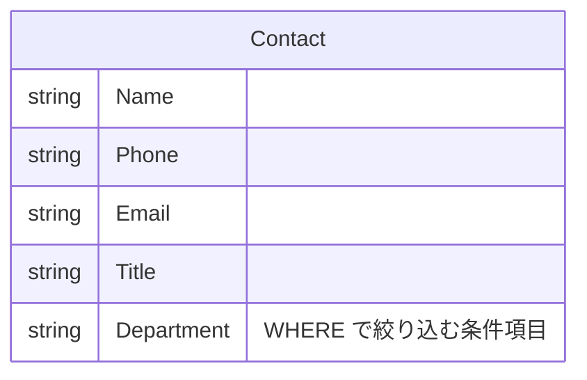
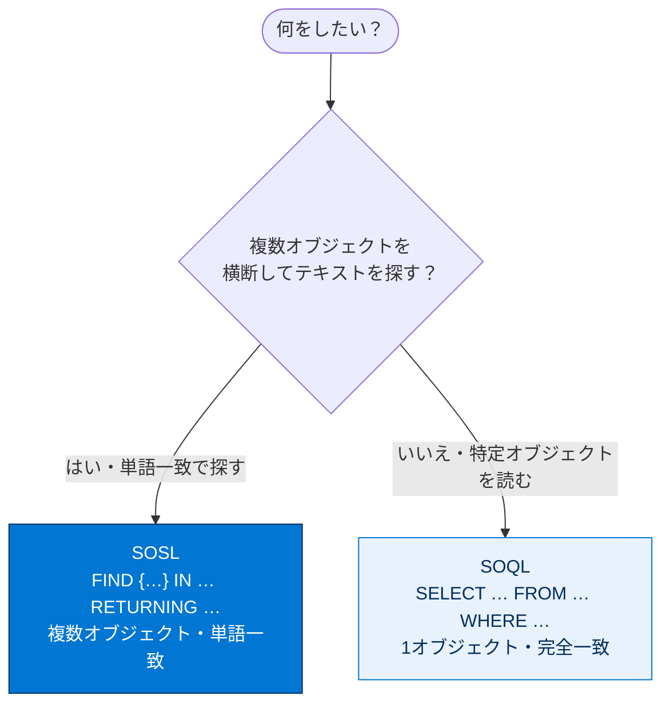
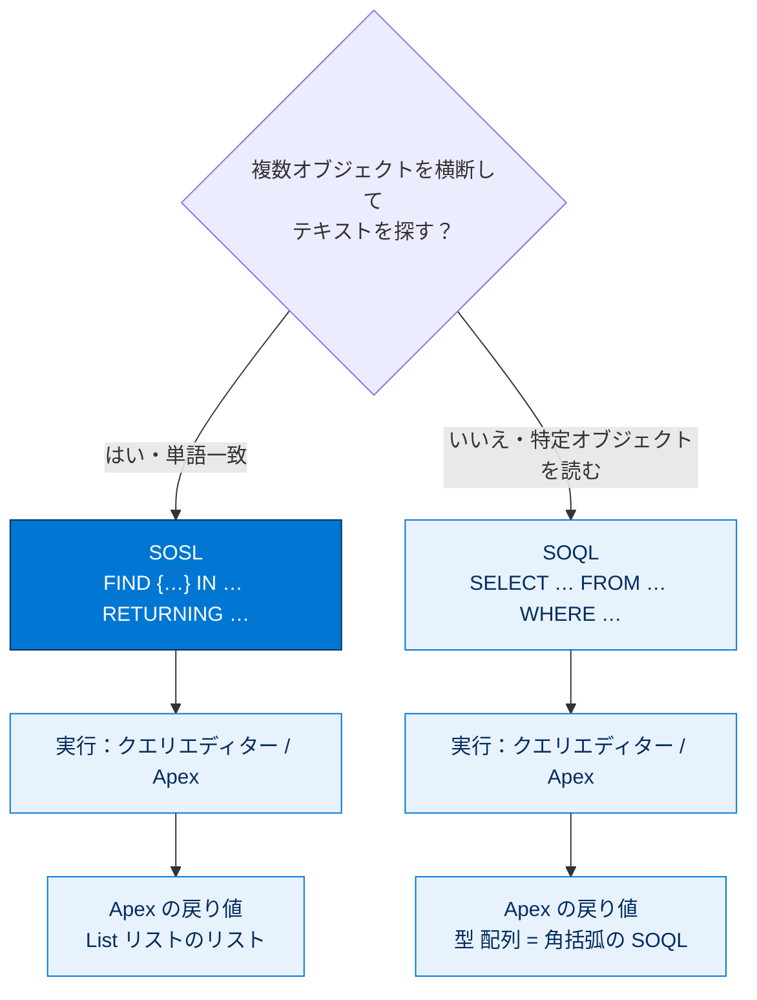

# SOQL クエリと SOSL クエリの実行

## 学習の目的

この単元を完了すると、次のことができるようになります。

- クエリエディターを使用して、または Apex コードで SOQL クエリを実行する。
- クエリエディターを使用して、または Apex コードで SOSL 検索を実行する。

> [!ポイント] この単元のゴール
>
> **SOQL（読み込み）**と **SOSL（テキスト検索）**の違いを理解し、**クエリエディター**と **Apex コード（インライン）**の両方で実行できるようになることが目標です。「SOQL = 1オブジェクト・完全一致」「SOSL = 複数オブジェクト横断・単語一致」という対比が最重要です。

---

## SOQL クエリとは?

**SOQL**（Salesforce Object Query Language）は、組織のデータベースに保存された情報を読み込む言語です。構文は SQL に似ています。

> [!用語] SOQL（ソークル、Salesforce Object Query Language）
>
> Salesforce のデータベースから**レコードを読み込む（検索する）**ための言語。SQL に似た文法（`SELECT ... FROM ... WHERE ...`）を持ち、**1回のクエリで対象は1種類のオブジェクト**です。

SOQL は Apex コードまたは開発者コンソールの**クエリエディター**で実行できます。

> [!用語] クエリエディター（Query Editor）
>
> 開発者コンソールのタブの1つ。SOQL や SOSL を入力して即座に実行し、結果を表で確認できます。Apex を書かなくてもデータを検索できます。

---

## SOQL クエリの実行

検索するデータが必要なので、まず3名の制御エンジニアの連絡先を追加します。

> [!手順] 検索対象のデータ（連絡先3件）を追加する
>
> 1. **[Debug] | [Open Execute Anonymous Window]** を選択する。
> 2. 次のコードを貼り付けて実行する。3 名の連絡先が Contact オブジェクトに追加される。

```apex
// 1人目の連絡先を追加
Contact contact1 = new Contact(
   Firstname='Quentin',
   Lastname='Foam',
   Phone='(415)555-1212',
   Department= 'Specialty Crisis Management',
   Title='Control Engineer - Specialty - Solar Arrays',
   Email='qfoam@trailhead.com');
insert contact1;   // データベースに挿入（DML）
// 2人目の連絡先を追加
Contact contact2 = new Contact(
   Firstname='Vega',
   Lastname='North',
   Phone='(416)556-1312',
   Department= 'Specialty Crisis Management',
   Title='Control Engineer - Specialty - Propulsion',
   Email='vnorth@trailhead.com');
insert contact2;
// 3人目の連絡先を追加
Contact contact3 = new Contact(
   Firstname='Palma',
   Lastname='Sunrise',
   Phone='(554)623-1212',
   Department= 'Specialty Crisis Management',
   Title='Control Engineer - Specialty - Radiators',
   Email='psunrise@trailhead.com');
insert contact3;
```

> [!用語] DML（Data Manipulation Language、データ操作言語）
>
> `insert`（作成）・`update`（更新）・`delete`（削除）など、データベースのレコードを操作する命令の総称。上のコードは `insert` で連絡先レコードを追加しています。

データを追加したら、クエリエディターで SOQL を実行できます。SOQL は特定オブジェクトのデータを検索し、**WHERE 句**で絞り込めます。

> [!手順] クエリエディターで SOQL を実行する
>
> 1. 次のクエリを **[Query Editor]** タブに入力する。
> 2. **[Execute]** をクリックする。
> 3. 特殊危機管理部門の連絡先の詳細が表示される。

```sql
SELECT Name, Phone, Email, Title FROM Contact
                                 WHERE (Department = 'Specialty Crisis Management')
```

> [!用語] WHERE 句
>
> クエリの検索条件を指定する部分。条件に合うレコードだけが結果に返ります。

このクエリが読み込む Contact オブジェクトと、SELECT で取得している項目の関係は次のとおりです。



クエリを再実行するには、**[Query Results]** パネルの **[Refresh Grid]** をクリックします。

### インライン SOQL クエリ（Apex 内で実行）

> [!用語] インライン SOQL クエリ（Inline SOQL Query）
>
> Apex コードの中に `[ ... ]`（角括弧）で直接 SOQL を書いて実行する書き方。結果をそのまま変数（リスト）に受け取り、続けてプログラムで処理できます。

> [!手順] Apex でインライン SOQL を実行する
>
> 1. **[Debug] | [Open Execute Anonymous Window]** を選択する。
> 2. 次のコードを入力して実行する。
> 3. 実行後にログが開く。`USER_DEBUG` メッセージのみ表示するには **[Debug Only]** を選択する。

```apex
Contact[] theseContacts = [SELECT Name, Phone, Email, Description FROM Contact
                           WHERE (Department='Specialty Crisis Management')
                           ORDER BY Name];   // 角括弧内がインライン SOQL。名前順に並べる
System.debug(theseContacts.size() + ' contact(s) returned.');   // 件数をログ出力
System.debug(theseContacts);                                    // 配列の中身をログ出力
```

> [!用語] ORDER BY 句
>
> 結果の並び順を指定する句。`ORDER BY Name` で名前のアルファベット順、末尾に `DESC` を付けると降順になります。

---

## SOSL 検索とは?

**SOSL**（Salesforce Object Search Language）は、レコード内の**テキスト検索**を実行する言語です。SOQL と異なり、**同時に複数種別のオブジェクト**を検索できます。また SOSL は**単語の一致**で項目を見つけるのに対し、SOQL は語句が**完全に一致**している必要があります。

> [!用語] SOSL（ソッスル、Salesforce Object Search Language）
>
> 複数のオブジェクトを**横断して**テキストを検索する言語。`FIND {検索語} ...` の形で書き、検索語を含むレコードを複数オブジェクトからまとめて探せます。

「Crisis」で連絡先を SOSL 検索すると、すべての連絡先項目が検索され、この単語を含む全レコードが返ります。SOQL で同じことをするには、検索対象項目と完全な語句を指定する必要があります。なお SOQL でも SOSL でも `LIKE` やワイルドカードで絞り込めます。

### SOQL と SOSL の違い

| 比較項目 | SOQL | SOSL |
| --- | --- | --- |
| 主な用途 | レコードの**読み込み**（クエリ） | レコードの**テキスト検索** |
| 対象オブジェクト | **1 種類のみ** | **複数種別を同時に**検索可 |
| 一致の仕方 | **完全一致**（語句が完全に一致） | **単語一致**（単語の一致で見つける） |
| 構文の始まり | `SELECT ... FROM ...` | `FIND {...} ...` |

> [!ポイント] SOQL vs SOSL（最重要・頻出）
>
> - **「1オブジェクト・完全一致・SELECT」＝ SOQL**。
> - **「複数オブジェクト横断・単語一致・FIND」＝ SOSL**。
> - 横断的にテキストを探すなら SOSL、特定オブジェクトから条件付きで読むなら SOQL、と覚えましょう。

検索の目的から、どちらを使うかを選べます。



---

## SOSL 検索の実行

> [!手順] クエリエディターで SOSL を実行する
>
> 1. **[Query Editor]** タブに次の SOSL クエリを入力する。検索語は部門名の一部「Crisis」だけ。
> 2. 実行して **[Search Results]** ペインで結果を確認する。

```sql
FIND {Crisis} IN ALL FIELDS RETURNING Contact(FirstName, LastName, Phone, Email, Title)
```

> [!例] SOSL クエリの読み方
>
> - `FIND {Crisis}` … すべての項目から「Crisis」を含むレコードを探す。
> - `IN ALL FIELDS` … 検索範囲は全項目。
> - `RETURNING Contact(...)` … Contact オブジェクトから、指定した項目を返す。

SOQL と同様に、Apex コード内でも SOSL を実行できます。

> [!手順] Apex でインライン SOSL を実行する
>
> 1. **[Debug] | [Open Execute Anonymous Window]** を選択する。
> 2. 次のコードを実行する。
> 3. ログを開き **[Debug Only]** を選択する。実行ログに制御エンジニアの氏名がリストされる。

```apex
List<List<sObject>> searchList = [FIND 'Crisis' IN ALL FIELDS
                                  RETURNING Contact(FirstName, LastName,
                                  Phone, Email, Description)];   // インライン SOSL
Contact[] searchContacts = (Contact[])searchList[0];   // 1番目の結果リストを Contact 配列に取り出す
System.debug('Found the following contacts:');
for (Contact c : searchContacts) {
   System.debug(c.LastName + ', ' + c.FirstName);   // 姓, 名 の形でログ出力
}
```

> [!用語] sObject（エスオブジェクト）
>
> Salesforce のレコードを Apex で扱うときのオブジェクト型。Contact や Account などの各レコードはすべて sObject の一種です。SOSL は複数オブジェクトを返せるため、結果は `List<List<sObject>>`（リストのリスト）で受け取ります。

> [!注意] SOSL の戻り値はなぜ「リストのリスト」?
>
> SOSL は**複数種類のオブジェクト**を同時に検索できるため、戻り値は `List<List<sObject>>` です。外側のリストが「オブジェクト種別ごと」、内側が「そのオブジェクトのレコード群」。上のコードは `searchList[0]` で最初（Contact）の結果リストを取り出しています。

---

## 試験対策：押さえておきたい追加ポイント

> [!ポイント] この単元の頻出ポイント整理
>
> - **SOQL**：`SELECT ... FROM ... WHERE ...`。**1オブジェクト**を**完全一致**で読み込む。
> - **SOSL**：`FIND {...} IN ... RETURNING ...`。**複数オブジェクトを横断**して**単語一致**でテキスト検索。
> - 実行場所は **クエリエディター** か **Apex コード（インライン）** の2通り。
> - Apex 内の SOQL は `Type[] var = [SELECT ...];`、SOSL の戻り値は `List<List<sObject>>`。
> - `WHERE`（条件）・`ORDER BY`（並び順）・`LIKE`／ワイルドカード（あいまい検索）を押さえる。
> - `USER_DEBUG`（`System.debug()` 出力）だけ見たいときは **[Debug Only]**。

---

## リソース

- 「Apex の基礎とデータベース」 Trailhead モジュール

---

## ハンズオン Challenge（+500 ポイント）

> [!まとめ] あなたの Challenge：データベースを検索する SOSL クエリを作成する
>
> Neptune Space Station（海王星宇宙ステーション）にいる Mission Specialist（宇宙飛行技術者）の取引先責任者の詳細を検索して返す SOSL クエリを作成します。
>
> **事前作業：検索対象データを追加する**
> 次のコードを **[Execute Anonymous window（実行匿名）]** で実行し、Neptune の Mission Specialist の取引先責任者を追加します。
>
> ```apex
> Contact thisContact = new Contact(
>     FirstName = 'Brian',
>     LastName = 'Dent',
>     Phone = '(619) 852-4569',
>     Department = 'Mission Control',
>     Title = 'Mission Specialist - Neptune',
>     Email = 'briandent@trailhead.com');
> insert thisContact;
> ```
>
> **手順**
> 1. 制御エンジニアレコードの検索に使用した Apex コードを **[Execute Anonymous window（実行匿名）]** に貼り付ける。
> 2. 挿入した Mission Specialist レコードを見つけられるよう、インライン SOSL クエリを変更する。
>    - `Mission Control` の取引先責任者を検索する。
>    - 取引先責任者の姓と名を取得する。
> 3. `System.debug` メソッドでデバッグログに `LastName, FirstName` を書き込む。
> 4. コードを実行する。

> [!注意] 日本語環境で受講する場合
>
> Challenge は日本語の Trailhead Playground で開始し、かっこ内の翻訳を参照しながら進めます。評価は英語データに対して行われるため、**英語の値のみ**をコピー&ペーストします。日本語組織で不合格になった場合は、(1) [Locale] を [United States] に、(2) [Language] を [English] に切り替えてから、(3) [Check Challenge] をクリックすると通ることがあります。

---

## 🎓 この単元のまとめ

この単元では、レコードを読み込む **SOQL** とテキストを横断検索する **SOSL** の違いを理解し、それぞれを**クエリエディター**と **Apex コード（インライン）** の両方で実行する方法を学びました。「SOQL = 1オブジェクト・完全一致・SELECT」「SOSL = 複数オブジェクト横断・単語一致・FIND」という対比が核心です。

次の図は、目的に応じた SOQL / SOSL の選択と、それぞれの実行場所・受け取り方を俯瞰したものです。



> [!まとめ] この単元の要点
>
> - **SOQL**：`SELECT ... FROM ... WHERE ...`。**1オブジェクト**を**完全一致**で読み込む。
> - **SOSL**：`FIND {...} IN ... RETURNING ...`。**複数オブジェクトを横断**して**単語一致**で検索。
> - 実行場所は **クエリエディター** と **Apex コード（インライン）** の2通り。
> - Apex 内の SOQL は `Type[] var = [SELECT ...];`、SOSL の戻り値は `List<List<sObject>>`（リストのリスト）。
> - `WHERE`（条件）・`ORDER BY`（並び順）・`LIKE`／ワイルドカード（あいまい検索）を押さえる。`USER_DEBUG` だけ見るなら **[Debug Only]**。

> [!豆知識] 読みは「ソークル」と「ソッスル」
>
> SOQL は "sockle（ソークル）"、SOSL は "sozzle（ソッスル）" と発音するのが Salesforce コミュニティの慣習です。綴りが1文字（Q と S）しか違わないため聞き分けにくいのですが、「Q＝Query（読み込み）」「2つ目の S＝Search（検索）」と頭文字の意味で覚えると混同しにくくなります。試験でも両者の用途を入れ替えた選択肢がよく出ます。
