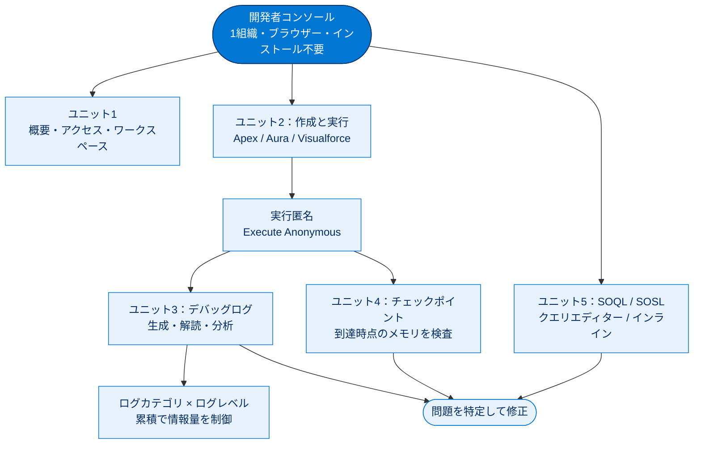

# 開発者コンソールの基礎 総まとめ

このトピックでは、Salesforce 組織を「操縦」するためのブラウザーベース IDE である**開発者コンソール**を、入口から実務フローまで一気通貫で学びました。コンソールの位置づけ（何ができ、いつ使うか）から始まり、Apex／Aura／Visualforce の**作成と実行**、**デバッグログ**の生成と分析、**チェックポイント**によるメモリ検査、そして **SOQL／SOSL** によるデータ検索までを扱いました。「コードを書く → 動かす → 問題を見つける → データを確かめる」という開発サイクルの全工程を、1つのコンソール上でたどれるようになるのがゴールです。

---

## 全体像

次の図は、開発者コンソールを中心に、各ユニットで学んだ機能がどう連携するかを1枚で俯瞰したものです。

---

## ユニット横断 早見表

| ユニット | 学んだこと | キーワード | 一言要点 |
| --- | --- | --- | --- |
| **1. 使用開始** | コンソールの正体・選択基準・アクセス・ワークスペース | IDE / 1組織 / バージョン管理なし / LWC 不可 / ワークスペース | 開発作業を1画面に集めたブラウザーベース IDE。複数組織や Git なら VS Code 拡張機能 |
| **2. 作成と編集** | Apex・Aura・Visualforce の作成と実行匿名 | File \| New / 実行匿名 / コンポーネントバンドル / VF=ページ中心 | 保存時に構文チェック。実行匿名は本番データに影響する |
| **3. ログ** | デバッグログの解読・分析・情報量制御 | Timestamp/Event/Details / ログインスペクター / パースペクティブ / ログレベルは累積 | ログレベルは累積（上位を選ぶと下位も含む）が最重要 |
| **4. チェックポイント** | 実行時点のメモリ検査 | 最大5つ / Apex のみ / 到達時記録 / Heap・Symbols | エラーの手前に置く。到達してはじめて記録される |
| **5. SOQL / SOSL** | レコードの読み込みとテキスト検索 | SELECT…FROM…WHERE / FIND{…} / 完全一致 vs 単語一致 / List のリスト | SOQL=1オブジェクト完全一致、SOSL=複数横断・単語一致 |

---

## 🎯 試験頻出ポイント

> [!ポイント] このトピックで狙われやすい論点
>
> - **開発者コンソール = IDE**。接続は **1組織のみ・ブラウザーベース・インストール不要・バージョン管理なし**。複数組織／比較同期／Git は **VS Code 向け Salesforce 拡張機能**。
> - 開発者コンソールで作れるのは **Apex・Aura コンポーネント・Visualforce**。**LWC は作れない**（最頻出）。
> - **実行匿名（Execute Anonymous）** で実行したコードは**本番データに影響する**（delete すれば本当に消える）。
> - **Visualforce = ページ中心・サーバー側で再読み込み**、**Lightning = コンポーネント中心・クライアント側で処理**。
> - デバッグログの3列は **Timestamp / Event / Details**。`System.debug()`（`USER_DEBUG`）だけ見るなら **[Debug Only]**。未加工ログの括弧内は経過時間（**ナノ秒**）。
> - **ログレベルは累積**：`INFO` を選ぶと `ERROR`・`WARN` も含む。順序は `NONE→ERROR→WARN→INFO→DEBUG→FINE→FINER→FINEST`。
> - **チェックポイントは最大5つ・Apex のみ**（VF 不可）。**設定行に到達したときだけ**記録され、必要権限は **「すべてのデータの参照」**、追跡フラグは **Apex ログレベル `INFO` 以上**。
> - **SOQL**＝`SELECT…FROM…WHERE`・1オブジェクト・完全一致。**SOSL**＝`FIND{…}…RETURNING`・複数オブジェクト横断・単語一致。SOSL の戻り値は `List<List<sObject>>`。

---

## 📖 用語早見表

| 用語 | ひとことの意味 |
| --- | --- |
| **開発者コンソール** | 組織内で動くブラウザーベースの統合開発環境（IDE） |
| **IDE（統合開発環境）** | エディター＋デバッガー＋実行環境が一体になったツール |
| **ワークスペース** | タブにまとめた一連のリソース（コード・ログ等）の作業セット |
| **Apex** | Salesforce サーバー側で動くオブジェクト指向プログラミング言語 |
| **実行匿名（Execute Anonymous）** | クラスに保存せずその場で Apex を即実行する機能 |
| **Aura コンポーネント** | 開発者コンソールで作れる従来型の UI フレームワーク部品 |
| **コンポーネントバンドル** | cmp・Controller・Helper・Style などをまとめた1部品の一式 |
| **Visualforce** | `<apex:...>` タグで画面を作るページ中心の開発フレームワーク |
| **デバッグログ** | コード実行を時系列で記録した実行記録 |
| **ログインスペクター** | 1本のログを複数パネルで連動表示するビューア |
| **パースペクティブ** | ログインスペクターのパネルのレイアウト（組み合わせ） |
| **ログレベル** | カテゴリごとに記録の詳細度を決める設定（累積） |
| **チェックポイント** | 実行が到達した時点のメモリ状態を撮影するスナップショット |
| **ヒープ（Heap）** | 実行中にオブジェクトを置くメモリ領域 |
| **SOQL** | 1オブジェクトをクエリしてレコードを読み込む言語 |
| **SOSL** | 複数オブジェクトを横断してテキスト検索する言語 |
| **sObject** | Apex でレコードを扱うときの汎用オブジェクト型 |

---

> [!豆知識] 全編に流れる「宇宙ミッション」のたとえ
>
> このモジュールは一貫して宇宙船・宇宙ステーションの運用になぞらえています。サンプルクラス `EmailMissionSpecialist`（宇宙飛行技術者へメール送信）や、飛行軌道変更・小惑星 2014 QO441 との衝突回避といった本文の例はすべてその世界観です。「組織を操縦する」というメタファーが、コンソールが各種計器を1枚に集めたコックピットである、という役割理解とつながっています。

> [!豆知識] LWC が「作れない」のはコンソールだけ
>
> 「LWC は作れない」のはあくまで開発者コンソールの制約であって、Salesforce で LWC が使えないわけではありません。LWC は VS Code 向け Salesforce 拡張機能や Salesforce CLI を使ったローカル開発で作成・デプロイします。試験では「開発者コンソールで作れるもの／作れないもの」の文脈で問われるので、主語が「開発者コンソール」であることを必ず確認しましょう。

> [!豆知識] チェックポイントは「止めない」デバッグ
>
> 一般的なデバッガーのブレークポイントは実行を一時停止しますが、Salesforce のチェックポイントはコードを止めず、指定行を通過した瞬間のメモリだけを記録します。サーバー側 Apex を対話的に止めにくいという事情から生まれた方式で、だからこそ「行に到達しないと何も残らない」という挙動になります。

---

## ✅ 理解度セルフチェック

> [!まとめ] 答えられるか確認しよう（答えは各項目の末尾）
>
> 1. 開発者コンソールは複数の組織に同時接続できる？ → **いいえ（1組織のみ）。複数組織は VS Code 拡張機能**
> 2. 開発者コンソールで LWC を作成できる？ → **いいえ（作れるのは Apex・Aura・Visualforce）**
> 3. 実行匿名で実行した delete は本番データに影響する？ → **はい（実際にレコードが消える）**
> 4. ログレベルを `INFO` にすると `ERROR` や `WARN` も記録される？ → **はい（ログレベルは累積）**
> 5. チェックポイントは最大いくつまで設定でき、対象は？ → **最大5つ／Apex のみ（Visualforce 不可）**
> 6. 「複数オブジェクトを横断して単語一致でテキスト検索する」言語は SOQL と SOSL のどちら？ → **SOSL（SOQL は1オブジェクト・完全一致）**
