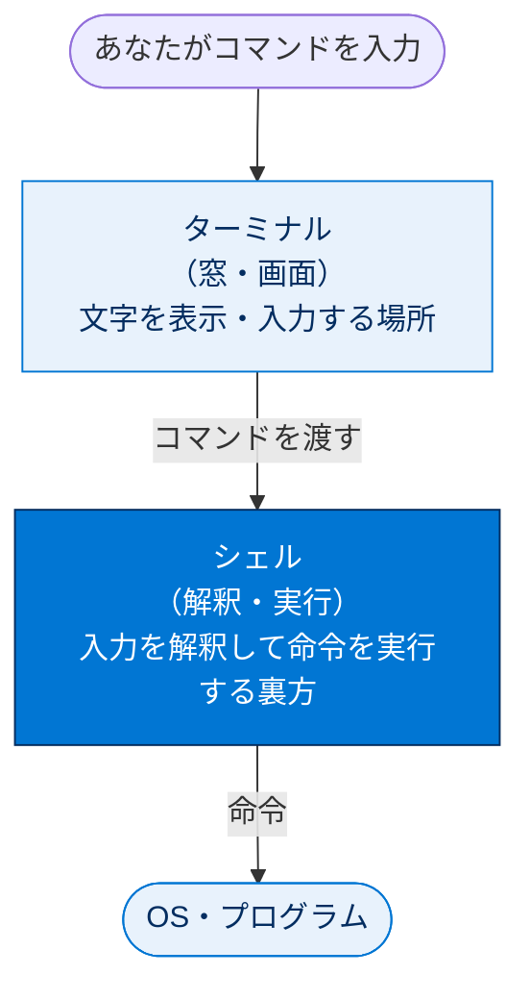
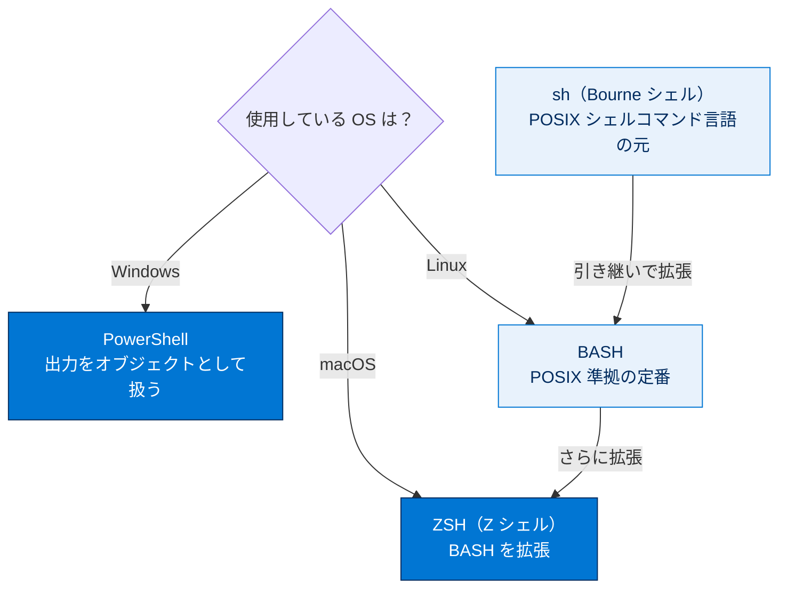
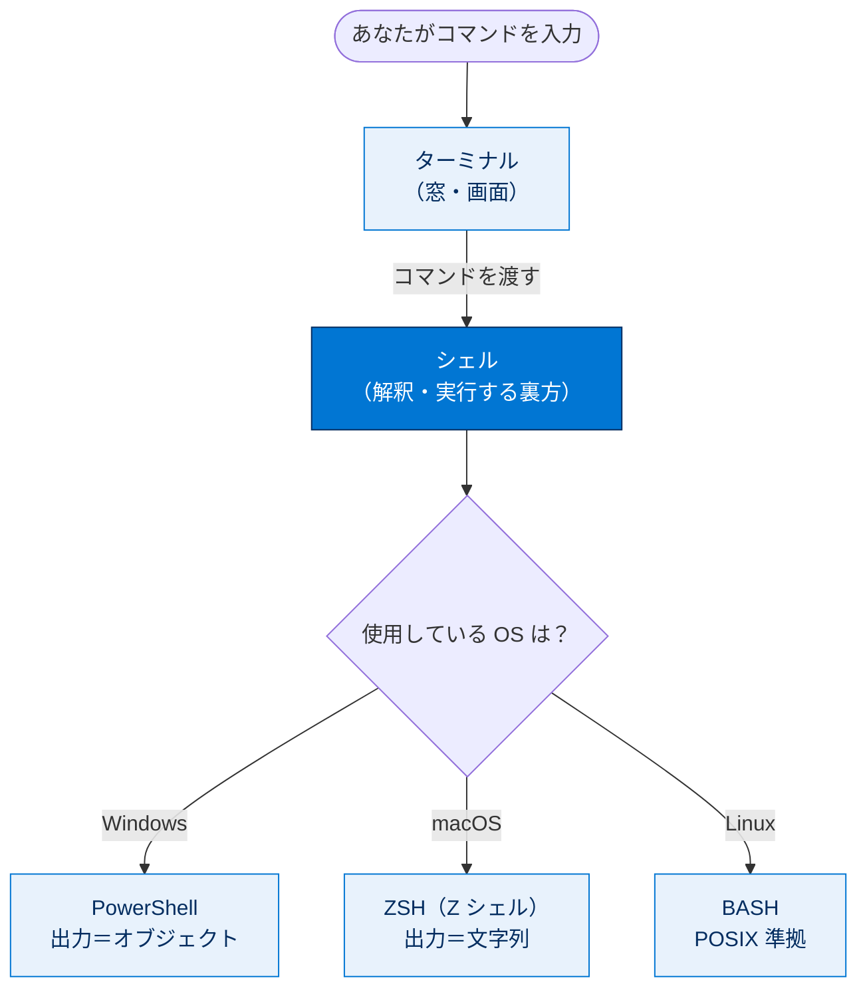

# コマンドラインインターフェースの概要

## 学習の目的

この単元を完了すると、次のことができるようになります。

- コマンドラインインターフェース（CLI）とは何かを説明する。
- 開発者が GUI ではなくコマンドラインツールを使う理由を説明する。
- 自分の OS（macOS / Linux / Windows）のコマンドラインツールを見つける。
- シェルとは何かを理解し、各 OS のシェルを識別する。

> [!ポイント] この単元のゴール
>
> 「**CLI＝文字でコンピューターに命令する道具**」「**シェル＝入力したコマンドを解釈して実行する裏方のプログラム**」を区別できるようにすることがゴール。あわせて、Windows のデフォルトシェルは **PowerShell**、macOS のデフォルトシェルは **ZSH** という対応を覚えればテスト対策は十分です。

---

## コマンドラインインターフェース（CLI）

GUI は画面・ボタン・メニューで構成されるインターフェースで、ナビゲーションやデータ更新などの基本タスクを簡単に実行できます。一方コマンドラインツールはテキストベースで、コマンドを入力してコンピューターやプログラムと直接やり取りします。

> [!用語] GUI（Graphical User Interface）
>
> 画面・ボタン・メニューなど、**目で見てマウスで操作する**インターフェース。直感的だが、決まった操作しか用意されていないという制約があります。

> [!用語] CLI（Command Line Interface）
>
> 「コマンドプロンプト」に文字（コマンド）を打ち込んで命令するインターフェース。最初はとっつきにくいが、複雑な操作を1行で実行したり自動化したりできるのが強みです。

> [!例] GUI と CLI のたとえ
>
> GUI が「メニューの写真を指さして注文する」なら、CLI は「厨房に『塩少なめ、辛さ2倍で』と細かく口頭指示する」方法。細かいカスタマイズや自動化ができる代わりに、正しい構文（コマンド）を知っている必要があります。

| 比較項目 | GUI（グラフィカル） | CLI（コマンドライン） |
| --- | --- | --- |
| 操作方法 | ボタン・メニューをクリック | コマンド（文字）を入力 |
| 学習コスト | 低い（直感的） | やや高い（構文を覚える） |
| 得意なこと | 基本操作・一覧の閲覧 | 複雑な操作・繰り返しの自動化 |
| カスタマイズ性 | 限定的 | 高い（プラグイン・スクリプト） |
| 開発での用途 | 設定・確認 | コーディング・ビルド・デプロイ |

---

## コマンドラインの用途

CLI では複雑なアクションをすばやく実行でき、プラグインやパッケージで柔軟にカスタマイズできます。スクリプト実行やディレクトリ作成に加え、Git などを操作してソース駆動型開発や CI インテグレーションの作業ができます。

> [!用語] スクリプト（script）
>
> 複数のコマンドを順番に書いてまとめて自動実行できるテキストファイル。手作業の一連の流れをファイルに保存し、1回の実行で再現できます。

> [!用語] CI（Continuous Integration、継続的インテグレーション）
>
> コードを頻繁に統合し、自動でビルド・テストする開発手法。CLI はこの自動化パイプラインの中で多用されます。

> [!例] CLI が活きる場面
>
> - 100 個のファイルを一括リネーム（GUI なら1つずつ手作業）。
> - Git で変更を記録しリポジトリに反映する。
> - Salesforce のメタデータを開発組織へ一括デプロイする。
> - 毎晩決まった時刻に自動テストを走らせる（CI）。

---

## コマンドラインツールはどこにある？

使用している OS によってコマンドラインツールの場所が決まります。OS にはマシン組み込みのコマンドラインツールがあります。

> [!用語] OS（Operating System）
>
> コンピューター全体を管理する基盤ソフトウェア。macOS、Linux、Windows などがあり、標準で付属するコマンドラインツールやシェルが OS ごとに異なります。

### macOS / Linux

主コマンドラインツールはターミナルです。

> [!手順] macOS でターミナルを開く
>
> 1. **Finder** を開きます。
> 2. 検索項目に `Terminal`（ターミナル）と入力するか、ターミナルアイコンをクリックして開きます。

### Windows

主コマンドラインツールはコマンドプロンプトです。

> [!手順] Windows でコマンドプロンプトを開く
>
> 1. **[Start（スタート）]** をクリックし、`command` または `cmd` と入力して Enter キーを押します。
> 2. **[コマンド プロンプト]** ショートカットをクリックして開きます。

### コードエディターのターミナルウィンドウ

VS Code などのコードエディターにはターミナルウィンドウが組み込まれています。コマンド実行や Salesforce CLI の操作には VS Code のターミナルウィンドウが推奨です。VS Code 向け Salesforce 拡張機能などのパッケージをインストールしてコマンドを補強できます。

> [!ポイント] 開発では VS Code のターミナルが便利
>
> コードを書くエディターとコマンドを打つターミナルが**1つの画面にまとまる**ため、切り替えずに「書く→実行する→確認する」を繰り返せます。Salesforce 開発では定番です。

```text
 ┌──────────── Visual Studio Code ────────────┐
 │  エディター領域（コードを書く）             │
 │   public class Hello { ... }                │
 │                                             │
 ├─────────────────────────────────────────────┤
 │  ターミナル領域（コマンドを打つ）   ◀── 組み込み
 │   $ sf project generate -n MyProject        │
 └─────────────────────────────────────────────┘
```

---

## シェルとは？

コマンドラインウィンドウの背後には、コマンドを解釈・実行するコマンドラインインタープリタ（シェル）があります。使用しているシェルを知ると、入力できるコマンドやスクリプト構文がわかります。このバッジでは macOS と Windows のデフォルトシェルを取り上げます。

> [!用語] シェル（shell）
>
> コマンドラインに入力されたコマンドを**解釈して実行する裏方のプログラム**（コマンドラインインタープリタ）。ターミナル（窓）は文字を表示する画面で、シェルはその裏で実際にコマンドを処理する係、という関係です。

> [!注意] 「ターミナル」と「シェル」は別物
>
> **ターミナル＝コマンドを表示・入力する窓**、**シェル＝その入力を実際に処理するプログラム**。同じターミナル窓でも、裏で動かすシェルを切り替えられます。初学者が混同しやすいポイントです。



---

## さまざまな種類のシェル

シェルには多くの種類があります。Windows で最も一般的なのは PowerShell、macOS で最も一般的なのは ZSH（Z シェル）です。ZSH は BASH を改良・拡張した Unix シェルです。BASH は前身の Bourne シェル（sh）を引き継いだもので、sh と同様 POSIX のシェルコマンド言語に従います。npm などほとんどの開発者ツールが ZSH とシームレスに統合されるため、チュートリアルでは BASH（現在は ZSH）が最もよく使われます。ほかに C 言語風の構文を持つ CSH（C シェル）もあります。

> [!用語] BASH（Bourne-Again SHell）
>
> Unix 系で広く使われるシェル。前身の **Bourne シェル（sh）** を引き継いで拡張したもの。**POSIX** という標準仕様に従うため、多くの環境で同じように動きます。

> [!用語] POSIX（ポジックス）
>
> Unix 系 OS が満たすべき**共通の仕様**を定めた標準規格。POSIX に従ったシェル（sh、BASH など）は OS が違っても同じ構文で書け、スクリプトの互換性が保たれます。

> [!用語] ZSH（Z SHell）
>
> BASH の機能をさらに拡張した Unix シェル。補完機能が強力で、現在の macOS のデフォルトシェル。BASH のコマンドはほぼそのまま ZSH でも動きます。

| シェル | 主な OS | 系統・特徴 |
| --- | --- | --- |
| **PowerShell** | Windows | Windows のデフォルト。出力を**オブジェクト**として扱う |
| **ZSH（Z シェル）** | macOS | macOS のデフォルト。BASH を拡張した Unix シェル |
| **BASH** | Linux / macOS | Unix の定番。POSIX 準拠。多くのチュートリアルで使用 |
| **sh（Bourne シェル）** | Unix | BASH の前身。POSIX シェルコマンド言語の元 |
| **CSH（C シェル）** | Unix | C 言語風の構文。演算機能を内蔵 |

OS ごとのデフォルトシェルと、Unix 系シェルの系統（sh → BASH → ZSH）を図で整理すると次のとおりです。



> [!ポイント] OS とデフォルトシェルの対応（頻出）
>
> - **Windows → PowerShell**
> - **macOS → ZSH（Z シェル）**
> - **Linux → BASH** が一般的
>
> テストでは「macOS で最も一般的なシェルは？」が頻出。答えは **ZSH（Z シェル）**。PowerShell（Windows）と取り違えないこと。

---

## PowerShell と ZSH の違いを知る

PowerShell（Windows）と ZSH（macOS / Linux）は、構文だけでなく機能や出力も異なります。最も顕著なのは出力の扱いで、ZSH は出力を文字列として扱い、PowerShell はオブジェクトとして扱います。出力が文字列だとプログラム間で情報を転送しやすく、スクリプトや API の典型的な出力は .txt や文字列形式のため、スクリプト・API 利用時に重要になります。このモジュールではコマンドを各 OS のデフォルトシェルで記述します。

> [!用語] オブジェクトと文字列（出力の扱いの違い）
>
> - **文字列（string）**：ただの文字の並び。`.txt` やログのようにそのまま読める文字データ。
> - **オブジェクト（object）**：名前・型・属性を持つ構造化データ。項目ごとに取り出して扱いやすい。
>
> ZSH は出力を**文字列**、PowerShell は出力を**オブジェクト**として扱います。

> [!例] 出力の違いがもたらすこと
>
> 同じ「ファイル一覧表示」でも、ZSH は1つの文字列で返すため別プログラムへ渡したり `.txt` に保存したりしやすい。PowerShell は「ファイル名」「サイズ」「更新日時」を属性に持つオブジェクトを返すため、サイズ順の並べ替えなどをシェル内で直接行いやすくなります。

| 観点 | ZSH（macOS / Linux） | PowerShell（Windows） |
| --- | --- | --- |
| 出力の扱い | 文字列（テキスト） | オブジェクト（構造化データ） |
| 得意なこと | プログラム間でのデータ受け渡し | 出力の属性を使った絞り込み・整形 |
| スクリプト・API 連携 | 文字列ベースで扱いやすい | オブジェクトを操作して処理 |

---

## リソース

- 外部サイト：The Open Group（Shell Command Language）
- 外部サイト：npm

---

## 試験対策：押さえておきたい追加ポイント

> [!ポイント] この単元の頻出ポイント
>
> - **CLI はテキストベースのユーザーインターフェース**（正誤問題で頻出、答えは「正しい」）。
> - **macOS のデフォルトシェルは ZSH**、**Windows のデフォルトシェルは PowerShell**。
> - **シェル**＝入力されたコマンドを解釈・実行するプログラム。ターミナル（窓）とは役割が異なる。
> - **BASH は POSIX に準拠**、前身は **Bourne シェル（sh）**。**ZSH は BASH を拡張**したもの。
> - 出力の扱いは **ZSH＝文字列 / PowerShell＝オブジェクト**。

> [!注意] よくある取り違え
>
> - 「PowerShell は macOS のシェル」は**誤り**（PowerShell は Windows、ZSH が macOS）。
> - 「ターミナルとシェルは同じもの」は**誤り**（ターミナルは窓、シェルは裏で動く実行プログラム）。

---

## テスト

> [!まとめ] 確認テスト
>
> この単元を完了するには、テストのすべての質問に正しく解答する必要があります。（**+100 ポイント**）
>
> **問1：** 正誤問題：コマンドラインインターフェースはテキストベースのユーザーインターフェースです。
>
> - A. 正しい
> - B. 誤り
>
> **問2：** macOS で最も一般的なシェルはどれですか？
>
> - A. PowerShell
> - B. ASH A シェル
> - C. ZSH Z シェル
> - D. BASH（bourne-again shell）

> [!ポイント] 解答の指針
>
> - **問1**：CLI は文字で操作するテキストベースのインターフェースなので **A. 正しい**。
> - **問2**：macOS のデフォルトシェルは **C. ZSH（Z シェル）**。PowerShell は Windows、BASH は Linux/Unix で一般的。

---

## 🎓 この単元のまとめ

この単元では、CLI（テキストで命令する道具）とシェル（入力を解釈・実行する裏方）の違い、ターミナルとの関係、そして OS ごとのデフォルトシェルを学びました。

次の図は「あなたの入力」から「OS が実行する」までの登場人物（ターミナル・シェル）の関係と、OS とデフォルトシェルの対応を俯瞰したものです。



> [!まとめ] この単元の要点
>
> - **CLI** は文字（コマンド）で命令するテキストベースのインターフェース。複雑な操作や自動化に強い。
> - **ターミナル＝窓**（文字を表示・入力）、**シェル＝裏方**（入力を解釈・実行）で役割が異なる。
> - デフォルトシェルは **Windows → PowerShell**、**macOS → ZSH**、**Linux → BASH**。
> - シェルの系統は **sh（Bourne）→ BASH → ZSH**。BASH は **POSIX** 準拠。
> - 出力の扱いは **ZSH＝文字列 / PowerShell＝オブジェクト**。

> [!豆知識] ZSH が macOS デフォルトになったのは 2019 年から
>
> macOS は長年 BASH がデフォルトでしたが、2019 年の macOS Catalina から ZSH に切り替わりました。背景には BASH の新しめのバージョンが採用するライセンス（GPLv3）を Apple が避けたい事情があったとも言われています。古い Mac の解説記事が BASH 前提なのはこのためです。
