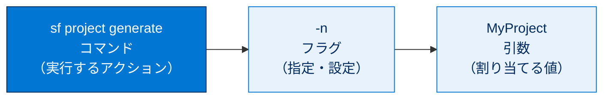
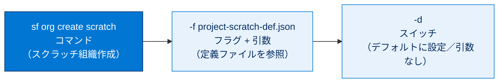
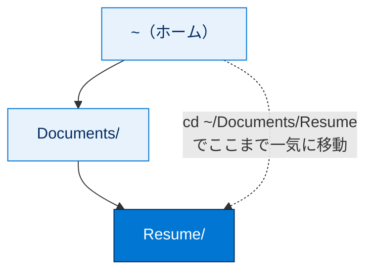
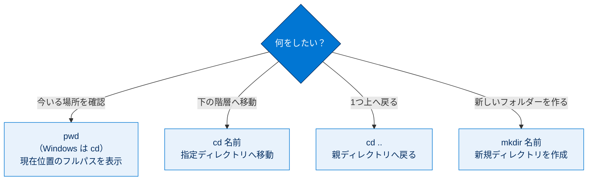
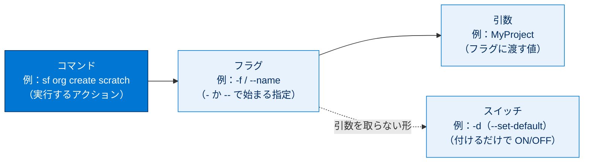

# コマンド構造とナビゲーションについて

## 学習の目的

この単元を完了すると、次のことができるようになります。

- コマンド構造の3つの部分（コマンド・フラグ・引数）を識別する。
- フラグ・スイッチ・引数の役割と使いどころを説明する。
- コマンドラインウィンドウでコマンドを実行する。
- ナビゲーションコマンド（`cd`、`mkdir`、`pwd` など）でディレクトリ内外を移動する。

> [!ポイント] この単元のゴール
>
> 「**コマンド構造＝コマンド＋フラグ＋引数の3部構成**」を覚えることが最重要。あわせて、移動の `cd`、作成の `mkdir`、現在地確認の `pwd`（Windows は `cd`）という基本ナビゲーションコマンドを手に馴染ませれば、テストもハンズオンも乗り切れます。

---

## コマンドの構造

コマンドは、いくつかの部分が空白で区切られて並んだものです。基本形は次のとおりです。

```bash
command -flag arguments
```

これは Salesforce DX プロジェクトを新規作成するコマンドの例で、フラグと引数を含みます。

```bash
sf project generate -n MyProject
```

- コマンドは `sf project generate`。
- フラグ `-n` は必須で、新規プロジェクトの名前を指示します。
- 引数は `MyProject` で、プロジェクトに割り当てる名前です。

> [!用語] Salesforce DX（Salesforce Developer Experience）
>
> Salesforce のソース駆動型開発のための仕組み・ツール群の総称。`sf` コマンドはこの Salesforce DX を操作する **Salesforce CLI** のコマンドです。



### コマンド

最初にコマンド（ユーティリティとも呼ぶ）があり、ツールで実行するアクションをシステムに伝えます。

### フラグ

フラグ（オプションとも呼ぶ）は、プロセスをトリガーする値を指定したり、含める変数をコマンドに指示したりします。多くのフラグ値は Boolean か、変数の設定（プロジェクトの命名など）を指示するものです。フラグは1つまたは2つのハイフン（`-` / `--`）とその後の値で識別され、必須のフラグもあります。たとえば新規プロジェクトに名前を付けるには `-n` フラグを使い、引数として名前を追加します（`-n MyProject`）。

> [!用語] Boolean（ブール値）
>
> **true（真）か false（偽）の2値しか取らない**データ型。機能を ON/OFF するスイッチ的な指定に使われます。

> [!用語] フラグ（flag、オプションとも）
>
> コマンドの動作を細かく調整する指定。**ハイフン1つ（`-n`）の短い形**と**ハイフン2つ（`--name`）の長い形**があり、短い形は入力が速く、長い形は意味が読み取りやすい。

スイッチはフラグに似ていますが引数が不要です。Salesforce CLI では作業を簡略化するため多くのフラグがスイッチとして組み込まれています。

> [!用語] スイッチ（switch）
>
> 引数を取らないフラグ。**付けるだけで ON/OFF が切り替わる**ため、後ろに値を書きません。電気のスイッチのように「立てるだけで効く」とイメージできます。

### 引数

引数は、設定する変数や呼び出すプロセスを指示します。通常フラグの後に空白を空けて指定します（例：`-n MyProject`）。

> [!注意] 引数内に空白を含めてはいけない
>
> `-n My Project` のように空白を含めると、`My` と `Project` が2つの引数と誤解釈され失敗する可能性があります。どうしても空白を含めたい場合は引数全体を引用符で囲みます（`-n "My Project"`）。

| 部分 | 別名 | 役割 | 例 |
| --- | --- | --- | --- |
| **コマンド** | ユーティリティ | 実行するアクションを指示 | `sf project generate` |
| **フラグ** | オプション | 値の指定や変数の追加を指示。`-` か `--` で始まる | `-n` / `--name` |
| **スイッチ** | （引数不要のフラグ） | 付けるだけで ON/OFF を切り替え | `-d`（`--set-default`） |
| **引数** | （値） | フラグに渡す具体的な値 | `MyProject` |

---

## フラグ、スイッチ、引数

実行するコマンドによっては、フラグと引数で結果が変わります。たとえば次の Salesforce CLI コマンドでスクラッチ組織を作成します。

```bash
sf org create scratch -f project-scratch-def.json -d
```

> [!用語] スクラッチ組織（Scratch Org）
>
> 開発やテストのために**一時的に作る使い捨ての Salesforce 組織**。定義ファイルをもとに必要な機能だけを素早く揃え、不要になれば破棄できます。Salesforce DX のソース駆動型開発で中心的に使われます。

このコマンドの各部分を分解すると次のとおりです。

- **コマンド**：`sf org create scratch` がスクラッチ組織の作成を指示。
- **フラグ**：残りに2つのフラグがあります。
  - `-f` は指定したスクラッチ組織定義ファイル（作成のテンプレート）を参照させます。
  - `-d` は新規組織をデフォルトに設定します。引数不要で、スイッチ `--set-default` とも書けます。ユーザー名を記憶するため、以降このスクラッチ組織にコマンドを実行する際（メタデータのプッシュ／プルなど）にユーザー名やエイリアスの入力が不要になります。
- **引数**：参照するファイル名 `project-scratch-def.json`。このファイルが新組織に必要な機能と特別な組織設定を決めます。

> [!例] スイッチ `-d` があると後がラクになる
>
> `-d`（`--set-default`）で組織をデフォルトにしておくと、以降のコマンドで「どの組織に実行するか」を毎回書かずに済みます。たとえば `sf project deploy start` を組織名なしでそのまま実行できます。最初の一手間で、その後の入力を大幅に減らせます。



> [!注意] この単元のコマンドが実行されるシェル
>
> mac では下記のコマンドは bash または zsh、Windows では PowerShell で実行されます。OS によって構文が少し異なる箇所があるので、自分の環境に合った方を使ってください。

---

## コマンドの実行方法

コマンドラインウィンドウにコマンドを入力し Enter キーを押すと実行されます。次の行に `$`（macOS / Linux）または `>`（Windows）が表示されれば正常に実行されています。失敗するとエラーとその説明が返されます。大文字・小文字は区別され、`myProject` と `MyProject` は別物です。

> [!用語] プロンプト（prompt）
>
> コマンド入力待ちを示す記号。macOS / Linux は `$`、Windows は `>`。実行後にこの記号が再表示されれば受け付け完了のサインです。

> [!注意] 大文字・小文字は区別される
>
> コマンドラインでは大文字と小文字が**別の文字**として扱われます。`myProject` と `MyProject` は別物。ファイル名・ディレクトリ名・引数は表記を正確に合わせましょう。

---

## ナビゲーションコマンド

ナビゲーションコマンドは最も頻繁に使うコマンドです。プロジェクトやディレクトリを作ったら、内外への移動方法を知っておく必要があります。

> [!用語] ディレクトリ（directory）
>
> ファイルを整理して入れておく「フォルダー」のこと。GUI の「フォルダー」を CLI では「ディレクトリ」と呼びます。中にさらにディレクトリを入れて階層構造を作れます。

> [!用語] 作業ディレクトリ（working directory）
>
> いま自分がコマンドラインで「いる場所」。コマンドはこの作業ディレクトリを基準に実行されるため、「今どこにいるか」の把握が大切です。

### 現在位置を確認する

新しいウィンドウを開くと通常は開始ディレクトリにいます。

- macOS 開始ディレクトリ：`yourname-ltm:~ yourname$`
- Windows 開始ディレクトリ：`PS C:\Users\yourname>`

### ディレクトリを変更する

直下のディレクトリに移動するには `cd`（change directory）とディレクトリ名を入力します。どちらの OS でも同じです。

```bash
cd Documents
```

> [!用語] `cd`（change directory：ディレクトリ変更）
>
> 別のディレクトリへ移動するコマンド。`cd 移動先の名前` の形で使う、最も頻繁に使うナビゲーションコマンドの1つです。

### 新規ディレクトリを作成する

空の新規ディレクトリは `mkdir` と作成名で作ります。どちらの OS でも同じです。

```bash
mkdir Resume
```

> [!用語] `mkdir`（make directory：ディレクトリ作成）
>
> 新しいディレクトリ（フォルダー）を作るコマンド。`mkdir 作りたい名前` の形で使い、GUI の「新規フォルダー」作成に相当します。

### 複数のディレクトリを移動する

複数レベル先に移動する場合も `cd` を使い、移動先のパスを追加します。パスの記述は OS で異なります（大文字・小文字は区別）。

- macOS：`cd ~/Documents/Resume`
- Windows：`cd ~\Documents\Resume`

> [!注意] パス区切り文字は OS で異なる
>
> 階層をたどる区切り文字は、**macOS / Linux はスラッシュ `/`**、**Windows はバックスラッシュ `\`**。`~`（チルダ）はホームディレクトリ（自分のユーザーフォルダー）を表す共通の記号です。



### 1レベル戻る

1つ上のレベルに戻るには `cd` の後に連続する2つのピリオドを続けます。どちらの OS でも同じです。

```bash
cd ..
```

> [!用語] `..`（2つのピリオド）
>
> 「**1つ上の親ディレクトリ**」を表す記号。`cd ..` で1階層上に戻れます。ピリオド1つ `.` は「現在のディレクトリ」を表します。

### 現在の作業ディレクトリを表示する

現在位置のフルパスを表示するには次のコマンドを実行します。

- macOS：`pwd`
- Windows：`cd`

> [!用語] `pwd`（print working directory：作業ディレクトリの表示）
>
> いま自分がいるディレクトリのフルパスを表示するコマンド（macOS / Linux）。Windows では引数なしの `cd` で現在位置が表示されます。「迷子になったらまず現在地確認」の基本コマンドです。

| 操作 | macOS / Linux | Windows | 共通か |
| --- | --- | --- | --- |
| ディレクトリ移動 | `cd 名前` | `cd 名前` | 共通 |
| 新規ディレクトリ作成 | `mkdir 名前` | `mkdir 名前` | 共通 |
| 階層をたどって移動 | `cd ~/Documents/Resume` | `cd ~\Documents\Resume` | 区切り文字が異なる |
| 1つ上に戻る | `cd ..` | `cd ..` | 共通 |
| 現在位置の表示 | `pwd` | `cd` | コマンドが異なる |

ナビゲーションの基本コマンドを「やりたいこと」から選べるように整理すると次のとおりです。



---

## コマンドライン履歴の表示

実行したコマンドの履歴ログは `history` で表示します（Windows は F7）。各コマンドに番号が振られて表示されます。macOS / Linux では `!` の後に番号を付けて Enter すると、そのコマンドを再実行できます（例：`!499`）。

> [!用語] `history`（コマンド履歴）
>
> これまでに実行したコマンドを番号付きで表示するコマンド。長いコマンドを打ち直す手間を省けます。Windows では F7 キーで呼び出せます。

> [!例] `!番号` で過去のコマンドを再実行（macOS / Linux）
>
> 一覧の499番が `cd ...` だったとき、`!499` と打って Enter するだけで499番のコマンドがそのまま再実行されます。長いコマンドを再び打たずに済む便利な機能です。

---

## 試験対策：押さえておきたい追加ポイント

> [!ポイント] この単元の頻出ポイント
>
> - **コマンド構造の3部構成は「コマンド・フラグ・引数」**（頻出、これが正解）。
> - **フラグ**は `-`（短い形）か `--`（長い形）で始まる。**スイッチは引数を取らないフラグ**。
> - **引数に空白を含めない**（含めたい場合は引用符で囲む）。
> - **大文字・小文字は区別される**。
> - ディレクトリ操作：移動 `cd`、作成 `mkdir`、1つ上へ `cd ..`、現在地 `pwd`（Windows は `cd`）。

> [!まとめ] この単元のキーワード早見
>
> | コマンド | 意味 | 由来 |
> | --- | --- | --- |
> | `cd` | ディレクトリ移動 | change directory |
> | `mkdir` | ディレクトリ作成 | make directory |
> | `pwd` | 作業ディレクトリ表示 | print working directory |
> | `history` | コマンド履歴の表示 | history |

---

## テスト

> [!まとめ] 確認テスト
>
> この単元を完了するには、テストのすべての質問に正しく解答する必要があります。（**+100 ポイント**）
>
> **問1：** コマンド構造の3つの部分とは何ですか？
>
> - A. コマンド、フラグ、パス
> - B. フラグ、引数、パス
> - C. コマンド、フラグ、番号
> - D. コマンド、フラグ、引数
>
> **問2：** コマンドラインでディレクトリの変更に使用するコマンドはどれですか？
>
> - A. `pwd`
> - B. `cd ~/パス`
> - C. `history`
> - D. `mkdir ディレクトリ名`

> [!ポイント] 解答の指針
>
> - **問1**：コマンド構造は「**コマンド・フラグ・引数**」の3部構成なので **D**。
> - **問2**：ディレクトリ変更は `cd` なので **B**。`pwd` は現在地表示、`mkdir` は作成、`history` は履歴表示。

---

## 🎓 この単元のまとめ

この単元では、コマンドが「コマンド＋フラグ＋引数」の3部構成であることと、`cd` / `mkdir` / `pwd` などの基本ナビゲーションコマンドの使い方を学びました。

次の図は、1行のコマンドがどの部分から構成されるか（スイッチは引数を取らないフラグ）を俯瞰したものです。



| 操作 | macOS / Linux | Windows |
| --- | --- | --- |
| ディレクトリ移動 | `cd 名前` | `cd 名前` |
| 新規ディレクトリ作成 | `mkdir 名前` | `mkdir 名前` |
| 1つ上に戻る | `cd ..` | `cd ..` |
| 現在位置の表示 | `pwd` | `cd` |
| パス区切り文字 | スラッシュ `/` | バックスラッシュ `\` |

> [!まとめ] この単元の要点
>
> - コマンド構造は **「コマンド・フラグ・引数」の3部構成**。
> - **フラグ**は `-`（短い形）/ `--`（長い形）で始まる指定。**スイッチ**は引数を取らないフラグ（例：`-d`）。
> - **引数に空白を含めない**（含めるなら引用符で囲む）。コマンドは**大文字・小文字を区別**する。
> - ナビゲーションは移動 `cd`、作成 `mkdir`、1つ上へ `cd ..`、現在地 `pwd`（Windows は `cd`）。
> - パス区切りは **macOS / Linux → `/`、Windows → `\`**。`~` はホームディレクトリ。

> [!豆知識] `mkdir` の `mk` は「make」の省略
>
> Unix のコマンド名は打鍵数を減らすため母音を削った略語が多くあります。`mkdir`＝make directory、`cd`＝change directory、`pwd`＝print working directory、`cat`＝concatenate。意味の元になった英単語を知ると、初見のコマンドでも役割を推測しやすくなります。
