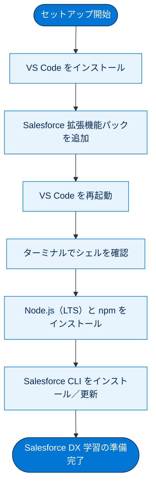
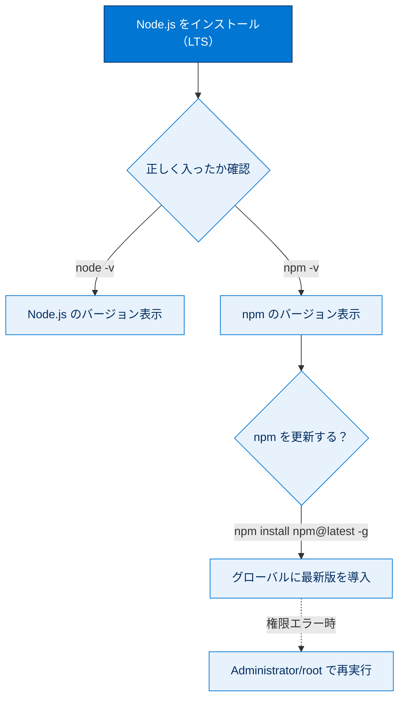
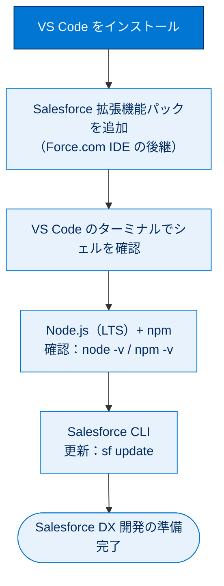

# コマンドラインツールを設定する

## 学習の目的

この単元を完了すると、次のことができるようになります。

- Visual Studio Code（VS Code）と Salesforce 拡張機能をインストールする。
- 使用しているシェルを VS Code のターミナルで確認する。
- Node.js と npm をインストール・確認・更新する。
- Salesforce CLI をインストール・更新する。
- Force.com IDE プラグインの後継となるソフトウェアツールを識別する。

> [!ポイント] この単元のゴール
>
> 開発に必要な3点セット「**VS Code（＋Salesforce 拡張機能）**」「**Node.js / npm**」「**Salesforce CLI**」をセットアップすることがゴール。「Force.com IDE プラグインの後継＝Salesforce 拡張機能を入れた VS Code」という対応関係も試験で問われます。

---

## 開発者コマンドラインツール

npm や Salesforce CLI のようなコマンドラインツールは他の開発者ツールと簡単に統合でき、生産性を高められます。多くのソフトウェアには CLI やプラグインが付属し、どれを入れるかはプロジェクトのニーズに応じて判断します。この単元では VS Code をインストールし、Node.js、npm、Salesforce CLI を設定します。

> [!用語] Salesforce CLI（Salesforce Command Line Interface）
>
> Salesforce 組織やスクラッチ組織を、`sf` から始まるコマンドで操作する公式ツール。メタデータのデプロイ・取得、スクラッチ組織の作成、ソースとの同期などを行えます。

> [!用語] npm（Node Package Manager）
>
> Node.js のパッケージ（再利用できるプログラムの部品）をインストール・更新・管理するツール。Node.js と一緒に入ります。Lightning Web コンポーネント開発などで多用します。

この単元で行うセットアップの全体像は次の流れです。



---

## Visual Studio Code のインストール

VS Code は、高いカスタマイズ性とクロスプラットフォーム性で Salesforce に選ばれているコードエディターです。VS Code 向け Salesforce 拡張機能は、デスクトップでの Salesforce 開発で Force.com IDE プラグインの後継となります。

> [!用語] Visual Studio Code（VS Code）
>
> Microsoft が無償提供する高機能なコードエディター。Windows / macOS / Linux で動き（クロスプラットフォーム）、拡張機能で自由に機能を追加できます。Salesforce 開発の標準エディターとして推奨されています。

> [!ポイント] Force.com IDE プラグインの後継
>
> かつての **Force.com IDE プラグイン**の後継は、**Salesforce 拡張機能をインストールした VS Code**。試験で「Force.com IDE の後継となるツールは？」と問われたら、これを思い出してください。

> [!手順] VS Code をインストールする
>
> 1. Visual Studio Code を `https://code.visualstudio.com/Download` からダウンロードします。
> 2. Visual Studio Code アプリケーションを開きます。

---

## Salesforce 拡張機能のインストール

Salesforce 拡張機能は、Salesforce Lightning プラットフォームでのコード補完、構文の強調表示、Apex のデバッグなどの機能を提供します。

> [!用語] 拡張機能（extension）
>
> エディターに後から機能を追加する追加ソフト。Salesforce 拡張機能パックを入れると、Apex のコード補完・構文ハイライト・デバッグなどが VS Code 上で使えるようになります。

> [!手順] Salesforce 拡張機能パックをインストールする
>
> 1. VS Code で **[View（表示）]** > **[Extensions（拡張機能）]** を選択します。
> 2. 検索ボックスに `salesforce extension pack` と入力します。
> 3. **[Install（インストール）]**（更新が必要な場合は **[Update（更新）]**）をクリックします。
> 4. インストール後、Visual Studio Code を再起動します。

> [!注意] インストール後は再起動を忘れずに
>
> 拡張機能やツールのインストール後は、VS Code を**再起動**しないと正しく認識されないことがあります。「入れたのに使えない」ときは、まず再起動を試しましょう。

---

## 使用するシェルの確認

新しいターミナルウィンドウを開き、マシンのシェルを確認します。

> [!手順] VS Code で現在のシェルを確認する
>
> 1. VS Code で **[Terminal（ターミナル）]** > **[New Terminal（新規ターミナル）]** をクリックします。
> 2. ターミナルウィンドウ上部のシェルドロップダウンで、デフォルトシェルを確認します。

macOS / Linux では bash または zsh、Windows では PowerShell が表示されます。

> [!ポイント] OS とデフォルトシェルの対応（復習）
>
> - **macOS / Linux** → bash または zsh
> - **Windows** → PowerShell
>
> 後で他のシェルをインストールして変更できますが、ここではこれらのデフォルトシェルを使用します。

---

## Node.js と npm の設定

Lightning Web コンポーネントの開発や Node.js のような JavaScript ランタイムでの作業では、npm を使ってパッケージのインストールや更新を行います。CLI で npm を使うと、パッケージを素早くインストールでき、簡単なコマンドで最新状態に保てます。

> [!用語] Node.js（ノードジェイエス）
>
> ブラウザーの外で JavaScript を実行する環境（JavaScript ランタイム）。多くの開発者ツールが Node.js 上で動きます。インストールすると **npm** も一緒に入ります。

> [!用語] パッケージ（package）
>
> 他の人が作って公開している再利用可能なプログラムの部品。npm でインストールし、自分のプロジェクトに機能を取り込めます。

> [!注意] これらのツールは各自の判断でインストールする
>
> Salesforce はこれらのツールのインストール有無を確認せず、Node.js や npm の維持管理も行いません。各自の判断でインストールし、インストール後は VS Code を再起動します。

> [!手順] Node.js と npm をインストール・確認する
>
> 1. Node.js をインストールします。必ず **LTS（Long Term Support：長期サポート）** バージョンを選択します。
> 2. `node -v` でインストールしたバージョンを確認します。
> 3. `npm -v` で npm がインストールされたことを確認します。

Node.js のバージョンを確認するコマンドです。

```bash
node -v
```

npm がインストールされたことを確認するコマンドです。

```bash
npm -v
```

> [!用語] LTS（Long Term Support、長期サポート）
>
> 長期間にわたり不具合修正などのサポートが提供される、**安定した推奨バージョン**。開発の土台には最新の実験的バージョンより LTS を選ぶのが定石です。

> [!用語] `-v` フラグ（version）
>
> インストール済みツールの**バージョン番号を表示する**フラグ。`node -v` や `npm -v` のように使い、正しく入っているかの確認にも使えます。

> [!例] バージョン確認の実行結果
>
> `node -v` で `v12.2.0`、`npm -v` で `6.14.1` のようにバージョンが表示されれば、ツールは正しくインストールされています（番号は時期により異なります）。

npm バージョンを更新する場合（ノードバージョンも更新される）、次のコマンドを実行します。

```bash
npm install npm@latest -g
```

> [!用語] `-g`（global：グローバル）フラグ
>
> パッケージを特定のプロジェクト内だけでなく、**マシン全体で使えるよう（グローバルに）インストール**するフラグ。`npm@latest` は「npm の最新版」を指します。

> [!注意] アクセス権限エラーが出たら
>
> `npm install npm@latest -g` の実行後に npm アクセスエラーが出た場合、権限エラー解決のための npm 公式ドキュメントを参照してください。ファイルへのアクセス権限がなく操作が拒否されたことを示し、root / Administrator として実行するよう指示している場合があります。

各ツールの確認・更新コマンドの使い分けは次のとおりです。



---

## Salesforce CLI のインストールと更新

Salesforce CLI コマンドは、スクラッチ組織でのカスタマイズ開発・テストや、ソースコードを組織とソースリポジトリの間で同期する際に使います。

> [!用語] ソースリポジトリ（source repository）
>
> ソースコードをバージョン管理しながら保管する場所（Git リポジトリなど）。Salesforce CLI で、組織とこのリポジトリの間でコードを同期できます。

> [!手順] Salesforce CLI をインストール・更新する
>
> 1. Salesforce CLI を `https://developer.salesforce.com/tools/sfdxcli` からインストールします。
> 2. VS Code で **[Terminal（ターミナル）]** > **[New Terminal（新規ターミナル）]** をクリックします。
> 3. 次のコマンドを実行し、sfdx-cli バージョンが最新であることを確認します。

```bash
sf update
```

> [!用語] `sf update`
>
> Salesforce CLI 自体を最新バージョンに更新するコマンド。CLI は頻繁に改良されるため、定期的に実行して最新の状態を保つのがベストプラクティスです。

これで Salesforce CLI がインストールされ、Salesforce DX の学習を開始する準備が整いました。開始するには「クイックスタート：Salesforce DX」プロジェクトを参照してください。

> [!まとめ] セットアップした開発ツール一覧
>
> | ツール | 役割 | 確認・更新コマンド |
> | --- | --- | --- |
> | **VS Code ＋ Salesforce 拡張機能** | コードを書くエディター（Force.com IDE の後継） | （拡張機能パックを更新） |
> | **Node.js** | JavaScript 実行環境 | `node -v` |
> | **npm** | パッケージ管理ツール | `npm -v` / `npm install npm@latest -g` |
> | **Salesforce CLI** | 組織を操作する `sf` コマンド | `sf update` |

---

## リソース

- Salesforce Developers：Select and Enable a Dev Hub Org（Dev Hub 組織の選択と有効化）
- Salesforce ヘルプ：Salesforce CLI Command Reference（force Namespace）

---

## 試験対策：押さえておきたい追加ポイント

> [!ポイント] この単元の頻出ポイント
>
> - **パッケージのインストールに役立つツールは npm**。
> - **Salesforce Lightning プラットフォーム開発の推奨ツールは「Salesforce 拡張機能をインストールした VS Code」**。
> - **Force.com IDE プラグインの後継 = Salesforce 拡張機能入りの VS Code**。
> - Node.js は **LTS バージョン**を選ぶ。`node -v` / `npm -v` で確認、`-g` はグローバルインストール。
> - Salesforce CLI の更新は `sf update`。

> [!注意] 「開発者コンソール」との混同に注意
>
> 推奨ツールを問う設問でブラウザー上の簡易ツールである「開発者コンソール」を選びがちですが、推奨は **Salesforce 拡張機能をインストールした VS Code** です。

---

## テスト

> [!まとめ] 確認テスト
>
> この単元を完了するには、テストのすべての質問に正しく解答する必要があります。（**+100 ポイント**）
>
> **問1：** コマンドラインインターフェースを使用したパッケージのインストールに役立つコマンドラインツールはどれですか？
>
> - A. npm
> - B. パッケージマネージャー
> - C. Developer Studio
> - D. Salesforce CLI
>
> **問2：** Salesforce Lightning プラットフォームの開発に使用することが推奨されるソフトウェアツールはどれですか？
>
> - A. 開発者コンソール
> - B. Salesforce CLI
> - C. Salesforce 拡張機能がインストールされた VS Code
> - D. 任意のコード編集ソフトウェア

> [!ポイント] 解答の指針
>
> - **問1**：パッケージのインストールに役立つのは **A. npm**。
> - **問2**：Lightning プラットフォーム開発の推奨は **C. Salesforce 拡張機能がインストールされた VS Code**。Force.com IDE プラグインの後継でもあります。

---

## 🎓 この単元のまとめ

この単元では、Salesforce 開発の環境を整えるために「VS Code（＋Salesforce 拡張機能）」「Node.js / npm」「Salesforce CLI」をインストール・確認・更新する流れを学びました。

次の図は、セットアップの順序と各ツールの確認・更新コマンドを俯瞰したものです。



> [!まとめ] この単元の要点
>
> - 開発の3点セットは **VS Code（＋Salesforce 拡張機能）／ Node.js・npm ／ Salesforce CLI**。
> - **Force.com IDE プラグインの後継 = Salesforce 拡張機能をインストールした VS Code**（試験頻出）。
> - **パッケージのインストールには npm** を使う。Node.js は **LTS** を選ぶ。
> - 確認は `node -v` / `npm -v`、更新は `npm install npm@latest -g`（`-g` はグローバル）。
> - Salesforce CLI の更新は **`sf update`**。インストール後は VS Code を**再起動**する。

> [!豆知識] 「sfdx」から「sf」への世代交代
>
> Salesforce CLI のコマンドは、かつての `sfdx` から、より短くわかりやすい `sf` へと刷新されました（v2 系）。教材内に `sfdx-cli` という表記が残るのは過渡期の名残で、現在は `sf` コマンドへの統一が進んでいます。学習中に両方の表記を見かけても同じツールだと理解しておくと混乱しません。
