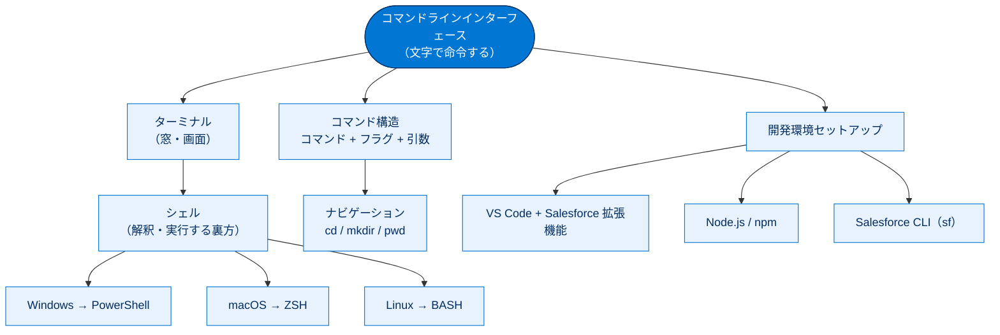

# コマンドラインインターフェース 総まとめ

このトピックでは、コマンドラインインターフェース（CLI）の基礎を学びました。CLI とシェルの違い・OS ごとのデフォルトシェル、コマンドの3部構成（コマンド・フラグ・引数）と基本ナビゲーションコマンド、そして Salesforce 開発に必要なツール（VS Code・Node.js / npm・Salesforce CLI）のセットアップまでを一通り押さえています。「文字でコンピューターに命令する」感覚と、Salesforce DX 開発の入り口に立つための環境構築が、このトピックの到達点です。

## 全体像

次の図は、このトピック全体の登場概念がどうつながるかを俯瞰したものです。

## ユニット横断早見表

| ユニット | 学んだこと | キーワード | 一言要点 |
| --- | --- | --- | --- |
| 01 コマンドラインインターフェースの概要 | CLI とシェルの違い、OS ごとのデフォルトシェル、出力の扱い | CLI / GUI / ターミナル / シェル / PowerShell / ZSH / BASH / POSIX | CLI は文字で命令、シェルは入力を解釈・実行する裏方 |
| 02 コマンド構造とナビゲーションについて | コマンドの3部構成、フラグ・スイッチ・引数、移動コマンド | コマンド / フラグ / スイッチ / 引数 / cd / mkdir / pwd | コマンドは「コマンド + フラグ + 引数」、移動は cd が基本 |
| 03 コマンドラインツールを設定する | VS Code・Node.js / npm・Salesforce CLI のセットアップ | VS Code / Salesforce 拡張機能 / Node.js / npm / LTS / sf update | 開発3点セットを入れて Salesforce DX 開発の準備を整える |

---

## 🎯 試験頻出ポイント

> [!ポイント] このトピックで狙われやすい論点
>
> - **CLI はテキストベースのユーザーインターフェース**（正誤問題で「正しい」が頻出）。
> - デフォルトシェル：**Windows → PowerShell**、**macOS → ZSH（Z シェル）**、**Linux → BASH**。取り違えに注意。
> - **ターミナル（窓）とシェル（実行する裏方）は別物**。
> - シェルの系統は **sh（Bourne）→ BASH → ZSH**。**BASH は POSIX 準拠**。
> - 出力の扱い：**ZSH＝文字列 / PowerShell＝オブジェクト**。
> - **コマンド構造の3部構成は「コマンド・フラグ・引数」**。
> - **フラグ**は `-` / `--` で始まる。**スイッチは引数を取らないフラグ**（例：`-d`）。
> - **引数に空白を含めない**（含めるなら引用符で囲む）。**大文字・小文字は区別**される。
> - ナビゲーション：移動 `cd`、作成 `mkdir`、1つ上へ `cd ..`、現在地 `pwd`（Windows は `cd`）。
> - **パッケージのインストールには npm**。Node.js は **LTS** を選ぶ。
> - **Lightning プラットフォーム開発の推奨ツール = Salesforce 拡張機能を入れた VS Code**（＝Force.com IDE プラグインの後継）。
> - Salesforce CLI の更新は **`sf update`**。

## 📖 用語早見表

| 用語 | ひとことの意味 |
| --- | --- |
| CLI（Command Line Interface） | 文字（コマンド）で命令するテキストベースのインターフェース |
| GUI（Graphical User Interface） | ボタン・メニューを目で見てマウスで操作するインターフェース |
| ターミナル | コマンドを表示・入力する窓（画面） |
| シェル | 入力されたコマンドを解釈・実行する裏方のプログラム |
| PowerShell | Windows のデフォルトシェル。出力をオブジェクトとして扱う |
| ZSH（Z シェル） | macOS のデフォルトシェル。BASH を拡張した Unix シェル |
| BASH | Unix の定番シェル。POSIX 準拠。前身は Bourne シェル（sh） |
| POSIX | Unix 系 OS が満たすべき共通仕様の標準規格 |
| コマンド | 実行するアクションを指示する部分（ユーティリティとも） |
| フラグ | コマンドの動作を調整する指定。`-` / `--` で始まる（オプションとも） |
| スイッチ | 引数を取らないフラグ。付けるだけで ON/OFF が切り替わる |
| 引数 | フラグに渡す具体的な値（例：`MyProject`） |
| `cd` / `mkdir` / `pwd` | ディレクトリ移動 / 作成 / 作業ディレクトリ表示 |
| Salesforce CLI（sf） | `sf` から始まるコマンドで Salesforce 組織を操作する公式ツール |
| npm（Node Package Manager） | Node.js のパッケージをインストール・更新・管理するツール |
| Node.js | ブラウザーの外で JavaScript を実行する環境（ランタイム） |
| LTS（Long Term Support） | 長期サポートが提供される安定した推奨バージョン |
| VS Code | Microsoft 製の高機能コードエディター（クロスプラットフォーム） |
| スクラッチ組織 | 開発・テスト用に一時的に作る使い捨ての Salesforce 組織 |

---

> [!豆知識] CLI は古くて新しい
>
> GUI が普及した今でも CLI が現役なのは、操作を「文字」として記録・再実行・自動化できるからです。GUI のクリック操作はその場限りですが、コマンドはスクリプトにまとめれば何度でも同じ手順を正確に再現できます。CI/CD やクラウド運用の自動化が CLI を中心に組まれているのはこのためです。

> [!豆知識] PowerShell が「オブジェクト」を返す意味
>
> 多くのシェルがコマンドの出力を「ただの文字列」として扱うのに対し、PowerShell は「ファイル名・サイズ・更新日時」などの属性を持つ構造化データ（オブジェクト）として返します。そのため、いったんテキストを解析し直さなくても「サイズ順に並べ替え」「特定の属性だけ抽出」といった操作をシェル内で直接行えます。これは Windows 環境ならではの大きな特徴です。

> [!豆知識] `sf project generate` の `-n` は名前付けの定番
>
> Salesforce CLI に限らず、多くの CLI ツールで `-n` は「name（名前）」の短縮フラグとして使われます。`-f` は file、`-d` は directory や default など、短いフラグには英単語の頭文字が割り当てられていることが多く、由来を知ると意味を覚えやすくなります。

---

## ✅ 理解度セルフチェック

> [!まとめ] このトピックの理解度を確認しよう
>
> 次の問いに答えてみましょう（カッコ内が答え）。
>
> 1. **Q.** macOS のデフォルトシェルは？ → **A.** ZSH（Z シェル）。Windows は PowerShell。
> 2. **Q.** 「ターミナル」と「シェル」は同じもの？（Yes / No） → **A.** No。ターミナルは窓、シェルは入力を解釈・実行する裏方。
> 3. **Q.** コマンド構造の3つの部分は？ → **A.** コマンド・フラグ・（　）。空欄は「引数」。
> 4. **Q.** 引数に空白を含めたいときはどうする？ → **A.** 引数全体を引用符で囲む（例：`-n "My Project"`）。
> 5. **Q.** パッケージのインストールに役立つコマンドラインツールは？ → **A.** npm。
> 6. **Q.** Force.com IDE プラグインの後継となる推奨ツールは？ → **A.** Salesforce 拡張機能をインストールした VS Code。
