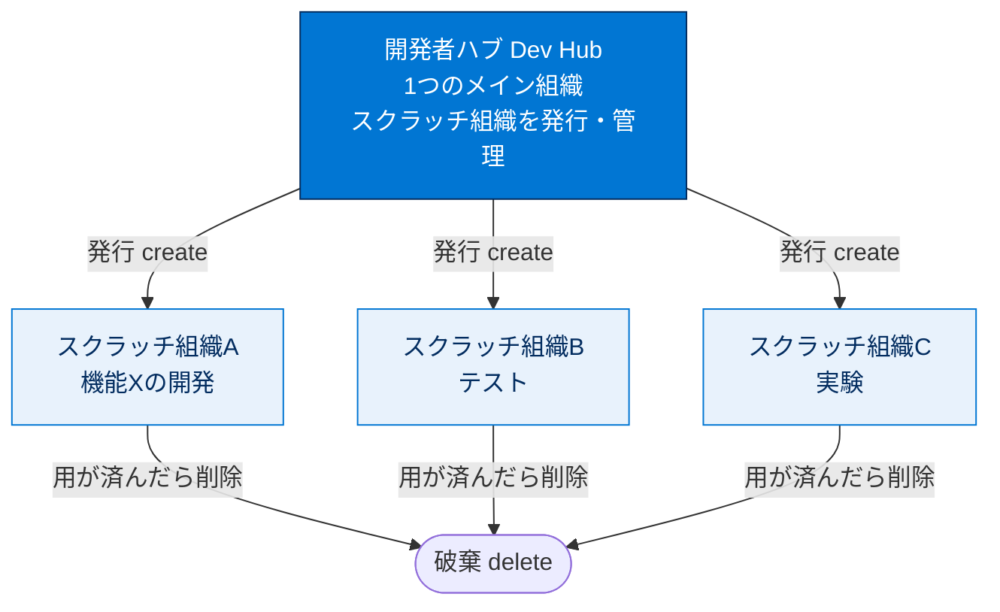
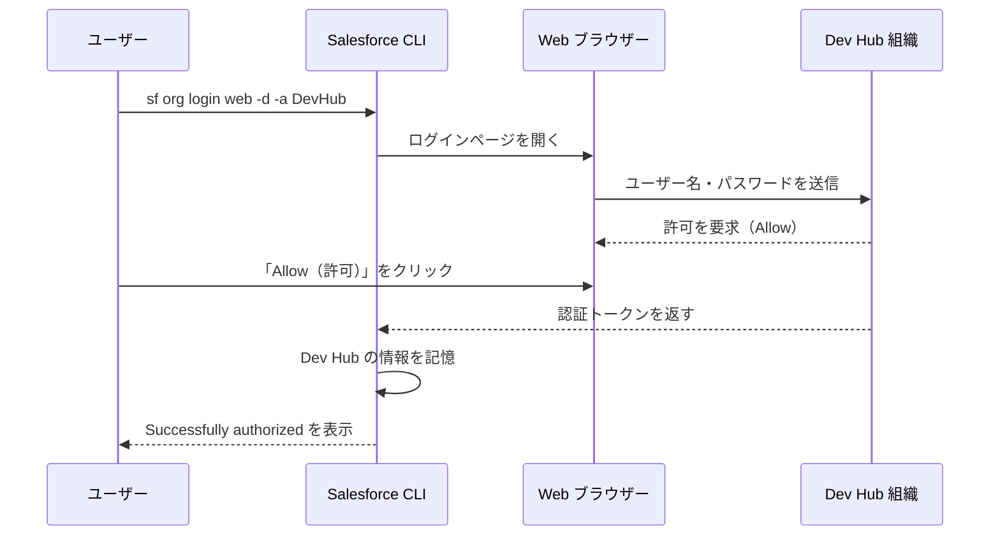
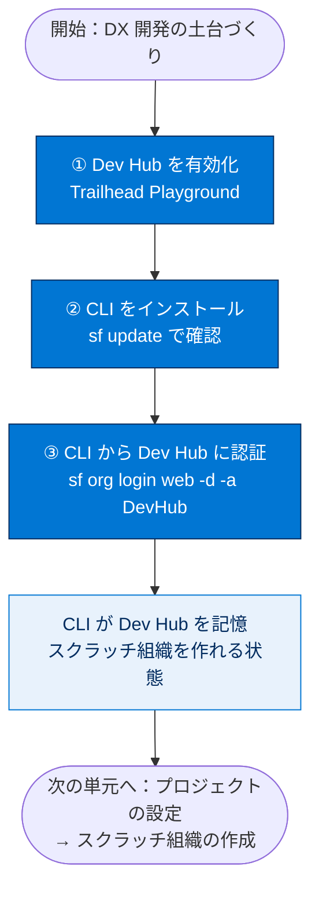

# Salesforce DX 環境の設定

## 学習の目的

この単元を完了すると、次のことができるようになります。

- Salesforce DX が何のためのものか説明する。
- スクラッチ組織と開発者ハブ（Dev Hub）の役割を区別する。
- Trailhead Playground で Dev Hub を有効化する。
- Salesforce CLI をインストールし、Dev Hub に認証する。

> [!ポイント] この単元のゴール
>
> DX 開発を始める土台づくりが目的です。**Dev Hub を有効化 → Salesforce CLI をインストール → CLI から Dev Hub にログイン**の3ステップを順番に押さえます。スクラッチ組織の作成は次以降の単元で行います。

---

## はじめに：Salesforce DX とは

**Salesforce Developer Experience（Salesforce DX）** は、開発ライフサイクル全体を合理化するツールセットです。チーム開発・コラボレーション、自動化テストと CI、リリースサイクルの効率化を実現します。

> [!用語] Salesforce DX（Salesforce Developer Experience）
>
> Salesforce の開発を「ソースコード中心（source-driven）」で進める仕組みとツールの総称。従来の組織設定画面を直接いじる開発に対し、DX では**コードを VCS で管理し、CLI で組織へ反映**します。複数人での開発・テスト・リリースが行いやすくなります。

DX はソースコードを VCS で管理する前提です。VCS の種類は問いませんが、このクイックスタートでは Git と GitHub を使用し、サンプルの **DreamHouse アプリケーション**を題材とします。

> [!用語] バージョン管理システム（VCS：Version Control System）
>
> ソースコードの変更履歴を記録・管理する仕組み。「いつ・誰が・どこを変えたか」を追跡でき、過去の状態に戻せます。代表例が **Git**、それをチームで共有するクラウドサービスが **GitHub** です。

> [!例] DreamHouse アプリケーション
>
> Salesforce が学習用に公開する不動産業向けサンプルアプリ。物件（Properties）や仲介業者（Brokers）を管理する画面があり、この単元シリーズで DX の流れを体験します。

---

## スクラッチ組織と開発者ハブ

DX の設定では**スクラッチ組織**という新しい種別の組織を使います。それを作り出す親元が**開発者ハブ（Dev Hub）**です。

| 用語 | 役割 | 性質 |
| --- | --- | --- |
| **スクラッチ組織（Scratch Org）** | 開発・機能テスト用の使い捨て環境 | 短期間（最大30日）で破棄。設定をファイルで定義できる |
| **開発者ハブ（Dev Hub）** | スクラッチ組織を作成・管理する司令塔 | 長期間使う1つのメイン組織。ここで権限を有効化する |

> [!用語] スクラッチ組織（Scratch Org）
>
> 新しいプロジェクトや機能テストを始めるときにすばやく準備できる、**専用・設定可能・短期**の Salesforce 環境。設定ファイル（後述の `project-scratch-def.json`）で内容を定義でき、用が済んだら削除します。「いつでも作って捨てられる実験用組織」です。

> [!用語] 開発者ハブ（Dev Hub）
>
> スクラッチ組織を作成・管理するためのメイン Salesforce 組織。スクラッチ組織は単独では作れず、必ず Dev Hub から発行します。**Dev Hub ＝ スクラッチ組織の発行元（工場）**。

> [!例] 2つの関係をたとえると
>
> Dev Hub は「レンタカー会社の本社」、スクラッチ組織は「貸し出される車」。本社が車を発行し、利用者は使い終わったら返却（削除）します。本社のプランで同時・1日あたりに貸せる台数が決まります。



---

## Trail Together の動画

エキスパートの説明を見ながら進めたい場合は、Trail Together シリーズの動画をご覧ください。

---

## Trailhead Playground で Dev Hub を有効にする

Dev Hub は有料組織でも有効化できますが、**開発は本番以外で行うのがベストプラクティス**です。ここでは Developer Edition または Trailhead Playground で Dev Hub を有効にします。

> [!注意] 本番組織で開発しない
>
> Dev Hub は本番組織でも有効化できますが、学習・開発では**Developer Edition か Trailhead Playground を使う**のが鉄則。試験でも「開発は本番以外で行う」が前提です。

### Trailhead のユーザー名とパスワードを取得する

このプロジェクトには Dev Hub のログイン情報が必要です。ユーザー名とパスワードが分からない場合は、Trailhead の該当記事の手順で取得してください。

> [!ポイント] CLI ログインにはユーザー名が必須
>
> このあと CLI から組織へログインする際、**Dev Hub 組織のユーザー名とパスワード**が必要です。ブラウザでログインできていても、CLI 用に資格情報を把握しておきましょう。

---

## コマンドラインインターフェース（CLI）をインストールする

**Salesforce CLI** でアプリケーションのライフサイクル全体を制御します。開発・テスト環境の作成、組織と VCS 間のソース同期、テスト実行ができます。

> [!用語] CLI（Command Line Interface）
>
> 画面のボタンではなく**文字でコマンドを打ち込んで操作する**方式。Salesforce CLI はコマンド `sf` から始まり、`sf org create scratch ...` のように打って組織の作成・ログイン・リリースを行います。GUI より手数が少なく自動化しやすいのが利点です。

『Salesforce CLI Setup Guide』を参照し、ダウンロードページから CLI をインストールします。インストール後、次のコマンドで適切にインストールされ最新であることを確認します。

```bash
# Salesforce CLI を最新バージョンに更新する（インストール確認も兼ねる）
sf update
```

> [!注意] コマンドは `sf` から始まる
>
> 現行 CLI のコマンドはすべて **`sf`** で始まります。古い教材では `sfdx` で始まることがありますが、`sf` が新しい体系です。コマンドが認識されないときは `sf --version` でインストールを確認しましょう。

---

## Dev Hub にログインする

Dev Hub が有効な組織に CLI からログインします。次のコマンドは `-a` で別名 `DevHub` を付け、`-d` でデフォルト組織に指定します。実行すると Web ブラウザーに Salesforce ログインページが開きます。

```bash
# Web ブラウザー経由で Dev Hub にログインする
#   -d : この組織をデフォルトの Dev Hub に設定（後続コマンドで省略可能になる）
#   -a : 別名（エイリアス）として DevHub を付ける
sf org login web -d -a DevHub
```

> [!用語] 別名（エイリアス／alias）
>
> 組織を呼ぶときの「あだ名」。ユーザー名は長くて覚えにくいため `DevHub` のような短い名前を付けると、以降のコマンドで `-o DevHub` のように簡単に指定できます。

> [!ポイント] よく使うフラグの意味
>
> | フラグ | 意味 |
> | --- | --- |
> | `-a`（`--alias`） | 組織に別名を付ける |
> | `-d`（`--set-default` / `--set-default-dev-hub`） | デフォルト組織（または既定の Dev Hub）に設定する |
>
> `-d` を付けると、以降のコマンドで対象組織を毎回指定せずに済みます。

ブラウザで Dev Hub 組織のログイン情報を入力し、**[Allow（許可）]** をクリックします。認証後、CLI は Dev Hub のログイン情報を記憶し、ターミナルに次が表示されます。

```text
Successfully authorized rraodv@salesforcedx1.com with org id 00D1I000000n3H5UAI
```

> [!注意] 上記のユーザー名・組織 ID は例
>
> `rraodv@salesforcedx1.com` や `00D1I000000n3H5UAI` は教材上のサンプルで、実際はあなた自身の値が表示されます。`Successfully authorized` が出ていれば認証成功です。

これで Dev Hub の Web ページを閉じて作業を続行できます。通常はこの Dev Hub からスクラッチ組織を作成して開発を始めます（後続ステップで実施）。次は、ローカルマシンにプロジェクトを設定します。



---

## 環境設定の全体像



> [!まとめ] この単元のおさらい
>
> - **Salesforce DX** はソースコード中心で開発を進めるツールセット。
> - **スクラッチ組織**は使い捨ての開発環境、**Dev Hub** はそれを発行・管理するメイン組織。
> - 開発は**本番以外**（Developer Edition / Trailhead Playground）で行う。
> - 手順は **Dev Hub 有効化 → CLI インストール（`sf update`）→ CLI 認証（`sf org login web -d -a DevHub`）**。
> - `-a` は別名、`-d` はデフォルト指定のフラグ。

---

## 試験対策：押さえておきたい追加ポイント

> [!ポイント] Salesforce DX / CLI の頻出ポイント
>
> - スクラッチ組織は **Dev Hub からのみ**作成できる（単独では作れない）。
> - スクラッチ組織は**最大30日間**有効。期限切れで使えなくなる。
> - Dev Hub のエディションで、**同時に有効化できる数**と**1日に作成できる数**が決まる。
> - 現行 CLI のコマンドはすべて **`sf`** で始まる（旧 `sfdx` からの移行体系）。
> - `sf org login web` は**ブラウザ経由**の認証。CI など画面のない環境では JWT 認証など別方式を使う。
> - `--set-default-dev-hub`（`-d`）で設定すると、その組織が既定の Dev Hub として記憶される。

---

## リソース

- Salesforce CLI Setup Guide（Salesforce CLI 設定ガイド）
- Salesforce ヘルプ：Dev Hub の有効化
- Salesforce ヘルプ：スクラッチ組織の概要
- Trailhead：Salesforce DX の使用開始

---

## ハンズオン Challenge（+100 ポイント）

> [!手順] あなたの Challenge：CLI で Dev Hub を承認する
>
> 1. Trailhead Playground または Developer Edition で **Dev Hub** を有効化する。
> 2. Salesforce CLI をインストールし、`sf update` で最新であることを確認する。
> 3. `sf org login web -d -a DevHub` を実行し、Dev Hub 組織でログイン・**[Allow（許可）]** する。
> 4. ページ下部の **[Verify Step（ステップを確認）]** をクリックして、ハンズオン組織で Salesforce CLI が承認されていることを確認する。

> [!注意] Developer Edition 組織を使う場合の接続手順
>
> Developer Edition 組織を使用する場合は、新しい組織を Trailhead に接続します。
>
> 1. Trailhead アカウントにログインしていることを確認する。
> 2. 「Challenge」セクションで組織名をクリックし **[Connect Org（組織を接続）]** をクリックする。
> 3. ログイン画面で Developer Edition のユーザー名とパスワードを入力する。
> 4. **[Allow Access?（アクセスを許可しますか?）]** 画面で **[Allow（許可）]** をクリックする。
> 5. **[Want to connect this org for hands-on challenges?]** 画面で **[Yes! Save it]** をクリックする。

> [!注意] 日本語環境で受講する場合
>
> Challenge は日本語の Trailhead Playground で開始し、かっこ内の翻訳を参照しながら進めます。評価は英語データに対して行われるため、**英語の値のみ**をコピー&ペーストします。日本語組織で不合格になった場合は、(1) [地域（Locale）] を [米国（United States）]、(2) [言語（Language）] を [英語（English）] に切り替え、(3) [Check Challenge] をクリックすると通ることがあります。
