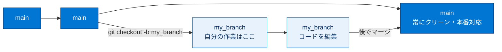
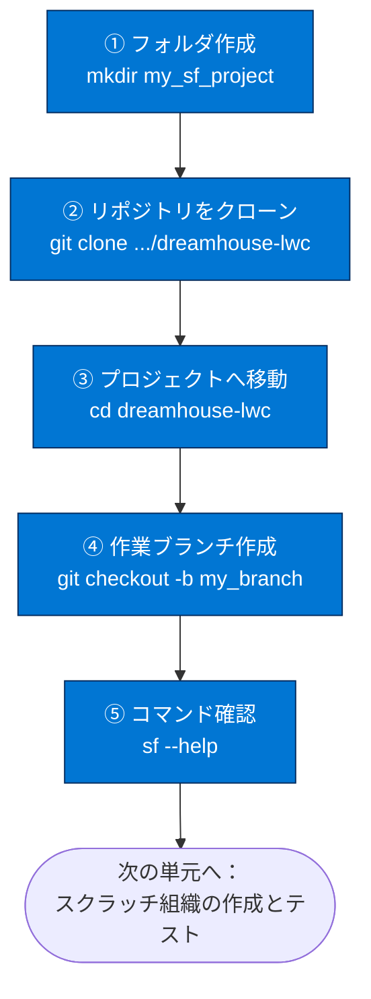
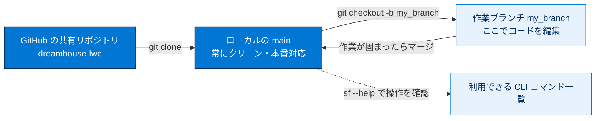

# ローカルマシンでのプロジェクトの設定

## 学習の目的

この単元を完了すると、次のことができるようになります。

- GitHub のリポジトリをローカルマシンにクローンする。
- GitHub フローに沿って作業用ブランチを作成する。
- Salesforce CLI のヘルプ（`sf --help`）でコマンドを確認する。

> [!ポイント] この単元のゴール
>
> 前の単元で整えた CLI 環境を使い、**手元のパソコン（ローカルマシン）に開発用プロジェクトを準備**します。やることは3つ。**リポジトリをクローン → 作業ブランチを作成 → CLI のヘルプを確認**。コードを書き換える前の作業場所づくりのステップです。

---

## Trail Together の動画

エキスパートの説明を見ながら進めたい場合は、Trail Together シリーズの動画をご覧ください（このクリップは 04:47 から開始）。

---

## はじめに：開発者プロジェクトを用意する

次の目標は、アプリケーションを変更するための開発者プロジェクトの設定です。最初にリポジトリをコピーします。

> [!用語] リポジトリ（repository）
>
> ソースコードとその変更履歴を保管する「保管庫」。GitHub 上の共有リポジトリを自分のパソコンに丸ごとコピーする操作を**クローン（clone）**と呼び、すべてのファイルと履歴が手元に取り込まれます。

> [!用語] ローカルマシン（local machine）
>
> あなたが今操作している**手元のパソコン**。クラウド上の Salesforce 組織（リモート）と対比して「ローカル」と呼びます。DX 開発ではローカルでコードを編集し、リモートの組織へ反映します。

---

## GitHub からプロジェクトをダウンロードする

> [!注意] Windows ユーザーは Git を先に用意する
>
> Windows ユーザーは最初に **Git for Windows** をインストールします（コマンドラインから `git` を実行するため）。Mac には標準で git が含まれることが多いですが、なければ同様にインストールが必要です。

新しいターミナル（Mac）またはコマンドプロンプト（Windows）を開き、作業用ディレクトリを作成してその中へ移動します。

```bash
# 作業用フォルダを作成する
mkdir my_sf_project
# 作成したフォルダの中へ移動する
cd my_sf_project
```

> [!用語] `mkdir` と `cd`
>
> コマンドラインの基本操作です。**`mkdir`（make directory）** は新しいフォルダを作るコマンド、**`cd`（change directory）** は指定フォルダへ移動するコマンドです。

次のコマンドでアプリケーションリポジトリをクローンし、できたディレクトリへ移動します。

```bash
# dreamhouse-lwc リポジトリを GitHub からクローンする
git clone https://github.com/trailheadapps/dreamhouse-lwc.git
# クローンで作成された dreamhouse-lwc フォルダへ移動する
cd dreamhouse-lwc
```

クローンすると、すべてのソースコードがローカルファイルシステムに取り込まれます。

> [!例] クローン後のフォルダ構成イメージ
>
> ```text
> my_sf_project/
> └─ dreamhouse-lwc/      ← クローンで取得したプロジェクト
>    ├─ force-app/        ← Apex / LWC などのソースコード
>    ├─ config/           ← スクラッチ組織の設定ファイル
>    ├─ data/             ← サンプルデータ
>    └─ ...
> ```
>
> `config/` の設定ファイルや `data/` のサンプルデータは、次の単元でスクラッチ組織を作るときに使います。

---

## プロジェクトのブランチを作成する

編集を開始する前に独自のブランチを作成します。メインブランチをクリーンで本番対応な状態に保てるため、これは **GitHub フロー**のベストプラクティスです。

> [!用語] ブランチ（branch／枝）
>
> リポジトリ内で作業を「枝分かれ」させる仕組み。メイン（main）ブランチを安全に保ちつつ自分専用の枝でコードを編集し、作業が固まったらメインに合流（マージ）させます。

> [!用語] GitHub フロー（GitHub Flow）
>
> 「メインブランチは常に本番リリース可能に保ち、新しい作業は必ず別ブランチで行う」というシンプルで広く使われる開発手法です。

作業用の新しいブランチを作成します。

```bash
# my_branch という名前の新しいブランチを作成し、そのブランチに切り替える
#   -b : ブランチを新規作成すると同時に切り替える
git checkout -b my_branch
```

> [!ポイント] `git checkout -b` の役割
>
> `git checkout -b ブランチ名` は、「新しいブランチを**作る**」と「そのブランチに**切り替える**」を一度に行うコマンドです。各自のブランチで作業すれば、後でチームに更新を簡単に送信できます。



---

## 利用できる CLI コマンドを確認する

Salesforce DX には CLI を使った包括的な機能が一式用意されています。次のコマンドで使用可能なコマンドを確認します。

```bash
# Salesforce CLI で利用できるコマンドの一覧とヘルプを表示する
sf --help
```

> [!ポイント] 困ったら `--help`
>
> `sf --help` で全体のコマンド一覧が見られます。特定コマンドの使い方は、`sf org create scratch --help` のように**コマンドの後ろに `--help` を付ける**と、そのコマンド専用の説明とフラグ一覧が表示されます。

プロジェクトの設定ができたので、次のステップではスクラッチ組織を作成します。

---

## この単元の作業フロー



> [!まとめ] この単元のおさらい
>
> - **クローン**（`git clone`）で GitHub の共有リポジトリを手元にコピーする。
> - 編集前に**作業ブランチ**（`git checkout -b my_branch`）を作るのが GitHub フローのベストプラクティス。
> - メインブランチは常にクリーン（本番対応）に保ち、変更は自分のブランチで行う。
> - `sf --help` で使えるコマンドを確認できる。個別コマンドは `コマンド --help` で詳しく見られる。

---

## 試験対策：押さえておきたい追加ポイント

> [!ポイント] バージョン管理と DX プロジェクトの頻出ポイント
>
> - DX 開発は**ソースコード中心**。コードはローカルで編集し、CLI で組織へリリースする。
> - メインブランチを直接編集せず、**フィーチャーブランチ**で開発するのが基本。
> - `git clone` は履歴を含めてリポジトリ全体を取得する操作。
> - DX プロジェクトには `sfdx-project.json`（プロジェクト定義）や `config/`（スクラッチ組織設定）が含まれる。
> - CLI コマンドの使い方が分からないときは `--help` を活用する。

---

## リソース

- GitHub Docs：リポジトリのクローン
- GitHub Flow（GitHub フロー）の概要
- Salesforce CLI Command Reference（コマンドリファレンス）
- Trailhead：Salesforce DX の使用開始

---

## ハンズオン Challenge（+100 ポイント）

> [!手順] あなたの Challenge：ローカルにプロジェクトを設定する
>
> 1. （Windows の場合）Git for Windows をインストールする。
> 2. 作業用フォルダを作成して移動する：`mkdir my_sf_project` → `cd my_sf_project`。
> 3. リポジトリをクローンする：`git clone https://github.com/trailheadapps/dreamhouse-lwc.git`。
> 4. プロジェクトフォルダへ移動する：`cd dreamhouse-lwc`。
> 5. 作業ブランチを作成する：`git checkout -b my_branch`。
> 6. **[Verify Step（ステップを確認）]** をクリックして次のステップへ進む。

> [!注意] このステップは設定の確認を行わない
>
> このステップではローカル環境の中身を Trailhead 側から検証できません。**[Verify Step（ステップを確認）]** をクリックして次のステップへ進んでください。

> [!注意] 日本語環境で受講する場合
>
> Challenge は日本語の Trailhead Playground で開始し、かっこ内の翻訳を参照しながら進めます。評価は英語データに対して行われるため、**英語の値のみ**をコピー&ペーストします。日本語組織で不合格になった場合は、(1) [地域（Locale）] を [米国（United States）]、(2) [言語（Language）] を [英語（English）] に切り替え、(3) [Check Challenge] をクリックすると通ることがあります。

---

## 🎓 この単元のまとめ

この単元では、前単元で整えた CLI 環境を使い、手元のパソコン（ローカルマシン）に開発用プロジェクトを準備する作業を行いました。GitHub フローに沿って「リポジトリをクローン → 作業ブランチを作成 → CLI のヘルプを確認」というコードを書く前の作業場所づくりを学びました。

次の図は、GitHub フローにおけるメインブランチと作業ブランチの関係を俯瞰したものです。



> [!まとめ] この単元の要点
>
> - **クローン**（`git clone`）で GitHub の共有リポジトリを履歴ごと手元にコピーする。
> - 編集前に**作業ブランチ**（`git checkout -b my_branch`）を作るのが **GitHub フロー**のベストプラクティス。
> - **メインブランチは常にクリーン（本番対応）** に保ち、変更は自分のブランチで行う。
> - DX プロジェクトには `force-app/`（ソース）・`config/`（スクラッチ組織設定）・`data/`（サンプルデータ）が含まれる。
> - `sf --help` で全コマンド一覧、`コマンド --help` で個別の使い方を確認できる。

> [!豆知識] クローンしているのは「DreamHouse LWC 版」
>
> この単元で取得する `dreamhouse-lwc` は、Salesforce 公式の学習用サンプルアプリ DreamHouse の **Lightning Web Components（LWC）版**です。同じ DreamHouse には Aura 版など複数のバリエーションがあり、リポジトリ名末尾の `-lwc` が「どの技術で作られた版か」を表しています。`git clone` 一発で本格的なサンプルアプリの全ソースと履歴が手に入るのは、ソース駆動開発の手軽さを体感できる好例です。
