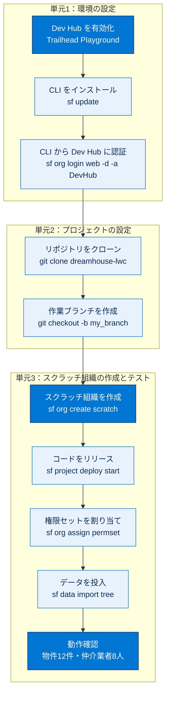

# クイックスタート SalesforceDX 総まとめ

このトピックでは、**Salesforce DX（Developer Experience）** によるソースコード中心の開発フローを、環境の準備から実際の動作確認まで一気通貫で体験しました。具体的には、スクラッチ組織を発行する **Dev Hub の有効化と CLI 認証**、**GitHub からのプロジェクト取得とブランチ作成**、そして **スクラッチ組織の作成・コードのリリース・権限付与・データ投入・動作確認** という3段階を学びました。コマンドを「画面ではなく文字で組織を操作する」という DX の核心を、サンプルアプリ DreamHouse を題材につかむのが狙いです。

---

## 全体像：3単元でたどる DX クイックスタートの流れ

---

## ユニット横断 早見表

| 単元 | 学んだこと | キーワード | 一言要点 |
| --- | --- | --- | --- |
| **1. Salesforce DX 環境の設定** | DX の概念、Dev Hub とスクラッチ組織の役割、CLI の導入と認証 | Salesforce DX / Dev Hub / Salesforce CLI（`sf`）/ 別名・デフォルト | スクラッチ組織を作れる「土台」を整える3ステップ |
| **2. ローカルマシンでのプロジェクトの設定** | リポジトリのクローン、GitHub フローによるブランチ作成、CLI ヘルプ | リポジトリ / クローン / ブランチ / GitHub フロー | 手元に作業場所を用意し、メインを汚さず開発する |
| **3. スクラッチ組織の作成とテスト** | スクラッチ組織の作成・リリース・権限付与・データ投入・動作確認 | スクラッチ組織 / deploy / 権限セット / sObject ツリー保存 API | DX の本番：コマンドでアプリを組み立て動かす |

---

## 🎯 試験頻出ポイント

> [!ポイント] このトピックで狙われやすい論点
>
> - **スクラッチ組織は Dev Hub からのみ作成できる**（単独では作れない）。発行元が Dev Hub、使い捨ての環境がスクラッチ組織という役割分担を区別する。
> - スクラッチ組織は **最大30日間** 有効。同時に有効化できる数・1日に作成できる数は **Dev Hub のエディション** で決まる。上限到達時は `sf org delete scratch` で枠を解放する。
> - 開発は本番組織ではなく **Developer Edition / Trailhead Playground** で行うのがベストプラクティス。
> - 現行 CLI のコマンドはすべて **`sf`** で始まる（旧 `sfdx` からの移行体系）。
> - リリースの方向：**`sf project deploy start`＝ローカル → 組織**、逆の取得は **`sf project retrieve start`**。
> - よく使うフラグ：**`-a`＝別名（alias）**、**`-d`＝デフォルト指定（既定の Dev Hub / 既定の組織）**、**`-f`＝定義ファイル**、**`-n`＝権限セット名**、**`-p`＝データプランファイル**。
> - データ投入は **sObject ツリー保存 API** を使い、**プランファイル** で親子の取り込み順を制御する。
> - DX は **ソースコード中心（source-driven）**：コードをローカルで編集し VCS で管理、CLI で組織へ反映する。

---

## 📖 用語早見表

| 用語 | ひとことの意味 |
| --- | --- |
| **Salesforce DX** | ソースコード中心で開発を進めるツールセットの総称 |
| **Dev Hub（開発者ハブ）** | スクラッチ組織を作成・管理するメイン組織（発行元） |
| **スクラッチ組織（Scratch Org）** | 設定可能で短期（最大30日）の使い捨て開発環境 |
| **Salesforce CLI（`sf`）** | コマンドで組織を操作する道具。全コマンドが `sf` で始まる |
| **別名（alias）** | 組織に付ける短い「あだ名」。`-a` で指定 |
| **VCS / Git / GitHub** | 変更履歴を管理する仕組みと、その代表ツール・共有サービス |
| **リポジトリ / クローン** | ソースの保管庫と、それを手元に丸ごとコピーする操作 |
| **ブランチ / GitHub フロー** | 作業を枝分かれさせる仕組みと、メインを本番対応に保つ開発手法 |
| **メタデータ** | Apex・LWC・オブジェクト定義などの設定・構成情報 |
| **リリース／デプロイ（deploy）** | ローカルのメタデータを組織へ反映・配置すること |
| **権限セット（Permission Set）** | プロファイルに上乗せしてアクセス権を付与する仕組み |
| **sObject ツリー保存 API** | 親子関係を保ったままレコードをまとめて登録する API |
| **`project-scratch-def.json`** | スクラッチ組織の構成を定義する設計図 JSON |
| **認証トークン** | ログイン状態を表す合言葉。パスワード再入力を不要にする |
| **CI（継続的インテグレーション）** | 変更のたびに自動でビルド・テストを行う開発手法 |

---

> [!豆知識] 「DX」は Developer Experience の略
>
> Salesforce DX の「DX」は、近年バズワード化した「デジタルトランスフォーメーション（DX）」ではなく **Developer Experience（開発者体験）** の略です。設定画面をクリックする旧来の開発から、コードとコマンドで再現性高く開発する体験へ。名前そのものが「開発のやり方を良くする」という思想を表しています。

> [!豆知識] DreamHouse は Salesforce の名物デモアプリ
>
> 本トピックで使う DreamHouse は、不動産業向けの公式サンプルアプリで、Dreamforce などのイベントでも長年デモに使われてきた“看板娘”的存在です。物件（Property）と仲介業者（Broker）という分かりやすい題材のおかげで、新しい開発手法を学ぶときの定番教材になっています。

> [!豆知識] 「捨てられる環境」が品質を上げる
>
> スクラッチ組織の真価は「いつでも作って捨てられる」点にあります。手作業で汚れた組織を使い続けるのではなく、定義ファイルから毎回まっさらな組織を再現できるため、「自分の環境では動くのに…」という属人化したトラブルが起きにくくなります。使い捨てにできることが、かえって開発全体の品質と再現性を高めるのです。

---

## ✅ 理解度セルフチェック

> [!まとめ] 答えられるか確認しよう（答えは各項目の末尾）
>
> 1. スクラッチ組織は、何という組織から作成しますか？ → **Dev Hub（開発者ハブ）**
> 2. スクラッチ組織が有効な最長期間は何日ですか？ → **最大30日間**
> 3. 現行 Salesforce CLI のコマンドは、すべて何という語で始まりますか？ → **`sf`**
> 4. ローカルのメタデータを組織へ反映するコマンドは？（逆方向のコマンドも） → **`sf project deploy start`（逆方向の取得は `sf project retrieve start`）**
> 5. 編集を始める前に、メインブランチを汚さないために行う GitHub フローの作法は？ → **作業用のブランチを作成する（`git checkout -b my_branch`）**
> 6. 親子関係を保ったままサンプルデータをまとめて投入するために使う API は？ → **sObject ツリー保存 API（`sf data import tree` ＋ プランファイル）**
