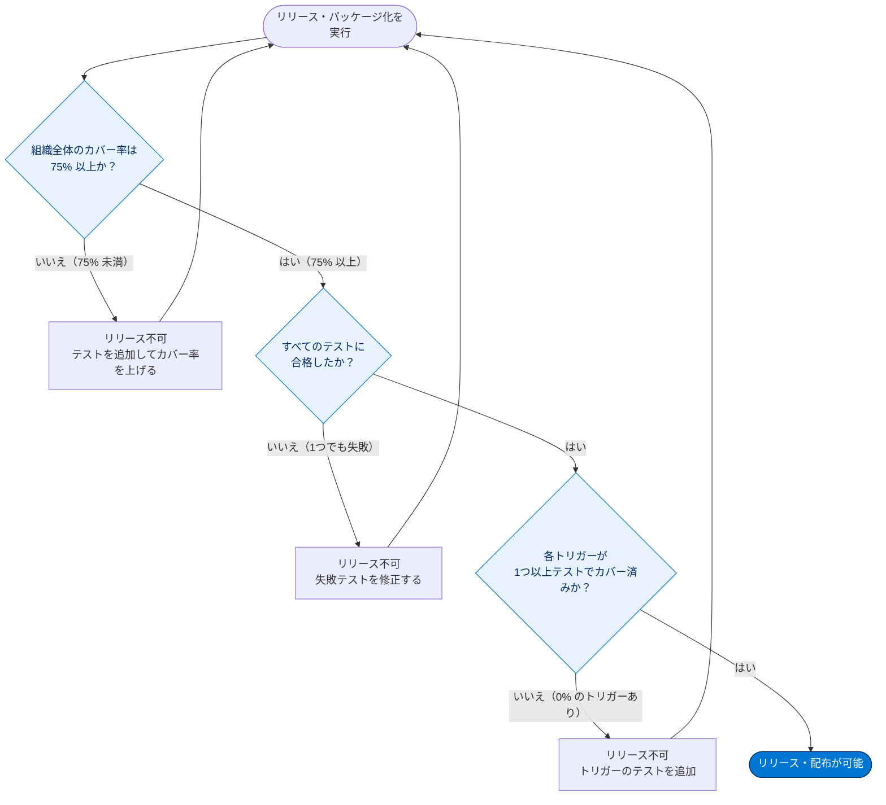
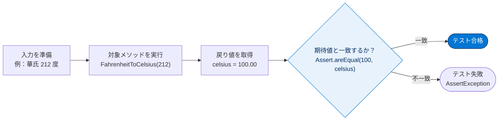
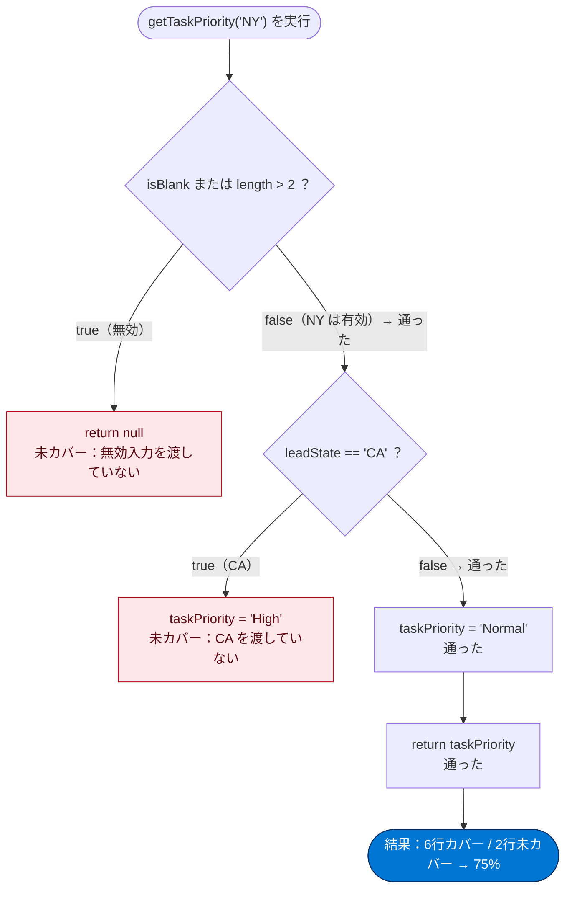

# Apex 単体テストを始める

## 学習の目的

この単元を完了すると、次のことができるようになります。

- Apex 単体テストの主要な利点を説明する。
- クラスとそのテストメソッドを定義する。
- クラスのすべてのテストメソッドを実行し、エラーを調べる。
- 一連のテストクラスを作成し、実行する。

> [!ポイント] この単元のゴール
>
> 「**自分が書いた Apex コードが正しく動くことを、別のコードで自動的に検証する**」のが Apex 単体テストです。試験では特に次の3点が問われます。
> - テストクラス・テストメソッドの書き方（`@IsTest` アノテーション）
> - **リリースには 75% 以上のコードカバー率が必須**という要件
> - `Assert` クラスによる検証（期待値と実際の値の比較）

---

## Apex 単体テストとは

Apex テストフレームワークで、Apex クラスとトリガーのテストを記述・実行できます。単体テストにより Apex コードの品質が高まり、リリース要件を満たせます。

> [!用語] Apex（エイペックス）
>
> Salesforce 独自のプログラミング言語。Java に似た構文で、Salesforce サーバー上で動作し、データベース操作やビジネスロジックを記述できます。

> [!用語] 単体テスト（Unit Test／ユニットテスト）
>
> プログラムの「最小単位（メソッドやクラス）」が、**入力に対して期待どおりの結果を返すか**をコードで自動検証する小さなテスト。

> [!注意] Apex コードを書ける場所・書けない場所
>
> Apex は **Sandbox または開発者組織でのみ記述でき、本番組織では直接記述できません**。Sandbox から本番組織へリリースします。また AppExchange へのパッケージアップロードで開発者組織から顧客に配布できます。Apex 単体テストは品質保証だけでなく、**Apex のリリースと配布の必須要件**です。

> [!用語] Sandbox（サンドボックス）／本番組織（Production）
>
> **Sandbox** は本番組織のコピーで、開発・テストを安全に行う環境。**本番組織**は実業務で使う環境。新しいコードはまず Sandbox で作り、テスト合格後に本番へリリースします。

### Apex 単体テストの利点

| 利点 | 説明 |
| --- | --- |
| 動作保証 | Apex クラスやトリガーが**期待どおりに機能すること**を確認できる |
| 回帰テスト | クラス更新のたびに再実行でき、**既存機能が壊れていないこと**を確認できる |
| リリース要件の充足 | 本番リリースやパッケージ配布で求められる**コードカバー率要件**を満たせる |
| 本番ユーザーの生産性向上 | 高品質なアプリを届け、本番ユーザーの生産性が上がる |
| 顧客の信頼向上 | 高品質なアプリ配信で、パッケージ登録者（顧客）の信頼が高まる |

> [!用語] 回帰テスト（Regression Test）
>
> コード変更で「以前は動いていた機能が壊れていないか（後戻り＝regression していないか）」を確認するテスト。一度書けば変更のたびに再実行できます。

---

## リリースのコードカバー率要件

リリースまたは AppExchange 用パッケージ化までに、**Apex コードの少なくとも 75% のテストが完了し、すべてのテストに合格している必要があります**。各トリガーも何らかのテストが必要です。

カバー率は要件ですが、これを満たすことのみを目的にしないでください。正常・異常のケース、一括・単一レコード処理など一般的なユースケースをテストします。



> [!用語] コードカバー率（Code Coverage）
>
> テストによって**実際に実行された行の割合**。全100行のうち75行が実行されればカバー率は 75%。本番リリースには **75% 以上**が必須です。

> [!ポイント] 75% は「最重要の暗記数字」
>
> - 本番リリース・パッケージ化には **組織全体で 75% 以上**のカバー率が必要。
> - **すべてのテストに合格**していることも必須（1つでも失敗するとリリース不可）。
> - **各トリガーは最低でも何らかのテストでカバー**される必要がある（0% は不可）。
> - 75% は最低ライン。**正常系・異常系・境界値・一括処理**もテストするのがベストプラクティス。

---

## テストクラスとテストメソッドの構文

Apex テストクラスには `@IsTest` アノテーションを付加します。public でも private でも定義できますが、単体テスト専用クラスは **private** で宣言します。public テストクラスは通常テストデータファクトリクラスで使用します。`@IsTest` クラスは**最上位クラス**である必要があります。

> [!用語] アノテーション（Annotation）
>
> コードに付ける「目印・注釈」。`@` で始まります。`@IsTest` を付けると Salesforce はそのクラス・メソッドを「テスト用」と認識し、本番のコードサイズ制限にカウントしない等の特別扱いをします。

テストメソッドも `@IsTest` で定義します。テストフレームワークは常にアクセスできるため、アクセス修飾子は考慮されず省略されます。

```apex
@IsTest
private with sharing class MyTestClass {
  @IsTest static void myTest() {
    // code_block
  }
}
```

`@IsTest` には括弧内に空白区切りで複数の修飾子を指定できます（例：`@IsTest(seeAllData=true)`）。

> [!ポイント] テストクラス構文のチェックポイント
>
> - クラスとメソッドの**両方**に `@IsTest` を付ける。
> - `@IsTest` クラスは**最上位クラス**でなければならない（入れ子不可）。
> - 単体テスト専用クラスは **private** で宣言するのが推奨。
> - テストメソッドは **static（静的）**で定義する。
> - 古い `static testMethod void ...` もあるが、現在は `@IsTest` が推奨。

---

## 単体テストの例: TemperatureConverter クラスのテスト

次はテストメソッドが 3 つあるテストクラスの例です（後で 4 つ目を追加）。テスト対象メソッドは華氏温度を入力に取り、摂氏温度へ変換して返します。

> [!手順] テスト対象クラス TemperatureConverter を作成する
>
> 1. 開発者コンソールで、**[File（ファイル）] | [New（新規）] | [Apex Class（Apex クラス）]** をクリックする。
> 2. クラス名に `TemperatureConverter` と入力して **[OK]** をクリックする。
> 3. デフォルトのクラス本文を次のコードで置き換える。

```apex
public with sharing class TemperatureConverter {
  // 華氏温度を受け取り、摂氏温度に変換して返す。
  public static Decimal FahrenheitToCelsius(Decimal fh) {
    Decimal cs = (fh - 32) * 5/9;
    return cs.setScale(2);
  }
}
```

`Ctrl + S` で保存します。同じ手順で `TemperatureConverterTest` クラスを作成し、本文を次のコードで置き換えます。

```apex
@IsTest
private with sharing class TemperatureConverterTest {
  @IsTest static void testWarmTemp() {
    Decimal celsius = TemperatureConverter.FahrenheitToCelsius(70);
    Assert.areEqual(21.11,celsius);
  }
  @IsTest static void testFreezingPoint() {
    Decimal celsius = TemperatureConverter.FahrenheitToCelsius(32);
    Assert.areEqual(0,celsius);
  }
  @IsTest static void testBoilingPoint() {
    Decimal celsius = TemperatureConverter.FahrenheitToCelsius(212);
    Assert.areEqual(100,celsius,'Boiling point temperature is not expected.');
  }
  @IsTest static void testNegativeTemp() {
    Decimal celsius = TemperatureConverter.FahrenheitToCelsius(-10);
    Assert.areEqual(-23.33,celsius);
  }
}
```

各テストメソッドの中身は「入力を渡してメソッドを実行し、戻り値を期待値と比較する」という共通の流れです。



各テストメソッドは1種類の入力（常温・氷点・沸点・マイナス温度）を検証します。検証は `Assert.areEqual()` をコールし、第1引数が**期待値**、第2引数が**実際の値**です。省略可能な第3引数に比較を説明する文字列を指定でき（`testBoilingPoint()` で使用）、アサーション失敗時にログに記録されます。

> [!用語] アサーション（Assertion）／Assert クラス
>
> 「**ここでは値がこうなっているはずだ**」とコードで宣言（assert）し、実際にそうなっているか検証する仕組み。`Assert.areEqual(期待値, 実際の値)` のように使い、一致しなければテスト失敗。古いコードでは `System.assertEquals()` を使います。

> [!ポイント] よく使う Assert メソッド
>
> | メソッド | 検証内容 |
> | --- | --- |
> | `Assert.areEqual(期待値, 実際の値)` | 2つの値が**等しい**こと |
> | `Assert.areNotEqual(値1, 値2)` | 2つの値が**等しくない**こと |
> | `Assert.isTrue(条件)` | 条件が **true** であること |
> | `Assert.isFalse(条件)` | 条件が **false** であること |
> | `Assert.isNull(値)` | 値が **null** であること |
> | `Assert.isNotNull(値)` | 値が **null でない**こと |
> | `Assert.fail()` | 無条件でテストを**失敗**させる（到達禁止箇所に置く） |
>
> 第1引数が「期待値」、第2引数が「実際の値」という**順番**を間違えないこと（失敗メッセージが逆になり混乱します）。

> [!例] 引数の順番を間違えると
>
> 正しくは `Assert.areEqual(100, celsius)`（期待値が先）。`Assert.areEqual(celsius, 100)` でも成功/失敗は同じですが、失敗ログで期待と実際が**逆表示**され原因調査がしづらくなります。

---

## テストクラスを実行する

> [!手順] 開発者コンソールでテストを実行する
>
> 1. 開発者コンソールで、**[Test（テスト）] | [New Run（新規実行）]** をクリックする。
> 2. **[Test Classes（テストクラス）]** の下で、**[TemperatureConverterTest]** をクリックする。
> 3. すべてのテストメソッドを実行に追加するには、**[Add Selected（選択項目を追加）]** をクリックする。
> 4. **[Run（実行）]** をクリックする。

**[Tests（テスト）]** タブに実行状況が表示されます。実行を展開すると個々のテストが表示され、すべてに緑のチェックが付けば全テスト合格です。

---

## 開発者コンソールでテスト結果を調べる

テスト実行後、Apex クラスやトリガーのコードカバー率が自動生成され、**[Tests（テスト）]** タブで確認できます。この例では `TemperatureConverter` クラスが 100% と表示されます。

> [!注意] コードカバー率の更新に関する既知の問題
>
> - Apex コードを変更したら**必ずテストを再実行**してカバー率を更新する。
> - 既知の問題により、**一部のテストだけ実行するとカバー率が正しく更新されません**。正しく更新するには **[Test] | [Run All（すべて実行）]** を使用する。

1 つのテストでカバー率が十分でも、別の入力をテストして品質を確保することが重要です。正の数・負の数、境界値、無効パラメーターなどを渡し、異常時の動作も検証します。

ただし `TemperatureConverterTest` は現在、境界条件や無効入力に未対応です。**境界条件**はメソッドが処理できる最小・最大値、**無効な入力**は `FahrenheitToCelsius()` に `null` が渡された場合などです。`null` では計算時に `System.NullPointerException` が発生します。これを処理するには無効入力時に `null` を返すようメソッドを修正し、テストメソッドを追加して動作を検証します。

> [!用語] 境界値（Boundary Value）テスト
>
> 処理が変わる「境目」の値（最小・最大、0、上限・下限のすぐ内側/外側）を狙うテスト。バグは境目に潜みやすく、試験でも「正常系だけでなく境界値・異常系もテストせよ」と問われます。

> [!用語] NullPointerException（ヌルポインター例外）
>
> `null` の変数にメソッド呼び出しや計算を行うと発生する代表的エラー。「中身が空なのに使おうとした」ときに起こります。

### アサーション失敗をシミュレーションする

変換数式が正しいため、ここまで全テスト合格でした。エラーをシミュレーションするため、沸点テストの期待値を誤って 0 にして失敗させてみます。

```apex
@IsTest
static void testBoilingPoint() {
  Decimal celsius = TemperatureConverter.FahrenheitToCelsius(212);
  // 失敗をシミュレーション
  Assert.areEqual(0,celsius,'Boiling point temperature is not expected.');
}
```

> [!手順] 失敗を確認する
>
> 1. **[Tests（テスト）]** タブで最新実行を選択し、**[Test（テスト）] | [Rerun（再実行）]** をクリックする。`testBoilingPoint()` のアサーションが失敗し `AssertException` が発生する。
> 2. 最新実行を展開すると、4 つ中 1 つが失敗とレポートされる。実行をダブルクリックすると詳細が別タブに表示される。
> 3. 失敗したテストの **[Errors（エラー）]** 列内をダブルクリックするとエラーメッセージが表示される。`Assert.areEqual()` で指定したテキストが含まれる。

エラーメッセージの例:

```text
System.AssertException: Assertion Failed: Boiling point temperature is not expected.: Expected: 0, Actual: 100.00
```

> [!例] 失敗メッセージの読み方
>
> - `Boiling point temperature is not expected.` … 第3引数で指定した**説明文**
> - `Expected: 0` … テストが期待していた値（こちらが間違い）
> - `Actual: 100.00` … メソッドが実際に返した値（こちらが正しい）
>
> 第3引数の説明文を書くと**失敗の原因が一目でわかる**ため、添えるのがおすすめです。

これらのテストデータは数値で、Salesforce レコードではありません。レコードのテスト方法とデータ設定は次の単元で学びます。

---

## コードカバー率を高める

リリースに必要な最低カバー率 75% で満足せず、できるだけ高いカバー率を目指します。カバーするケースが多いほどコードは堅牢になります。

すべてのメソッドにテストを書いても 100% にならないことがあります。よくある原因は、**条件付きコード実行のすべてのデータ値がカバーされていないこと**です。`if` で分岐する場合、各分岐に対応する値をテストする必要があります。

> [!用語] 分岐（ブランチ）カバレッジ
>
> `if`〜`else` で **true 側・false 側の両方の経路**がテストで通っているかという観点。100% を目指すにはすべての分岐の両側を通すテストが必要です。

次の `getTaskPriority()` は 2 つの `if` を含みます。州を検証し、無効なら `null`、CA なら `'High'`、それ以外は `'Normal'` を返します。

```apex
public with sharing class TaskUtil {
  public static String getTaskPriority(String leadState) {
    // 入力を検証する
    if(String.isBlank(leadState) || leadState.length() > 2) {
      return null;
    }
    String taskPriority;
    if(leadState == 'CA') {
      taskPriority = 'High';
    } else {
      taskPriority = 'Normal';
    }
    return taskPriority;
  }
}
```

> [!注意] 等価演算子と大文字小文字
>
> 等価演算子（`==`）は**大文字小文字を区別しない**文字列比較を行います。`ca` や `Ca` を渡しても `CA` との等価条件が満たされ、小文字変換は不要です。

次のテストは 1 つの州（`NY`）だけで `getTaskPriority()` をコールします。

```apex
@IsTest
private with sharing class TaskUtilTest {
  @IsTest
  static void testTaskPriority() {
    String pri = TaskUtil.getTaskPriority('NY');
    Assert.areEqual('Normal', pri);
  }
}
```

このテストを実行すると `TaskUtil` のカバー率は **75%** と表示されます。`TaskUtil` クラスで **[Code Coverage: All Tests]** に切り替えると、6 つの青い行（カバー済み）と 2 つの赤い行（未カバー）が表示されます。



無効な州を渡すテストと、CA を渡すテストがないため 2 行が未カバーです。`testTaskHighPriority()` と `testTaskPriorityInvalid()` を追加した完全なテストクラスを次に示します。実行すると `TaskUtil` のカバー率は **100%** になります。

```apex
@IsTest
private with sharing class TaskUtilTest {
  @IsTest
  static void testTaskPriority() {
    String pri = TaskUtil.getTaskPriority('NY');
    Assert.areEqual('Normal', pri);
  }
  @IsTest
  static void testTaskHighPriority() {
    String pri = TaskUtil.getTaskPriority('CA');
    Assert.areEqual('High', pri);
  }
  @IsTest
  static void testTaskPriorityInvalid() {
    String pri = TaskUtil.getTaskPriority('Montana');
    Assert.isNull(pri);
  }
}
```

> [!ポイント] 100% にするための考え方
>
> | テストメソッド | 入力 | カバーする経路 |
> | --- | --- | --- |
> | `testTaskPriority` | `'NY'` | `Normal` を返す経路 |
> | `testTaskHighPriority` | `'CA'` | `High` を返す経路 |
> | `testTaskPriorityInvalid` | `'Montana'`（3文字＝無効） | `null` を返す経路 |
>
> **すべての分岐の「行き先」を一度ずつ通す**のがコツ。`'Montana'` は3文字で `length() > 2` に引っかかり `null` が返ります。

---

## テストスイートを作成して実行する

**テストスイート**は、まとめて実行する Apex テストクラスのコレクションです。リリース準備時や Salesforce の新バージョンリリース時などに実行します。

> [!用語] テストスイート（Test Suite）
>
> 関連する複数のテストクラスを「ひとまとまり」にしたもの。全テストを毎回流すと時間がかかるため、関連クラスだけスイートにまとめ、必要なときに実行できます。

組織のテストクラスが 2 つになりました。両方を含むスイートを作って実行します。

> [!手順] テストスイートを作成・実行する
>
> 1. 開発者コンソールで、**[Test（テスト）] | [New Suite（新規スイート）]** を選択する。
> 2. スイート名に `TempConverterTaskUtilSuite` と入力して **[OK]** をクリックする。
> 3. **[TaskUtilTest]** を選択し、`CTRL` キーを押したまま **[TemperatureConverterTest]** を選択する。
> 4. スイートに追加するには **[>]** をクリックする。
> 5. **[Save（保存）]** をクリックする。
> 6. **[Test（テスト）] | [New Suite Run（新規スイート実行）]** を選択する。
> 7. **[TempConverterTaskUtilSuite]** を選択し、**[>]** で **[Selected Test Suites]** 列に移動する。
> 8. **[Run Suites（スイートを実行）]** をクリックする。

**[Tests（テスト）]** タブで状況を監視します。実行を展開し、メソッド名をダブルクリックすると詳細な結果を確認できます。

---

## テストデータを作成する

テストメソッドで作成した Salesforce レコードは**データベースにコミットされず**、テスト終了時にロールバックされます。テストデータはテストメソッド内で直接作成するか、ユーティリティテストクラス（後述）で作成します。

> [!用語] ロールバック（Rollback）
>
> 行った変更を「なかったこと」にして元に戻すこと。テスト中に作ったレコードは自動ロールバックされ、**本物のデータベースを汚さず**何度でもテストできます。

> [!ポイント] テストデータの基本ルール
>
> - テストで `insert` したレコードはテスト終了時に**自動でロールバック**される（後片付け不要）。
> - デフォルトでは Apex テストは**組織の既存データにアクセスできない**（User・Profile など設定・メタデータオブジェクトは例外）。
> - だから**テストデータはテスト内で自分で作る**のが原則。組織データの欠落・変更に左右されず堅牢になる。

> [!注意] SeeAllData=true は安易に使わない
>
> 既存データへのアクセスが必要な場合、テストメソッドに `@IsTest(SeeAllData=true)` を付加すると組織データにアクセスできます。ただし**組織データに依存してテストが不安定になる**ため原則避けます。この単元の例では使用しません。

---

## 試験対策：押さえておきたい追加ポイント

> [!ポイント] テスト実行環境の特徴（暗記推奨）
>
> | 項目 | 振る舞い |
> | --- | --- |
> | テストで作成したレコード | 終了時に**ロールバック**される |
> | メール送信 | テストメソッドでは**送信されない** |
> | コールアウト（外部サービス呼び出し） | **実行できない**。`Test.setMock()` などで**疑似コールアウト**を使う |
> | SOSL 検索 | **空の結果**を返す。`Test.setFixedSearchResults()` で結果を固定できる |
> | 組織の既存データ | 原則**アクセス不可**（`SeeAllData=true` で可だが非推奨） |
> | `@IsTest` クラスのコードサイズ | 組織の **6 MB 制限に含まれない** |

> [!ポイント] Test.startTest() / Test.stopTest()
>
> - この**ペアで囲んだブロックは、新しいガバナ制限のセット**で実行される。
> - **テストデータ準備のリソース（DML 回数など）と本番ロジックのリソースを切り離して**計測できる。
> - `Test.stopTest()` は囲んだ**非同期処理（@future・Queueable・Batch など）を同期的に完了させる**役割も持つ（非同期 Apex のテストで重要）。

> [!用語] ガバナ制限（Governor Limits）
>
> Salesforce はマルチテナント環境のため、1 つの処理が資源を独占しないよう「SOQL は 100 回まで」「DML は 150 回まで」などの上限を設けています。これを**ガバナ制限**と呼びます。

---

## もうひとこと...

- **VS Code 向け Salesforce Apex 拡張機能**でも Apex テストを実行できます。
- テストに別個のデータベースは使われないため、一意制約のある sObject で重複レコードを挿入するとエラーになります。
- メール送信・コールアウト・SOSL の挙動や 6 MB 制限は、上の「試験対策」の表を参照。

---

## リソース

- Apex 開発者ガイド: ベストプラクティスのテスト
- Apex 開発者ガイド: Apex の単体テスト
- Apex 開発者ガイド: 単体テストの組織データとテストデータの分離
- Salesforce ヘルプ: コードカバー率のチェック

---

## ハンズオン Challenge の準備をする

ハンズオン Challenge を完了するには、以下のコードで `VerifyDate` という名前の新しい Apex クラスを作成します。

```apex
public with sharing class VerifyDate {
  //method to handle potential checks against two dates
  public static Date CheckDates(Date date1, Date date2) {
    //if date2 is within the next 30 days of date1, use date2.  Otherwise use the end of the month
    if(DateWithin30Days(date1,date2)) {
      return date2;
    } else {
      return SetEndOfMonthDate(date1);
    }
  }
  //method to check if date2 is within the next 30 days of date1
  private static Boolean DateWithin30Days(Date date1, Date date2) {
    //check for date2 being in the past
    if( date2 < date1) { return false; }
    //check that date2 is within (>=) 30 days of date1
    Date date30Days = date1.addDays(30); //create a date 30 days away from date1
    if( date2 >= date30Days ) { return false; }
    else { return true; }
  }
  //method to return the end of the month of a given date
  private static Date SetEndOfMonthDate(Date date1) {
    Integer totalDays = Date.daysInMonth(date1.year(), date1.month());
    Date lastDay = Date.newInstance(date1.year(), date1.month(), totalDays);
    return lastDay;
  }
}
```

> [!ポイント] このコードを 100% カバーするテストの作り方
>
> `CheckDates` には分岐が複数あります。**すべての経路**を通すには最低でも次のケースが必要です。
> - `date2` が `date1` の **30日以内** → `date2` がそのまま返る経路
> - `date2` が `date1` より**過去** → 月末日が返る経路
> - `date2` が `date1` から **30日以上先** → 月末日が返る経路
>
> private メソッドは public メソッド経由で呼ばれるため、`CheckDates()` を様々な日付で呼べば内部の private メソッドもカバーされます。

---

## ハンズオン Challenge（+500 ポイント）

> [!まとめ] あなたの Challenge：単純な Apex クラスの単体テストを作成する
>
> 日付が適切な範囲内かをテストし、範囲外なら範囲内の月末日を返す単純な Apex クラスを作成・インストールし、コードカバー率 100% を達成する単体テストを作成します。
>
> **Apex クラスを作成する**
> - 名前：`VerifyDate`
> - コード：上記「準備」セクションからコピー
>
> **単体テストを別のテストクラスに配置する**
> - 名前：`TestVerifyDate`
> - 目標：コードカバー率 100%
>
> **テストクラスを少なくとも 1 回実行する**

> [!注意] 日本語環境で受講する場合
>
> Challenge は日本語 Trailhead Playground で開始し、かっこ内の翻訳を参照しながら進めます。評価は英語データに対して行われるため、**英語の値のみ**をコピー&ペーストします。日本語組織で不合格の場合は、(1) [地域（Locale）] を [米国（United States）]、(2) [言語（Language）] を [英語（English）] に切り替えてから (3) [Check Challenge] をクリックすると通ることがあります。
