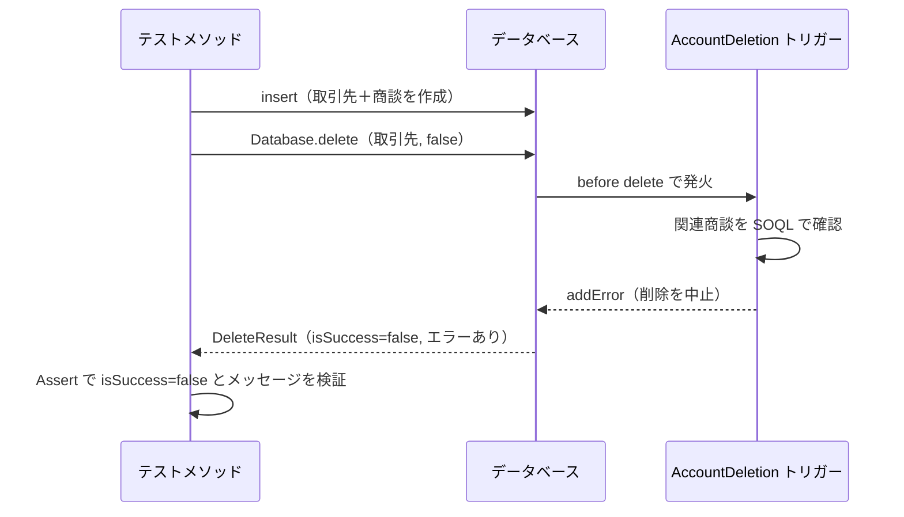
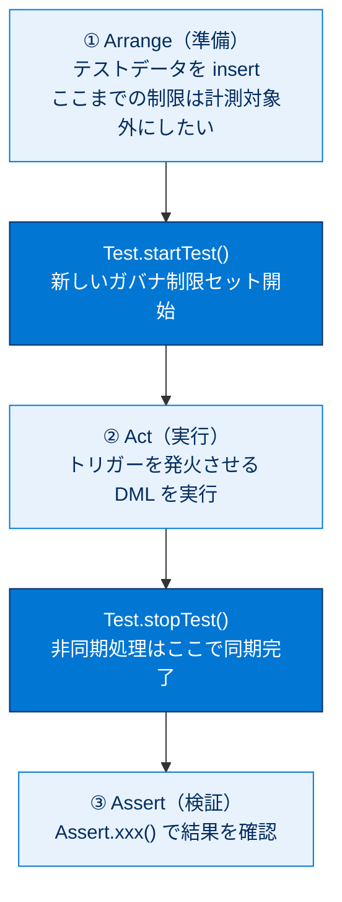

# Apex トリガーをテストする

## 学習の目的

この単元を完了すると、次のことができるようになります。

- 単一レコード操作を起動するトリガーのテストを記述する。
- クラスのすべてのテストメソッドを実行する。

> [!ポイント] この単元のゴール
>
> 「**トリガーが意図した動作をするかをテストで確認する**」のがテーマです。試験では特に次が問われます。
> - トリガーのテストでは、**トリガーを発火させる DML（insert/update/delete）をテスト内で実行する**こと。
> - `Test.startTest()` / `Test.stopTest()` で**ガバナ制限を区切る**こと。
> - `Database.delete(..., false)` のような**部分許可（partial）モード**で結果オブジェクトを受け取り、エラーを検証する手法。

> [!用語] Apex トリガー（Trigger）
>
> レコードが**保存される前後（insert / update / delete など）に自動的に実行される** Apex コード。特定のオブジェクト（Account など）に紐づき、「商談が紐づく取引先は削除させない」といったルールを実装できます。

---

## 前提条件

取引先レコードに商談が関連付けられている場合、`AccountDeletion` トリガーはレコードの削除を防ぎます。

> [!例] AccountDeletion トリガーは何をする？
>
> 商談（子）がぶら下がる取引先（親）を削除しようとすると、トリガーが割り込んで `addError()` でエラーを付け、**削除を中止**します。関連データを巻き込んだうっかり削除を防げます。

まだ `AccountDeletion` トリガーを追加していない場合は、次の手順に従います。

> [!手順] AccountDeletion トリガーを追加する
>
> 1. 開発者コンソールで、**[File（ファイル）] | [New（新規）] | [Apex Trigger（Apex トリガー）]** をクリックする。
> 2. トリガー名に `AccountDeletion` と入力し、sObject に **[Account（取引先）]** を選択して **[Submit（送信）]** をクリックする。
> 3. デフォルトのコードを次のコードに置き換える。

```apex
trigger AccountDeletion on Account (before delete) {
  // 関連する商談がある取引先の削除を防止する。
  for(Account a : [SELECT Id FROM Account
    WHERE Id IN (SELECT AccountId FROM Opportunity) AND
    Id IN :Trigger.old WITH USER_MODE]) {
    Trigger.oldMap.get(a.Id).addError('Cannot delete account with related opportunities.');
  }
}
```

> [!用語] before delete トリガー／Trigger.old・Trigger.oldMap
>
> - **before delete** … レコードが削除される「直前」に動くトリガー。ここで `addError()` を呼ぶと削除を止められます。
> - **Trigger.old** … 削除（や更新前）対象のレコードのリスト（変更前の値）。
> - **Trigger.oldMap** … 同じレコードを **Id をキーにした Map**で持つもの。`Trigger.oldMap.get(a.Id)` で特定レコードを取り出し `addError()` を付けます。

> [!用語] addError() メソッド
>
> レコードにエラーを付与し、DML 操作（ここでは削除）を**失敗させる**メソッド。メッセージは画面や `Database` の結果オブジェクトで確認できます。

> [!注意] WITH USER_MODE と sObject 修飾子
>
> - SOQL 末尾の `WITH USER_MODE` は、クエリを**実行ユーザーの権限に従って**実行させる安全な書き方です。
> - サブクエリ `(SELECT AccountId FROM Opportunity)` で「商談を持つ取引先の Id」を抽出し、`Id IN :Trigger.old` で**今まさに削除されようとしている取引先**に絞り込みます。

前の単元で `AccountDeletion` を無効化してある場合は、再び有効にします。

> [!手順] AccountDeletion トリガーを有効化する
>
> 1. **[Setup（設定）]** から `Apex Triggers`（Apex トリガー）を検索する。
> 2. `AccountDeletion` トリガー横の **[Edit（編集）]** をクリックする。
> 3. **[Is Active（有効）]** を選択する。
> 4. **[Save（保存）]** をクリックする。

組織に `AddRelatedRecord`、`CalloutTrigger`、`HelloWorldTrigger` がある場合は無効にします（**[Apex Triggers]** ページで各トリガーの **[Edit]** → **[Is Active]** をオフ → **[Save]**）。

> [!注意] なぜ他のトリガーを無効化するのか
>
> 別のトリガーが取引先や関連オブジェクトに副作用を与えると、`AccountDeletion` のテスト結果が予期せず変わることがあります。**関係のないトリガーは無効化**し、テスト対象だけを正しく検証します。

---

## 単体テストを追加し、実行する

トリガーをリリースする前に、トリガーを起動するアクションを実行し結果を確認する単体テストを記述します。まずトリガーが設計された目的（**ポジティブケース**）を検証するテストメソッドを追加します。

> [!用語] ポジティブケース／ネガティブケース
>
> - **ポジティブケース** … 「期待どおりに動くべき」シナリオの検証（例：商談がある取引先は削除できない、が正しく機能する）。
> - **ネガティブケース** … 「失敗・拒否されるべき」入力や異常系の検証。
>
> 良いテストは両方を網羅します。本単元はまずポジティブケースから始めます。

> [!手順] TestAccountDeletion テストクラスを作成する
>
> 1. 開発者コンソールで、**[File（ファイル）] | [New（新規）] | [Apex Class（Apex クラス）]** をクリックする。
> 2. クラス名に `TestAccountDeletion` と入力し、**[OK]** をクリックする。
> 3. デフォルトのクラス本文を次のコードで置き換える。

```apex
@IsTest
private with sharing class TestAccountDeletion {
  @IsTest
  static void TestDeleteAccountWithOneOpportunity() {
    // テストデータの設定
    // 商談付きの取引先を作成し、削除を試みる
    Account acct = new Account(Name='Test Account');
    insert as user acct;
    Opportunity opp = new Opportunity(
      Name=acct.Name + ' Opportunity',
      StageName='Prospecting',
      CloseDate=System.today().addMonths(1),
      AccountId=acct.Id);
    insert as user opp;
    // テストの実行
    Test.startTest();
      Database.DeleteResult result = Database.delete(acct, false, AccessLevel.USER_MODE);
    Test.stopTest();
    // 検証
    // 削除はトリガーによって止められているはずなので、エラーが返ったことを検証する。
    Assert.isFalse(result.isSuccess());
    Assert.isTrue(result.getErrors().size() > 0);
    Assert.areEqual('Cannot delete account with related opportunities.',
      result.getErrors()[0].getMessage());
  }
}
```

このテストは、商談のあるテスト取引先を設定し、削除して `AccountDeletion` トリガーを発火させます。`Database.delete()` の戻り値 `Database.DeleteResult` を調べ、削除が行われず、エラーメッセージが取得されたことを確認します。



> [!用語] DML（Data Manipulation Language／データ操作言語）
>
> レコードを**追加（insert）・更新（update）・削除（delete）**などする操作の総称。`insert acct;` のように書きます。トリガーはこの DML を引き金（トリガー）に発火します。

> [!用語] Database.delete() の partial（部分許可）モード
>
> `Database.delete(レコード, allOrNone, アクセスレベル)` の第2引数 `false` は **partial（部分許可）モード**です。
> - `true`（または通常の `delete` 文）… 1件でも失敗すると**例外が発生し処理全体が止まる**。
> - `false` … 失敗しても**例外を投げず**、各レコードの結果（成功/失敗・エラー）を `DeleteResult` で返す。
>
> トリガーが削除をブロックする「失敗するはずのケース」を検証するため、ここでは `false` を使い結果オブジェクトでエラーを調べます。

> [!ポイント] DeleteResult からエラーを検証する流れ
>
> | コード | 意味 |
> | --- | --- |
> | `result.isSuccess()` | 削除が成功したか（今回は `false` を期待） |
> | `result.getErrors().size() > 0` | エラーが1件以上付いているか |
> | `result.getErrors()[0].getMessage()` | 1件目のエラーメッセージ本文 |
>
> `addError()` で付けたメッセージ文字列が、取り出すメッセージと一致するか検証するのが定番です。

> [!手順] テストを実行する
>
> 1. **[Test（テスト）] | [New Run（新規実行）]** をクリックする。
> 2. **[Test Classes（テストクラス）]** の下で **[TestAccountDeletion]** をクリックする。
> 3. すべてのメソッドを実行に追加するには **[Add Selected（選択項目を追加）]** をクリックする。
> 4. **[Run（実行）]** をクリックし、**[Tests（テスト）]** タブの最新実行で結果を確認する。

このテストは 1 件・ポジティブケースのみです。商談のない取引先の削除や一括削除など、他のシナリオもテストして全ケースでトリガーが機能することを確認します。

> [!ポイント] トリガーは「一括処理（バルク）」を必ずテストする
>
> トリガーは画面からの 1 件操作だけでなく、データローダや一括 API による**最大 200 件のまとまり**でも発火します。1 件しかテストしないと、ループ内 SOQL/DML などのガバナ制限超過を見逃します。
> - 商談あり / 商談なし（分岐の両側）
> - 1 件 / 一括（200 件）
>
> といった組み合わせをテストするのがベストプラクティスです。

テストデータが多くなると設定に時間がかかるため、テストデータの作成を**テストユーティリティクラス**に入れ、複数のテストメソッドからコールします（次の単元で説明）。

---

## もうひとこと... Test.startTest() と Test.stopTest()

`Test.startTest()` と `Test.stopTest()` のペアは、**ガバナ制限の最新セットを取得するコードのブロック**を区切ります。

このテストでは、データ設定に 2 つの DML（取引先と商談の `insert`）を使います。本番ロジックがガバナ制限内で実行されることをテストするには、**データ設定の使用制限をテストの使用制限と切り離す**必要があります。テストコールを `Test.startTest()`〜`Test.stopTest()` で囲んで切り離します。このブロックは**非同期 Apex のテスト**にも使います。



> [!ポイント] startTest / stopTest の3つの役割（試験頻出）
>
> 1. **ガバナ制限のリセット** … `startTest()`〜`stopTest()` 内は準備処理とは別の**新しい制限セット**で計測される。準備に DML を使っても本番ロジック分の制限を正しく測れる。
> 2. **非同期処理の同期完了** … `stopTest()` を呼ぶと、ブロック内でキューに入った `@future`・Queueable・Batch などの**非同期処理が同期的に完了**する。その後で結果を検証できる。
> 3. **1 テストにつき 1 回だけ** … `startTest()`/`stopTest()` はテストメソッド内で**1 回ずつ**しか呼べない。

> [!注意] コードカバー率の更新に関する既知の問題
>
> 既知の問題により、**一部のテストだけ実行するとカバー率が正しく更新されません**。更新するには **[Test] | [New Run]** ではなく **[Test] | [Run All（すべて実行）]** を使用してください。

---

## 試験対策：押さえておきたい追加ポイント

> [!ポイント] トリガーのテストで狙われる定番
>
> - **各トリガーは最低1つのテストでカバー**されていないとリリースできない（カバー率 0% のトリガーは不可）。
> - トリガーのテストでは、**トリガーを発火させる DML をテスト内で実行**する。
> - `before` トリガーの `addError()` をテストするときは、`Database.insert/update/delete(..., false, ...)` で**結果オブジェクト**を受け取り、`isSuccess()` と `getErrors()` を検証するのが定石。
> - **一括（200 件）テスト**でガバナ制限超過がないことを確認する。ループ内 SOQL/DML のアンチパターンは一括時に破綻する。

> [!用語] バルク化（Bulkification）
>
> 複数レコードをまとめて処理できるようにコードを書くこと。SOQL や DML を**ループの外でまとめて1回**行うのが基本。トリガーは最大 200 件単位で動くため、バルク化されていないコードは一括処理でガバナ制限に引っかかります。

---

## リソース

- Apex 開発者ガイド: Apex のテストについて
- Apex 開発者ガイド: トリガー

---

## ハンズオン Challenge の準備をする

ハンズオン Challenge を完了するには、以下のコードで Contact オブジェクトに `RestrictContactByName` という Apex トリガーを作成します。

```apex
trigger RestrictContactByName on Contact (before insert, before update) {
  //check contacts prior to insert or update for invalid data
  for(Contact c : Trigger.New) {
    if(c.LastName == 'INVALIDNAME') {
      //invalidname is invalid
      c.AddError('The Last Name "'+c.LastName+'" is not allowed for DML');
    }
  }
}
```

> [!用語] Trigger.New
>
> insert / update トリガーで使える、**これから保存される新しいレコードのリスト**。`before` トリガー内なら保存前に値を書き換えたり `addError()` を付けたりできます（このトリガーは姓が `INVALIDNAME` のとき保存を拒否します）。

> [!ポイント] このトリガーを 100% カバーするテストの作り方
>
> - **エラーになるケース**：`LastName = 'INVALIDNAME'` の取引先責任者を insert し、`addError` が付くこと（DML 失敗）を検証 → `if` の true 側をカバー。
> - **正常なケース**：通常の姓の取引先責任者を insert し、成功すること を検証 → `if` の false 側をカバー。
> - `Database.insert(c, false)` で結果オブジェクトを受け取り `isSuccess()` / `getErrors()` を確認するか、`try-catch` で `DmlException` を捕捉します。

---

## ハンズオン Challenge（+500 ポイント）

> [!まとめ] あなたの Challenge：単純な Apex トリガーの単体テストを作成する
>
> 姓が「INVALIDNAME」の取引先責任者への挿入・更新をブロックする単純な Apex トリガーを作成・インストールし、コードカバー率 100% を達成する単体テストを作成します。
>
> **取引先責任者オブジェクトの Apex トリガーを作成する**
> - 名前：`RestrictContactByName`
> - コード：上記「準備」セクションからコピー
>
> **単体テストを別のテストクラスに配置する**
> - 名前：`TestRestrictContactByName`
> - 目標：テストカバー率 100%
>
> **テストクラスを少なくとも 1 回実行する**

> [!注意] 日本語環境で受講する場合
>
> Challenge は日本語 Trailhead Playground で開始し、かっこ内の翻訳を参照しながら進めます。評価は英語データに対して行われるため、**英語の値のみ**をコピー&ペーストします。日本語組織で不合格の場合は、(1) [地域（Locale）] を [米国（United States）]、(2) [言語（Language）] を [英語（English）] に切り替えてから (3) [Check Challenge] をクリックすると通ることがあります。

---

## 🎓 この単元のまとめ

この単元では、レコードの保存前後に動くトリガーを、テスト内で DML を実行して発火させ、その結果を検証する方法を学びました。`before delete` トリガーが削除を阻止する「失敗するはずのケース」を検証する手法が中心です。

次の表は、トリガーのテストで押さえるべき要素を整理したものです。

| 要素 | 内容 | なぜ重要か |
| --- | --- | --- |
| トリガーの発火 | テスト内で `insert`/`update`/`delete` を実行する | DML を起点にしないとトリガーが動かない |
| partial モード | `Database.delete(rec, false, ...)` で結果オブジェクトを受け取る | 失敗時に例外で止めず `isSuccess()`・`getErrors()` を検証できる |
| startTest / stopTest | テスト本体をペアで囲む | ガバナ制限を区切り、非同期処理を同期完了させる |
| バルクテスト | 1件と一括（200件）の両方を流す | ループ内 SOQL/DML のガバナ制限超過を発見できる |

> [!まとめ] この単元の要点
>
> - トリガーのテストでは、**トリガーを発火させる DML をテスト内で実行**する。
> - `before` トリガーの `addError()` を検証するときは、`Database.delete/insert/update(..., false, ...)` の **partial（部分許可）モード**で結果オブジェクトを受け取り、`isSuccess()` と `getErrors()[0].getMessage()` を確認するのが定石。
> - `Test.startTest()`／`Test.stopTest()` は **ガバナ制限のリセット・非同期処理の同期完了・1テスト1回まで** の3点を押さえる。
> - 各トリガーは**最低1つのテストでカバー**されないとリリースできない（0% は不可）。
> - トリガーは最大 **200 件**単位で動くため、**1件・一括の両方**と**分岐の両側**を必ずテストする。

> [!豆知識] addError() は「画面」と「API」で見え方が違う
>
> `addError()` で付けたメッセージは、画面操作（Lightning UI）では赤いエラーバナーとしてユーザーに表示され、API やデータローダ経由ではレコードごとの結果オブジェクト（`SaveResult`／`DeleteResult`）の `getErrors()` に格納されます。テストで `Database.delete(..., false, ...)` を使うのは、後者の「結果オブジェクトでエラーを受け取る」経路をコードで再現しているからです。`addError()` には項目を指定して特定項目にエラーを紐づける使い方もあります。
