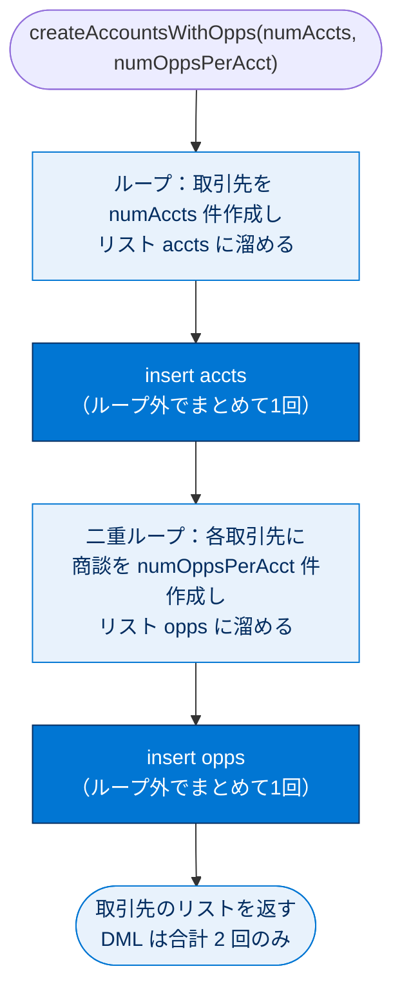
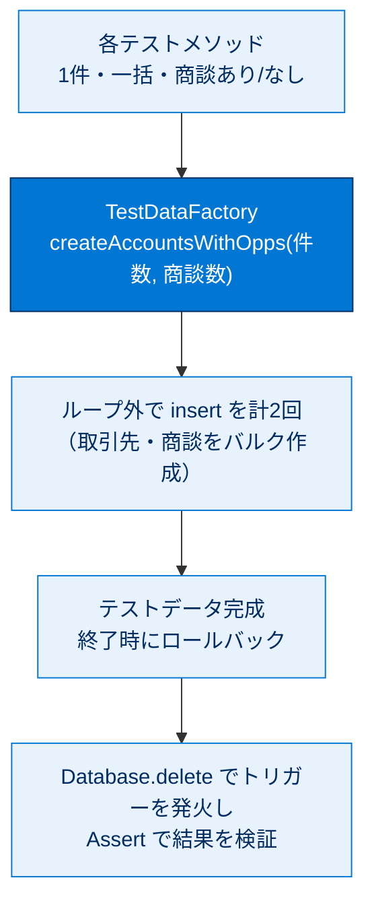

# Apex テストのテストデータを作成する

## 学習の目的

この単元を完了すると、次のことができるようになります。

- テストユーティリティクラスを作成する。
- テストユーティリティメソッドを使用してさまざまなテストケースのテストデータを設定する。
- クラスのすべてのテストメソッドを実行する。

> [!ポイント] この単元のゴール
>
> 「**テストデータの作成を1か所にまとめて使い回す**」のがテーマです。試験では次が問われます。
> - **テストデータファクトリ（TestDataFactory）**の役割と作り方。
> - `@IsTest` を付けた**公開（public）クラス**はテスト中からのみ呼べ、組織のコードサイズ制限から除外される。
> - **バルク化**（ループ外で 1 回だけ DML）された再利用メソッドの書き方。

> [!用語] テストデータファクトリ（Test Data Factory）
>
> テスト用のレコードを「組み立てて返す（factory ＝ 工場）」専用のクラス。各テストが毎回バラバラに作る代わりに、**共通メソッドを1か所に集約**して呼びます。修正が一箇所で済み、保守が楽になります。

---

## 前提条件

前単元「Apex トリガーをテストする」の前提条件を完了します。具体的には `AccountDeletion` トリガーが有効化され、関係のない他のトリガーが無効化されていることを確認してください。

---

## テストユーティリティクラスを追加する

テストデータ作成をユーティリティクラスメソッドへのコールに置き換えて、前のテストメソッドをリファクタリングします。まずテストユーティリティクラスを作成します。

> [!用語] リファクタリング（Refactoring）
>
> **外から見た動作は変えずに、内部の構造を整理・改善**すること。ここでは各テストで重複していたデータ作成コードを共通メソッドにまとめます。

`TestDataFactory` クラスは `@IsTest` を付加した**公開（public）クラス**で、実行中のテストからのみアクセスできます。テストデータ設定などの便利なメソッドを含み、**組織のコードサイズ制限から除外**されます。

> [!ポイント] テストユーティリティクラスの「3つの特徴」
>
> - `@IsTest` を付けた**公開（public）クラス**にする（単体テスト専用クラスは private だが、共有するファクトリは public）。
> - **実行中のテストからのみアクセス可能**（本番ロジックからは呼べない）。
> - 組織の **6 MB コードサイズ制限に含まれない**。

> [!手順] TestDataFactory クラスを追加する
>
> 1. 開発者コンソールで **[File（ファイル）] | [New（新規）] | [Apex Class（Apex クラス）]** をクリックし、クラス名に `TestDataFactory` と入力し **[OK]** をクリックする。
> 2. デフォルトのクラス本文を次のコードで置き換える。

```apex
@IsTest
public with sharing class TestDataFactory {
  public static List<Account> createAccountsWithOpps(Integer numAccts, Integer numOppsPerAcct) {
    List<Account> accts = new List<Account>();
    for(Integer i=0;i<numAccts;i++) {
      Account a = new Account(Name='TestAccount' + i);
      accts.add(a);
    }
    insert as user accts;
    List<Opportunity> opps = new List<Opportunity>();
    for(Integer j=0;j<numAccts;j++) {
      Account acct = accts[j];
      // 挿入したばかりの各取引先について、商談を追加する
      for(Integer k=0;k<numOppsPerAcct;k++) {
        opps.add(new Opportunity(Name=acct.Name + ' Opportunity ' + k,
          StageName='Prospecting',
          CloseDate=System.today().addMonths(1),
          AccountId=acct.Id));
      }
    }
    // すべての取引先のすべての商談を一括で挿入する。
    insert as user opps;
    return accts;
  }
}
```

静的メソッド `createAccountsWithOpps()` は、取引先数（`numAccts`）と取引先ごとの関連商談数（`numOppsPerAcct`）を受け取ります。



> [!手順] メソッドが何をしているか（1ステップずつ）
>
> 1. 最初のループで `numAccts` 件の取引先を作成し `accts` リストに保存する。
> 2. ループの後、`insert` を**1回**コールしてすべての取引先を作成する。
> 3. 外側のループで取引先を反復し、内側のループで現在の取引先の関連商談を作成する。商談は `AccountId` で親取引先にリンクされる。
> 4. 作成される商談の合計数は `numOppsPerAcct` × `numAccts`。
> 5. ループの外で `insert` を**1回**コールしてすべての商談をまとめて作成する。
> 6. 新規取引先のリストを返す。

> [!ポイント] ループの「外」で DML する＝バルク化の手本
>
> 最重要は、`insert` を**ループの中ではなく外で1回だけ**呼ぶ点です。
> - 悪い例：ループ内で1件ずつ `insert`（200件なら 200 回 → ガバナ制限超過の恐れ）。
> - 良い例：リストに溜めて**ループ外でまとめて1回** `insert`。
>
> このメソッドは取引先 `insert` 1回 + 商談 `insert` 1回 = **合計 2 回の DML**で、何件作っても回数は増えません。試験頻出のベストプラクティスです。

> [!用語] DML と SOQL の違い
>
> - **DML**（`insert` / `update` / `delete` 等）… レコードを**書き込む**操作。
> - **SOQL**（`SELECT ... FROM ...`）… レコードを**読み出す**クエリ。
>
> どちらもガバナ制限（DML は 150 回、SOQL は 100 回など）の対象なので、ループ内で呼ばないのが鉄則です。

> [!例] createAccountsWithOpps(2, 3) を呼ぶと
>
> **取引先 2 件・商談 6 件**が作られます。
>
> ```mermaid
> flowchart LR
>     A0["取引先 TestAccount0"] --> O00["商談 Opportunity 0"]
>     A0 --> O01["商談 Opportunity 1"]
>     A0 --> O02["商談 Opportunity 2"]
>     A1["取引先 TestAccount1"] --> O10["商談 Opportunity 0"]
>     A1 --> O11["商談 Opportunity 1"]
>     A1 --> O12["商談 Opportunity 2"]
> ```
> 戻り値は取引先 2 件のリスト（`List<Account>`）です。

> [!注意] 商談は返らない — 必要なら SOQL で取得
>
> このメソッドは関連商談を返しません。取得するには、Account と Opportunity 間のリレーションを利用する SOQL クエリを作成します。

---

## テストデータ作成用のユーティリティメソッドをコールする

このクラスを利用するように `TestAccountDeletion` を変更します。`TestDataFactory.createAccountsWithOpps(1,1)` の戻り配列には Account sObject が 1 つ含まれます。

> [!用語] sObject（エスオブジェクト）
>
> Salesforce のレコードを表す Apex のデータ型。`Account`、`Opportunity`、`Contact` などはすべて sObject の一種。`Account[] accts`（＝`List<Account>`）は取引先 sObject のリストです。

変更されたテストメソッドは次のようになります。

```apex
@IsTest
private with sharing class TestAccountDeletion {
  @IsTest
  static void TestDeleteAccountWithOneOpportunity() {
    // テストデータの設定
    // ユーティリティメソッドを呼び、商談1件付きの取引先を1件作成する
    Account[] accts = TestDataFactory.createAccountsWithOpps(1,1);
    // テストの実行
    Test.startTest();
      Database.DeleteResult result = Database.delete(accts[0], false, AccessLevel.USER_MODE);
    Test.stopTest();
    // 削除はトリガーによって止められているはずなので、エラーが返ったことを検証する。
    Assert.isFalse(result.isSuccess());
    Assert.isTrue(result.getErrors().size() > 0);
    Assert.areEqual('Cannot delete account with related opportunities.',
      result.getErrors()[0].getMessage());
  }
}
```

> [!例] Before / After で見るリファクタリングの効果
>
> | | リファクタリング前（前単元） | リファクタリング後（本単元） |
> | --- | --- | --- |
> | データ作成 | テスト内で `new Account` → `insert`、`new Opportunity` → `insert` を毎回記述 | `TestDataFactory.createAccountsWithOpps(1,1)` の**1行**で完了 |
> | 重複 | テストごとに同じコードをコピー | 共通メソッドを再利用 |
> | 保守 | 仕様変更時に全テストを直す | ファクトリ1か所を直すだけ |

---

## さまざまな条件でテストする

トリガーのすべての入力をテストするには 1 つのメソッドでは不十分です。商談のない取引先の削除など他の条件、また 1 件だけでなく**大量のレコード（一括）**でもテストします。3 つのテストメソッドを追加した更新版を次に示します（保存します）。

> [!ポイント] 4つのテストメソッドがカバーするシナリオ
>
> | テストメソッド | データ | 期待される結果 |
> | --- | --- | --- |
> | `TestDeleteAccountWithOneOpportunity` | 取引先1・商談1 | 削除が**失敗**（トリガーが阻止） |
> | `TestDeleteAccountWithNoOpportunities` | 取引先1・商談0 | 削除が**成功** |
> | `TestDeleteBulkAccountsWithOneOpportunity` | 取引先200・各商談1 | 全件削除が**失敗** |
> | `TestDeleteBulkAccountsWithNoOpportunities` | 取引先200・商談0 | 全件削除が**成功** |
>
> 「**商談あり/なし（分岐の両側）**」×「**1件/一括200件**」で網羅しているのがポイントです。

```apex
@IsTest
private with sharing class TestAccountDeletion {
  @IsTest
  static void TestDeleteAccountWithOneOpportunity() {
    // テストデータの設定
    // ユーティリティメソッドを呼び、商談1件付きの取引先を1件作成する
    Account[] accts = TestDataFactory.createAccountsWithOpps(1,1);
    // テストの実行
    Test.startTest();
      Database.DeleteResult result = Database.delete(accts[0], false, AccessLevel.USER_MODE);
    Test.stopTest();
    // 削除はトリガーによって止められているはずなので、エラーが返ったことを検証する。
    Assert.isFalse(result.isSuccess());
    Assert.isTrue(result.getErrors().size() > 0);
    Assert.areEqual('Cannot delete account with related opportunities.',
      result.getErrors()[0].getMessage());
  }
  @IsTest
  static void TestDeleteAccountWithNoOpportunities() {
    // テストデータの設定
    // ユーティリティメソッドを呼び、商談なしの取引先を1件作成する
    Account[] accts = TestDataFactory.createAccountsWithOpps(1,0);
    // テストの実行
    Test.startTest();
      Database.DeleteResult result = Database.delete(accts[0], false, AccessLevel.USER_MODE);
    Test.stopTest();
    // 削除が成功したことを検証する
    Assert.isTrue(result.isSuccess());
  }
  @IsTest
  static void TestDeleteBulkAccountsWithOneOpportunity() {
    // テストデータの設定
    // ユーティリティメソッドを呼び、各取引先に商談1件ずつ付けて作成する
    Account[] accts = TestDataFactory.createAccountsWithOpps(200,1);
    // テストの実行
    Test.startTest();
      Database.DeleteResult[] results = Database.delete(accts, false, AccessLevel.USER_MODE);
    Test.stopTest();
    // レコードごとに検証する。削除はトリガーによって止められているはずなので、
    // エラーが返ってきたことを確認する。
    for(Database.DeleteResult dr : results) {
      Assert.isFalse(dr.isSuccess());
      Assert.isTrue(dr.getErrors().size() > 0);
      Assert.areEqual('Cannot delete account with related opportunities.',
        dr.getErrors()[0].getMessage());
    }
  }
  @IsTest
  static void TestDeleteBulkAccountsWithNoOpportunities() {
    // テストデータの設定
    // ユーティリティメソッドを呼び、商談なしの取引先を作成する
    Account[] accts = TestDataFactory.createAccountsWithOpps(200,0);
    // テストの実行
    Test.startTest();
      Database.DeleteResult[] results = Database.delete(accts, false, AccessLevel.USER_MODE);
    Test.stopTest();
    // レコードごとに、削除が成功したことを検証する
    for(Database.DeleteResult dr : results) {
      Assert.isTrue(dr.isSuccess());
    }
  }
}
```

> [!注意] 一括テストは「単数」ではなく「複数（配列）」の結果を扱う
>
> 1 件削除では `Database.DeleteResult result`（単数）でしたが、一括削除では `Database.DeleteResult[] results`（配列）を受け取り、`for` ループで**各レコードの結果を1件ずつ検証**します。一括テストはこの形が基本です。

> [!ポイント] なぜ 200 件でテストするのか
>
> Salesforce のトリガーは、データローダや一括 API で **1 回あたり最大 200 件**ずつ処理されます。そのため一括テストは慣習的に 200 件で行い、「ループ内 SOQL/DML」などのバルク化されていないバグや**ガバナ制限超過**を早期に発見します。

---

## すべてのテストメソッドを実行する

`TestAccountDeletion` はテストデータファクトリを使うようリファクタリングされ、より包括的になりました。再実行してすべてのテストメソッドを実行します。

> [!手順] テストを再実行して結果を確認する
>
> 1. **[Tests（テスト）]** タブでテスト実行を選択し、**[Test（テスト）] | [Rerun（再実行）]** をクリックする。
> 2. 最新のテスト実行を展開し、4 つのテストがすべて合格したことを確認する。

---

## 試験対策：押さえておきたい追加ポイント

> [!ポイント] テストデータ作成のベストプラクティス
>
> - データ作成は**テストデータファクトリに集約**して再利用する（DRY：同じことを繰り返さない）。
> - ファクトリのメソッドは**バルク化**し、`insert` はループ外で 1 回だけ。
> - テストは**正常系・異常系・1件・一括**を網羅する。
> - 必須項目（例：Opportunity の `StageName`・`CloseDate`）は**漏れなく設定**する（漏れると DML が失敗）。
> - 原則として `SeeAllData=true` は使わず、**テスト内で必要なデータを自前で作る**。

> [!用語] @IsTest(SeeAllData=true)
>
> 通常テストは組織の既存データを見られませんが、このアノテーションを付けると見えるようになります。**組織データの変化でテストが壊れやすく**なるため、原則は使わずテスト内でデータを作るのが推奨です。

> [!ポイント] テストメソッドからの呼び出し関係（全体像）
>
> ```mermaid
> flowchart TD
>     T["TestAccountDeletion<br/>（@IsTest, private）"] -->|"各テストメソッドが共通で呼ぶ"| F["TestDataFactory.createAccountsWithOpps(件数, 商談数)"]
>     F -->|"取引先＋商談をまとめて insert"| R["Account / Opportunity レコード<br/>（テスト終了でロールバック）"]
>     R -->|"Database.delete を実行"| TR["AccountDeletion トリガーが発火"]
>     TR --> A["結果を Assert で検証"]
> ```

---

## リソース

- Apex 開発者ガイド: テストデータ作成用の共通テストユーティリティクラス

---

## ハンズオン Challenge の準備をする

> [!注意] このChallengeでは @isTest を付けない
>
> このハンズオン Challenge では、**クラスとメソッドのどちらにも `@isTest` アノテーションを指定しないでください**（通常は必須の場合も同じ）。Challenge 評価の都合による特例です（実務ではテストデータファクトリに `@IsTest` を付けます）。

---

## ハンズオン Challenge（+500 ポイント）

> [!まとめ] あなたの Challenge：取引先責任者テストファクトリーを作成する
>
> 2 つの入力パラメーター（生成する取引先責任者の数と共通の姓）に基づいて取引先責任者のリストを返す Apex クラスを作成します。生成したレコードは**データベースに挿入しないでください**。
>
> **`public` スコープに Apex クラスを作成する**
> - 名前：`RandomContactFactory`（`@isTest` アノテーションなし）
> - `Test 0`、`Test 1` のような連番に基づき、**Public Static メソッド**で常に一意の名を持つ取引先責任者を生成する。
>
> **メソッド**
> - メソッド名（Method Name）：`generateRandomContacts`（`@isTest` アノテーションなし）
> - パラメーター 1：一意な名前で生成される取引先責任者の数を制御する**整数**（`Test 0` や `Test 1` など）
> - パラメーター 2：取引先責任者の共通の姓を含む**文字列**
> - 戻り値のデータ型（Return Type）：`List<Contact>`

> [!ポイント] Challenge 攻略のヒント
>
> - 戻すのは `List<Contact>`。**insert はしない**（リストを作って返すだけ）。
> - `FirstName` は `'Test ' + i` のように連番で一意にし、`LastName` は引数の共通姓を使う。
> - クラスもメソッドも `static`・`public` で、**`@isTest` は付けない**（この Challenge 特有の指示）。
> - 例：`for(Integer i=0; i<numContacts; i++) { ... new Contact(FirstName='Test '+i, LastName=lastName) ... }`

> [!注意] 日本語環境で受講する場合
>
> Challenge は日本語 Trailhead Playground で開始し、かっこ内の翻訳を参照しながら進めます。評価は英語データに対して行われるため、**英語の値のみ**をコピー&ペーストします。日本語組織で不合格の場合は、(1) [地域（Locale）] を [米国（United States）]、(2) [言語（Language）] を [英語（English）] に切り替えてから (3) [Check Challenge] をクリックすると通ることがあります。

---

## 🎓 この単元のまとめ

この単元では、各テストで重複していたデータ作成コードを「テストデータファクトリ」に集約して再利用する方法と、ループ外で1回だけ DML を行うバルク化された書き方を学びました。

次の図は、複数のテストメソッドが共通のファクトリを呼び、まとめて作ったデータでトリガーを検証する全体像です。



> [!まとめ] この単元の要点
>
> - テストデータ作成は**テストデータファクトリに集約**して再利用し、保守を1か所で済ませる（DRY）。
> - 共有するファクトリは `@IsTest` を付けた**公開（public）クラス**にする（単体テスト専用クラスは private）。テストからのみ呼べ、**6 MB コードサイズ制限から除外**される。
> - ファクトリのメソッドは**バルク化**し、`insert` は**ループの外でまとめて1回**だけ呼ぶ（件数が増えても DML 回数は一定）。
> - テストは**正常系・異常系・1件・一括（200件）**を網羅し、必須項目（`StageName`・`CloseDate` など）を漏れなく設定する。
> - 一括テストでは結果を**配列（`DeleteResult[]`）**で受け取り、`for` ループで1件ずつ検証する。

> [!豆知識] 200 件はなぜ「キリのいい区切り」なのか
>
> Salesforce のトリガーが1回あたり最大 200 件で処理されるのは、データローダや Bulk API がレコードを 200 件ずつの「バッチ」に分割して送るためです。この 200 という数字はトリガー処理の基本単位として有名で、テストも慣習的に 200 件で行います。なお Apex の `List` には1コレクションあたり最大要素数といった上限もあり、大量データを扱うときは Batch Apex で 200 件ずつ自動分割する設計が定石になっています。
