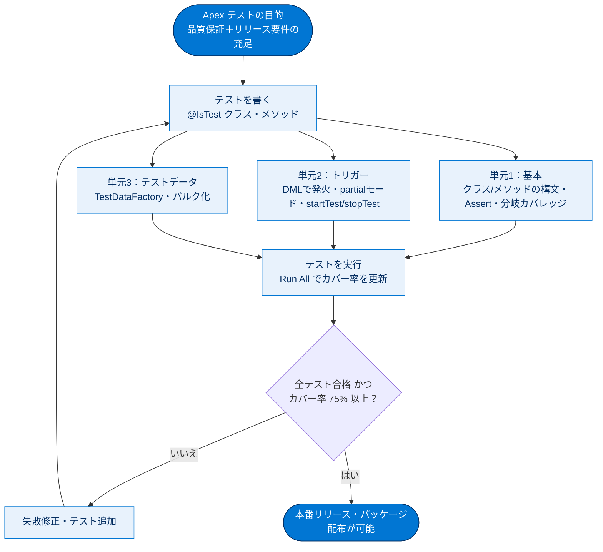

# Apex テスト 総まとめ

このトピックでは、Apex コードが正しく動くことを別のコード（テスト）で自動検証する「Apex 単体テスト」を学びました。クラスとトリガーのテストの書き方、リリースに必須となる 75% コードカバー率、`Assert` クラスによる検証、`Test.startTest()`／`Test.stopTest()` でのガバナ制限の区切り、そしてテストデータを1か所に集約する「テストデータファクトリ」とバルク化までを通して理解します。テストは品質保証であると同時に、Apex を本番にリリース・配布するための必須要件である点が最大のポイントです。

## 全体像

## ユニット横断 早見表

| ユニット | 学んだこと | キーワード | 一言要点 |
| --- | --- | --- | --- |
| 01 Apex 単体テストを始める | テストクラス／メソッドの構文、カバー率要件、Assert、分岐カバレッジ、テストスイート | `@IsTest`・75%・`Assert.areEqual`・分岐・ロールバック | テストの基本作法と「75% 以上＋全合格」のリリース要件を押さえる |
| 02 Apex トリガーをテストする | DML でトリガーを発火、partial モードでエラー検証、startTest/stopTest、バルクテスト | `before delete`・`addError`・`Database.delete(...,false,...)`・`DeleteResult` | トリガーは DML で発火させ、結果オブジェクトでエラーを検証する |
| 03 Apex テストのテストデータを作成する | テストデータファクトリ、バルク化、正常/異常・1件/一括の網羅、配列での結果検証 | `TestDataFactory`・`@IsTest` public・ループ外 DML・200件 | データ作成を1か所に集約し、ループ外で1回だけ DML する |

## 🎯 試験頻出ポイント

> [!ポイント] このトピックで狙われやすい論点・暗記値
>
> - **コードカバー率 75% 以上**が本番リリース・パッケージ化の必須条件。さらに**全テスト合格**と**各トリガー1件以上のカバー**（0% トリガー不可）も必須。
> - テストクラス・テストメソッドは**両方に `@IsTest`**。メソッドは **static**。単体テスト専用クラスは **private**、共有するテストデータファクトリは **public**。
> - `Assert.areEqual(期待値, 実際の値)` の**引数の順番**（期待値が先）。`areNotEqual`／`isTrue`／`isFalse`／`isNull`／`isNotNull`／`fail` も覚える。
> - `Test.startTest()`／`Test.stopTest()` は **①ガバナ制限のリセット ②非同期処理の同期完了 ③1テスト1回まで** の3点。
> - トリガーのテストは**DML で発火**させ、`Database.xxx(..., false, ...)` の **partial モード**で結果オブジェクト（`isSuccess()`・`getErrors()`）を検証する。
> - テスト実行環境の特徴：作成レコードは**ロールバック**、**メール送信されない**、**コールアウト不可**（`Test.setMock()`）、**SOSL は空**（`Test.setFixedSearchResults()`）、組織既存データは**原則アクセス不可**（`SeeAllData=true` は非推奨）、`@IsTest` コードは **6 MB 制限に含まれない**。
> - **バルク化**：`insert`／`update`／`delete` は**ループの外で1回**。トリガーは最大 **200 件**単位で動くため一括テストは 200 件が定番。
> - 100% を目指すには `if` 分岐の**両側の経路**をそれぞれ通す（分岐カバレッジ）。

## 📖 用語早見表

| 用語 | ひとことの意味 |
| --- | --- |
| 単体テスト（Unit Test） | メソッド/クラスが期待どおりの結果を返すかをコードで自動検証する小さなテスト |
| `@IsTest` | クラス・メソッドを「テスト用」と認識させるアノテーション。コードサイズ制限から除外 |
| コードカバー率 | テストで実際に実行された行の割合。本番リリースには 75% 以上が必須 |
| Assert クラス | 期待値と実際の値を比較して検証する仕組み（`Assert.areEqual` など） |
| 分岐カバレッジ | `if`〜`else` の true 側・false 側の両経路がテストで通っているかの観点 |
| 回帰テスト | 変更で既存機能が壊れていないか（後戻りしていないか）を確認するテスト |
| ロールバック | テストで作ったレコードを終了時に自動で元に戻す挙動。DB を汚さない |
| ガバナ制限 | マルチテナント環境で資源独占を防ぐ上限（SOQL 100回・DML 150回 など） |
| `Test.startTest()`／`stopTest()` | ガバナ制限を区切り、非同期処理を同期完了させるペア |
| Apex トリガー | レコード保存の前後（insert/update/delete）に自動実行される Apex コード |
| `addError()` | レコードにエラーを付け、DML 操作を失敗させるメソッド |
| partial（部分許可）モード | `Database.xxx(rec, false, ...)`。失敗しても例外を投げず結果オブジェクトを返す |
| `DeleteResult`／`SaveResult` | DML 結果を表すオブジェクト。`isSuccess()`・`getErrors()` で検証 |
| テストデータファクトリ | テストレコードを組み立てて返す共通クラス（@IsTest public） |
| バルク化（Bulkification） | 複数レコードをまとめて処理し、DML/SOQL をループ外で1回にする書き方 |
| テストスイート | まとめて実行する複数テストクラスのコレクション |
| `SeeAllData=true` | 組織既存データへのアクセスを許可するが、テストが壊れやすく原則非推奨 |

> [!豆知識] 「テストを書かないとリリースできない」のは Salesforce の珍しい文化
>
> 多くの開発環境ではテストは「推奨」止まりですが、Salesforce はプラットフォーム側がカバー率 75% を強制します。これはマルチテナント（多数の顧客が同じインフラを共有）という特性上、誰か1人の低品質なコードが全体の安定性を脅かさないようにするための仕組みです。テストが文化ではなく「規約」として組み込まれている点が Salesforce 開発の大きな特徴です。

> [!豆知識] `System.assertEquals` から `Assert` クラスへ
>
> 昔の Apex では `System.assertEquals(期待値, 実際の値)` を使っていましたが、API バージョン 53.0（Winter '22）で `Assert` クラスが導入され、`Assert.areEqual()` のように読みやすく整理されました。試験や既存コードでは両方が登場し得るので、対応関係（`assertEquals`→`areEqual`、`assert`→`isTrue` など）を知っておくと混乱しません。

> [!豆知識] `as user` と `AccessLevel.USER_MODE` の登場
>
> 教材のコード例にある `insert as user accts;` や `Database.delete(acct, false, AccessLevel.USER_MODE)` は、比較的新しい「ユーザーモード DML」の構文です。従来は `WITH USER_MODE`（SOQL）しかありませんでしたが、DML でも実行ユーザーの権限・項目レベルセキュリティ（FLS）に従って操作できるようになり、より安全なコードを書きやすくなりました。

## ✅ 理解度セルフチェック

> [!まとめ] 理解度を確認しよう（答えは各項目の末尾）
>
> 1. 本番リリースに必要な最低コードカバー率は何 % か？ → **75%**（さらに全テスト合格・各トリガー1件以上のカバーも必須）
> 2. `Assert.areEqual()` の第1引数と第2引数は、それぞれ「期待値」と「実際の値」のどちらか？ → **第1引数＝期待値、第2引数＝実際の値**
> 3. テストメソッド内で `insert` したレコードはテスト終了後にどうなる？ → **ロールバックされる（DB に残らない）**
> 4. `before delete` トリガーが削除を阻止する「失敗ケース」を検証するために `Database.delete()` の第2引数に渡す値は？ → **`false`（partial／部分許可モード）**
> 5. `Test.stopTest()` が持つ、ガバナ制限のリセット以外の重要な役割は？ → **キューに入った非同期処理（@future・Queueable・Batch）を同期的に完了させる**
> 6. テストデータファクトリで `insert` をループの外で1回だけ呼ぶのはなぜか？ → **バルク化のため。ループ内で呼ぶとガバナ制限（DML 回数）を超過する恐れがある**
