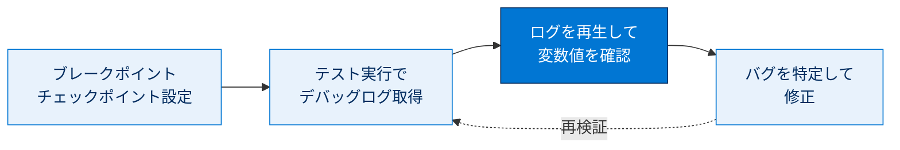
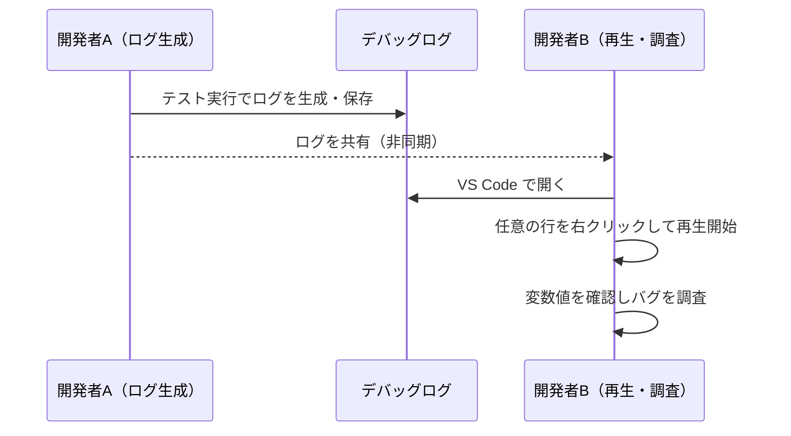
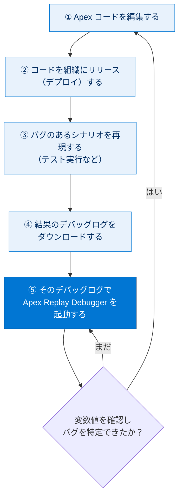

# Trailhead Playground の起動

## 学習の目的

このプロジェクトでは、次のことを行います。

- デバッグセッションでブレークポイントとチェックポイントを設定し、コードをステップ実行して特定行の変数値を調べる。
- Visual Studio Code から Apex テストを呼び出し、デバッグログをダウンロードする。
- Apex Replay Debugger でバグを見つけて修正する。

> [!ポイント] このプロジェクトのゴール
>
> 「デバッグログを使って Apex コードを"巻き戻し再生"し、バグの原因を突き止めて直す」流れを体験します。Apex Replay Debugger（無料）で、(1) ブレークポイント／チェックポイント設定 → (2) テスト実行でログ取得 → (3) ログを再生して変数値確認 → (4) バグ修正、というサイクルを身につけます。

---

## はじめに

> 「設計フェーズで検出されなかったバグをコーディングフェーズで検出するにはコストが 10 倍かかり、デバッグフェーズで検出するコストはさらに 10 倍になる。」 ― Nikolai Bezroukov 博士、『The Art of Debugging』

デバッグとテストは関連しますが、**異なるプロセス**です。バグは早く見つけるほど修正コストが小さく済みます。

| プロセス | 目的 | 何をするか |
| --- | --- | --- |
| **テスト** | エラーを**見つけて報告する** | 期待値と実際の値を比較し、ズレを検出する |
| **デバッグ** | エラーの**原因を突き止めて修正する** | 変数値や実行経路を調べ、バグの場所を特定する |

> [!用語] デバッグ（Debugging）
>
> プログラムの不具合（バグ）の**原因を特定して取り除く**作業。テストが「異常があると知らせる」のに対し、デバッグは「なぜ異常が起きたか」を追います。

Apex のデバッグは `System.debug` ステートメント、デバッグログ、デバッガーで支援されます。追跡フラグが有効だと、トランザクションの全操作を記録したデバッグログが生成され、Apex Replay Debugger はこのログでライブデバッグをシミュレーションします。

> [!用語] Apex（エイペックス）
>
> Salesforce プラットフォーム上で動く Java に似た言語。データベース操作やビジネスロジックをサーバー側で実行します。認定 Platform デベロッパー試験の中心テーマです。

> [!用語] `System.debug`
>
> Apex で**変数値やメッセージをデバッグログに出力する**メソッド。`System.debug('値は ' + x);` のように書きます。Replay Debugger を使えば、これを大量に埋め込まなくても変数値を確認できます。

> [!用語] デバッグログ（Debug Log）
>
> 実行されたトランザクションの**詳細な記録**。呼ばれたメソッド、SOQL 発行回数、変数の変化などが時系列で残ります。Replay Debugger はこれを"録画テープ"のように再生します。

> [!用語] 追跡フラグ（Trace Flag）
>
> 「いつ・誰の・どのカテゴリを・どの詳細レベルで」ログに残すかを指定する設定。これが有効でないとデバッグログは生成されません。VS Code のコマンドから簡単に有効化できます。

---

## Apex Replay Debugger とは?

**Apex Replay Debugger** はデバッグログを調査して Apex コードをデバッグできる**無料のツール**で、Visual Studio Code をクライアントとして使います。他のデバッガー同様の機能を使えます。

- 変数を参照する
- ブレークポイントを設定する
- 変数にマウスを置いて現在の値を確認する

何千行ものログを手動で解析したり、`System.debug` をあちこちに入れて変数値を追ったりする必要はなくなります。

> [!例] 「録画した処理を巻き戻して再生する」イメージ
>
> Apex はサーバー側で一瞬で実行されるため、実行中に変数をのぞき込むのが難しい言語です。Replay Debugger は処理を**録画（デバッグログとして保存）**し、後からそのログを**巻き戻して一行ずつ再生**します。スポーツの試合をビデオで見返し、好きな場面で一時停止するのと同じ感覚です。

再生デバッガーセッションは任意の再生対応デバッグログから起動できるため、クライアントや同僚とログを共有して**非同期にコラボレーション**できます。セッションは、VS Code でデバッグログを開き、任意の行を右クリックして起動します。

---

## デバッグプロセスの全体像

デバッグは**いくつかのステップの反復**です。次の流れを繰り返してバグを追い詰めます。

> [!ポイント] 再生対応デバッグログの条件
>
> Apex Replay Debugger で再生できるログにはログレベルの条件があり、試験でも問われます。
>
> - ログカテゴリが **Visualforce** → ログレベルは **FINER** または **FINEST**
> - ログカテゴリが **Apex コード** → ログレベルは **FINEST**

---

## Apex Interactive Debugger とは?

**Apex Interactive Debugger** も Salesforce Extension Pack に含まれ、VS Code をクライアントに Apex コードを Sandbox やスクラッチ組織で**リアルタイムにデバッグ**できます。管理パッケージを扱う**独立系ソフトウェアベンダー（ISV）パートナー**向け機能（ISV カスタマーデバッガー）もあります。価格は Salesforce のアカウントエグゼクティブに問い合わせます。

> [!ポイント] Replay と Interactive の違い
>
> 試験では「無料／リアルタイムか録画か」の対比が狙われます。
>
> | 項目 | Apex Replay Debugger | Apex Interactive Debugger |
> | --- | --- | --- |
> | 料金 | **無料** | 有料（要問い合わせ） |
> | 方式 | デバッグログを**後から再生** | 実行を**リアルタイム**に停止 |
> | 必要なもの | 再生対応デバッグログ | ライブ接続したコード実行 |
> | 共有・非同期 | ログ共有で可能 | リアルタイム接続が前提 |

このプロジェクトでは**無料の Apex Replay Debugger** に焦点を絞ります。

---

## Trailhead Playground を作成する

このプロジェクト用に新しい Trailhead Playground を作成します。

> [!用語] Trailhead Playground
>
> Trailhead 学習者向けに無料で用意される**練習用の Salesforce 組織**。本番に影響を与えず設定変更やコード作成を試せます。Challenge の採点もこの組織に対して行われます。

> [!手順] 新しい Trailhead Playground を作成する
>
> 1. このページ最下部までスクロールする。
> 2. **[Launch（起動）]** の横の**下矢印**をクリックする。
> 3. **[Create a Trailhead Playground]** を選択する。

---

## リソース

- 外部サイト: Apex Replay Debugger for Visual Studio Code
- 外部サイト: Apex Interactive Debugger for Visual Studio Code
- 動画: YouTube: Banish the Bugs with the Apex Replay Debugger
- Salesforce 開発者ブログ: Salesforce for VS Code: Apex Replay Debugger and More
- ヘルプ: デバッグログレベル
- 外部サイト: The Art of Debugging
- Trailhead: Lightning プラットフォームの単体テスト

---

> [!まとめ] このステップの要点
>
> - **デバッグ**はエラーの原因を突き止めて修正する作業（テストは見つけて報告する作業）。
> - **Apex Replay Debugger** は無料で、デバッグログを後から「再生」して変数値やコールスタックを確認できる。
> - デバッグは「編集 → リリース → 再現 → ログ取得 → 再生」の反復プロセス。
> - 再生対応ログは Apex コードなら**ログレベル FINEST** が必要。
> - まず練習用の **Trailhead Playground** を新規作成しておく。
