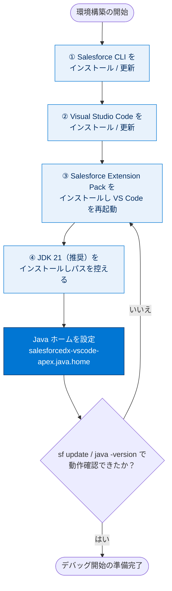

# Visual Studio Code の設定

Apex Replay Debugger は VS Code 向けの **Salesforce Extension Pack** に含まれます。この拡張機能には VS Code、Salesforce CLI、JDK 21（推奨。17 または 11 も可）が必要です。このステップでは必要なツールをインストールして設定します。

VS Code が初めての場合は、先に「クイックスタート: Salesforce 開発のための Visual Studio Code」を修了するのがおすすめです。

> [!ポイント] 用意する 4 つの道具
>
> 1 つでも欠けるとデバッグを始められません。
>
> | 道具 | 役割 |
> | --- | --- |
> | **Salesforce CLI** | コマンドラインから組織を操作・デプロイ・テスト実行する |
> | **Visual Studio Code** | コードを書き、デバッガーを動かすエディター |
> | **Salesforce Extension Pack** | VS Code に Apex 開発・デバッグ機能を追加する拡張機能群 |
> | **JDK（Java）** | Apex 言語サポートが内部で利用する実行基盤 |



> [!用語] Salesforce CLI
>
> ターミナルから Salesforce 組織を操作するツール。`sf` で始まるコマンドで、プロジェクト作成・組織接続・デプロイ・テスト実行などができます。GUI なしで自動化しやすいのが利点です。

> [!用語] JDK（Java Development Kit）
>
> Java を開発・実行するためのキット。Salesforce 拡張機能の Apex サポート（補完や構文チェック）は内部で Java を使うため、Apex を書くだけでも JDK が必要です。

---

## Salesforce CLI をインストールまたは更新する

Salesforce CLI でアプリケーションのライフサイクル全体を管理します。開発・テスト環境の作成、組織とソース制御間の同期、テスト実行ができます。

> [!手順] Salesforce CLI のインストールと確認
>
> 1. 「Salesforce CLI」のダウンロードページからインストールする。
> 2. Windows の**コマンドプロンプト**または macOS の**ターミナル**を開く。
> 3. 次のコマンドを実行する。

```bash
sf update
```

`Updating CLI...` のように出力されれば、CLI は正しく動作しています。

> [!注意] `sf` コマンドが見つからないとき
>
> `sf` が認識されない場合は、ターミナルを**いったん閉じて開き直す**と PATH が反映されて実行できることが多いです。

---

## Visual Studio Code をインストールまたは更新する

VS Code は強力なクロスプラットフォームのエディターです。Salesforce 拡張機能は Eclipse 用 Force.com IDE プラグインの後継です。

> [!手順] Visual Studio Code のインストール
>
> 1. `https://code.visualstudio.com/Download` からインストールする。
> 2. VS Code を起動する。

---

## Salesforce 拡張機能をインストールまたは更新する

この拡張機能は、コード補完、構文の強調表示、Apex のデバッグなどの機能を提供します。

> [!用語] Salesforce Extension Pack
>
> VS Code に Salesforce 開発機能をまとめて追加する拡張機能の詰め合わせ。Apex の補完・構文ハイライト・テスト実行・Apex Replay Debugger などが一括で入ります。

> [!手順] Salesforce Extension Pack をインストールする
>
> 1. VS Code で **[View（表示）]** → **[Extensions（拡張機能）]** を選択する。
> 2. 検索ボックスに `salesforce extension pack` と入力する。
> 3. 「Salesforce Extension Pack」の **[Install]**／**[Update]**／**[Restart]** をクリックする。
> 4. インストール後、VS Code を**再起動**して変更を有効にする。

---

## JDK をインストールする

Salesforce 拡張機能の一部機能、特に Apex サポートは JDK に依存します。JDK 21（推奨）または 11 以上が必要です。別の Java が入っていても、**推奨バージョンのいずれかをインストール**します。

> [!手順] JDK のインストールとディレクトリの確認
>
> 1. Salesforce 拡張機能のドキュメントに従って Java をインストールする。
> 2. **Java のインストールディレクトリ**を見つける（次のステップで必要）。

例: JDK21 のデフォルトインストールディレクトリ。

```text
Windows: C:\Program Files\Java\jdk-21
MacOS:   /Library/Java/JavaVirtualMachines/jdk-21.0.1.jdk/Contents/Home
```

> [!注意] インストールディレクトリのパスをメモする
>
> このパスは次の「Java ホーム設定」で入力するため正確に控えます。バージョン番号やフォルダー名は環境で異なる（例: `jdk-21.0.1`）ので、実際に存在を確認したパスを使います。

---

## Apex サポートのために Java ホームを設定する

既定では、Salesforce 拡張機能は `JAVA_HOME` または `JDK_HOME` 環境変数で Java の場所を探します。`salesforcedx-vscode-apex.java.home` 設定でも指定でき、複数バージョンがある場合に役立ちます。このプロジェクトではこの設定で JDK ディレクトリを指定します。

> [!用語] 環境変数 `JAVA_HOME` / `JDK_HOME`
>
> OS 全体で「Java（JDK）の場所はここ」を示す設定値。多くのツールがこれを頼りに Java を探します。`salesforcedx-vscode-apex.java.home` は「Salesforce 拡張機能だけが使う Java の場所」を個別指定でき、複数バージョンが混在しても目的のバージョンを確実に使わせられます。

> [!手順] VS Code に Java ホームを設定する
>
> 1. **[File] > [Preferences] > [Settings]**（Windows / Linux）、または **[Code] > [Settings] > [Settings]**（macOS）を開く。
> 2. 検索ボックスに `apex java` と入力する。
> 3. `salesforcedx-vscode-apex.java.home` に使用する Java ディレクトリを入力する。
> 4. VS Code を**再起動**し、新しいターミナルで次のコマンドを実行して確認する。

```bash
java -version
```

`openjdk version "21..."` のように JDK バージョンが表示されれば、Java の設定は完了です。

> [!注意] このステップでは [Verify Step] は不要
>
> Trailhead 側の確認は行いません。**[Verify Step]** をクリックして次のステップへ進み、Apex Replay Debugger を設定しましょう。

---

## リソース

- Trailhead: クイックスタート: Salesforce 開発のための Visual Studio Code
- 動画: YouTube: Salesforce Development with Visual Studio Code
- 動画: YouTube: Be An Efficient Salesforce Developer with VS Code
- Salesforce 開発者ブログ: All About Salesforce Extensions for VS Code
- Salesforce 開発者ブログ: The Future of Salesforce IDEs
- Salesforce Developers: Apex Replay Debugger
- 外部サイト: Java Standard Edition Development Kit 8 のダウンロード
- Salesforce Developers: Salesforce CLI
- 外部サイト: Visual Studio Code
- 外部サイト: Salesforce Extension Pack

---

> [!まとめ] このステップの要点
>
> - Apex Replay Debugger には **Salesforce CLI / VS Code / Salesforce Extension Pack / JDK** の 4 点が必要。
> - JDK は**バージョン 21 推奨**（17・11 も可）。インストール後はパスを控える。
> - VS Code の `salesforcedx-vscode-apex.java.home` 設定で、拡張機能が使う Java の場所を明示できる。
> - 各インストール後は VS Code を**再起動**し、`sf update` / `java -version` で動作確認する。
