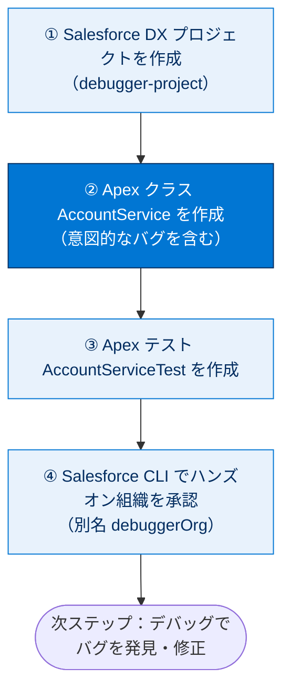
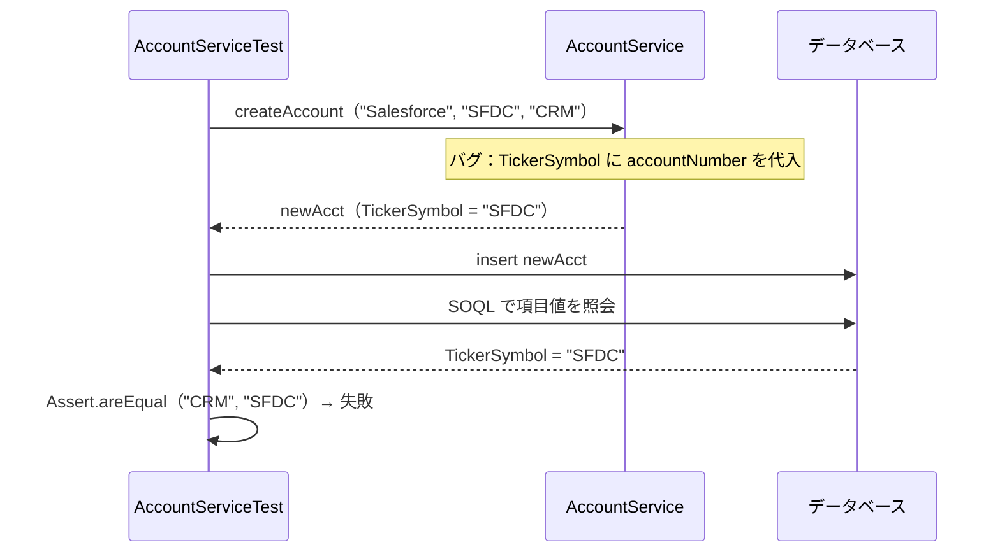
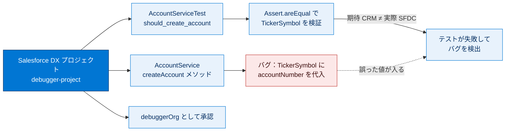

# Apex Replay Debugger を設定する

このステップでは、テストとデバッグを行うために Apex コードを含む **Salesforce DX プロジェクト**を作成します。

> [!ポイント] このステップでやること
>
> 1. ローカルに **Salesforce DX プロジェクト**を作る
> 2. わざとバグを仕込んだ **Apex クラス**（`AccountService`）を作る
> 3. 動作を検証する **Apex テストクラス**（`AccountServiceTest`）を作る
> 4. Salesforce CLI でハンズオン組織を**承認（接続）**する
>
> 次のステップで、このバグをデバッガーで見つけて修正します。



> [!用語] Salesforce DX プロジェクト
>
> Salesforce のソースやメタデータを**ローカルのフォルダー構造**として管理する形式。`force-app/main/default/` 以下に Apex クラスや項目定義が整理され、CLI や Git でバージョン管理しやすくなります。

---

## Salesforce DX プロジェクトを作成する

> [!手順] Salesforce DX プロジェクトを作成する
>
> 1. **[View（表示）]** → **[Command Palette...]** を選択する（または `Ctrl + Shift + P` / `Cmd + Shift + P`）。
> 2. `sfdx create project` と入力し、**[SFDX: Create Project]** を選択する。
> 3. **[Standard project template (default)]** を選択する。
> 4. プロジェクト名として `debugger-project` と入力する。
> 5. プロジェクトを作成するフォルダーを選択し、**[Create Project]** をクリックする。
> 6. 数秒後 VS Code が再読み込みされる。**[Yes, I trust the authors]** をクリックして新しいフォルダーを開く。

> [!用語] コマンドパレット（Command Palette）
>
> VS Code のあらゆるコマンドを検索・実行できる入力欄。`Ctrl + Shift + P` で開きます。Salesforce 拡張機能のコマンドは `SFDX:` で始まるので、`sfdx` で絞り込めます。

[Explorer] サイドバーで `force-app/main/default/classes` フォルダーを展開します。フォルダーは空です。次のセクションでこれを変更します。

---

## Apex クラスを作成する

> [!用語] Apex クラス（Apex Class）
>
> Apex コードをまとめる入れ物。メソッドや変数を持ちます。1 つの `.cls` が 1 クラスに対応し、それぞれに `.cls-meta.xml`（メタデータファイル）が付随します。

> [!注意] 必ず [SFDX: Create Apex Class] で作成する
>
> Apex クラスは必ず **[SFDX: Create Apex Class]** で作成します。**[New File]** で作ると `.cls-meta.xml` が作られず、組織にデプロイできません。ファイルが 4 つ（2 クラス + 各メタデータ）そろわないときも、このコマンドで作成したか確認します。

> [!手順] `AccountService` クラスを作成する
>
> 1. [Explorer] で `classes` フォルダーを右クリックし、**[SFDX: Create Apex Class]** を選択する。
> 2. 名前に `AccountService` と入力し、デフォルトディレクトリを受け入れる。
> 3. `AccountService.cls` の内容を次のコードに置き換える。

このファイル内のバグ 🐞 は**意図的なもの**ですので、まだ修正しないでください。😉

```apex
public with sharing class AccountService {
  public Account createAccount( String accountName, String accountNumber, String tickerSymbol ) {
    Account newAcct = new Account(
      Name = accountName,
      AccountNumber = accountNumber,
      TickerSymbol = accountNumber   // ← バグ: tickerSymbol を渡すべきところで accountNumber を渡している
    );
    return newAcct;
  }
}
```

ファイルを保存します。

> [!ポイント] コードのポイント
>
> `AccountService` の唯一のメソッド `createAccount` は、パラメーターの**取引先名・取引先番号・株式コード**を使って取引先 sObject を作成し、返します。

> [!用語] sObject（エスオブジェクト）
>
> Salesforce のレコードを Apex 上で表すオブジェクト型。`Account`（取引先）や `Contact`（取引先責任者）などに対応します。`new Account( Name = ... )` のように項目名を指定してレコードを生成できます。

> [!注意] 仕込まれたバグの正体
>
> `TickerSymbol`（株式コード）に、本来の `tickerSymbol` 引数ではなく `accountNumber`（取引先番号）が割り当てられています。コンパイルは通りエラーにもなりませんが、**間違った値が入る**典型的な「ロジックのバグ」です。次のステップでテストがこれを検出します。

---

## Apex テストを作成する

> [!用語] Apex テスト（Apex Test）
>
> Apex コードが期待通り動くかを自動検証するコード。`@IsTest` を付けたクラス／メソッドとして書き、`Assert` で「期待値」と「実際の値」を突き合わせます。本番デプロイ前に一定のテストカバー率が求められます。

> [!手順] `AccountServiceTest` クラスを作成する
>
> 1. [Explorer] で `classes` フォルダーを右クリックし、**[SFDX: Create Apex Class]** を選択する。
> 2. 名前として `AccountServiceTest` と入力する。
> 3. `AccountServiceTest.cls` の内容を次のコードに置き換える。

```apex
@IsTest
private class AccountServiceTest {
  @IsTest
  static void should_create_account() {
    // テストで使う期待値を準備する
    String acctName = 'Salesforce';
    String acctNumber = 'SFDC';
    String tickerSymbol = 'CRM';
    Test.startTest();
      // テスト対象のサービスを生成し、取引先を作成する
      AccountService service = new AccountService();
      Account newAcct = service.createAccount( acctName, acctNumber, tickerSymbol );
      insert newAcct;   // 作成した取引先をデータベースに挿入する
    Test.stopTest();
    // 挿入されたレコードを照会して、各項目の値を検証する
    List<Account> accts = [ SELECT Id, Name, AccountNumber, TickerSymbol FROM Account WHERE Id = :newAcct.Id ];
    Assert.areEqual( 1, accts.size(), 'should have found new account' );
    Assert.areEqual( acctName, accts[0].Name, 'incorrect name' );
    Assert.areEqual( acctNumber, accts[0].AccountNumber, 'incorrect account number' );
    Assert.areEqual( tickerSymbol, accts[0].TickerSymbol, 'incorrect ticker symbol' );  // ← ここでバグが検出される
  }
}
```

ファイルを保存します。

> [!用語] `Test.startTest()` / `Test.stopTest()`
>
> テスト内で「ここからここまでが検証対象の処理」を囲む宣言。この区間ではガバナ制限のカウンターがリセットされ、非同期処理（`@future` やバッチ）は区間の終わりで実行されます。計測を正確にする仕組みです。

> [!用語] `Assert.areEqual( 期待値, 実際の値, メッセージ )`
>
> 「期待値」と「実際の値」が等しいことを確認するアサーション。一致しないとテストは失敗し、第 3 引数のメッセージが表示されます。このテストは `TickerSymbol` が `'CRM'` を期待しますが、バグのため `'SFDC'` が入り、ここで失敗します。

> [!ポイント] コードのポイント
>
> テストメソッド `should_create_account` は、名前「Salesforce」・取引先番号「SFDC」・株式コード「CRM」を指定して `createAccount` を呼び、挿入したレコードを照会して各項目値を確認します。



上記のクラス作成後、`classes` フォルダーには 4 つのファイル（`AccountService.cls`、`AccountServiceTest.cls`、各 `.cls-meta.xml`）が含まれます。

---

## 組織を承認する

次に、Salesforce CLI でハンズオン組織を承認し、CLI と拡張機能で組織を操作できるようにします。

> [!用語] 組織の承認（Authorize an Org）
>
> ローカルの VS Code / CLI と、クラウド上の Salesforce 組織を**接続して認証する**操作。承認後はデプロイやテスト実行をその組織に対して行えます。

> [!注意] ユーザー名とパスワードが必要
>
> 承認にはハンズオン組織の**ユーザー名とパスワード**が必要です。Trailhead Playground の場合、関連記事にユーザー名の確認とパスワードリセットの方法があります。

> [!手順] ハンズオン組織を承認する
>
> 1. **[View]** → **[Command Palette...]** を選択する（または `Ctrl + Shift + P` / `Cmd + Shift + P`）。
> 2. `sfdx authorize org` と入力し、**[SFDX: Authorize an Org]** を選択する。
> 3. ログイン URL を選択する。Trailhead Playground なら **[Project Default]** または **[Production]** を選べる。
> 4. 組織の別名として `debuggerOrg` と入力する。
> 5. ブラウザーで開くログインページに Trailhead Playground のログイン情報を入力する。
> 6. アクセスを要求されたら **[Allow]** をクリックする。
> 7. VS Code に戻り、組織が承認されたことを確認する。

承認に成功すると、出力パネルに次のようなメッセージが表示されます。

```text
Successfully authorized <username> with org ID <orgid>
```

**[Verify Step]** をクリックして CLI の承認を確認し、次のステップでコードをデバッグしましょう。

---

## リソース

- 外部サイト: Salesforce Extension Pack
- Salesforce DX 開発者ガイド: Salesforce DX プロジェクトの設定
- 外部サイト: Debugging in Visual Studio Code

---

> [!まとめ] このステップの要点
>
> - **Salesforce DX プロジェクト**（`debugger-project`）を VS Code で作成した。
> - Apex クラスは必ず **[SFDX: Create Apex Class]** で作る（`.cls-meta.xml` が必要）。
> - わざとバグのある `AccountService`（`TickerSymbol = accountNumber`）と、検証する `AccountServiceTest` を用意した。
> - Salesforce CLI でハンズオン組織を **`debuggerOrg`** という別名で承認した。

---

## 🎓 この単元のまとめ

このステップでは、デバッグの題材となる Salesforce DX プロジェクトを作り、意図的なバグを含む `AccountService` クラスと、それを検証する `AccountServiceTest` を用意し、ハンズオン組織を CLI で承認しました。次のステップでこのバグを再生デバッガーで見つけて直します。

次の図は、このステップで用意した「バグの仕込み」と「検出のしくみ」の対応関係を俯瞰したものです。



> [!まとめ] このステップの要点
>
> - **Salesforce DX プロジェクト**（`debugger-project`）を作り、ソースを `force-app/main/default/classes` で管理する。
> - Apex クラスは必ず **[SFDX: Create Apex Class]** で作る（`.cls` と `.cls-meta.xml` の 2 ファイルが必要）。
> - 仕込んだバグは `TickerSymbol = accountNumber`。コンパイルは通るが**間違った値が入るロジックのバグ**。
> - `AccountServiceTest` は `Assert.areEqual` で `TickerSymbol = 'CRM'` を期待し、ここで失敗してバグを検出する。
> - CLI でハンズオン組織を **`debuggerOrg`** という別名で承認しておく。

> [!豆知識] コンパイルが通るバグほど厄介
>
> 今回の `TickerSymbol = accountNumber` は文法的に正しく、エディターも警告を出しません。型の不一致や未定義変数のように**コンパイル時に弾かれるバグ**は早期に気づけますが、「正しい型の間違った値を代入する」ロジックのバグは実行して結果を見るまで分かりません。だからこそテストで期待値を突き合わせ、デバッガーで実際の値を確認する工程が効きます。
