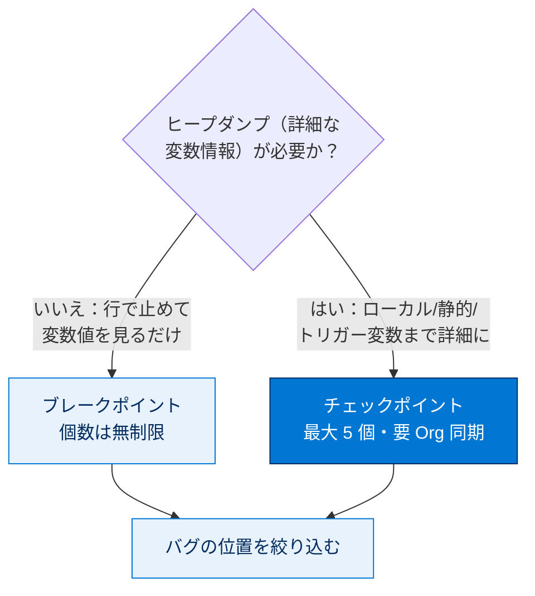
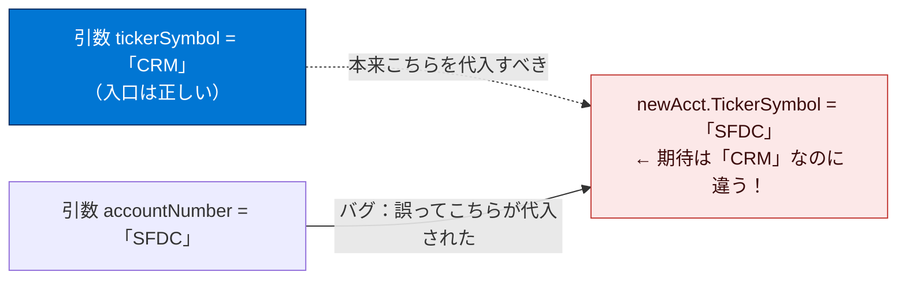

# コードをデバッグする

Apex Replay Debugger の設定が完了しました。次は、Apex コードを修正するためのテストとデバッグを行います。

> [!ポイント] このステップ全体の流れ
>
> 仕込まれたバグを、デバッグログの再生で突き止めて修正します。
>
> ```mermaid
> flowchart TD
>     A["① メタデータ（Apexクラス）を<br/>組織にリリースする"] --> B["② Apex テストを実行する<br/>→ 失敗する（バグがあるため）"]
>     B --> C["③ ブレークポイント／<br/>チェックポイントを設定する"]
>     C --> D["④ 再生用ログを有効化し<br/>テストを再実行 → ログ取得"]
>     D --> E["⑤ Replay Debugger でログを再生し<br/>変数値を確認 → バグ特定"]
>     E --> F["⑥ コードを修正してリリース<br/>→ テスト再実行 → 合格"]
>     classDef hl fill:#0176D3,stroke:#032D60,color:#fff;
>     classDef soft fill:#E8F2FC,stroke:#0176D3,color:#032D60;
>     class E hl;
>     class A,B,C,D,F soft;
> ```

---

## メタデータを組織にリリースする

> [!用語] リリース（Deploy / デプロイ）
>
> ローカルの Apex コードやメタデータを、クラウド上の Salesforce 組織に**反映（アップロード）する**操作。組織側にコードがないとテストもデバッグもできないため、まずデプロイします。

> [!手順] ソースを組織にリリースする
>
> 1. VS Code で `classes` フォルダーを右クリックする。
> 2. **[SFDX: Deploy This Source To Org]** を選択する。

> [!注意] リリースのメニューが出ないとき
>
> **[SFDX: Deploy This Source To Org]** が使えない場合は、前のステップで Trailhead Playground を**承認**したか確認してください。

---

## Apex テストを実行する

> [!手順] Apex テストを実行する
>
> 1. **[View]** → **[Command Palette...]** を選択する（または `Ctrl + Shift + P` / `Cmd + Shift + P`）。
> 2. `apex test` と入力し、**[SFDX: Run Apex Tests]** を選択する。
> 3. `AccountServiceTest` を選択する。

[Output] パネルにテスト結果が表示されます。Apex テストは失敗します。😯 エラーは**取引先の株式コード項目に間違った値が割り当てられた**ことを示します。チェックポイントを設定し、テストを再実行してデバッグログを収集し、再生してバグ 🐞 を見つけましょう。

> [!例] テストが教えてくれること
>
> テストは `TickerSymbol` に `'CRM'` を期待しますが、別の値が入っていたため失敗しました。テストは「**どこかがおかしい**」とは教えますが、「**なぜそうなったのか**」までは教えません。その"なぜ"を追うのがデバッガーの役割です。

---

## ブレークポイントとチェックポイントを設定する

**ブレークポイント**は実行を特定行で停止させ、その時点の変数値を調べられます。**チェックポイント**は Apex 固有のブレークポイントで、ヒープダンプを取得してより詳細な情報を得られます。

> [!用語] ブレークポイント（Breakpoint）
>
> 実行を**指定行で一時停止させる目印**。停止時点の変数値などを確認できます。VS Code 上では**塗りつぶされた赤いドット**で表示されます。

> [!用語] チェックポイント（Checkpoint）
>
> Apex 専用の特別なブレークポイント。停止に加えてその瞬間のメモリ状態（**ヒープダンプ**）を取得し、すべてのローカル変数・静的変数・トリガーコンテキスト変数の充実した情報を得られます。VS Code 上では**中心に線が入った赤い円**で表示されます。

> [!用語] ヒープダンプ（Heap Dump）
>
> ある瞬間にメモリ上にあった変数やオブジェクトの状態を丸ごと記録したもの。チェックポイント位置で取得され、Replay Debugger でその時点の詳細な値を再現するのに使われます。

| 種類 | 機能 | 取得できる情報 | 個数の上限 | 表示 |
| --- | --- | --- | --- | --- |
| **ブレークポイント** | 指定行で一時停止 | その時点の変数値 | **無制限** | 塗りつぶされた赤いドット |
| **チェックポイント** | 一時停止＋ヒープダンプ取得 | ローカル変数・静的変数・トリガーコンテキスト変数まで詳細に | **最大 5 個** | 中心に線が入った赤い円 |

> [!ポイント] ブレークポイント vs チェックポイント（試験頻出）
>
> - ブレークポイントは**無制限**、チェックポイントは**同時に最大 5 個**。
> - チェックポイントはヒープダンプを取得するため**情報量が多い**。
> - 切り替えコマンドは **[Debug: Toggle Breakpoint]** と **[SFDX: Toggle Checkpoint]**。



> [!手順] ブレークポイントとチェックポイントを設定する
>
> 1. `AccountService.cls` を開く。
> 2. `Account newAcct = new Account(` の行の**行番号の左側**をクリックして**ブレークポイント**を設定する。
> 3. `return newAcct;` の行に**カーソルを置く**。
> 4. コマンドパレットを開く。
> 5. `sfdx checkpoint` と入力し、**[SFDX: Toggle Checkpoint]** を選択する。インジケーターが行番号の横に表示される。
> 6. 再度コマンドパレットで `sfdx checkpoint` と入力し、**[SFDX: Update Checkpoints in Org]** を選択する。

ステップ 6 の **[Update Checkpoints in Org]** は、Apex 実行時にヒープダンプを収集するよう**Salesforce にチェックポイントを通知する**ために必要です。コードやチェックポイントを変更したら、もう一度実行して同期します。

> [!注意] チェックポイントの上限と有効期限
>
> - ブレークポイントは無制限ですが、同時に設定できる**チェックポイントは 5 個まで**です。
> - チェックポイントを更新したら**速やかに**デバッグログを生成して再生してください。**チェックポイントは 30 分**、**ヒープダンプは 1 日**で失効します。

---

## Apex テストを実行してデバッグログを取得する

> [!手順] 再生用ログを有効化してテストを実行する
>
> 1. **[View]** → **[Command Palette...]** を選択する（または `Ctrl + Shift + P` / `Cmd + Shift + P`）。
> 2. `sfdx replay` と入力し、**[SFDX: Turn On Apex Debug Log for Replay Debugger]** を選択する。再生対応デバッグログを 30 分間生成する**追跡フラグ**が作成される。
> 3. コマンドパレットで `apex test` と入力し、**[SFDX: Run Apex Tests]** を選択する。
> 4. `AccountServiceTest` を選択する。

> [!注意] ログ生成時間の変更
>
> 再生用ログの生成時間（既定 30 分）は **[Setup]** の **[Debug Logs]** ページで変更できます。

コードは変更していないため、テストは**再び失敗**します。今回はバグ 🐞 を見つけて修正するための**再生対応デバッグログとチェックポイント**がある点が違います。

> [!手順] デバッグログをダウンロードする
>
> 1. コマンドパレットで `sfdx get` と入力し、**[SFDX: Get Apex Debug Logs...]** を選択する。
> 2. ダウンロードするログを選ぶ。**最近の Apex テスト実行に関連付けられたログ**（通常はリストの最初）を選択する。
> 3. 数秒後、ダウンロードされたログが VS Code で開く。

---

## Apex デバッグログを再生する

最近ダウンロードしたデバッグログを再生します。チームの別の開発者が生成・共有したログを再生することもできます。

> [!注意] ログとソースコードを一致させる
>
> 再生時には、ログを**生成した Apex ソースと同じもの**が DX プロジェクトに含まれていることを確認します。一致しないと行番号や変数で混乱が生じバグを発見できません。ログは、ログカテゴリ **Visualforce** なら **FINER** または **FINEST**、**Apex コード** なら **FINEST** で生成する必要があります。

> [!用語] コールスタック（Call Stack）
>
> 現在実行中のメソッドが「どのメソッドから呼ばれたか」の連なり。[Debug] サイドバーに表示され、処理の経路を把握できます。

> [!手順] デバッグログを再生してデバッグセッションを開始する
>
> 1. ダウンロードしたログを開く（`.sfdx/tools/debug/logs` フォルダーにある）。
> 2. ログ内の**任意の行を右クリック**し、**[SFDX: Launch Apex Replay Debugger with Current File]** を選択する。
> 3. 数秒後、**[Debug]** サイドバーが開き、コードを順に実行できる。
> 4. **[Continue（続行）]** をクリックして次のブレークポイントまで進む。`AccountService.cls` の `return newAcct;` の**チェックポイント**に到達するまで [Continue] を繰り返す。

デバッガーは `return newAcct;` のチェックポイント行で**一時停止**し、[Debug] サイドバーに範囲内の現在の変数値が表示されます。

### 変数を調べてバグを特定する

`createAccount` に渡された `tickerSymbol` 引数が期待値「CRM」になっており、コードがメソッドに**正しい値を渡している**ことがわかります。🙂 しかし [Debug] サイドバーで `newAcct` を展開すると、`TickerSymbol` の値「**SFDC**」が引数値「**CRM**」と一致しません。🤔



`AccountService.cls` を調べると、`TickerSymbol = accountNumber` と**間違った引数を割り当てている**誤字が見つかります。🐞

> [!例] 「正しい値が来ているのに結果が違う」＝代入ミスのサイン
>
> 入口（引数 `tickerSymbol = "CRM"`）は正しいのに、出口（`newAcct.TickerSymbol = "SFDC"`）が間違っている。この「入力は正しいのに出力がおかしい」パターンは、**途中の代入・計算の誤り**を強く示唆します。デバッガーで両方の値を見比べられたので、原因が代入行だと一瞬で絞り込めました。

> [!手順] デバッグセッションを終了する
>
> 1. デバッグツールバーの **[Stop（停止）]** をクリックする。

---

## 修正したメタデータを組織にリリースする

> [!手順] バグを修正してリリースする
>
> 1. `tickerSymbol` 引数を `TickerSymbol` 項目に割り当てるよう `AccountService.cls` を修正する。

```apex
TickerSymbol = tickerSymbol
```

修正後の該当箇所は次のようになります。

```apex
Account newAcct = new Account(
  Name = accountName,
  AccountNumber = accountNumber,
  TickerSymbol = tickerSymbol   // ← 修正: 正しい引数 tickerSymbol を割り当てる
);
```

> [!手順] 修正をリリースする
>
> 1. ファイルを保存する。
> 2. 任意の行を右クリックし、**[SFDX: Deploy This Source to Org]** を選択する。

---

## Apex テストを実行して修正を検証する

> [!手順] 修正後のテストを実行する
>
> 1. コマンドパレットを開く。
> 2. `apex test` と入力し、**[SFDX: Run Apex Tests]** を選択する。
> 3. `AccountServiceTest` を選択する。

[Output] パネルで、今度は Apex テストに**合格**します。🥳 ここでは Apex Replay Debugger と Salesforce 拡張機能で Apex の**開発・テスト・デバッグ**を行いました。**[Verify Step]** をクリックするとデバッグセッションが確認され、バッジを獲得できます。

---

## リソース

- 外部サイト: Apex Replay Debugger for Visual Studio Code
- 動画: YouTube: Banish the Bugs with the Apex Replay Debugger
- 動画: YouTube: Salesforce Development with Visual Studio Code
- 動画: YouTube: Be An Efficient Salesforce Developer with VS Code
- Apex 開発者ガイド: Apex のデバッグ
- ヘルプ: デバッグログの設定
- 外部サイト: Debugging in Visual Studio Code

---

## 試験対策：押さえておきたい追加ポイント

> [!ポイント] Apex Replay Debugger まわりの頻出ポイント
>
> - **ブレークポイントは無制限／チェックポイントは最大 5 個**。チェックポイントはヒープダンプを取得し情報量が多い。
> - **チェックポイントは 30 分・ヒープダンプは 1 日**で失効。設定したら速やかにログ取得・再生する。
> - 再生対応ログのログレベルは、**Apex コードなら FINEST**（Visualforce は FINER または FINEST）。
> - チェックポイントを切り替えたら **[Update Checkpoints in Org]** で組織と同期する。
> - Replay Debugger は**無料**。リアルタイムに止めたいなら Apex Interactive Debugger（有料）。
> - デバッグログは共有でき、**他の開発者が取得したログを自分の環境で再生**して協力できる。

> [!ポイント] デバッグのベストプラクティス
>
> - まず**テストで再現**してから、ブレークポイント／チェックポイントで変数値を確認する。
> - 「入力は正しいか」「出力は期待通りか」を切り分けると、バグの位置を素早く絞れる。
> - 修正後は必ず**テストを再実行**して回帰がないか検証する。

---

> [!まとめ] このステップの要点
>
> - テストでバグを再現し、`AccountService.cls` に**ブレークポイントとチェックポイント**を設定した。
> - 再生用ログを有効化してテストを再実行し、**デバッグログを取得**した。
> - Replay Debugger でログを再生し、`tickerSymbol`（"CRM"）と `newAcct.TickerSymbol`（"SFDC"）の不一致から、`TickerSymbol = accountNumber` という**代入ミス**を特定した。
> - `TickerSymbol = tickerSymbol` に修正・リリースし、テスト**合格**を確認した。
